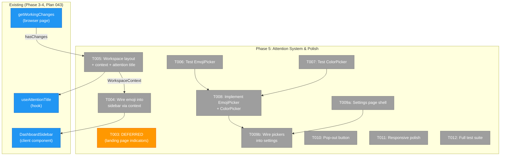
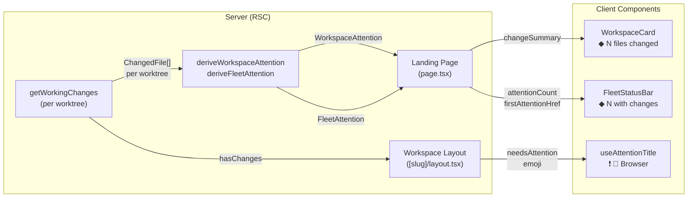
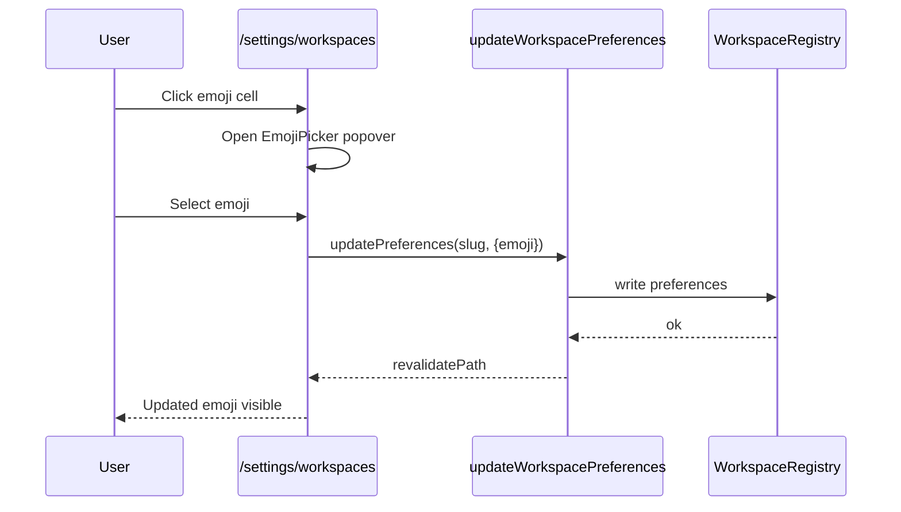

# Phase 5: Attention System & Polish — Tasks

**Plan**: [file-browser-plan.md](../../file-browser-plan.md)
**Phase**: 5 of 6
**Testing Approach**: Full TDD
**Created**: 2026-02-24
**Refreshed**: 2026-02-24 — Pivoted attention source from agents to file changes

---

## Executive Briefing

**Purpose**: Wire the attention system end-to-end — deriving workspace attention state from **uncommitted file changes** (not agents) and bubbling it through the UI layers (workspace card → fleet status bar → browser tab title). Also deliver the workspace settings page with emoji/color pickers and pop-out buttons.

**What We're Building**:
- Server-side attention derivation functions that aggregate `getWorkingChanges()` per worktree into workspace-level attention state
- Wiring change data into WorkspaceCard (new `changeSummary` prop) and FleetStatusBar (existing `attentionCount`/`firstAttentionHref` props)
- Creating `[slug]/layout.tsx` to fetch workspace preferences + change status, wire `useAttentionTitle`
- Wiring workspace emoji into sidebar header (Phase 3 debt FT-006)
- A `/settings/workspaces` page with emoji picker, color picker, star toggle, remove action
- Pop-out `[↗]` buttons on file viewer header
- Final responsive polish pass across all pages

**Goals**:
- ✅ Workspaces with uncommitted changes show amber ◆ indicator on landing page cards
- ✅ Fleet status bar shows "◆ N workspaces with changes" with click-to-navigate
- ✅ Browser tab title shows workspace emoji and ❗ prefix when changes detected
- ✅ Sidebar header shows workspace emoji + name (not raw slug)
- ✅ Users can customize workspace emoji and color from settings page
- ✅ File viewer has pop-out button for opening in new tab

**Non-Goals**:
- ❌ Wiring to real agent status data (agents are OOS for now — attention = file changes only)
- ❌ SSE live-update of change status on landing page (manual refresh / page reload is fine)
- ❌ Full workspace CRUD from settings (add is already on landing page)
- ❌ Responsive phone layout rebuild (Phase 5 does a polish pass, not a phone-first redesign)
- ❌ Agent chat/interaction from workspace pages

**Verification Protocol** (MANDATORY):
- Every task that touches UI must be visually verified using Next.js MCP server (`nextjs_index`/`nextjs_call`) + Playwright browser automation (`browser_eval` screenshots)
- Deep link directly to each page under test — do not navigate manually
- Screenshot at each breakpoint (375px, 768px, 1440px) for T011
- Check `nextjs_call` `get_errors` for runtime/compilation errors after each implementation task
- **Work is NOT complete until screenshots confirm correct rendering**

---

## Prior Phase Context

### Phase 3: UI Overhaul — Landing Page & Sidebar (COMPLETE)

**A. Deliverables**:
- `workspace-card.tsx` — Server Component, accepts optional `agentSummary` prop (NOT wired, renders amber ◆ when attention > 0)
- `fleet-status-bar.tsx` — Server Component, accepts optional counts (NOT wired, returns null when all zeroes)
- `worktree-picker.tsx` — Client Component, searchable workspace picker
- `use-attention-title.ts` — Hook for browser tab title with ❗ prefix (NOT wired in any workspace layout)
- Landing page `page.tsx` — Workspace card grid, starred-first, direct DI service calls, enriches with worktree info
- Sidebar restructured — workspace-scoped sections, dev section collapsed
- Navigation constants: `WORKSPACE_NAV_ITEMS`, `DEV_NAV_ITEMS`, `LANDING_NAV_ITEMS`

**B. Dependencies Exported**:
- `WorkspaceCardProps.agentSummary?: { running: number; attention: number }` — renders amber ◆ when attention > 0
- `FleetStatusBarProps: { runningCount?, attentionCount?, firstAttentionHref? }` — renders "◆ N needs attention" as amber link
- `useAttentionTitle({ emoji, pageName, workspaceName, needsAttention })` — sets document.title with optional ❗
- Landing page already calls `workspaceService.getInfo(slug)` per workspace → has worktree paths available

**C. Gotchas & Debt**:
- `workspaceHref(slug)` without subPath appends "undefined" — must pass `''`
- Sidebar header shows decoded slug only — emoji/display name not yet wired (FT-006)
- `useAttentionTitle` not wired into workspace layout yet (FT-007)
- `toggleWorkspaceStar` is silent on failure — no toast feedback
- Empty string emoji → card falls back to first letter avatar (correct behavior)

**D. Incomplete Items**: None — all 14 tasks complete.

**E. Patterns to Follow**: Server Components by default, form actions for mutations, props-only presentational components, direct DI in Server Components, `workspaceHref()` for all URL construction.

### Phase 4: File Browser (COMPLETE)

**A. Deliverables**:
- File tree, code editor, file viewer panel, browser page (two-panel layout via PanelShell)
- Server actions: readFile, saveFile, fetchGitDiff, fetchChangedFiles, fetchWorkingChanges, fetchRecentFiles, fileExists, uploadFile
- API route: `GET /api/workspaces/[slug]/files` for lazy directory listing
- API route: `GET /api/workspaces/[slug]/files/raw` for binary file streaming (Plan 046)
- Context menus, clipboard operations, download, toast wiring
- Binary file viewers: ImageViewer, PdfViewer, VideoViewer, AudioViewer, BinaryPlaceholder (Plan 046)
- Working changes service: `getWorkingChanges()` via `git status --porcelain` (Plan 043)
- Changed files service: `getChangedFiles()` via `git diff --name-only`

**B. Dependencies Exported**:
- `getWorkingChanges(worktreePath)` → `{ ok: true, files: ChangedFile[] }` — **key for attention derivation**
- `ChangedFile: { path, status, area }` — modified/added/deleted/untracked/renamed × staged/unstaged/untracked
- File browser URL params (`fileBrowserParams`, `fileBrowserPageParamsCache`)
- `CodeEditor` — lazy-loaded CodeMirror wrapper
- `FileViewerPanel` — Edit/Preview/Diff modes + binary routing
- Toast pattern via sonner for save/settings operations

**C. Gotchas & Debt**:
- `navigator.clipboard.writeText` requires HTTPS — fallback with setTimeout(0) + textarea
- Radix portals steal focus — async/setTimeout pattern for clipboard in onSelect
- CodeMirror must be lazy-loaded (jsdom can't instantiate)
- FileViewerPanel hooks must be above early returns (Rules of Hooks — fixed in Plan 046 review)

**D. Incomplete Items**: None — all tasks complete (Phase 4 + Plan 043 + Plan 046).

**E. Patterns to Follow**: Hybrid server/client boundary, atomic writes, mtime conflict detection, lazy component imports, callback pattern for context menu, binary detection via extension-first.

### Plan 045: Live File Events (COMPLETE — parallel work)

**A. Deliverables available for Phase 5**:
- `FileChangeHub` — client-side pattern-based event dispatcher
- `useFileChanges(pattern)` → `{ changes, hasChanges, clearChanges }` — pattern subscription hook
- `FileChangeProvider` — React context + SSE connection per worktree

**B. Phase 5 relevance**: The live events system is available but **not needed for landing page** (server-side `getWorkingChanges()` is sufficient). Could be used for real-time attention updates within workspace pages in the future.

---

## Pre-Implementation Check

| File | Exists? | Domain Check | Notes |
|------|---------|-------------|-------|
| `features/041-file-browser/services/attention.ts` | No — create | file-browser | New: attention derivation from ChangedFile[] |
| `test/unit/web/features/041-file-browser/attention.test.ts` | No — create | file-browser | New: tests for derivation functions |
| `app/(dashboard)/workspaces/[slug]/layout.tsx` | No — create | file-browser | New: workspace layout with attention + emoji context |
| `features/041-file-browser/components/emoji-picker.tsx` | No — create | file-browser | New: palette grid component |
| `features/041-file-browser/components/color-picker.tsx` | No — create | file-browser | New: color swatch component |
| `app/(dashboard)/settings/workspaces/page.tsx` | No — create | file-browser | New: settings route |
| `app/(dashboard)/page.tsx` | Yes — modify | file-browser | Wire change data into cards + fleet bar |
| `features/041-file-browser/components/workspace-card.tsx` | Yes — modify | file-browser | Add `changeSummary` prop, keep `agentSummary` |
| `features/041-file-browser/components/fleet-status-bar.tsx` | Yes — modify | file-browser | Props already defined — just wire data |
| `features/041-file-browser/hooks/use-attention-title.ts` | Yes — no change | file-browser | Already implemented, needs calling |
| `components/dashboard-sidebar.tsx` | Yes — modify | file-browser | Wire emoji in header (Phase 3 FT-006) |
| `features/041-file-browser/components/file-viewer-panel.tsx` | Yes — modify | file-browser | Add pop-out button |
| `packages/workflow/src/constants/workspace-palettes.ts` | Yes — no change | _platform | EMOJI_PALETTE + COLOR_PALETTE |
| `features/041-file-browser/services/working-changes.ts` | Yes — no change | file-browser | getWorkingChanges() consumed by browser page for attention |
| `features/041-file-browser/hooks/use-workspace-context.ts` | No — create | file-browser | New: WorkspaceContext + provider + hook (DYK-02) |

---

## Architecture Map



---

## Tasks

| Status | ID | Task | Domain | Path(s) | Done When | Notes |
|--------|-----|------|--------|---------|-----------|-------|
| ~~[ ]~~ | T001 | ~~Folded into T005 (DYK-04)~~ | — | — | — | Attention derivation is just `changes.length > 0` — no separate service needed. |
| ~~[ ]~~ | T002 | ~~Folded into T005 (DYK-04)~~ | — | — | — | See T001. |
| ~~[ ]~~ | T003 | ~~DEFERRED (DYK-01)~~ Landing page change indicators deferred to SSE eventing layer. | — | — | — | Spawning N×M git processes per page load is disproportionate. Defer to when Plan 045 SSE pushes change events to a cache. |
| [x] | T004 | Wire emoji into sidebar header — read from WorkspaceContext (DYK-02), show emoji before name, fall back to first letter | file-browser | `apps/web/src/components/dashboard-sidebar.tsx` | Sidebar header shows emoji + workspace name when scoped to workspace. Falls back to first letter avatar when no emoji set. | Phase 3 debt FT-006. Sidebar reads WorkspaceContext provided by [slug]/layout.tsx. No server calls in sidebar. |
| [x] | T005 | Create workspace layout + WorkspaceContext + useAttentionTitle — `[slug]/layout.tsx` (Server Component) fetches preferences only (DYK-03). Client wrapper provides WorkspaceContext and calls useAttentionTitle. Browser page sets `hasChanges` into context when it has change data. | file-browser | `apps/web/app/(dashboard)/workspaces/[slug]/layout.tsx`, `apps/web/src/features/041-file-browser/hooks/use-workspace-context.tsx` | Tab title shows "🔮 Browser" format. Shows "❗ 🔮 Browser" when browser page reports changes. Sidebar reads emoji from context. | DYK-02+03+04 combined. Layout fetches preferences (fast, no git). Browser page calls `setHasChanges(true)` via context. Context provides: emoji, color, name, hasChanges, setHasChanges. |
| [x] | T006 | Write tests for EmojiPicker — renders palette grid, click selects, current highlighted, curated set from WORKSPACE_EMOJI_PALETTE | file-browser | `test/unit/web/features/041-file-browser/emoji-picker.test.tsx` | Tests: renders 30 emojis, click calls onSelect with emoji string, current emoji visually distinguished, keyboard accessible | Simple popover with grid layout |
| [x] | T007 | Write tests for ColorPicker — renders color swatches, click selects, current highlighted | file-browser | `test/unit/web/features/041-file-browser/color-picker.test.tsx` | Tests: renders 10 color swatches, click calls onSelect with color name, current color visually distinguished, swatches show actual color | Use WORKSPACE_COLOR_PALETTE light/dark values |
| [x] | T008 | Implement EmojiPicker and ColorPicker components | file-browser | `apps/web/src/features/041-file-browser/components/emoji-picker.tsx`, `apps/web/src/features/041-file-browser/components/color-picker.tsx` | All T006+T007 tests pass. Grid layout, popover-based, accessible. | Client Components. Import via subpath `@chainglass/workflow/constants/workspace-palettes` (barrel pulls server code). |
| [x] | T009a | Settings page shell — route, table layout, star toggle, sidebar nav link (DYK-05) | file-browser | `apps/web/app/(dashboard)/settings/workspaces/page.tsx` | Page renders workspace table with name, path, star toggle. Deep-linkable at `/settings/workspaces`. "Settings" appears in sidebar nav. | Server Component wrapper + Client table. Reuse `toggleWorkspaceStar` form action. |
| [x] | T009b | Wire emoji/color pickers into settings table (DYK-05) | file-browser | `apps/web/app/(dashboard)/settings/workspaces/page.tsx` | Clicking emoji cell opens EmojiPicker popover, saves via `updateWorkspacePreferences`. Same for color cell. | Depends on T008 (pickers) + T009a (settings shell). |
| [x] | T010 | Add pop-out `[↗]` button to file viewer header | file-browser | `apps/web/src/features/041-file-browser/components/file-viewer-panel.tsx` | Pop-out button opens current file's deep-linked URL in new tab via `window.open()`. Button appears in toolbar next to mode buttons. | Use `workspaceHref()` for URL construction. Small icon button, minimal footprint. |
| [x] | T011 | Visual verification pass — Next.js MCP + curl verification. Playwright browser screenshots unavailable (MCP connectivity issue). | file-browser | Various | All pages return 200. No runtime errors. Settings page renders all expected UI elements. Pop-out button present. | Verified via: `get_errors` (0 errors), curl HTTP 200 checks, aria-label verification of UI elements. |
| [x] | T012 | Run `just fft` — lint + format + test pass. Build pre-existing failure (Plan 045 fast-glob/fs issue). | file-browser | — | 4365 tests pass, lint clean, format clean. | Pre-existing build failure from parallel Plan 045 work — not caused by Phase 5 changes. |

---

## Context Brief

### Key findings from plan (refreshed)

- **Finding: Attention source is file changes, not agents.** `getWorkingChanges(worktreePath)` via `git status --porcelain` returns `ChangedFile[]` with path, status (modified/added/deleted/untracked/renamed), and area (staged/unstaged/untracked). This is the data source for all attention indicators.
- **Finding: Landing page already has worktree paths.** `workspaceService.getInfo(slug).worktrees[].path` gives absolute worktree paths. No additional data fetching infrastructure needed — just call `getWorkingChanges()` per path.
- **Finding: Components already accept attention props.** WorkspaceCard renders amber ◆ when `agentSummary.attention > 0`. FleetStatusBar renders "◆ N needs attention" when `attentionCount > 0`. We add a `changeSummary` prop to WorkspaceCard rather than misusing `agentSummary`.
- **Finding: Palette constants exist.** `WORKSPACE_EMOJI_PALETTE` (30 emojis), `WORKSPACE_COLOR_PALETTE` (10 colors with light/dark hex). Validation via `WORKSPACE_EMOJI_SET` / `WORKSPACE_COLOR_NAMES`.
- **Finding: No [slug]/layout.tsx exists.** All workspace pages go directly under the `[slug]` route group. Creating a layout here gives us a single place to fetch preferences + change status and wire `useAttentionTitle`.
- **Finding: updateWorkspacePreferences server action exists.** Already validates emoji/color/starred/sortOrder via Zod schema. Used by `toggleWorkspaceStar`. Ready for settings page integration.

### Domain dependencies

- `_platform/events`: `toast()` — feedback on settings mutations (save emoji, color, remove workspace)
- `_platform/workspace-url`: `workspaceHref()` — URL construction for pop-out buttons and firstAttentionHref
- `@chainglass/workflow`: `IWorkspaceService`, `WorkspacePreferences`, `WORKSPACE_EMOJI_PALETTE`, `WORKSPACE_COLOR_PALETTE`
- `file-browser` (own domain): `getWorkingChanges()`, `ChangedFile` type — data source for attention derivation

### Domain constraints

- All new UI components go in `features/041-file-browser/`
- Settings page route goes in `app/(dashboard)/settings/workspaces/`
- Workspace layout goes in `app/(dashboard)/workspaces/[slug]/layout.tsx`
- Attention derivation is pure business logic — no side effects, easily testable
- Import palette constants from `@chainglass/workflow` (not relative paths to packages/)
- Keep `agentSummary` prop on WorkspaceCard untouched — add new `changeSummary` alongside it for future extensibility

### Reusable from prior phases

- **WorkspaceCard** (Phase 3): Already renders amber ◆ indicator — we add `changeSummary` prop for change-specific rendering
- **FleetStatusBar** (Phase 3): Already renders "◆ N needs attention" link — just wire `attentionCount` + `firstAttentionHref`
- **useAttentionTitle** (Phase 3): Already implemented — just call from new workspace layout
- **getWorkingChanges** (Plan 043): Already parses `git status --porcelain` → `ChangedFile[]` — the attention data source
- **Existing tests** (Phase 3): 34 tests for card/fleet/attention — they test component rendering
- **Toast pattern** (Plan 042): `toast.success()` / `toast.error()` for settings mutations
- **Server action pattern** (Phase 3): `toggleWorkspaceStar` + `updateWorkspacePreferences` — reuse for settings page
- **Radix Popover** (already in deps): Used in context menus — reuse for emoji/color pickers

### Data flow diagram



### Settings page flow



---

## Discoveries & Learnings

_Populated during implementation by plan-6._

| Date | Task | Type | Discovery | Resolution | References |
|------|------|------|-----------|------------|------------|

---

## Directory Layout

```
docs/plans/041-file-browser/
  ├── file-browser-plan.md
  └── tasks/phase-5-attention-system-polish/
      ├── tasks.md              ← this file
      ├── tasks.fltplan.md      ← generated next
      └── execution.log.md      # created by plan-6
```
