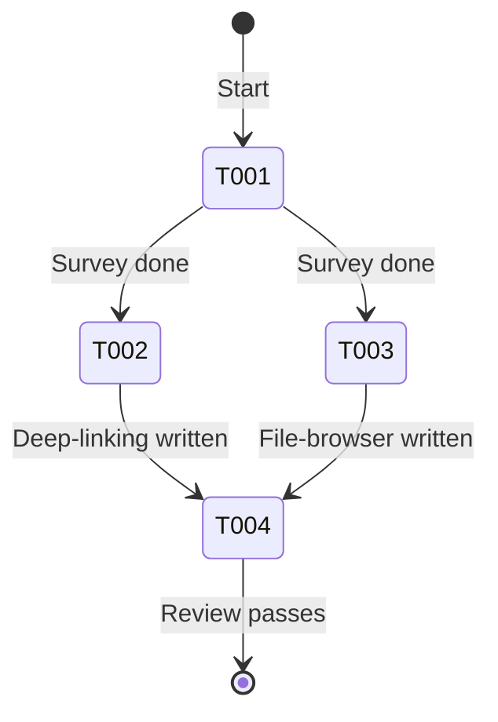
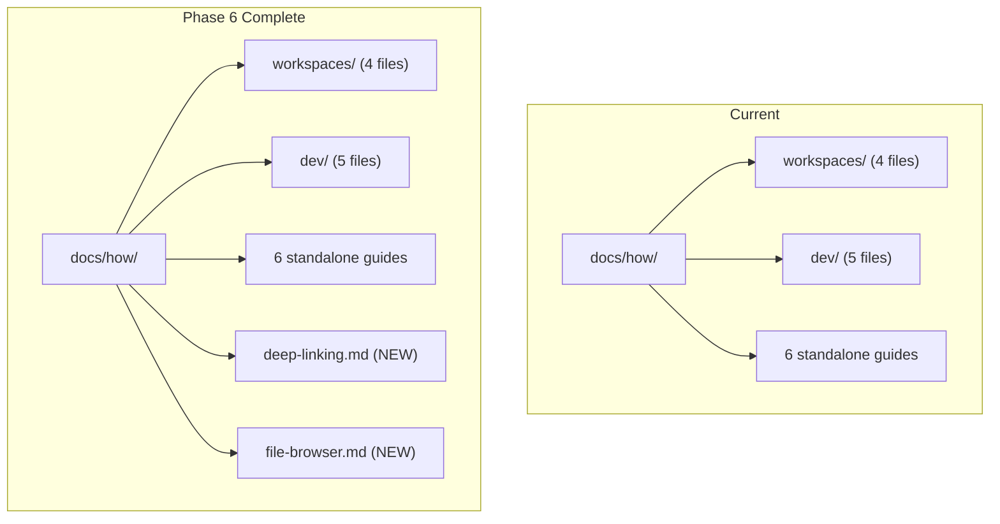

# Flight Plan: Phase 6 — Documentation

**Phase**: [tasks.md](./tasks.md)
**Plan**: [file-browser-plan.md](../../file-browser-plan.md)
**Status**: Ready

---

## Departure → Destination

**Where we are**: The file browser and deep linking system are fully implemented (Phases 1-5 + Plans 043, 044, 046) with 4370+ tests. No developer documentation exists for either system. A new contributor would need to read implementation code to understand the deep linking pattern or file operation security model.

**Where we're going**: Two focused how-to guides in `docs/how/` that let a developer add URL params to a new page (deep-linking) or understand the file browser architecture and security model (file-browser). Code examples reference real implementation files.

---

## Domain Context

### Domains We're Changing

| Domain | Relationship | What Changes | Key Files |
|--------|-------------|-------------|-----------|
| documentation | create | Two new how-to guides | `docs/how/deep-linking.md`, `docs/how/file-browser.md` |

### Domains We Depend On

None — documentation only reads, doesn't import.

---

## Flight Status

---

## Stages

- [ ] **Survey** (T001): Check existing docs/how/ structure and conventions
- [ ] **Deep-linking guide** (T002): nuqs params, workspaceHref, server caching, step-by-step
- [ ] **File-browser guide** (T003): Architecture, security, binary, operations
- [ ] **Review** (T004): Verify paths, examples, links

---

## Architecture: Before & After

---

## Acceptance

- [ ] `docs/how/deep-linking.md` exists and covers param definitions, nuqs usage, workspaceHref, adding params to new pages
- [ ] `docs/how/file-browser.md` exists and covers architecture, security model, file operations, binary handling
- [ ] Code examples reference real file paths that exist in the codebase
- [ ] A developer can follow the deep-linking guide to add URL params to a new page

---

## Goals & Non-Goals

**Goals**: Two practical developer how-to guides with real code examples

**Non-Goals**: API reference, user docs, Plan 045 events documentation

---

## Checklist

| ID | Task | CS |
|----|------|----|
| T001 | Survey docs/how/ | 1 |
| T002 | Write deep-linking.md | 2 |
| T003 | Write file-browser.md | 2 |
| T004 | Review for accuracy | 1 |
