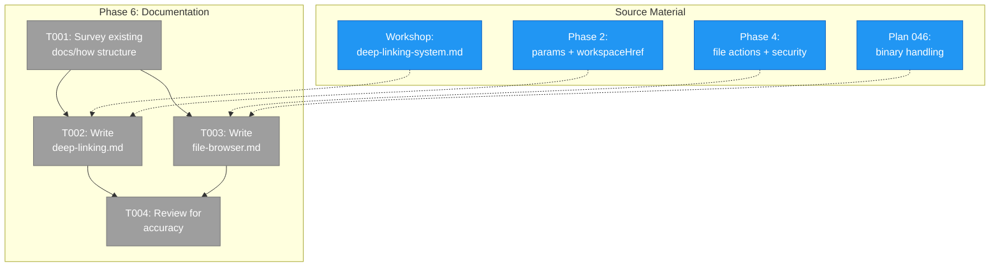

# Phase 6: Documentation — Tasks

**Plan**: [file-browser-plan.md](../../file-browser-plan.md)
**Phase**: 6 of 6
**Testing Approach**: Lightweight — verify links, code examples compile mentally
**Created**: 2026-02-24

---

## Executive Briefing

**Purpose**: Write developer documentation for the deep linking system and file browser architecture so future contributors can extend both without reading implementation code.

**What We're Building**:
- `docs/how/deep-linking.md` — How-to guide for adding URL state to new pages using nuqs
- `docs/how/file-browser.md` — Architecture overview, security model, file operations, binary handling

**Goals**:
- ✅ A developer can follow the deep-linking guide to add URL params to a new page
- ✅ The security model for file operations is clearly documented
- ✅ Code examples come from real implementation (not hypothetical)

**Non-Goals**:
- ❌ API reference docs (code is self-documenting with JSDoc)
- ❌ User-facing documentation (this is developer-facing)
- ❌ Documenting Plan 045 live events (separate plan's responsibility)

---

## Prior Phase Context

### Phases 1-5 (All Complete)

**A. Deliverables relevant to documentation**:
- Phase 2: `fileBrowserParams`, `workspaceParams`, `workspaceHref()`, `fileBrowserPageParamsCache` — the deep linking infrastructure
- Phase 4: `readFile`, `saveFile` server actions with security (IPathResolver + realpath symlink check), mtime conflict detection, atomic writes
- Phase 5: WorkspaceContext, per-worktree emoji/color, `useAttentionTitle`, settings page
- Plan 043: PanelShell integration, `?panel=` param
- Plan 046: Binary file handling, raw streaming route, `detectContentType`

**B. Key patterns to document**:
- nuqs `parseAsString`, `parseAsStringLiteral` for param definitions
- `createSearchParamsCache` for server-side param access
- `useQueryStates` for client-side param binding
- `workspaceHref(slug, subPath, options)` for URL construction
- `history: 'push'` vs default `'replace'` for browser navigation
- IPathResolver → realpath → startsWith containment check (two-phase security)
- ReadFileResult discriminated union (ok+text, ok+binary, error)

**C. Existing docs in docs/how/**:
- `docs/how/workspaces/` — 4 files covering workspace overview, CLI, web UI, domains
- `docs/how/dev/` — agent guides, central events, fast feedback loops
- No deep-linking or file-browser docs yet

---

## Pre-Implementation Check

| File | Exists? | Domain Check | Notes |
|------|---------|-------------|-------|
| `docs/how/deep-linking.md` | No — create | documentation | New how-to guide |
| `docs/how/file-browser.md` | No — create | documentation | New architecture doc |

---

## Architecture Map



---

## Tasks

| Status | ID | Task | Domain | Path(s) | Done When | Notes |
|--------|-----|------|--------|---------|-----------|-------|
| [ ] | T001 | Survey existing `docs/how/` structure — list files, identify naming conventions, check for any overlap with planned docs | documentation | `docs/how/` | Conventions noted, no overlap found | Discovery step — 2 min |
| [ ] | T002 | Write `docs/how/deep-linking.md` — covers: what nuqs is and why, defining params with `parseAsString`/`parseAsStringLiteral`, `createSearchParamsCache` for server components, `useQueryStates` for client binding, `workspaceHref()` for URL construction, `history: 'push'` for browser nav, adding params to a new page (step-by-step), WorkspaceContext for page identity. Code examples from real files. | documentation | `docs/how/deep-linking.md` | A developer new to the codebase can add URL params to a new workspace page by following the guide. Guide references real file paths. | Source: workshop + Phase 2 + Phase 5 implementation |
| [ ] | T003 | Write `docs/how/file-browser.md` — covers: architecture overview (two-panel layout, server/client boundary), file operations (readFile flow, saveFile with conflict detection, atomic writes), security model (IPathResolver traversal prevention, realpath symlink check, containment verification), binary handling (detectContentType, raw streaming route, Range requests), size limits (5MB text, 250MB upload), WorkspaceContext + attention system, deep linking params. | documentation | `docs/how/file-browser.md` | A developer understands the security model, can trace a file read from URL to disk, and knows where to add new file operations. | Source: Phase 4 + Plan 043 + Plan 046 |
| [ ] | T004 | Review both docs for accuracy — verify file paths still exist, code examples match current implementation, links to other docs work | documentation | `docs/how/deep-linking.md`, `docs/how/file-browser.md` | All file paths verified, code snippets checked against source, internal links working | Quick pass — read + spot-check |

---

## Context Brief

### Key findings from plan

- **Finding: Documentation is developer-facing only** (clarification Q3) — no user docs, just `docs/how/` guides
- **Finding: Code examples must be from real implementation** — not hypothetical. Reference actual file paths.
- **Finding: Deep linking workshop exists** — `workshops/deep-linking-system.md` covers the design decisions. The how-to guide should be practical (how-to), not theoretical (why).

### Domain dependencies

- None — documentation phase has no code dependencies

### Existing docs conventions

- `docs/how/` contains topic-based markdown guides
- `docs/how/dev/` for development-specific guides
- `docs/how/workspaces/` for workspace-related guides (numbered: 1-overview, 2-cli, etc.)
- Deep-linking and file-browser docs go at `docs/how/` root level (cross-cutting topics)

### Reusable from prior phases

- **Workshop**: `workshops/deep-linking-system.md` — design rationale, nuqs evaluation, pattern comparison
- **Workshop**: `workshops/ux-vision-workspace-experience.md` — product vision context
- **Workshop**: `workshops/tab-title-strategy.md` — WorkspaceContext + attention design

---

## Discoveries & Learnings

_Populated during implementation by plan-6._

| Date | Task | Type | Discovery | Resolution | References |
|------|------|------|-----------|------------|------------|

---

## Directory Layout

```
docs/plans/041-file-browser/
  ├── file-browser-plan.md
  └── tasks/phase-6-documentation/
      ├── tasks.md              ← this file
      ├── tasks.fltplan.md      ← generated next
      └── execution.log.md      # created by plan-6
```
