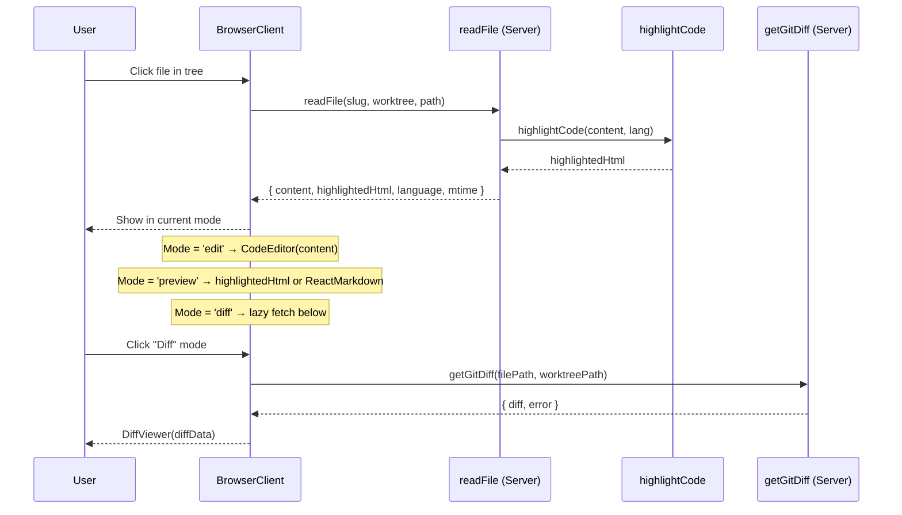

# Workshop: File Viewer Integration — Wiring Real Components

**Type**: Integration Pattern
**Plan**: 041-file-browser
**Spec**: [file-browser-spec.md](../file-browser-spec.md)
**Created**: 2026-02-24
**Status**: Draft

**Domain Context**:
- **Primary Domain**: `file-browser` — owns FileViewerPanel, CodeEditor, browser page
- **Related Domains**: `_platform/viewer` — provides FileViewer, MarkdownViewer, DiffViewer, Shiki

---

## Purpose

Design how FileViewerPanel integrates the four real viewer components (FileViewer, MarkdownViewer, DiffViewer, CodeEditor) instead of placeholder text. The challenge: Shiki highlighting is server-only, but the viewer panel is a client component that switches modes dynamically.

## Key Questions Addressed

- How does highlighted HTML get from server to client for preview mode?
- How does MarkdownViewer get its `preview` ReactNode (MarkdownServer is a Server Component)?
- How does DiffViewer get workspace-scoped diff data?
- When does CodeEditor vs FileViewer render?
- How do we avoid re-highlighting on every mode switch?

---

## The Problem

The existing viewer components have specific data contracts:

| Component | Needs | Source | Runs On |
|-----------|-------|--------|---------|
| FileViewer | `ViewerFile` + `highlightedHtml` | Shiki server action | Client |
| MarkdownViewer | `ViewerFile` + `highlightedHtml` + `preview` (ReactNode) | Shiki + MarkdownServer | Client (but preview needs Server Component) |
| DiffViewer | `ViewerFile` + `diffData` (raw git diff string) | getGitDiff server action | Client |
| CodeEditor | `value` + `language` + `onChange` | File content string | Client |

The FileViewerPanel is a `'use client'` component. It can't render MarkdownServer (Server Component) directly. And it shouldn't re-highlight code every time the user switches modes.

---

## Solution: Fetch Everything Upfront in readFile

**Principle**: The `readFile` server action already runs on the server. Extend it to return all the data the viewer needs — highlighted HTML, and for markdown files, the rendered preview HTML. The client just picks which piece to display based on mode.

### Extended readFile Result

```typescript
type ReadFileResult =
  | {
      ok: true;
      content: string;          // Raw file content (for editor)
      mtime: string;            // For conflict detection
      size: number;
      language: string;         // Detected language
      highlightedHtml: string;  // Pre-highlighted (for FileViewer preview)
      markdownHtml?: string;    // Rendered markdown (for MarkdownViewer preview) — only for .md files
    }
  | { ok: false; error: 'file-too-large' | 'binary-file' | 'not-found' | 'security' };
```

**Why this approach**:
- Single server roundtrip gets everything
- No second fetch when switching from edit → preview
- `highlightedHtml` cached with the file data — no re-highlight on mode toggle
- `markdownHtml` only computed for markdown files (cheap to skip otherwise)
- Diff data fetched separately (only when diff mode activated) since it's a different git command

### Server Action Changes

```typescript
// In readFile server action:
import { highlightCode } from '@/lib/server/shiki-processor';
import { renderMarkdownToHtml } from '@/lib/server/markdown-renderer'; // new

const result = await readFileService({ ... });
if (result.ok) {
  // Always highlight for preview mode
  const highlightedHtml = await highlightCode(result.content, result.language);
  
  // Render markdown preview if applicable
  let markdownHtml: string | undefined;
  if (result.language === 'markdown') {
    markdownHtml = await renderMarkdownToHtml(result.content);
  }
  
  return { ...result, highlightedHtml, markdownHtml };
}
```

### Diff Data: Lazy-Loaded on Mode Switch

Diff is different — it's a separate git command and only needed when the user clicks "Diff" mode. Fetch it lazily:

```typescript
// In BrowserClient:
const handleModeChange = async (newMode: ViewerMode) => {
  setParams({ mode: newMode });
  
  if (newMode === 'diff' && !diffData && selectedFile) {
    const result = await getGitDiffAction(selectedFile, worktreePath);
    setDiffData(result);
  }
};
```

---

## Component Wiring

### FileViewerPanel Mode Rendering

```
Mode = 'edit'    → <CodeEditor value={content} language={language} onChange={...} />
Mode = 'preview' → isMarkdown ? <MarkdownPreview html={markdownHtml} />
                              : <FileViewer file={viewerFile} highlightedHtml={highlightedHtml} />
Mode = 'diff'    → <DiffViewer file={viewerFile} diffData={diffData} error={diffError} />
```

### The MarkdownViewer Problem

The existing `MarkdownViewer` expects a `preview` prop of type `ReactNode` (specifically, the `<MarkdownServer>` Server Component output). But we can't render a Server Component inside a Client Component.

**Options**:
- **A) Render markdown to HTML string server-side**, pass as `markdownHtml`, render with `dangerouslySetInnerHTML` in a simple client div. Loses React component tree but works.
- **B) Use the existing MarkdownServer pattern** — but that requires the preview to be a Server Component child passed from the page. This means the page (Server Component) pre-renders the markdown and passes it as a prop.
- **C) Use `highlightCodeAction` from client** to get highlighted source, and a new `renderMarkdown` server action for preview. Two server roundtrips but clean separation.

**Recommended: Match the demo page pattern.** The browser page (`page.tsx`) IS a Server Component. It can render `<MarkdownServer content={...} />` and pass the ReactNode down through props. The BrowserClient stores it alongside fileData.

For non-initial file loads (clicking files client-side), use a server action that returns rendered markdown HTML string via the same pipeline. This gives us mermaid + syntax-highlighted code blocks in preview — identical to the demo page.

**Pattern**:
```tsx
// In readFile server action — for markdown files:
import { renderMarkdownToHtml } from '@/lib/server/markdown-renderer';

if (language === 'markdown') {
  // Use same pipeline as MarkdownServer but return HTML string
  markdownHtml = await renderMarkdownToHtml(content);
}

// In FileViewerPanel — preview mode for markdown:
{mode === 'preview' && language === 'markdown' && (
  <div 
    className="prose dark:prose-invert max-w-none p-4"
    dangerouslySetInnerHTML={{ __html: markdownHtml }} 
  />
)}
```

This gives us all the features: mermaid diagrams, syntax-highlighted code blocks, GFM tables, task lists — same as the demo page.

---

## Data Flow Diagram



---

## Implementation Checklist

1. **readFile server action** — add `highlightedHtml` to result (call `highlightCode` server-side)
2. **FileViewerPanel** — replace placeholder rendering:
   - Edit: `<CodeEditor>` (already created, just wire it)
   - Preview (code): `dangerouslySetInnerHTML={{ __html: highlightedHtml }}`
   - Preview (markdown): `<ReactMarkdown>{content}</ReactMarkdown>`
   - Diff: `<DiffViewer>` with lazy-loaded diff data
3. **BrowserClient** — add `diffData` state, lazy-fetch on diff mode switch
4. **FileTree auto-expand** — derive initial expanded set from `selectedFile` path segments

---

## Decisions

### D1: Server action returns rendered HTML for all preview types (not ReactNode)
**Context**: The demo page uses `<MarkdownServer>` (Server Component) passed as a ReactNode prop. But file selection happens client-side — we can't render Server Components from the client.
**Decision**: The `readFile` server action returns `previewHtml` as a string. Server-side rendering uses the same pipeline (react-markdown + @shikijs/rehype + mermaid) but outputs HTML string. Client renders via `dangerouslySetInnerHTML`.
**Rationale**: Supports any preview type (markdown today, potentially others tomorrow). Single roundtrip. Same visual quality as demo page. Extensible.

### D2: Reuse existing rendering pipeline, don't reinvent
**Context**: Plan 006 Phase 3 built MarkdownServer with GFM, Shiki code blocks, mermaid diagrams.
**Decision**: Extract the rendering logic from MarkdownServer into a reusable `renderMarkdownToHtml()` function. Both MarkdownServer (for demo pages) and readFile (for browser) call the same function.
**Rationale**: Single source of truth. No feature drift between demo and browser. All the hard work from Plan 006 is reused.

### D3: Diff data lazy-loaded on mode switch, not upfront
**Context**: Diff requires a separate `git diff` command per file.
**Decision**: Only fetch diff when user clicks "Diff" mode button. Cache result for that file until file changes or refresh.
**Rationale**: Most users open files in preview/edit mode. Avoid unnecessary git commands. Keep initial load fast.

### D4: Highlighted HTML cached with file data, not re-fetched on mode switch
**Context**: Switching between edit/preview/diff shouldn't trigger server roundtrips.
**Decision**: `readFile` returns `content` (for editor) + `highlightedHtml` (for code preview) + `previewHtml` (for markdown preview) all in one response. Stored in `fileData` state.
**Rationale**: Mode switching is instant — just pick which piece to render. Only file selection triggers a server call.

- ❌ Client-side ReactMarkdown (loses mermaid + syntax highlighting — use server-rendered HTML instead)
- ❌ Re-highlighting on mode switch — highlighted HTML cached with file data
- ❌ Syntax highlighting in diff view — DiffViewer handles its own Shiki client-side

---

## Open Questions

### Q1: Should we use the existing MarkdownViewer component?

**RESOLVED**: No — use the same server-side rendering pipeline as MarkdownServer but return HTML string from the readFile server action. This gives mermaid + syntax-highlighted code blocks. The existing `MarkdownViewer` component itself isn't used (it expects a ReactNode `preview` prop), but we get the same output via `dangerouslySetInnerHTML`.

### Q2: Should highlighted HTML be cached across file selections?

**RESOLVED**: No cache needed — `readFile` returns it fresh each time. File selections are user-driven (not rapid), so re-highlighting is acceptable. The important thing is NOT re-highlighting on mode switch (edit → preview → edit), which is solved by storing `highlightedHtml` in the `fileData` state.

### Q3: Can `highlightCode` be called from a server action?

**RESOLVED**: Yes. `highlightCode` in `shiki-processor.ts` is a regular async function (no `'use server'` directive). It can be imported and called from any server-side code including server actions. The module-level singleton pattern caches the highlighter across requests.
