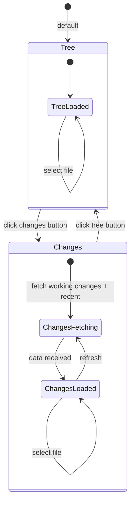

# Workshop: Left Panel View Modes

**Type**: UI Component / State Machine
**Plan**: 041-file-browser
**Spec**: [file-browser-spec.md](../file-browser-spec.md)
**Created**: 2026-02-24
**Status**: Draft

**Related Documents**:
- [file-tree-context-menu.md](./file-tree-context-menu.md) — Context menu on tree items
- [file-path-utility-bar.md](./file-path-utility-bar.md) — Path bar above panels

**Domain Context**:
- **Primary Domain**: file-browser
- **Related Domains**: _platform/workspace-url (URL state for active mode)

---

## Purpose

Design a composable view mode system for the left panel of the file browser. The panel currently only shows a file tree. We need to support multiple "ways to view" the workspace content — starting with **Tree** mode and **Changes** mode, with more modes coming later. The header bar ("FILES" + refresh) becomes the mode switcher. Selecting a file in any mode opens it in the editor and syncs across modes.

## Key Questions Addressed

- How do view modes compose — shared selection, shared header, different content?
- How does the Changes view get its data (unstaged, staged, recent commits)?
- How does cross-mode navigation work (click file in Changes → tree expands to it)?
- How does the mode persist in the URL for deep linking?

---

## Current State

The left panel is a single `FileTree` component with a sticky header:

```
┌──────────────────────────┐
│  FILES           [↻]     │  ← sticky header
├──────────────────────────┤
│  ▸ src/                  │
│  ▸ test/                 │
│    README.md             │  ← tree view (only mode)
│    package.json          │
└──────────────────────────┘
```

The "Changed only" filter exists as a boolean toggle (`?changed=true`) that filters the tree in-place. This will be **replaced** by the Changes view mode.

---

## Proposed Design

### Mode Switcher in Header

The header gets a toggle button group. Each mode is a small icon button. The title updates to reflect the active mode.

```
┌──────────────────────────────────┐
│  FILES  [🌳][📝]        [↻]     │  ← mode buttons in header
├──────────────────────────────────┤
│                                  │
│  (mode-specific content below)   │
│                                  │
└──────────────────────────────────┘
```

**Modes (v1)**:

| Icon | Mode | Label | Description |
|------|------|-------|-------------|
| 🌳 `GitBranch` | `tree` | Files | Full directory tree (current default) |
| 📝 `FileDiff` | `changes` | Changes | Changed files grouped by status + recent history |

**Future modes** (not built now, but the system accommodates them):

| Icon | Mode | Label | Description |
|------|------|-------|-------------|
| 🔍 `Search` | `search` | Search | File search results |
| ⭐ `Star` | `bookmarks` | Bookmarks | Pinned/starred files |
| 🕐 `Clock` | `recent` | Recent | Recently opened files |

### Mode Toggle Behaviour

- Clicking a mode button switches the panel content
- Active mode button gets `bg-accent` highlight (same pattern as viewer mode buttons)
- Mode persists in URL: `?panel=tree` or `?panel=changes`
- Toast on first switch: "Changes view" / "Tree view" (brief, informative)
- Switching modes **preserves the selected file** — the orange ▶ indicator and editor panel stay the same

### URL State

Add `panel` param to `fileBrowserParams`:

```typescript
export const fileBrowserParams = {
  dir: parseAsString.withDefault(''),
  file: parseAsString.withDefault(''),
  mode: parseAsStringLiteral(['edit', 'preview', 'diff'] as const).withDefault('preview'),
  panel: parseAsStringLiteral(['tree', 'changes'] as const).withDefault('tree'),
  // 'changed' boolean param is REMOVED — replaced by panel mode
};
```

---

## Changes View Design

### Data Sources

The Changes view shows files from two git sources:

**Section 1: Working Changes** (top)
- Unstaged changes: `git diff --name-only`
- Staged changes: `git diff --cached --name-only`
- Untracked files: `git ls-files --others --exclude-standard`
- Files shown with status badge: `M` (modified), `A` (added/staged), `?` (untracked), `D` (deleted)

**Section 2: Recent Activity** (bottom, below a separator)
- Last 20 unique files changed across recent commits: `git log --name-only --pretty=format: -n 20`
- Deduplicated against Section 1 — if a file already appears in Working Changes, skip it
- Shown with muted styling (these are committed, not active work)

### Visual Layout

```
┌──────────────────────────────────┐
│  FILES  [🌳][📝]        [↻]     │
├──────────────────────────────────┤
│  WORKING CHANGES                 │  ← section header
│   M  src/lib/utils.ts            │  ← modified (amber)
│   M  src/components/header.tsx   │
│   A  src/features/new-thing.ts   │  ← staged (green)
│   ?  scratch.ts                  │  ← untracked (grey)
│                                  │
│  ─────────────────────           │  ← separator
│  RECENT (committed)              │  ← section header, muted
│    src/lib/server/auth.ts        │  ← committed file (muted)
│    src/components/sidebar.tsx    │
│    test/unit/auth.test.ts        │
│    ...                           │
└──────────────────────────────────┘
```

### Status Badges

| Badge | Colour | Git Status | Meaning |
|-------|--------|-----------|---------|
| `M` | amber-500 | unstaged modified | File has local changes |
| `A` | green-500 | staged (new or modified) | File is staged for commit |
| `D` | red-500 | deleted | File was deleted |
| `?` | muted-foreground | untracked | New file not yet tracked |
| `R` | blue-500 | renamed | File was renamed |

### File Items in Changes View

Each file item is a flat list (no tree nesting). Shows relative path with the filename emphasized:

```
 M  src/lib/utils.ts
     ^^^^           ← muted directory prefix
              ^^^^^^^^ ← bold/normal filename
```

```typescript
// Render: split path into dir + filename
const dir = filePath.includes('/') ? filePath.slice(0, filePath.lastIndexOf('/') + 1) : '';
const name = filePath.split('/').pop();

<span className="text-muted-foreground">{dir}</span>
<span className="font-medium">{name}</span>
```

### Interaction

- Click a file → `onSelect(filePath)` — same callback as tree view
- Selected file gets the same orange ▶ indicator
- Context menu — same as tree view file menu (Copy Path, Copy Content, Download)
- **Cross-mode sync**: After clicking a file in Changes view, if you switch to Tree mode, the tree auto-expands to that file (because `selectedFile` is shared state and the tree already has auto-expand logic)

---

## Git Service Extension

### New: `getWorkingChanges`

```typescript
export interface ChangedFile {
  path: string;
  status: 'modified' | 'added' | 'deleted' | 'untracked' | 'renamed';
  /** 'staged' if in index, 'unstaged' if in working tree, 'untracked' if new */
  area: 'staged' | 'unstaged' | 'untracked';
}

export interface WorkingChangesResult {
  ok: true;
  files: ChangedFile[];
} | {
  ok: false;
  error: 'not-git';
}

export async function getWorkingChanges(worktreePath: string): Promise<WorkingChangesResult> {
  // Uses: git status --porcelain=v1
  // Parses XY status codes (first char = staged, second = unstaged)
  // Single command, all info in one call
}
```

**Why `git status --porcelain=v1`?** — One command gives us staged, unstaged, and untracked in a machine-parseable format. Each line is `XY <path>` where X = index status, Y = worktree status.

```
M  src/staged-file.ts        → staged modified (X=M, Y=space)
 M src/unstaged-file.ts      → unstaged modified (X=space, Y=M)
?? scratch.ts                → untracked
A  src/new-file.ts           → staged added
 D src/deleted-file.ts       → unstaged deleted
```

### New: `getRecentFiles`

```typescript
export interface RecentFilesResult {
  ok: true;
  files: string[];   // Deduplicated, ordered by most recent first
} | {
  ok: false;
  error: 'not-git';
}

export async function getRecentFiles(
  worktreePath: string,
  limit: number = 20
): Promise<RecentFilesResult> {
  // Uses: git log --name-only --pretty=format: --diff-filter=AMCR -n <N>
  // Returns unique file paths, most recent first
  // May need to scan more than N commits to get N unique files
}
```

**Edge case**: If there are fewer than 20 unique files in git history, return however many exist. The UI handles empty gracefully.

### Migration: Replace `getChangedFiles`

The existing `getChangedFiles` (which only does `git diff --name-only`) gets **replaced** by `getWorkingChanges` which is strictly more informative. The `fetchChangedFiles` server action wraps the new function. The `changedFiles: string[]` state in BrowserClient evolves to use the richer `ChangedFile[]` type.

For backward compat during the transition, the tree view's `changedFiles` filter can derive from the new type:
```typescript
const changedFilePaths = workingChanges.map(f => f.path);
```

---

## Component Architecture

### Composable Panel Pattern

```typescript
/** The left panel renders one of several views based on active mode */
type PanelMode = 'tree' | 'changes';  // Extensible union

interface LeftPanelProps {
  mode: PanelMode;
  onModeChange: (mode: PanelMode) => void;
  selectedFile?: string;
  onSelect: (filePath: string) => void;
  onRefresh: () => void;
  // Mode-specific data passed through
  treeProps: FileTreeProps;          // for tree mode
  changesProps: ChangesViewProps;    // for changes mode
}
```

**Option A: Wrapper component** — `LeftPanel` wraps `FileTree` and `ChangesView`, switches between them. Owns the header with mode buttons.

**Option B: Keep in BrowserClient** — BrowserClient conditionally renders `FileTree` or `ChangesView` based on `params.panel`. Header is a shared component.

**Decision: Option A** — A `LeftPanel` wrapper keeps BrowserClient from growing further. The header (mode buttons + refresh) is owned by LeftPanel. Each view mode is a separate component.

```
LeftPanel
  ├── PanelHeader (mode buttons + refresh)
  ├── FileTree (when mode === 'tree')
  └── ChangesView (when mode === 'changes')
```

### PanelHeader

```typescript
interface PanelHeaderProps {
  mode: PanelMode;
  onModeChange: (mode: PanelMode) => void;
  onRefresh: () => void;
}
```

The sticky header moves from inside FileTree to PanelHeader. FileTree becomes a pure scrollable list without its own header.

### ChangesView

```typescript
interface ChangesViewProps {
  workingChanges: ChangedFile[];
  recentFiles: string[];
  selectedFile?: string;
  onSelect: (filePath: string) => void;
  // Clipboard callbacks (same interface as FileTree)
  onCopyFullPath?: (path: string) => void;
  onCopyRelativePath?: (path: string) => void;
  onCopyContent?: (filePath: string) => void;
  onDownload?: (filePath: string) => void;
}
```

---

## State Machine



### Data Fetching Strategy

- **Tree mode**: Data loaded on mount (existing behaviour — initial entries from server, lazy expand)
- **Changes mode**: Data fetched **on first switch** to changes mode (lazy). Cached in state. Refresh button re-fetches.
- Both modes share `selectedFile` — switching modes preserves selection

```typescript
// In BrowserClient:
const [workingChanges, setWorkingChanges] = useState<ChangedFile[]>([]);
const [recentFiles, setRecentFiles] = useState<string[]>([]);
const [changesLoaded, setChangesLoaded] = useState(false);

// Fetch on first switch to changes mode
useEffect(() => {
  if (params.panel === 'changes' && !changesLoaded) {
    fetchWorkingChanges(worktreePath).then(result => {
      if (result.ok) setWorkingChanges(result.files);
    });
    fetchRecentFiles(worktreePath).then(result => {
      if (result.ok) setRecentFiles(result.files);
    });
    setChangesLoaded(true);
  }
}, [params.panel]);
```

---

## Cross-Mode File Selection Sync

This is the key UX feature: **selecting a file in any mode works everywhere**.

### Changes → Tree sync

1. User clicks `src/lib/utils.ts` in Changes view
2. `onSelect('src/lib/utils.ts')` fires → `setParams({ file: 'src/lib/utils.ts' })`
3. Editor loads the file (right panel)
4. User clicks Tree mode button
5. Tree renders with `selectedFile='src/lib/utils.ts'`
6. Tree's `useState` initializer auto-expands `src/` → `src/lib/` (existing logic at line 67-78)
7. ScrollIntoView fires on the selected file (existing logic at line 275-282)

**This already works!** The tree's auto-expand-to-selected logic runs on initial render. When switching from Changes to Tree, the FileTree re-mounts (or re-renders with new selectedFile), and the existing expand logic handles it.

### Tree → Changes sync

1. User selects file in tree view
2. Switches to Changes view
3. If the file appears in working changes or recent files, it gets the ▶ indicator
4. If it doesn't appear (unchanged file) — the ▶ indicator just isn't visible, which is correct

---

## Deduplication Logic

Recent files must not duplicate working changes:

```typescript
// In ChangesView:
const workingPaths = new Set(workingChanges.map(f => f.path));
const dedupedRecent = recentFiles.filter(f => !workingPaths.has(f));
```

---

## Edge Cases

### Non-git workspace

- Changes mode button is **hidden** (not disabled) when `isGit === false`
- Only Tree mode available
- URL param `?panel=changes` ignored gracefully — falls back to tree

### No working changes

```
┌──────────────────────────────────┐
│  FILES  [🌳][📝]        [↻]     │
├──────────────────────────────────┤
│  WORKING CHANGES                 │
│  ✓ Working tree clean            │  ← green check, muted text
│                                  │
│  ─────────────────────           │
│  RECENT (committed)              │
│    src/lib/utils.ts              │
│    ...                           │
└──────────────────────────────────┘
```

### No recent files (brand new repo)

Both sections empty — show "No changes or recent files" message.

### Deleted file clicked

User clicks a deleted file (`D` status). `readFile` will return `not-found`. Toast: "File has been deleted". File viewer shows empty state. This is correct — the user sees the file was deleted and can check the diff mode to see what was removed.

### Renamed file

`git status --porcelain` shows renames as `R  old-name -> new-name`. Parse the new name for display, show `R` badge. Navigation goes to the new path.

---

## Open Questions

### Q1: Should Changes view auto-refresh on focus?

**DEFERRED**: No auto-refresh for now. Manual refresh button in header. Future: SSE notification system will push file change events (already scoped in Plan 041's OOS notes). When that arrives, Changes view subscribes to file events and auto-updates.

### Q2: Should we show the diff inline in the Changes view?

**DEFERRED**: Not in v1. Just show the file list. Clicking opens the file in the right panel where you can switch to Diff mode. VS Code also separates the list from the diff viewer.

### Q3: What about `git stash` files?

**DEFERRED**: Not shown in v1. Stash is a power feature. We can add a "Stashes" section later if needed.

### Q4: Sort order in Recent files?

**RESOLVED**: Most recently changed first (git log order). This matches the user's mental model of "what was I just working on?"

---

## Implementation Checklist

1. Add `getWorkingChanges` service (`git status --porcelain=v1` parser)
2. Add `getRecentFiles` service (`git log --name-only` parser)
3. Add server actions: `fetchWorkingChanges`, `fetchRecentFiles`
4. Create `PanelHeader` component (extracted from FileTree header + mode buttons)
5. Create `ChangesView` component (two sections, file items with status badges)
6. Create `LeftPanel` wrapper (mode switch, renders tree or changes)
7. Update `FileTree` — remove its own header (now in PanelHeader)
8. Add `panel` param to `fileBrowserParams`, remove `changed` boolean
9. Update `BrowserClient` — use LeftPanel, lazy-fetch changes data
10. Tests for porcelain parser, dedup logic, component rendering
11. Verify cross-mode selection sync works
