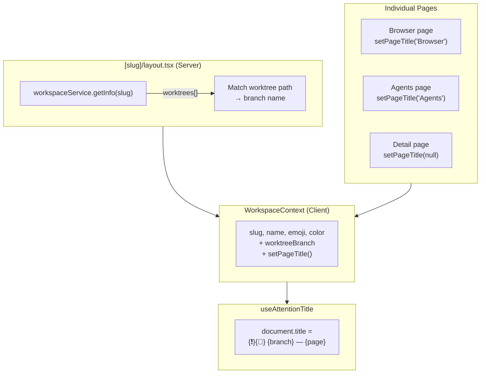

# Workshop: Browser Tab Title Strategy

**Type**: Integration Pattern
**Plan**: 041-file-browser
**Spec**: [file-browser-spec.md](../file-browser-spec.md)
**Created**: 2026-02-24
**Status**: Draft

**Related Documents**:
- [UX Vision Workshop § 15 — Attention System](./ux-vision-workspace-experience.md)
- [Phase 5 Tasks](../tasks/phase-5-attention-system-polish/tasks.md)

**Domain Context**:
- **Primary Domain**: file-browser
- **Related Domains**: _platform/workspace-url (worktree param)

---

## Purpose

Design how browser tab titles identify which worktree + page you're on, so multiple tabs across workspaces and worktrees are instantly distinguishable at a glance. This is the primary use case for the attention system — you have 5 tabs open, you need to know which is which without clicking.

## Key Questions Addressed

- What information goes in the tab title?
- How does each page set its own title without duplicating logic?
- How does worktree branch name flow from server → client → title?
- What happens when pages don't have a worktree (agents, settings)?

---

## The Problem

Current state — every workspace page shows:

```
🔮 Workspace
```

What we need when 3 tabs are open:

```
Tab 1: 🔮 main — Browser
Tab 2: 🔮 041-file-browser — Browser
Tab 3: 🔮 033-real-agent — Agents
```

And with attention:

```
Tab 2: ❗ 🔮 041-file-browser — Browser
```

## Title Format

```
{attention}{emoji} {worktree|workspace} — {page}
```

| Segment | Source | Example |
|---------|--------|---------|
| `{attention}` | `hasChanges` from context | `❗ ` or empty |
| `{emoji}` | Workspace preferences | `🔮` or first letter `S` |
| `{worktree}` | Branch name from URL worktree param | `041-file-browser` |
| `{workspace}` | Fallback when no worktree active | `substrate` |
| `{page}` | Each page sets its own | `Browser`, `Agents`, `Settings` |

### Examples at Different Levels

```
Landing page:       Chainglass                    (no workspace, default title)
Workspace detail:   🔮 substrate                  (workspace, no worktree, no page)
Browser:            🔮 041-file-browser — Browser  (worktree + page)
Agents:             🔮 substrate — Agents          (no worktree, just workspace + page)
Settings:           Chainglass — Settings          (no workspace context)
```

## Data Flow



## Design: Two-Part Title Setting

The problem is that the **layout** knows workspace/worktree info, but the **page** knows which page it is. Neither knows both. Solution: split responsibility.

### Option A: Context with `setPageTitle` callback (Recommended)

The layout provides workspace + worktree data. Each page calls `setPageTitle('Browser')` to announce itself. The attention wrapper reacts to both.

```typescript
// WorkspaceContext gains:
interface WorkspaceContextValue {
  // ... existing
  worktreeBranch: string | null;  // NEW: from layout matching worktree param
  pageTitle: string | null;        // NEW: set by each page
  setPageTitle: (title: string | null) => void;  // NEW
}
```

The attention wrapper composes the title:

```typescript
// workspace-attention-wrapper.tsx
useAttentionTitle({
  emoji: ctx?.emoji ?? '',
  pageName: buildPageName(ctx),  // "041-file-browser — Browser" or "substrate"
  needsAttention: ctx?.hasChanges ?? false,
});

function buildPageName(ctx) {
  const location = ctx.worktreeBranch ?? ctx.name;
  if (ctx.pageTitle) return `${location} — ${ctx.pageTitle}`;
  return location;
}
```

Each page just does:

```typescript
// In browser-client.tsx
const ctx = useWorkspaceContext();
useEffect(() => { ctx?.setPageTitle('Browser'); }, []);

// In agents page (client wrapper)
const ctx = useWorkspaceContext();
useEffect(() => { ctx?.setPageTitle('Agents'); }, []);
```

### Option B: Each page calls useAttentionTitle directly

Remove `useAttentionTitle` from the wrapper. Each page calls it with its own pageName.

**Problem**: Pages that don't call it get no title. Every new page must remember to wire it. The wrapper exists to guarantee it always works.

### Option C: useAttentionTitle reads route metadata

Use Next.js `metadata` export or `usePathname()` to derive the page name.

**Problem**: Too magic. Route → human label mapping is fragile. `/workspaces/[slug]/browser` → "Browser" requires a lookup table.

### Decision: **Option A**

- Layout provides data (workspace, worktree branch)
- Pages announce themselves via `setPageTitle`
- Attention wrapper composes the full title
- Default works even if page forgets to call setPageTitle

## Worktree Branch Resolution

The layout needs to resolve the `?worktree=` URL param to a branch name. It already fetches workspace info (which includes `worktrees[].path` and `worktrees[].branch`).

```typescript
// In [slug]/layout.tsx
const worktreePath = searchParamsResolved?.worktree;
let worktreeBranch: string | null = null;

if (worktreePath && info) {
  const wt = info.worktrees.find(w => w.path === worktreePath);
  worktreeBranch = wt?.branch ?? worktreePath.split('/').pop() ?? null;
}
```

**Problem**: `layout.tsx` doesn't currently receive `searchParams`. In Next.js App Router, layouts don't get searchParams — only pages do.

### Solution: Layout reads searchParams too

Actually in Next.js 16, layouts CAN receive searchParams as a prop. But this forces the layout to be dynamic (which it already is via `force-dynamic`).

Wait — checking Next.js docs: **Layouts do NOT receive searchParams**. Only `page.tsx` and `route.ts` get them.

### Revised Solution: Page sets worktree branch via context

Since only the page knows the worktree (from searchParams), the page must set it:

```typescript
// browser/page.tsx passes worktreeBranch to BrowserClient
const wt = info.worktrees.find(w => w.path === worktreePath);
const worktreeBranch = wt?.branch ?? worktreePath.split('/').pop() ?? null;

<BrowserClient
  slug={slug}
  worktreePath={worktreePath}
  worktreeBranch={worktreeBranch}  // NEW
  ...
/>

// browser-client.tsx sets it into context
const ctx = useWorkspaceContext();
useEffect(() => {
  ctx?.setWorktreeBranch(worktreeBranch);
  ctx?.setPageTitle('Browser');
}, [worktreeBranch]);
```

## Final Design

### WorkspaceContext additions

```typescript
interface WorkspaceContextValue {
  slug: string;
  name: string;
  emoji: string;
  color: string;
  hasChanges: boolean;
  setHasChanges: (value: boolean) => void;
  // NEW:
  worktreeBranch: string | null;
  setWorktreeBranch: (branch: string | null) => void;
  pageTitle: string | null;
  setPageTitle: (title: string | null) => void;
}
```

### Attention wrapper title composition

```typescript
function buildTitle(ctx: WorkspaceContextValue | null): string {
  if (!ctx) return 'Chainglass';
  const location = ctx.worktreeBranch ?? ctx.name;
  if (ctx.pageTitle) return `${location} — ${ctx.pageTitle}`;
  return location;
}
```

### Per-page wiring (one line each)

| Page | Code | Result |
|------|------|--------|
| Browser | `setPageTitle('Browser'); setWorktreeBranch(branch)` | `🔮 041-file-browser — Browser` |
| Agents | `setPageTitle('Agents')` | `🔮 substrate — Agents` |
| Workspace detail | _(nothing)_ | `🔮 substrate` |
| Worktree detail | `setWorktreeBranch(branch)` | `🔮 041-file-browser` |

### Cleanup on unmount

Pages should clear their title on unmount so navigating away resets:

```typescript
useEffect(() => {
  ctx?.setPageTitle('Browser');
  return () => ctx?.setPageTitle(null);
}, []);
```

## Implementation Checklist

1. Add `worktreeBranch`, `setWorktreeBranch`, `pageTitle`, `setPageTitle` to WorkspaceContext
2. Update WorkspaceProvider with new state
3. Update workspace-attention-wrapper to compose title from context
4. Browser page: resolve branch name server-side, pass to BrowserClient
5. BrowserClient: set worktreeBranch + pageTitle into context
6. Update tests for new context fields

## Open Questions

### Q1: Should worktree branch be the full path fallback or just the last segment?

**RESOLVED**: Use branch name if available, fall back to last path segment. `wt.branch ?? worktreePath.split('/').pop()`. Branch is cleaner (`041-file-browser` vs `/home/jak/substrate/041-file-browser`).

### Q2: What about pages that have both workspace and worktree context but don't need the worktree in the title?

**RESOLVED**: Pages that don't call `setWorktreeBranch` get the workspace name as fallback. This is the right default — agents are workspace-scoped, not worktree-scoped.

---

## Per-Worktree Identity (Emoji + Color)

### The Problem

With 5 worktrees open from the same workspace, they all show the same workspace emoji 🔮. Tabs look identical. Each worktree needs its own emoji + color.

### Data Model Extension

Add `worktreePreferences` map to `WorkspacePreferences`:

```typescript
export interface WorktreeVisualPreferences {
  emoji: string;
  color: string;
}

export interface WorkspacePreferences {
  emoji: string;           // workspace-level (existing)
  color: string;           // workspace-level (existing)
  starred: boolean;
  sortOrder: number;
  starredWorktrees: string[];
  worktreePreferences: Record<string, WorktreeVisualPreferences>;  // NEW: keyed by worktree path
}

export const DEFAULT_PREFERENCES: WorkspacePreferences = {
  // ... existing
  worktreePreferences: {},  // NEW: empty = all worktrees use workspace defaults
};
```

- Key is worktree path (absolute, e.g. `/home/jak/substrate/041-file-browser`)
- Missing entry → falls back to workspace emoji/color
- Empty string emoji/color → falls back to workspace emoji/color

### Emoji Resolution Order (tab title)

```
worktreePreferences[worktreePath].emoji  →  workspace.emoji  →  first letter of branch
```

Same for color:

```
worktreePreferences[worktreePath].color  →  workspace.color  →  neutral
```

### Tab Title Examples (with per-worktree emoji)

```
Tab 1: 💎 main — Browser              (worktree emoji 💎)
Tab 2: 🔥 041-file-browser — Browser  (worktree emoji 🔥)
Tab 3: 🔮 033-real-agent — Agents     (falls back to workspace emoji)
```

### Settings Page Design

When inside a worktree (URL has `?worktree=`), the settings page shows a **Worktree** section above the workspace table:

```
┌─────────────────────────────────────────────────┐
│ Worktree: 041-file-browser                      │
│                                                 │
│  Emoji: [🔥]    Color: [●]                     │
│                                                 │
│  (These override workspace defaults for this    │
│   worktree only)                                │
├─────────────────────────────────────────────────┤
│ Workspace Settings                              │
│  ... existing table ...                         │
└─────────────────────────────────────────────────┘
```

When NOT in a worktree, just shows the workspace table (current behavior).

### Context Flow

```
[slug]/layout.tsx
  → WorkspaceProvider(emoji, color, worktreePreferences)

browser/page.tsx
  → resolves worktreePath from searchParams
  → looks up worktreePreferences[worktreePath]
  → passes worktreeEmoji, worktreeColor to BrowserClient

BrowserClient
  → ctx.setWorktreeBranch(branch)
  → ctx.setWorktreeEmoji(emoji)  // overrides workspace emoji for tab title
  → ctx.setPageTitle('Browser')

workspace-attention-wrapper.tsx
  → reads ctx.worktreeEmoji ?? ctx.emoji
  → composes: "{attention}{emoji} {branch} — {page}"
```

### Implementation Additions (beyond original checklist)

1. Add `WorktreeVisualPreferences` type + `worktreePreferences` to `WorkspacePreferences`
2. Update `DEFAULT_PREFERENCES` with empty map
3. Add `updateWorktreePreferences` server action (or extend `updateWorkspacePreferences`)
4. Add `worktreePreferences` to WorkspaceContext (passed from layout)
5. Pages resolve their worktree's emoji/color from the map
6. Settings page: contextual worktree section when `?worktree=` present
7. Update tab title to prefer worktree emoji over workspace emoji
