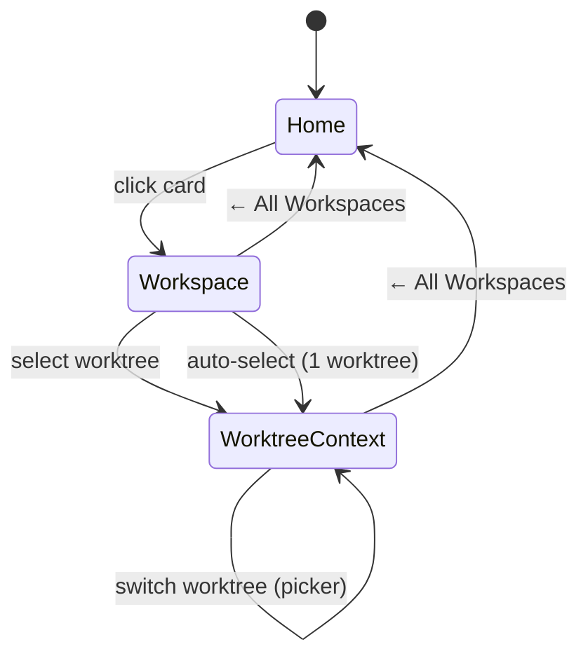

# Workshop: Workspace Context — Session Binding & Worktree Scope

**Type**: State Machine / UX Flow
**Plan**: 041-file-browser
**Spec**: [file-browser-spec.md](../file-browser-spec.md)
**Created**: 2026-02-24
**Status**: Draft

**Related Documents**:
- [UX Vision Workshop](./ux-vision-workspace-experience.md)
- [Deep Linking Workshop](./deep-linking-system.md)

**Domain Context**:
- **Primary Domain**: `_platform/workspace-url` — owns URL construction and param parsing
- **Related Domains**: `file-browser` — consumes workspace context for browser/viewer routing

---

## Purpose

Define how a user "enters" a workspace, selects a worktree, and stays locked to that context as they navigate between Browser, Agents, and Workflows. Currently the sidebar drops worktree context when building nav links — clicking "Browser" loses your worktree selection.

## Key Questions Addressed

- How does worktree context persist across sub-pages?
- What does the sidebar show at each level (home → workspace → worktree)?
- How do nav links (Browser, Agents, Workflows) carry worktree context?
- What happens when no worktree is selected?
- How does deep linking work with workspace context?

---

## The Problem

Today's flow is broken:

```
1. User visits /workspaces/chainglass-main
2. User clicks worktree "041-file-browser" in the list
3. URL becomes /workspaces/chainglass-main/worktree?worktree=/path/to/041
4. User clicks "Browser" in sidebar
5. URL becomes /workspaces/chainglass-main/browser  ← WORKTREE LOST!
6. Browser page falls back to workspace root, not the worktree
```

The `?worktree=` param is in the URL but the sidebar doesn't read it or pass it through to nav links.

---

## The Mental Model

```
┌─────────────────────────────────────────────────────────────┐
│                                                             │
│  HOME (/)                                                   │
│    "Pick a workspace"                                       │
│    [card] [card] [card]                                     │
│                                                             │
│         │ click card                                        │
│         ▼                                                   │
│                                                             │
│  WORKSPACE (/workspaces/chainglass-main)                    │
│    "Pick a worktree"                                        │
│    Sidebar: worktree list                                   │
│    Main: worktree cards/list                                │
│                                                             │
│         │ click worktree (or auto-select if only 1)         │
│         ▼                                                   │
│                                                             │
│  WORKTREE CONTEXT (?worktree=/path/to/041)                  │
│    "Working inside 041-file-browser"                        │
│    Sidebar: [041-file-browser ▾] picker                     │
│             Browser → /browser?worktree=...                 │
│             Agents  → /agents?worktree=...                  │
│             Workflows → /workgraphs?worktree=...            │
│             ← All Workspaces                                │
│    Main: whatever sub-page you're on                        │
│                                                             │
└─────────────────────────────────────────────────────────────┘
```

**Three levels of context:**

| Level | URL | Sidebar Shows | Main Shows |
|-------|-----|---------------|------------|
| Home | `/` | Workspace list (or hidden) | Workspace cards |
| Workspace | `/workspaces/{slug}` | Worktree list for this workspace | Worktree overview |
| Worktree | `/workspaces/{slug}/*?worktree=...` | Current worktree picker + scoped nav | Sub-page content |

---

## State Machine



---

## URL Design

The worktree context is carried as a **query parameter** on every sub-page URL:

```
/workspaces/chainglass-main/browser?worktree=%2Fhome%2Fjak%2Fsubstrate%2F041-file-browser
/workspaces/chainglass-main/agents?worktree=%2Fhome%2Fjak%2Fsubstrate%2F041-file-browser
/workspaces/chainglass-main/workgraphs?worktree=%2Fhome%2Fjak%2Fsubstrate%2F041-file-browser
```

**Why query param, not path segment?**
- Worktree paths are filesystem paths (contain `/`, can be long) — ugly in path segments
- `?worktree=` is already established (Phase 2 `workspaceParams`)
- Works with nuqs `createSearchParamsCache`
- Deep-linkable and bookmarkable

**No worktree param?** Falls back to workspace root path (`info.path`). This means browsing the workspace itself is just "no explicit worktree selected" — the main checkout.

---

## Sidebar Behavior (The Fix)

### Current (broken)
```typescript
// dashboard-sidebar.tsx line 96
const href = workspaceHref(workspaceSlug, item.href);
// → /workspaces/slug/browser  (no worktree!)
```

### Fixed
```typescript
// Read current worktree from URL
const searchParams = useSearchParams();
const currentWorktree = searchParams.get('worktree');

// Pass worktree through to all nav links
const href = workspaceHref(workspaceSlug, item.href, {
  worktree: currentWorktree ?? undefined,
});
// → /workspaces/slug/browser?worktree=%2Fpath%2Fto%2F041
```

This is a **one-line fix** in `dashboard-sidebar.tsx`. The infrastructure (`workspaceHref` with options) already exists from Phase 2.

### Sidebar States

**Outside workspace** (`/`, `/workflows`, etc.):
```
┌─────────────────────┐
│ Chainglass           │
├─────────────────────┤
│ Workspaces           │  ← workspace list
│   chainglass-main    │
│   demo               │
├─────────────────────┤
│ Dev ▸                │
└─────────────────────┘
```

**Inside workspace, no worktree selected** (`/workspaces/chainglass-main`):
```
┌─────────────────────┐
│ chainglass-main      │
├─────────────────────┤
│ Worktrees            │
│   ★ 041-file-browser │
│   ★ main             │
│     002-agents       │
│     003-wf-basics    │
│     ...              │
├─────────────────────┤
│ ← All Workspaces     │
├─────────────────────┤
│ Dev ▸                │
└─────────────────────┘
```

**Inside workspace, worktree selected** (`/workspaces/chainglass-main/browser?worktree=...`):
```
┌─────────────────────┐
│ chainglass-main      │
│ ▾ 041-file-browser   │  ← worktree picker (click to switch)
├─────────────────────┤
│ 📁 Browser           │  ← all carry ?worktree=
│ 🤖 Agents            │
│ ⚡ Workflows          │
├─────────────────────┤
│ ← All Workspaces     │
├─────────────────────┤
│ Dev ▸                │
└─────────────────────┘
```

---

## Worktree Picker Behavior

When a worktree is selected, the picker shows the current worktree name. Clicking it opens the picker popover/sheet to switch.

**When user switches worktree:**
1. User clicks picker → popover opens
2. User selects different worktree (e.g., `main`)
3. URL updates: same sub-page, different `?worktree=` value
4. Page re-renders with new worktree context
5. Sidebar nav links update to point to new worktree

```typescript
// In worktree picker's onSelect callback:
const handleWorktreeSelect = (newWorktreePath: string) => {
  // Stay on same sub-page, just change worktree
  const currentSubPath = pathname.replace(`/workspaces/${slug}`, '') || '/';
  router.push(workspaceHref(slug, currentSubPath, { worktree: newWorktreePath }));
};
```

---

## Auto-Selection Rules

| Scenario | Behavior |
|----------|----------|
| Workspace has 1 worktree | Auto-select it, skip worktree list |
| Workspace has 0 worktrees (non-git) | Use workspace root path as implicit worktree |
| URL has `?worktree=` on any sub-page | Use that worktree |
| URL has NO `?worktree=` on sub-page | Fall back to workspace root path |
| User navigates to `/workspaces/{slug}` | Show worktree list (no auto-select when multiple) |

---

## Implementation Changes Needed

### 1. Sidebar reads and passes worktree (1 change)

```typescript
// dashboard-sidebar.tsx
const searchParams = useSearchParams();
const currentWorktree = searchParams.get('worktree');

// In nav link generation:
const href = workspaceHref(workspaceSlug, item.href, {
  worktree: currentWorktree ?? undefined,
});
```

### 2. Worktree picker shows current selection (already exists)

WorktreePicker already receives `currentWorktree` prop. Just need to wire the picker's `onSelect` to navigate with the new worktree while preserving the current sub-page.

### 3. Workspace landing page shows worktree list (already exists)

The `/workspaces/[slug]/page.tsx` already shows worktrees. Each links to `/workspaces/{slug}/worktree?worktree=...`. This is the "pick a worktree" step.

### 4. Sub-pages read worktree from URL (already exists)

Browser page already reads `searchParams.worktree`. Agents and Workflows pages can do the same when they're built.

### 5. Back button preserves context

"← All Workspaces" in sidebar goes to `/` — fully exits workspace context. This is intentional. The user opens different workspaces in different tabs.

---

## Deep Link Examples

| Action | URL | What You See |
|--------|-----|-------------|
| Browse files in 041 worktree | `/workspaces/chainglass-main/browser?worktree=%2Fhome%2Fjak%2Fsubstrate%2F041-file-browser` | File tree for 041 |
| Edit a specific file | `/workspaces/chainglass-main/browser?worktree=...&file=src/lib/workspace-url.ts&mode=edit` | CodeMirror editing that file |
| View agents in main worktree | `/workspaces/chainglass-main/agents?worktree=%2Fhome%2Fjak%2Fsubstrate%2Fchainglass` | Agent list for main |
| Workspace overview (no worktree) | `/workspaces/chainglass-main` | Worktree selection list |
| Home | `/` | Workspace card grid |

All deep-linkable. Pin any of these in browser favorites.

---

## What This Does NOT Change

- **No new routes** — everything uses existing `/workspaces/[slug]/*` structure
- **No new params** — `?worktree=` already defined in Phase 2 `workspaceParams`
- **No new components** — sidebar, picker, nav links already exist
- **No data model changes** — worktree paths come from git worktree detection

The entire fix is **context threading** — making the sidebar read `?worktree=` and pass it through to nav links. The plumbing is built; we just need to connect it.

---

## Open Questions

### Q1: Should selecting a worktree from the workspace landing page navigate to a specific sub-page?

**RESOLVED**: Navigate to the worktree overview page (`/worktree?worktree=...`). From there the user clicks Browser/Agents/Workflows in the sidebar. The sidebar now carries the worktree context.

### Q2: What about the mobile BottomTabBar?

**RESOLVED**: Same fix — read `?worktree=` from URL and pass through to tab hrefs via `workspaceHref()`. Already implemented for workspace-scoped tabs in Phase 3 T013, just needs worktree threading.

### Q3: Should workspace root be a "worktree" in the picker?

**RESOLVED**: Yes. For non-git workspaces, there's only one path (the workspace root). For git workspaces, the main checkout IS a worktree (listed by `git worktree list`). No special casing needed — the workspace root appears naturally in the worktree list as `main` or whatever the default branch is.
