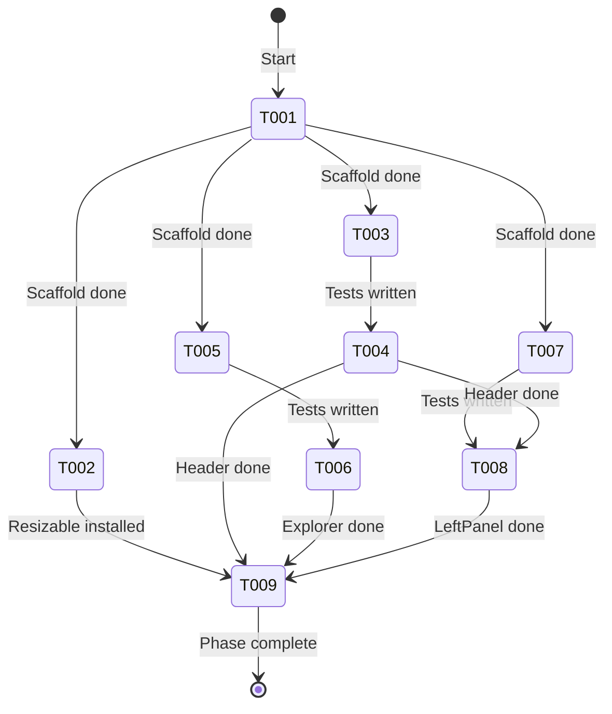
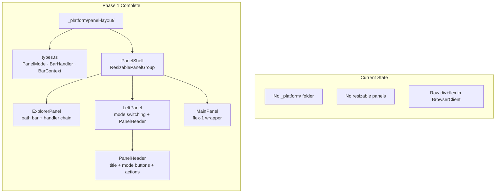

# Flight Plan: Phase 1 — Panel Infrastructure

**Phase**: [tasks.md](./tasks.md)
**Plan**: [panel-layout-plan.md](../../panel-layout-plan.md)
**Status**: Ready

---

## Departure → Destination

**Where we are**: The file browser uses raw `div+flex` for layout. FileTree owns its own sticky header. FileViewerPanel embeds a file path row. No reusable panel components exist. No `_platform` feature folder exists.

**Where we're going**: A complete set of reusable panel layout components in `_platform/panel-layout/` — PanelShell composites ExplorerPanel (top utility bar), LeftPanel (mode-switching sidebar), and MainPanel (content area) with a resizable drag handle between left and main. All components are tested, stateless (no business logic), and ready for Phase 3 wiring.

**Concrete outcomes**:
1. `_platform/panel-layout/` feature folder with barrel exports
2. 5 components: PanelShell, ExplorerPanel, LeftPanel, MainPanel, PanelHeader
3. 3 types: PanelMode, BarHandler, BarContext
4. shadcn `resizable` component installed
5. ~20 unit tests across 3 test files

---

## Domain Context

### Domains We're Changing

| Domain | Relationship | What Changes | Key Files |
|--------|-------------|-------------|-----------|
| _platform/panel-layout | create code (domain doc exists) | All 5 components, types, barrel export | `features/_platform/panel-layout/` |

### Domains We Depend On

| Domain | Contract | Usage |
|--------|----------|-------|
| (none at Phase 1 level) | — | Panel components are standalone; URL state and business logic wired in Phase 3 |
| npm: react-resizable-panels | ResizablePanelGroup, ResizablePanel, ResizableHandle | PanelShell resizable layout |
| npm: lucide-react | Icons | Button icons in PanelHeader, ExplorerPanel |

---

## Flight Status

---

## Stages

- [ ] **Scaffold** (T001, T002): Create feature folder + install resizable
- [ ] **PanelHeader** (T003-T004): TDD the shared header component
- [ ] **ExplorerPanel** (T005-T006): TDD the path utility bar with handler chain
- [ ] **LeftPanel** (T007-T008): TDD the mode-switching sidebar wrapper
- [ ] **PanelShell + MainPanel** (T009): Compose everything with resizable layout

---

## Architecture: Before & After

---

## Acceptance Criteria

- [ ] AC-26: PanelShell composes ExplorerPanel + LeftPanel + MainPanel with resizable layout
- [ ] AC-27: PanelHeader provides consistent header with title + mode buttons
- [ ] AC-28: MainPanel wraps content with flex-1 overflow handling
- [ ] AC-10: ExplorerPanel handler chain is composable (extensibility point)
- [ ] LeftPanel ↔ MainPanel resizable via drag handle (defaultSize=20%, min=15%, max=40%)
- [ ] All components are `'use client'`, standalone, no business logic
- [ ] Unit tests pass for PanelHeader, ExplorerPanel, LeftPanel

---

## Goals & Non-Goals

**Goals**: Create reusable panel infrastructure with resizable layout

**Non-Goals**: Wiring into BrowserClient (Phase 3), ChangesView (Phase 2), responsive phone layout, business logic

---

## Checklist

| ID | Task | CS |
|----|------|----|
| T001 | Feature folder scaffold + types | 1 |
| T002 | Install shadcn resizable | 1 |
| T003 | Test PanelHeader | 1 |
| T004 | Implement PanelHeader | 1 |
| T005 | Test ExplorerPanel | 2 |
| T006 | Implement ExplorerPanel | 2 |
| T007 | Test LeftPanel | 1 |
| T008 | Implement LeftPanel | 1 |
| T009 | PanelShell + MainPanel (resizable) | 2 |
