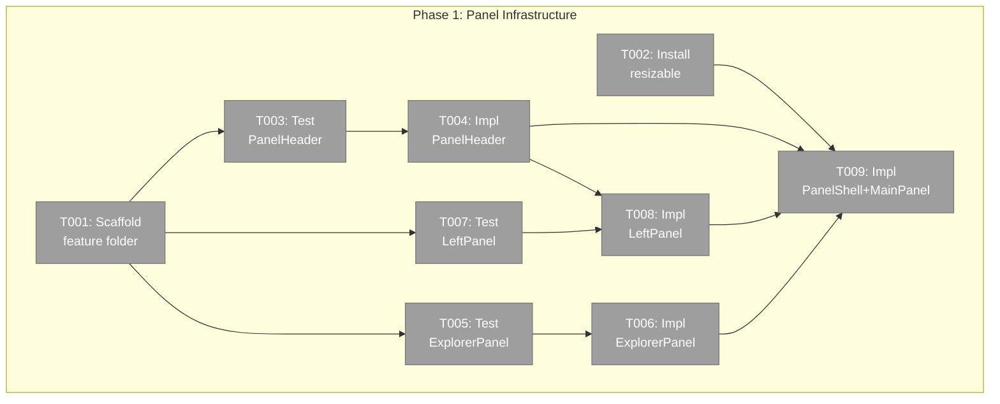
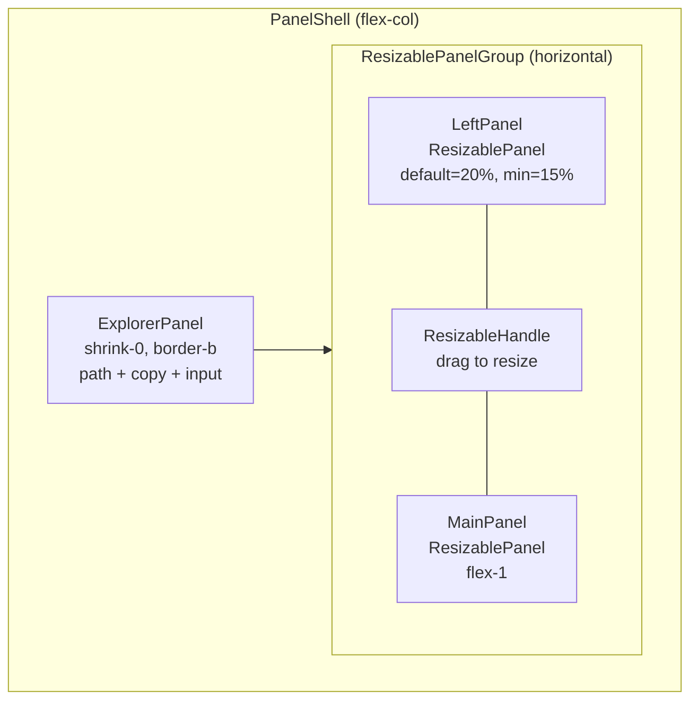
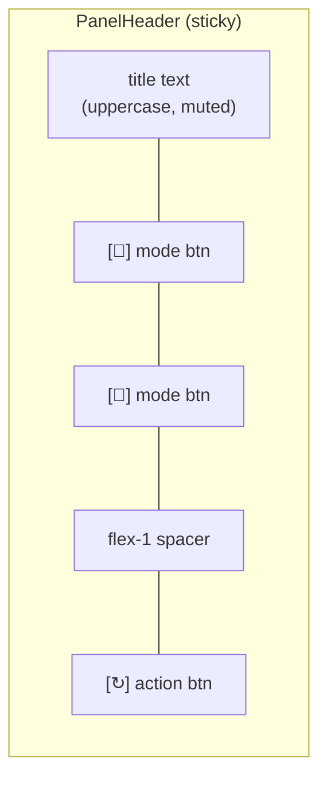
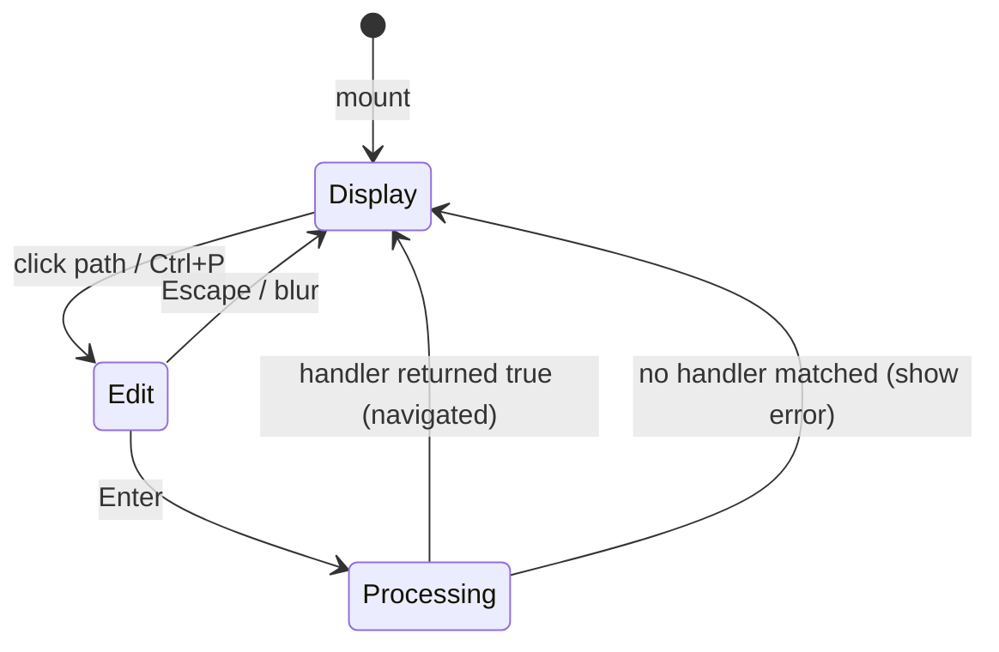

# Phase 1: Panel Infrastructure — Tasks

**Plan**: [panel-layout-plan.md](../../panel-layout-plan.md)
**Phase**: 1 of 3
**Testing Approach**: Full TDD
**Created**: 2026-02-24

---

## Executive Briefing

**Purpose**: Create the `_platform/panel-layout` infrastructure domain with all structural panel components. This is the foundation — reusable layout primitives that the file browser (Phase 3) and future workspace pages compose.

**What We're Building**:
- `PanelShell` — root layout compositor using `react-resizable-panels` for a resizable left/main split with an ExplorerPanel on top
- `ExplorerPanel` — top utility bar with composable input handler chain (display path, edit to navigate, copy button)
- `LeftPanel` — mode-switching sidebar wrapper with PanelHeader for mode buttons
- `MainPanel` — content area wrapper with flex-1 overflow handling
- `PanelHeader` — shared header component with title, mode toggle buttons, action buttons
- Types: `PanelMode`, `BarHandler`, `BarContext`

**Goals**:
- ✅ First `_platform` feature folder created with correct structure
- ✅ All panel components are standalone, testable, no business logic
- ✅ ExplorerPanel handler chain is extensible (file path handler is v1, search/commands are future)
- ✅ LeftPanel ↔ MainPanel are resizable via drag handle
- ✅ shadcn resizable component installed

**Non-Goals**:
- ❌ Wiring panels into BrowserClient (Phase 3)
- ❌ ChangesView or git services (Phase 2)
- ❌ Any file-browser business logic
- ❌ Responsive phone/tablet layout

---

## Pre-Implementation Check

| File | Exists? | Domain Check | Notes |
|------|---------|-------------|-------|
| `apps/web/src/features/_platform/panel-layout/` | No — create | panel-layout | First `_platform` folder |
| `apps/web/src/features/_platform/panel-layout/types.ts` | No — create | panel-layout | PanelMode, BarHandler, BarContext |
| `apps/web/src/features/_platform/panel-layout/index.ts` | No — create | panel-layout | Barrel export |
| `apps/web/src/features/_platform/panel-layout/components/panel-header.tsx` | No — create | panel-layout | Shared header |
| `apps/web/src/features/_platform/panel-layout/components/explorer-panel.tsx` | No — create | panel-layout | Path bar + handler chain |
| `apps/web/src/features/_platform/panel-layout/components/left-panel.tsx` | No — create | panel-layout | Mode-switching wrapper |
| `apps/web/src/features/_platform/panel-layout/components/main-panel.tsx` | No — create | panel-layout | Content wrapper |
| `apps/web/src/features/_platform/panel-layout/components/panel-shell.tsx` | No — create | panel-layout | Root compositor with resizable panels |
| `apps/web/src/components/ui/resizable.tsx` | No — install | panel-layout | `npx shadcn@latest add resizable` |
| `apps/web/package.json` | Yes — modify | panel-layout | `react-resizable-panels` dep added by shadcn |

---

## Architecture Map



---

## Tasks

| Status | ID | Task | Domain | Path(s) | Done When | Notes |
|--------|-----|------|--------|---------|-----------|-------|
| [x] | T001 | Create `_platform/panel-layout` feature folder scaffold — `types.ts` with PanelMode, BarHandler, BarContext types; `index.ts` barrel; `components/` directory | panel-layout | `apps/web/src/features/_platform/panel-layout/types.ts`, `apps/web/src/features/_platform/panel-layout/index.ts` | Types compile. Barrel exports types. `PanelMode = 'tree' \| 'changes'`. `BarHandler = (input: string, ctx: BarContext) => Promise<boolean>`. `BarContext = { slug, worktreePath, fileExists, navigateToFile, showError }`. | Per finding 02. Follow barrel pattern from 041-file-browser/index.ts. |
| [x] | T002 | Install shadcn resizable component | panel-layout | `apps/web/src/components/ui/resizable.tsx`, `apps/web/package.json` | `npx shadcn@latest add resizable` succeeds. `ResizablePanel`, `ResizablePanelGroup`, `ResizableHandle` importable. `react-resizable-panels` in deps. | shadcn wraps react-resizable-panels. |
| [x] | T003 | Write tests for PanelHeader — renders title, mode buttons with icons, active state highlighting, fires onModeChange callback, renders action buttons | panel-layout | `test/unit/web/features/_platform/panel-layout/panel-header.test.tsx` | Tests: renders title text, renders N mode buttons, active button has accent styling, click fires onModeChange(mode), action button fires callback. | Follow ModeButton pattern from FileViewerPanel (icon+label, accent vs muted). |
| [x] | T004 | Implement PanelHeader component | panel-layout | `apps/web/src/features/_platform/panel-layout/components/panel-header.tsx` | All T003 tests pass. Props: `title: string`, `modes?: { key: PanelMode; icon: ReactNode; label: string }[]`, `activeMode?: PanelMode`, `onModeChange?: (mode: PanelMode) => void`, `actions?: { icon: ReactNode; label: string; onClick: () => void }[]`. Client component. | Sticky header: `sticky top-0 bg-background z-10 border-b px-3 py-2 shrink-0`. DYK-05: mode buttons icon-only with tooltip (`title` attr or shadcn Tooltip), `aria-label` for accessibility. |
| [x] | T005 | Write tests for ExplorerPanel — display mode shows path + copy button; click path enters edit mode with text selected; Enter fires handler chain; first handler returning true stops chain; Escape reverts; empty input no-ops; placeholder when no path; ASCII spinner during processing; exposes focusInput() ref | panel-layout | `test/unit/web/features/_platform/panel-layout/explorer-panel.test.tsx` | Tests: (1) renders filePath text, (2) copy button fires onCopy, (3) click path shows input, (4) Enter runs handlers in order, (5) first true-returning handler stops chain, (6) Escape reverts to filePath, (7) blur reverts, (8) empty string no-ops, (9) placeholder when filePath empty, (10) spinner shows during async handler, (11) focusInput() ref selects all text. | DYK-03: ASCII spinner `\| / — \\` replaces copy button during processing. DYK-04: `forwardRef` + `useImperativeHandle` exposes `focusInput()` for Phase 3 Ctrl+P. |
| [x] | T006 | Implement ExplorerPanel component | panel-layout | `apps/web/src/features/_platform/panel-layout/components/explorer-panel.tsx` | All T005 tests pass. Props: `filePath: string`, `handlers: BarHandler[]`, `context: BarContext`, `onCopy: () => void`, `placeholder?: string`. Client component with forwardRef. Display/edit mode via local state. Input with select-all on focus. ASCII spinner: `useEffect` + `setInterval` cycling `['\|', '/', '—', '\\']` at 80ms. `useImperativeHandle` exposes `{ focusInput: () => void }`. | Styling: `bg-muted/30 border-b px-3 py-1.5 shrink-0`, font-mono text-sm. Copy button uses ClipboardCopy icon. Spinner is same size/position as copy button. |
| [x] | T007 | Write tests for LeftPanel — renders children based on mode; mode switch via PanelHeader; hides modes when not available | panel-layout | `test/unit/web/features/_platform/panel-layout/left-panel.test.tsx` | Tests: (1) mode=tree renders first child, (2) mode=changes renders second child, (3) PanelHeader mode button fires onModeChange, (4) modes prop controls which buttons render, (5) single mode = no buttons. | LeftPanel is a thin wrapper: PanelHeader + content slot. |
| [x] | T008 | Implement LeftPanel component | panel-layout | `apps/web/src/features/_platform/panel-layout/components/left-panel.tsx` | All T007 tests pass. Props: `mode: PanelMode`, `onModeChange: (mode: PanelMode) => void`, `modes: { key: PanelMode; icon: ReactNode; label: string }[]`, `onRefresh: () => void`, `children: Record<PanelMode, ReactNode>`. Uses PanelHeader for mode toggle + refresh action. | Children keyed by mode — `children[mode]` renders active content. |
| [x] | T009 | Implement MainPanel + PanelShell with resizable layout | panel-layout | `apps/web/src/features/_platform/panel-layout/components/main-panel.tsx`, `apps/web/src/features/_platform/panel-layout/components/panel-shell.tsx` | MainPanel: `flex-1 overflow-hidden` wrapper. PanelShell: flex-col root, ExplorerPanel (shrink-0) on top, `ResizablePanelGroup direction="horizontal" autoSaveId="browser-panels"` below with LeftPanel in `ResizablePanel` (defaultSize=20, minSize=15, maxSize=40), `ResizableHandle`, MainPanel in `ResizablePanel`. Barrel export updated. | DYK-02: `autoSaveId` persists resize to localStorage. PanelShell props: `explorer: ReactNode`, `left: ReactNode`, `main: ReactNode`. |

---

## Context Brief

### Key findings from plan

- **Finding 02 (HIGH)**: No `_platform` feature folder exists. T001 creates the first one, setting the naming/structure precedent. Follow the barrel export pattern from `041-file-browser/index.ts`.
- **Finding 06 (LOW)**: Use simple icon buttons for mode switching (matching ModeButton from FileViewerPanel), not new shadcn components like Tabs or ToggleGroup.

### Domain dependencies

- `_platform/workspace-url`: nuqs — URL param infrastructure. Not consumed directly in Phase 1 (panels are stateless; URL state wired in Phase 3).
- `lucide-react`: Icons for buttons (ClipboardCopy, RefreshCw, GitBranch, FileDiff, etc.)
- `react-resizable-panels` (via shadcn `resizable`): ResizablePanelGroup, ResizablePanel, ResizableHandle

### Domain constraints

- All files go in `apps/web/src/features/_platform/panel-layout/`
- Tests go in `test/unit/web/features/_platform/panel-layout/`
- Components are `'use client'` (they use state, callbacks, DOM)
- No business logic — panels are pure structural/presentational
- No imports from `file-browser` domain (dependency direction: business → infrastructure, not the reverse)

### Reusable patterns

- **ModeButton** from `file-viewer-panel.tsx` (lines 232-258): Icon + label, `bg-accent` when active, `text-muted-foreground` otherwise. Copy this pattern for PanelHeader mode buttons.
- **Barrel export** from `041-file-browser/index.ts`: Export components + `export type { Props }` for interfaces.
- **Clipboard fallback** from `browser-client.tsx` (lines 205-225): `navigator.clipboard.writeText` with textarea fallback for non-HTTPS. ExplorerPanel's copy delegates to parent via `onCopy` prop (doesn't own clipboard logic).

### Component composition diagram



### PanelHeader internals



### ExplorerPanel state machine



---

## Discoveries & Learnings

_Populated during implementation by plan-6._

| Date | Task | Type | Discovery | Resolution | References |
|------|------|------|-----------|------------|------------|

---

## Directory Layout

```
docs/plans/043-panel-layout/
  ├── panel-layout-plan.md
  ├── panel-layout-spec.md
  ├── research-dossier.md
  ├── workshops/
  │   ├── file-path-utility-bar.md → (symlink)
  │   └── left-panel-view-modes.md → (symlink)
  └── tasks/phase-1-panel-infrastructure/
      ├── tasks.md              ← this file
      ├── tasks.fltplan.md      ← generated next
      └── execution.log.md      # created by plan-6
```
