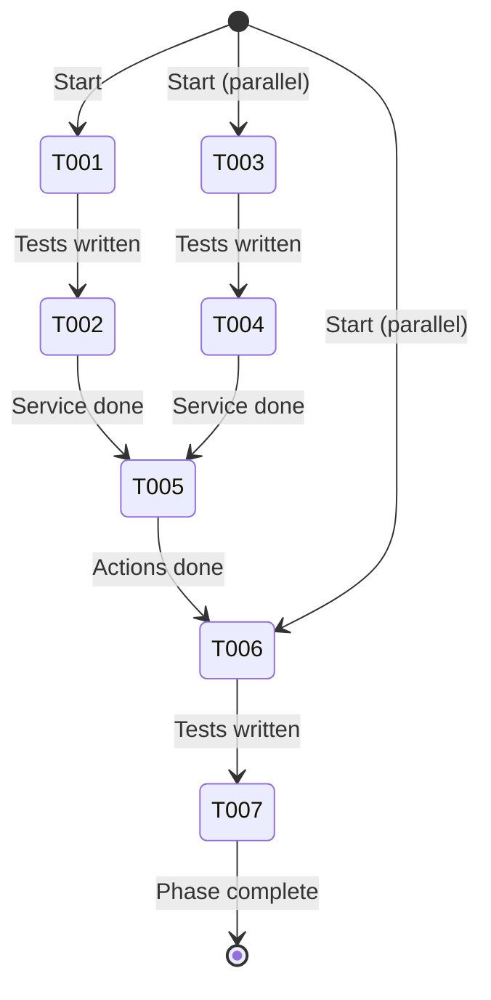
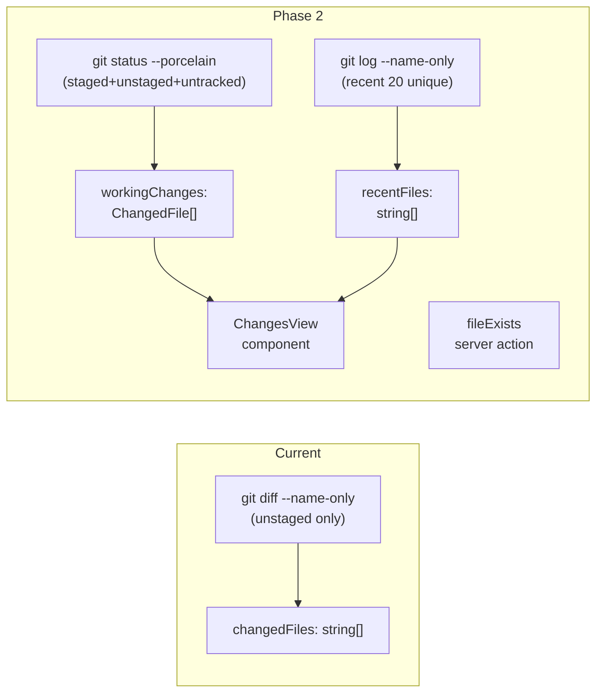

# Flight Plan: Phase 2 — Git Services + Changes View

**Phase**: [tasks.md](./tasks.md)
**Plan**: [panel-layout-plan.md](../../panel-layout-plan.md)
**Status**: Ready

---

## Departure → Destination

**Where we are**: The file browser has a `git diff --name-only` service that returns a flat list of changed file paths (unstaged only, no status codes). No way to distinguish staged vs unstaged vs untracked. No recent files history. No changes view component.

**Where we're going**: Two new git services parse `git status --porcelain=v1` (staged/unstaged/untracked with status codes) and `git log --name-only` (recent 20 unique files). A ChangesView component renders these as a flat file list with color-coded status badges and a "recent activity" section. A `fileExists` server action enables the ExplorerPanel to verify paths.

**Concrete outcomes**:
1. `getWorkingChanges` — parses porcelain into typed `ChangedFile[]`
2. `getRecentFiles` — deduplicated recent file list
3. `ChangesView` — two-section flat file list with status badges
4. 3 new server actions in `file-actions.ts`
5. ~20 unit tests

---

## Domain Context

### Domains We're Changing

| Domain | Relationship | What Changes | Key Files |
|--------|-------------|-------------|-----------|
| file-browser | modify | 2 git services, 1 component, 3 server actions | `services/working-changes.ts`, `services/recent-files.ts`, `components/changes-view.tsx`, `app/actions/file-actions.ts` |

### Domains We Depend On

| Domain | Contract | Usage |
|--------|----------|-------|
| _platform/file-ops | `IFileSystem.stat()` | `fileExists` server action verifies path |
| _platform/file-ops | `IPathResolver` | Security check in `fileExists` |

---

## Flight Status

---

## Stages

- [ ] **Working changes service** (T001-T002): TDD porcelain parser
- [ ] **Recent files service** (T003-T004): TDD git log parser
- [ ] **Server actions** (T005): Wrap services + fileExists
- [ ] **ChangesView component** (T006-T007): TDD flat file list with badges

---

## Architecture: Before & After

---

## Acceptance Criteria

- [ ] AC-16: Changes view shows Working Changes + Recent sections
- [ ] AC-17: Status badges (M amber, A green, D red, ? muted, R blue)
- [ ] AC-18: Flat path display with muted directory, bold filename
- [ ] AC-19: Recent deduplicated against working changes
- [ ] AC-20: Clean working tree shows "Working tree clean"
- [ ] AC-21: Click selects file with ▶ indicator
- [ ] AC-6: fileExists verifies paths for ExplorerPanel

---

## Goals & Non-Goals

**Goals**: Git porcelain parsing, recent files, ChangesView component, fileExists action

**Non-Goals**: Wiring into browser page (Phase 3), SSE live-update, merge conflict handling

---

## Checklist

| ID | Task | CS |
|----|------|----|
| T001 | Test getWorkingChanges | 2 |
| T002 | Implement getWorkingChanges | 2 |
| T003 | Test getRecentFiles | 1 |
| T004 | Implement getRecentFiles | 1 |
| T005 | Server actions (3) | 1 |
| T006 | Test ChangesView | 2 |
| T007 | Implement ChangesView | 2 |
