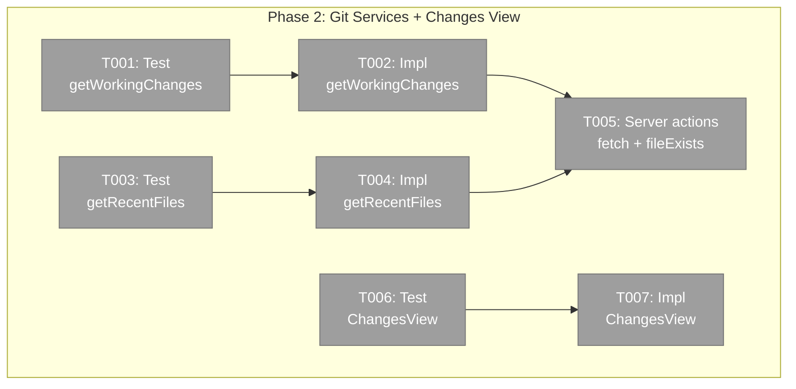
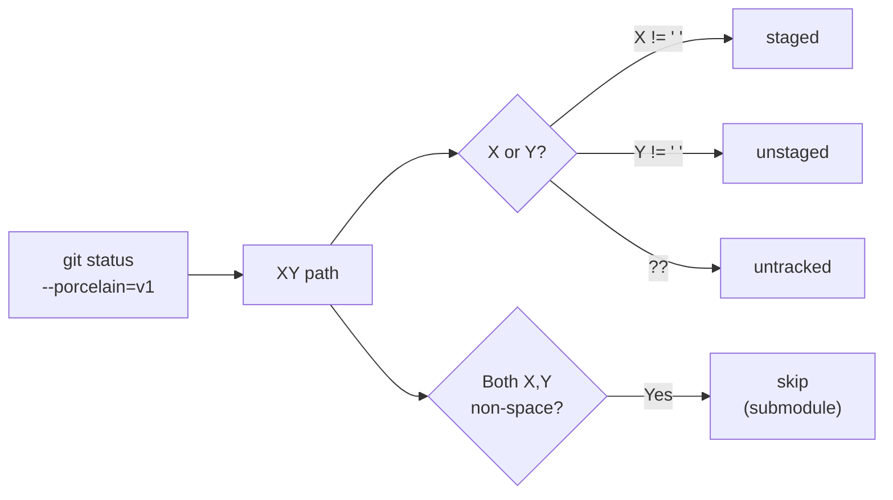
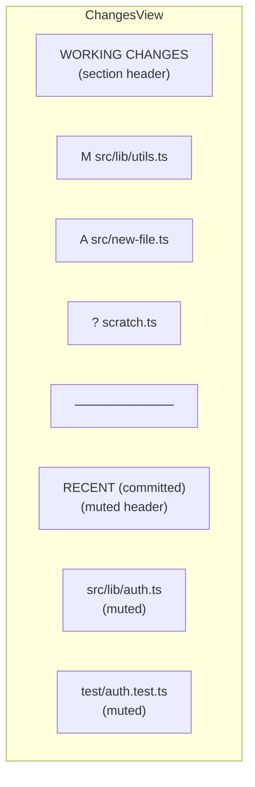

# Phase 2: Git Services + Changes View — Tasks

**Plan**: [panel-layout-plan.md](../../panel-layout-plan.md)
**Phase**: 2 of 3
**Testing Approach**: Full TDD
**Created**: 2026-02-24

---

## Executive Briefing

**Purpose**: Add git services that power the changes view — a `git status --porcelain` parser for working changes and a `git log --name-only` parser for recent files — plus the ChangesView component itself and a `fileExists` server action for the ExplorerPanel.

**What We're Building**:
- `getWorkingChanges` service: parses `git status --porcelain=v1` into typed `ChangedFile[]` with status badges (M/A/D/?/R) and area classification (staged/unstaged/untracked)
- `getRecentFiles` service: parses `git log --name-only` into deduplicated list of recent files
- `ChangesView` component: flat file list with two sections (Working Changes + Recent), status badges, selection indicator, context menus
- Server actions: `fetchWorkingChanges`, `fetchRecentFiles`, `fileExists`

**Goals**:
- ✅ Parse all common git porcelain status codes correctly
- ✅ Deduplicate recent files against working changes
- ✅ ChangesView renders with status badges matching the spec colors
- ✅ File selection works identically to FileTree (▶ indicator, onSelect callback)
- ✅ `fileExists` enables ExplorerPanel to verify paths before navigation

**Non-Goals**:
- ❌ Wiring ChangesView into the browser page (Phase 3)
- ❌ SSE live-update of changes (manual refresh only)
- ❌ Merge conflict file handling (skip ambiguous porcelain lines)
- ❌ Context menus (reuse same callbacks as FileTree, wired in Phase 3)

---

## Prior Phase Context

### Phase 1: Panel Infrastructure (COMPLETE)

**A. Deliverables**:
- `apps/web/src/features/_platform/panel-layout/` — types, barrel export, 5 components
- `apps/web/src/components/ui/resizable.tsx` — shadcn resizable installed

**B. Dependencies Exported**:
- `PanelMode = 'tree' | 'changes'` — type for left panel mode
- `BarHandler`, `BarContext`, `ExplorerPanelHandle` — types for explorer bar
- `PanelShell`, `ExplorerPanel`, `LeftPanel`, `MainPanel`, `PanelHeader` — components

**C. Gotchas & Debt**: None identified.

**D. Incomplete Items**: None — all 9 tasks complete, 19 tests passing.

**E. Patterns to Follow**: Client components with `'use client'`, icon-only buttons with tooltip/aria-label, children keyed by PanelMode.

---

## Pre-Implementation Check

| File | Exists? | Domain Check | Notes |
|------|---------|-------------|-------|
| `features/041-file-browser/services/working-changes.ts` | No — create | file-browser ✅ | New git service. Follow `changed-files.ts` pattern. |
| `features/041-file-browser/services/recent-files.ts` | No — create | file-browser ✅ | New git service. Same pattern. |
| `features/041-file-browser/components/changes-view.tsx` | No — create | file-browser ✅ | New component. Follow FileTree item pattern for selection. |
| `app/actions/file-actions.ts` | Yes — modify | file-browser ✅ | Add 3 server actions. Follow dynamic import pattern. |
| `test/unit/web/features/041-file-browser/working-changes.test.ts` | No — create | file-browser ✅ | |
| `test/unit/web/features/041-file-browser/recent-files.test.ts` | No — create | file-browser ✅ | |
| `test/unit/web/features/041-file-browser/changes-view.test.tsx` | No — create | file-browser ✅ | |

---

## Architecture Map



---

## Tasks

| Status | ID | Task | Domain | Path(s) | Done When | Notes |
|--------|-----|------|--------|---------|-----------|-------|
| [ ] | T001 | Write tests for `getWorkingChanges` — parse `git status --porcelain=v1 --ignore-submodules` output for all status codes | file-browser | `test/unit/web/features/041-file-browser/working-changes.test.ts` | Tests cover: `M ` (staged modified), ` M` (unstaged modified), `A ` (staged added), ` D` (unstaged deleted), `??` (untracked), `R  old -> new` (rename), `MM` (both → two entries: staged+unstaged), empty output → empty array, non-git → error result | DYK-P2-01: `--ignore-submodules` flag, no manual filtering. `MM` is valid (staged+unstaged same file). |
| [ ] | T002 | Implement `getWorkingChanges` service | file-browser | `apps/web/src/features/041-file-browser/services/working-changes.ts` | All T001 tests pass. Runs `git status --porcelain=v1 --ignore-submodules`. Parses XY codes. Returns `WorkingChangesResult`. Exports `ChangedFile` type. | X = staged status, Y = unstaged status. `MM` emits two entries. Parse line format: `XY <path>` or `XY old -> new` for renames. |
| [ ] | T003 | Write tests for `getRecentFiles` — deduplicated recent file list from git log | file-browser | `test/unit/web/features/041-file-browser/recent-files.test.ts` | Tests: returns unique paths, most recent first, respects limit param, handles empty repo, handles non-git error | Simple: parse stdout lines, deduplicate with Set, return first N unique. |
| [ ] | T004 | Implement `getRecentFiles` service | file-browser | `apps/web/src/features/041-file-browser/services/recent-files.ts` | All T003 tests pass. Runs `git log --name-only --pretty=format: -n <limit>`. Returns `RecentFilesResult`. | May need to scan more commits than limit to get enough unique files. Use `--diff-filter=AMCR` to exclude deletes. |
| [ ] | T005 | Add server actions: `fetchWorkingChanges`, `fetchRecentFiles`, `fileExists` | file-browser | `apps/web/app/actions/file-actions.ts` | Three new server actions added. `fileExists` does `stat()` via IFileSystem + IPathResolver security check. All follow dynamic import pattern. | `fileExists` is needed by ExplorerPanel's file path handler (Phase 3). Lightweight — just stat, no read. |
| [ ] | T006 | Write tests for ChangesView — renders working changes with status badges, recent section with dedup, empty state, file selection | file-browser | `test/unit/web/features/041-file-browser/changes-view.test.tsx` | Tests: (1) renders M/A/D/?/R badges with correct colors, (2) renders file paths with muted dir + bold filename, (3) deduplicates recent vs working, (4) shows "Working tree clean" when no changes, (5) click fires onSelect, (6) selected file has ▶ indicator, (7) empty recent section hidden | Follow FileTree item pattern for selection indicator (▶ amber, bg-accent). |
| [ ] | T007 | Implement ChangesView component | file-browser | `apps/web/src/features/041-file-browser/components/changes-view.tsx` | All T006 tests pass. Two sections: "Working Changes" header + file items with status badges, separator, "Recent (committed)" header + muted file items. Props: `workingChanges: ChangedFile[]`, `recentFiles: string[]`, `selectedFile?: string`, `onSelect: (path) => void`. Client component. | Status badge colors: M=amber-500, A=green-500, D=red-500, ?=muted-foreground, R=blue-500. Path split: dir muted, filename `font-medium`. |

---

## Context Brief

### Key findings from plan

- **Finding 03 (MEDIUM)**: `git status --porcelain` shows submodules as `MM`. Filter lines where both X and Y are non-space modification codes (or more conservatively, skip any line we can't parse cleanly).
- **Finding DYK-01 (HIGH)**: `handleExpand` should skip fetch when `childEntries[dirPath]` already exists — not directly Phase 2 but affects Phase 3 wiring.

### Domain dependencies

- `_platform/panel-layout`: `PanelMode = 'tree' | 'changes'` type — Phase 2 doesn't directly import it, but ChangesView is the content for `mode='changes'`
- `_platform/file-ops`: `IFileSystem.stat()` — used by `fileExists` server action for path verification
- Node.js `child_process`: `execFile` — git command execution (same as existing services)

### Domain constraints

- All new services go in `apps/web/src/features/041-file-browser/services/`
- All new tests go in `test/unit/web/features/041-file-browser/`
- Server actions go in `apps/web/app/actions/file-actions.ts` (extend existing file)
- ChangesView is a client component (`'use client'`) — pure presentational, no server imports
- `ChangedFile` type exported from `working-changes.ts` for use by ChangesView and BrowserClient

### Reusable from prior work

- **`changed-files.ts`**: Exact pattern for git service (execFileAsync, result union, try-catch)
- **`changed-files.test.ts`**: Test pattern (real path for success, fake path for error)
- **FileTree item rendering**: Selection indicator (▶ amber), `bg-accent` on selected, scroll-into-view
- **Context menu**: Same `ContextMenu`/`ContextMenuItem` pattern from FileTree — reuse via callback props

### ChangedFile type

```typescript
export interface ChangedFile {
  path: string;
  status: 'modified' | 'added' | 'deleted' | 'untracked' | 'renamed';
  area: 'staged' | 'unstaged' | 'untracked';
}
```

### Porcelain parsing logic



### ChangesView layout



---

## Discoveries & Learnings

| Date | Task | Type | Discovery | Resolution | References |
|------|------|------|-----------|------------|------------|
| 2026-02-24 | Pre-impl | Decision | DYK-P2-01: `--ignore-submodules` flag eliminates submodule lines from porcelain output. `MM` is valid (staged+unstaged same file) — emit two entries, don't filter. | Use `git status --porcelain=v1 --ignore-submodules`. No manual filtering. | Plan finding 03 updated |
| 2026-02-24 | Pre-impl | Decision | DYK-P2-02: Show ALL files in tree view — disable gitignore filtering. Switch `listDirectory` from `git ls-files` to always use `readDir`. Git only used for changes view, not tree view. | Remove `isGit` branch in `listDirectory`. Always `listFromReadDir`. | User decision 2026-02-24 |
| 2026-02-24 | Pre-impl | Gotcha | DYK-P2-03: `git log -n 20` gives 20 commits not 20 files. Add `--no-merges`. Filter empty lines from `--pretty=format:` output. May need higher `-n` to get 20 unique. | Scan `-n 50` commits, cap at 20 unique files. Add `--no-merges`. | DYK analysis |

---

## Directory Layout

```
docs/plans/043-panel-layout/
  ├── panel-layout-plan.md
  └── tasks/phase-2-git-services-changes-view/
      ├── tasks.md              ← this file
      ├── tasks.fltplan.md      ← generated next
      └── execution.log.md      # created by plan-6
```
