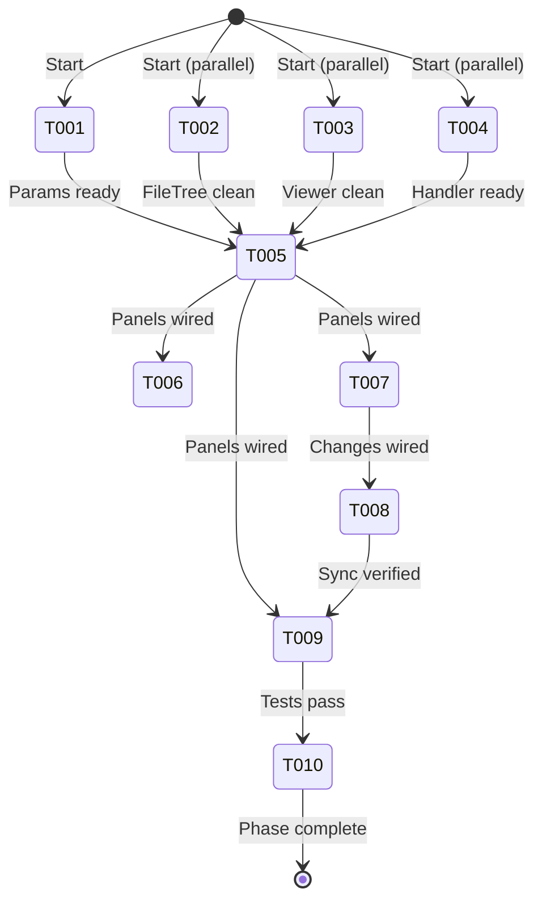
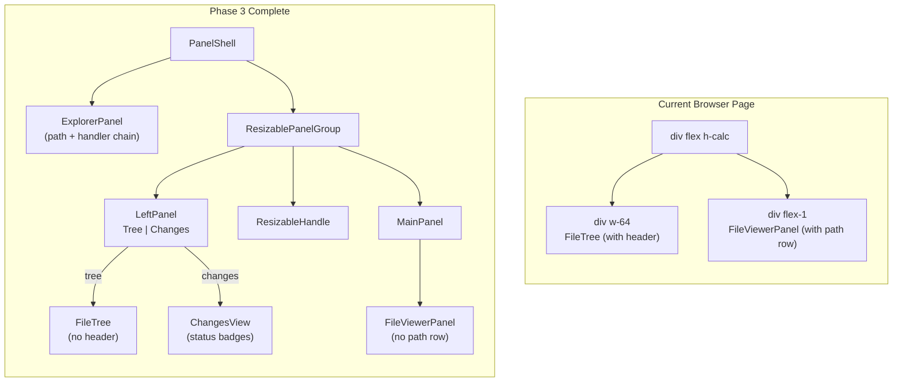

# Flight Plan: Phase 3 — Wire Into BrowserClient + Migration

**Phase**: [tasks.md](./tasks.md)
**Plan**: [panel-layout-plan.md](../../panel-layout-plan.md)
**Status**: Ready

---

## Departure → Destination

**Where we are**: The browser page uses raw `div+flex` for its two-panel layout. The FileTree owns its own sticky header. FileViewerPanel embeds a path row in its toolbar. Panel components (Phase 1) and git services + ChangesView (Phase 2) exist as standalone tested modules but aren't wired into the page. Nothing is visible to the user yet.

**Where we're going**: The browser page uses `PanelShell` with resizable panels. An explorer bar at the top shows the file path and accepts paste-to-navigate. The left panel has Tree/Changes mode toggle with a shared header. FileTree and FileViewerPanel are simplified (no own header/path row). Ctrl+P focuses the explorer bar. All state is deep-linkable via `?panel=tree|changes`.

**Concrete outcomes**:
1. Resizable left↔main split visible with drag handle
2. Explorer bar at top with path + copy + navigate
3. Tree/Changes toggle in left panel header
4. Ctrl+P focuses explorer bar (VS Code convention)
5. Changes view with live git status data
6. All existing functionality preserved
7. `just fft` passes

---

## Domain Context

### Domains We're Changing

| Domain | Relationship | What Changes | Key Files |
|--------|-------------|-------------|-----------|
| file-browser | modify | Wire panels, refactor components, migrate params, add handler | `browser-client.tsx`, `file-tree.tsx`, `file-viewer-panel.tsx`, `file-browser.params.ts`, `file-path-handler.ts` |
| _platform/panel-layout | consume + docs | Uncomment domain map edge, update history | `domain-map.md`, `domain.md` |

### Domains We Depend On

| Domain | Contract | Usage |
|--------|----------|-------|
| _platform/panel-layout | PanelShell, ExplorerPanel, LeftPanel, MainPanel, PanelHeader | Layout composition |
| _platform/panel-layout | BarHandler, BarContext, ExplorerPanelHandle, PanelMode | Types |
| _platform/notifications | toast() | Mode switch feedback |
| _platform/workspace-url | nuqs useQueryStates | URL state for `panel` param |

---

## Flight Status

---

## Stages

- [ ] **Prep refactors** (T001-T004, parallel): URL params, FileTree header, viewer path row, file path handler
- [ ] **Core wiring** (T005): PanelShell into BrowserClient with all panels
- [ ] **Feature wiring** (T006-T007): Ctrl+P shortcut, ChangesView data + context menus
- [ ] **Verification** (T008-T009): Cross-mode sync, test updates, `just fft`
- [ ] **Domain docs** (T010): Map edges, history entries

---

## Architecture: Before & After

---

## Acceptance Criteria

- [ ] AC-1: Explorer bar always visible above split
- [ ] AC-2: Path in monospace with copy button
- [ ] AC-3: Placeholder when no file selected
- [ ] AC-4-8: Edit mode, Enter navigates, Escape reverts, Ctrl+P
- [ ] AC-9: Ctrl+P focuses explorer bar
- [ ] AC-11-15: Mode toggle, toast, URL param, non-git
- [ ] AC-23-25: Cross-mode selection sync
- [ ] AC-29-31: FileTree no header, viewer no path row, single-row toolbar
- [ ] AC-32-33: Tests pass, `just fft` passes

---

## Goals & Non-Goals

**Goals**: Wire everything visible, migrate URL params, Ctrl+P shortcut, verify sync

**Non-Goals**: New panel features, responsive phone layout, SSE updates

---

## Checklist

| ID | Task | CS |
|----|------|----|
| T001 | URL params migration | 1 |
| T002 | Remove FileTree header | 1 |
| T003 | Remove viewer path row | 1 |
| T004 | File path BarHandler | 2 |
| T005 | Wire PanelShell (core) | 3 |
| T006 | Ctrl+P shortcut | 1 |
| T007 | Wire ChangesView data | 2 |
| T008 | Cross-mode sync verify | 1 |
| T009 | Update all tests | 2 |
| T010 | Domain docs update | 1 |
