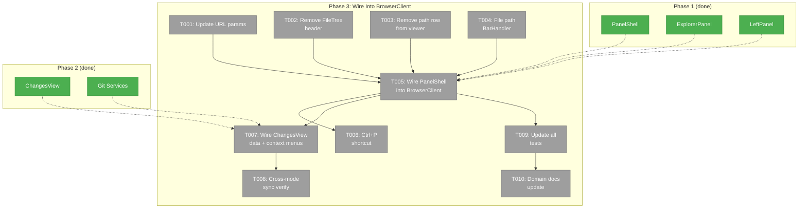
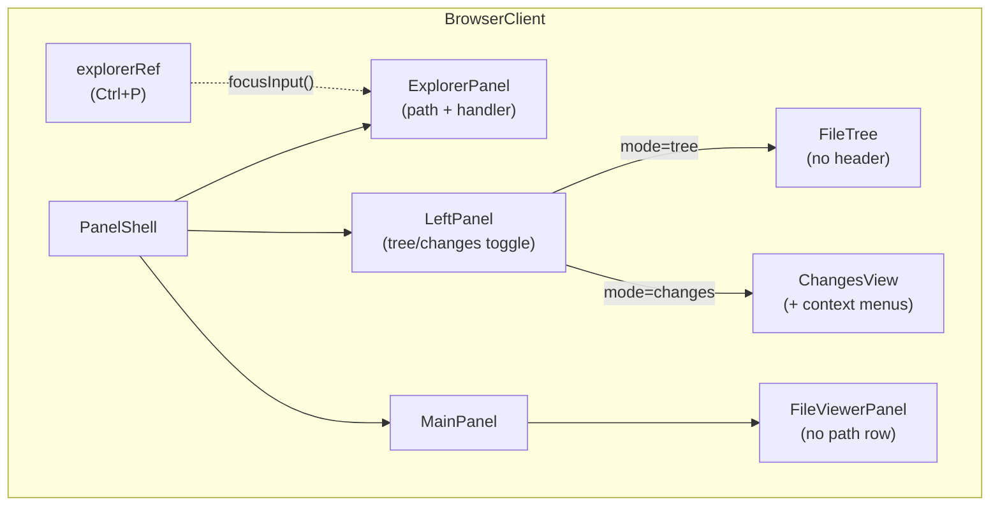
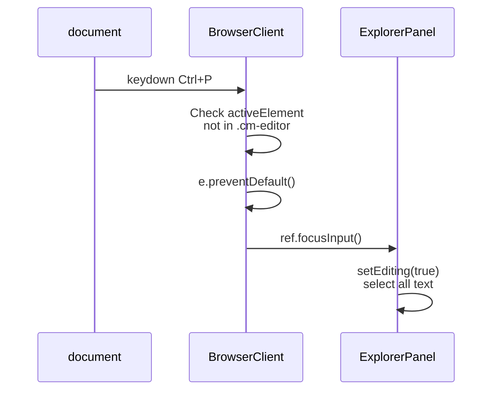

# Phase 3: Wire Into BrowserClient + Migration — Tasks

**Plan**: [panel-layout-plan.md](../../panel-layout-plan.md)
**Phase**: 3 of 3
**Testing Approach**: Full TDD (refactor existing tests + new)
**Created**: 2026-02-24

---

## Executive Briefing

**Purpose**: Wire the panel layout components (Phase 1) and git services (Phase 2) into the actual browser page. This is where everything becomes visible — the resizable panels, explorer bar, mode switching, and changes view all appear in the UI.

**What We're Building**:
- BrowserClient layout replaced with PanelShell (resizable panels)
- ExplorerPanel at top with file path display + paste-to-navigate handler
- LeftPanel with Tree/Changes mode toggle, FileTree and ChangesView as children
- FileTree header extracted (now provided by LeftPanel's PanelHeader)
- FileViewerPanel path row removed (now in ExplorerPanel)
- URL param migration: `?changed=true` → `?panel=tree|changes`
- Ctrl+P keyboard shortcut for explorer bar focus
- DYK-01: cache-aware handleExpand to avoid re-fetch on mode switch

**Goals**:
- ✅ Users see resizable panels with drag handle
- ✅ Explorer bar shows current file path, type to navigate
- ✅ Tree/Changes toggle in left panel header
- ✅ All existing functionality preserved (save, edit, preview, diff, context menus)
- ✅ Deep linking works with new `?panel` param

**Non-Goals**:
- ❌ New panel features beyond tree + changes (search, bookmarks — future)
- ❌ Responsive phone/tablet layout changes
- ❌ SSE live-update of changes

---

## Prior Phase Context

### Phase 1: Panel Infrastructure (COMPLETE)

**A. Deliverables**:
- `_platform/panel-layout/`: types.ts, index.ts, 5 components (PanelHeader, ExplorerPanel, LeftPanel, MainPanel, PanelShell)
- `components/ui/resizable.tsx`: shadcn wrapper for react-resizable-panels

**B. Dependencies Exported**:
- `PanelMode = 'tree' | 'changes'`
- `BarHandler`, `BarContext`, `ExplorerPanelHandle` types
- `PanelShell({ explorer, left, main })` — compositor with `autoSaveId`
- `ExplorerPanel` with `forwardRef` exposing `focusInput()`
- `LeftPanel({ mode, onModeChange, modes, onRefresh, children })` — keyed children
- `PanelHeader({ title, modes, activeMode, onModeChange, actions })`
- `MainPanel({ children })` — flex-1 wrapper

**C. Gotchas**:
- ExplorerPanel state sync: `prevFilePathRef` tracks actual changes (review fix FT-001)
- LeftPanel `children[mode]` unmounts inactive child — need cache-aware expand (DYK-01)
- `autoSaveId` is hardcoded `"browser-panels"` — fine for now

**D. Incomplete**: None. 22 tests passing.

**E. Patterns**: Icon-only buttons with tooltip/aria-label. Clipboard via `onCopy` prop. Handler chain: first `true` stops.

### Phase 2: Git Services + Changes View (COMPLETE)

**A. Deliverables**:
- `services/working-changes.ts`: `getWorkingChanges()`, `parsePorcelainOutput()`, `ChangedFile` type
- `services/recent-files.ts`: `getRecentFiles()`, `parseGitLogOutput()`
- `components/changes-view.tsx`: `ChangesView` with status badges + dedup
- `app/actions/file-actions.ts`: `fetchWorkingChanges`, `fetchRecentFiles`, `fileExists`

**B. Dependencies Exported**:
- `ChangedFile { path, status, area }` — consumed by BrowserClient state
- `ChangesView({ workingChanges, recentFiles, selectedFile, onSelect })` — child for LeftPanel
- `fetchWorkingChanges(worktreePath)` / `fetchRecentFiles(worktreePath, limit)` — server actions
- `fileExists(slug, worktreePath, filePath)` — for ExplorerPanel handler

**C. Gotchas**:
- AC-22 (context menu parity) deferred to this phase
- `fileExists` resolves trusted root from slug via IWorkspaceService
- `directory-listing.ts` now always uses `readDir` (no git ls-files)

**D. Incomplete**: Context menu on ChangesView items (this phase).

**E. Patterns**: Status badges (M=amber, A=green, D=red, ?=muted, R=blue). ▶ selection indicator. Dynamic import server action wrappers.

---

## Pre-Implementation Check

| File | Exists? | Domain | Change | Tests Break? |
|------|---------|--------|--------|-------------|
| `features/041-file-browser/params/file-browser.params.ts` | Yes | file-browser | Remove `changed`, add `panel` | params.test.ts may reference `changed` |
| `features/041-file-browser/components/file-tree.tsx` | Yes | file-browser | Remove header (lines 107-118) | file-tree.test.tsx line 78 (refresh button) |
| `features/041-file-browser/components/file-viewer-panel.tsx` | Yes | file-browser | Remove path row (lines 137-168) | No direct assertions on path row |
| `app/(dashboard)/workspaces/[slug]/browser/browser-client.tsx` | Yes | file-browser | Replace layout with PanelShell, add state/handlers | Layout re-test |
| `features/041-file-browser/services/file-path-handler.ts` | No — create | file-browser | New BarHandler for file path navigation | — |
| All domain docs | Yes | both | Update history, composition | — |

---

## Architecture Map



---

## Tasks

| Status | ID | Task | Domain | Path(s) | Done When | Notes |
|--------|-----|------|--------|---------|-----------|-------|
| [x] | T001 | Update `fileBrowserParams` — remove `changed` boolean, add `panel` as `parseAsStringLiteral(['tree', 'changes']).withDefault('tree')` | file-browser | `apps/web/src/features/041-file-browser/params/file-browser.params.ts` | `panel` param defined. `?panel=tree` default. `changed` removed. Param tests updated. | Per finding 05. DYK-P3-03: also remove `showChangedOnly` prop from FileTree (dead code). Keep `changedFiles` (amber text still useful). |
| [x] | T002 | Remove FileTree header — delete the sticky header div (title + refresh button). FileTree becomes pure scrollable entry list. Remove `onRefresh` prop. Remove `showChangedOnly` prop + filtering logic. | file-browser | `apps/web/src/features/041-file-browser/components/file-tree.tsx` | FileTree renders `overflow-y-auto` div directly with entries. No sticky header. `onRefresh` and `showChangedOnly` props removed. Test updated: remove refresh button and changed-filter assertions. | DYK-P3-03: `showChangedOnly` becomes dead code with `?panel=changes` — remove it. Keep `changedFiles` for amber text. |
| [x] | T003 | Remove FileViewerPanel path row — delete the `bg-muted/30` div with copy button + path text (lines 137-168). Toolbar becomes single row. | file-browser | `apps/web/src/features/041-file-browser/components/file-viewer-panel.tsx` | Path row removed. Toolbar is single row: Save, Edit, Preview, Diff, Refresh. `filePath` prop stays (used by DiffViewer internally). | Path display moves to ExplorerPanel. Copy button in ExplorerPanel. |
| [x] | T004 | Write tests + implement file path BarHandler — normalizes input, strips worktree prefix, calls `fileExists`, calls `navigateToFile` on success | file-browser | `apps/web/src/features/041-file-browser/services/file-path-handler.ts`, `test/unit/web/features/041-file-browser/file-path-handler.test.ts` | Tests: strips `./` and leading `/`, strips worktree prefix, calls fileExists, returns true + navigateToFile on success, returns false on not-found, empty string returns false. | Per workshop file-path-utility-bar.md. Pure function, easy to test with fake BarContext. |
| [x] | T005 | Extract custom hooks + wire PanelShell into BrowserClient. Extract: `useFileNavigation()` (selection, expand, read, save, edit, diff), `usePanelState()` (mode, changes data, lazy fetch), `useClipboard()` (copy/download handlers). Wire `<PanelShell explorer={...} left={...} main={...}>`. DYK-01: cache-aware handleExpand via `childEntriesRef`. | file-browser | `apps/web/app/(dashboard)/workspaces/[slug]/browser/browser-client.tsx`, new hook files in same directory or `features/041-file-browser/hooks/` | BrowserClient is thin render layer (~150 lines). Hooks own state + effects. Resizable panels visible. ExplorerPanel shows path. LeftPanel toggles tree/changes. Mode switch toast. handleExpand uses ref for cache check. | DYK-P3-01: `childEntriesRef.current[dirPath]` guard in handleExpand (ref pattern, not closure). DYK-P3-05: Extract hooks to keep BrowserClient as layout compositor. |
| [x] | T006 | Add Ctrl+P / Cmd+P keyboard shortcut — `document.addEventListener('keydown')` in useEffect, calls `explorerRef.current?.focusInput()`. Platform detection: `e.metaKey` on Mac, `e.ctrlKey` on others. Checks activeElement not in `.cm-editor`. `e.preventDefault()` to suppress print dialog. | file-browser | `apps/web/app/(dashboard)/workspaces/[slug]/browser/browser-client.tsx` | Ctrl+P (Windows/Linux) and Cmd+P (Mac) both focus explorer bar. Does not fire in CodeMirror. Print dialog suppressed. | DYK-P3-04: `navigator.platform.includes('Mac')` for platform detection. |
| [x] | T007 | Wire ChangesView data + context menus — lazy fetch on first switch. Add ContextMenu wrapping to ChangesView file items (Copy Full Path, Copy Relative Path, Copy Content, Download). Add callback props to ChangesViewProps. Cache in state. Refresh re-fetches. Non-git hides changes button. | file-browser | `apps/web/app/(dashboard)/workspaces/[slug]/browser/browser-client.tsx`, `apps/web/src/features/041-file-browser/components/changes-view.tsx` | Changes data appears on panel=changes. Context menu on file items. Cached on first load. Refresh refetches. Non-git shows only tree mode. | DYK-P3-02: Need actual ContextMenu components in ChangesView, not just callback props. Import from shadcn, wrap each ChangeFileItem. |
| [x] | T008 | Verify cross-mode selection sync — select file in changes, switch to tree, tree expands. Select in tree, switch to changes, file highlighted. | file-browser | (no new files — verification task) | Both directions work. URL `?file=...` persists across mode switches. Tree auto-expands to selected file on remount. | DYK-01 ref-based cache prevents re-fetch on tree remount. |
| [x] | T009 | Update all affected tests — FileTree (remove header/refresh/showChangedOnly assertions), FileViewerPanel (remove path row assertions if any), params (changed → panel). Run `just fft`. | file-browser | `test/unit/web/features/041-file-browser/file-tree.test.tsx`, `test/unit/web/features/041-file-browser/file-viewer-panel.test.tsx`, `test/unit/web/features/041-file-browser/params.test.ts` | All existing tests pass. `just fft` passes (lint + format + typecheck + test). Zero failures. | Per findings 04, 05. |
| [x] | T010 | Update domain docs — uncomment domain map edge (file-browser → panel-layout), update file-browser domain.md composition + history, update panel-layout domain.md history | panel-layout, file-browser | `docs/domains/domain-map.md`, `docs/domains/file-browser/domain.md`, `docs/domains/_platform/panel-layout/domain.md` | Domain map shows active edge. Both domain.md files have Phase 3 history entry. Composition tables reflect new wiring. | |

---

## Context Brief

### Key findings from plan

- **Finding 01 (HIGH)**: Ctrl+P handler must be on `document.addEventListener` to beat browser print dialog. Check `activeElement` not in `.cm-editor`.
- **Finding 04 (MEDIUM)**: FileTree header test assertion `screen.getByRole('button', { name: /refresh file tree/i })` will break when header extracted.
- **Finding 05 (MEDIUM)**: `?changed=true` removal — clean swap to `?panel` param.
- **DYK-01 (HIGH)**: `handleExpand` must skip fetch when `childEntries[dirPath]` already exists. One-line fix. Prevents N API calls on tree→changes→tree round-trip.
- **DYK-04 (MEDIUM)**: ExplorerPanel exposes `focusInput()` via `forwardRef`. BrowserClient creates ref and passes it.

### Domain dependencies

- `_platform/panel-layout`: `PanelShell`, `ExplorerPanel`, `LeftPanel`, `MainPanel` — layout components
- `_platform/panel-layout`: `BarHandler`, `BarContext`, `ExplorerPanelHandle`, `PanelMode` — types
- `_platform/notifications`: `toast()` — mode switch feedback
- `_platform/workspace-url`: nuqs `useQueryStates` — URL state for `panel` param

### Domain constraints

- `file-browser` imports from `_platform/panel-layout` (business → infrastructure ✅)
- `_platform/panel-layout` must NOT import from `file-browser` (infrastructure → business ❌)
- All new files stay in `file-browser` domain except domain doc updates
- Context menu callbacks stay as props (BrowserClient owns clipboard logic, passes to both FileTree and ChangesView)

### Reusable from prior phases

- **copyToClipboard helper** (browser-client.tsx): setTimeout fallback for non-HTTPS
- **handleCopyFullPath/Relative/Content/Tree/Download** callbacks: Pass to ChangesView same as FileTree
- **Auto-expand logic** (FileTree useState initializer): Expands ancestors of selectedFile on mount — handles cross-mode sync automatically
- **scrollRef callback** (FileTree): Scrolls selected file to center on mount

### Integration flow



### Keyboard shortcut wiring



---

## Discoveries & Learnings

| Date | Task | Type | Discovery | Resolution | References |
|------|------|------|-----------|------------|------------|
| 2026-02-24 | Pre-impl | Decision | DYK-P3-01: handleExpand cache check has stale closure — mount-only useEffect captures initial empty childEntries. | Use `childEntriesRef.current[dirPath]` ref pattern for guard check in handleExpand. Ref updated via useEffect whenever state changes. | DYK-01 from Phase 1 |
| 2026-02-24 | Pre-impl | Decision | DYK-P3-02: ChangesView context menus need actual ContextMenu component wrapping, not just callback props. | Import ContextMenu from shadcn, wrap each ChangeFileItem button (same pattern as FileTree TreeItem). ~30 lines JSX per section. | AC-22 |
| 2026-02-24 | Pre-impl | Decision | DYK-P3-03: `showChangedOnly` prop on FileTree becomes dead code after `?changed` removal. | Remove `showChangedOnly` prop + filtering logic from FileTree. Keep `changedFiles` prop (still used for amber text on changed files). | Finding 05 |
| 2026-02-24 | Pre-impl | Decision | DYK-P3-04: Ctrl+P on Mac needs `e.metaKey`, not `e.ctrlKey`. Ctrl+P on Mac opens print dialog. | Platform detection: `navigator.platform.includes('Mac') ? e.metaKey : e.ctrlKey`. Both checked alongside `e.key === 'p'`. | Finding 01 |
| 2026-02-24 | Pre-impl | Decision | DYK-P3-05: BrowserClient (~360 lines, 12 handlers, 7 state vars) will grow past 500 lines with panel wiring. | Extract 3 custom hooks: `useFileNavigation()`, `usePanelState()`, `useClipboard()`. BrowserClient becomes thin render layer (~150 lines). Idiomatic React pattern. | React docs, Vercel examples |

---

## Directory Layout

```
docs/plans/043-panel-layout/
  ├── panel-layout-plan.md
  └── tasks/phase-3-wire-into-browserclient/
      ├── tasks.md              ← this file
      ├── tasks.fltplan.md      ← generated next
      └── execution.log.md      # created by plan-6
```
