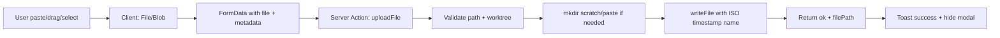

# Research Report: File Paste/Upload to Scratch Folder

**Generated**: 2026-02-24T06:57:00Z
**Research Query**: "File paste/upload via browser to scratch/paste folder on server, utility area in top right, modal with paste/drag/select"
**Mode**: Plan (044-paste-upload)
**Location**: docs/plans/044-paste-upload/research-dossier.md
**FlowSpace**: Available
**Findings**: 63 across 8 subagents

## Executive Summary

### What It Does
A browser-based file upload feature allowing users to paste screenshots, drag files, or select files via a popover modal in the top-right utility area. Files are written to a `scratch/paste/` folder inside the active worktree, named with ISO timestamps (`2026-02-24T065700.png`).

### Business Purpose
Eliminates the need for direct server/filesystem access when sharing screenshots or files during development. Available on every page when a worktree context is present.

### Key Insights
1. **Existing infrastructure covers 90% of needs**: `IFileSystem.writeFile()`, atomic tmp+rename, path security, and DI container are all production-ready
2. **Radix Dialog + sonner toast patterns are established** — upload modal and feedback follow existing conventions exactly
3. **Server actions with FormData** are the idiomatic Next.js 16 approach — no separate API upload route needed
4. **The utility area is new UI chrome** — top-right of the dashboard layout, designed for future expansion

### Quick Stats
- **Reusable Components**: IFileSystem, Dialog, toast, server actions, path validation
- **New Components**: ~4 files (UtilityBar, PasteUploadButton, PasteUploadModal, uploadFile action)
- **Dependencies**: 0 new packages (FormData, Clipboard API, drag-drop are browser-native)
- **Prior Learnings**: 15 relevant discoveries from previous implementations
- **Domains**: file-browser (primary), _platform/file-ops (consumed), _platform/notifications (consumed)

## How It Currently Works

### Existing File Write Flow
1. **Client** calls `saveFile()` server action with content + path
2. **Server action** resolves DI container → gets `IFileSystem` + `IPathResolver`
3. **Service layer** validates path (no traversal, symlink escape check via `realpath()`)
4. **Atomic write**: content → `.tmp` file → `fs.rename()` to target
5. **Result**: `{ ok: true, newMtime }` or `{ ok: false, error: 'conflict' | 'security' }`

### Entry Points for New Feature
| Entry Point | Type | Location | Purpose |
|------------|------|----------|---------|
| Dashboard Layout | UI | `apps/web/app/(dashboard)/layout.tsx` | Top-right utility area injection point |
| Server Action | Mutation | `apps/web/app/actions/file-actions.ts` | New `uploadFile()` action |
| IFileSystem.writeFile | Infrastructure | `packages/shared/src/interfaces/filesystem.interface.ts` | Write uploaded bytes to disk |
| IFileSystem.mkdir | Infrastructure | Same | Create `scratch/paste/` if not exists |

### Data Flow

## Architecture & Design

### Component Map

#### New Components (to create)
- **UtilityBar** (`apps/web/src/components/utility-bar.tsx`): Top-right container for utility buttons, rendered in dashboard layout. Only visible when worktree context present.
- **PasteUploadButton** (`apps/web/src/features/041-file-browser/components/paste-upload-button.tsx`): Trigger button with clipboard/upload icon
- **PasteUploadModal** (`apps/web/src/features/041-file-browser/components/paste-upload-modal.tsx`): `'use client'` Dialog with drag zone, paste handler, file input
- **uploadFile action** (`apps/web/app/actions/file-actions.ts`): Server action accepting FormData

#### Existing Components (reuse)
- **Dialog** (`apps/web/src/components/ui/dialog.tsx`): Radix-based modal primitive
- **toast** (sonner): Upload feedback (loading → success/error)
- **IFileSystem** (`packages/shared`): writeFile, mkdir, stat
- **IPathResolver** (`packages/shared`): Path validation + traversal prevention

### Design Patterns to Follow
1. **Server Action with FormData** (PS-02): `'use server'` function accepting `FormData` with file blob
2. **Radix Dialog** (IA-07): `DialogTrigger` → `DialogContent` → upload zone → submit
3. **Toast feedback** (PS-06): `toast.loading()` → `toast.success/error()` with unique ID
4. **Result type** (PS-08): Return `{ ok: boolean, error?: string, filePath?: string }`
5. **Path security** (IC-02, IC-07): `IPathResolver` for traversal prevention, `realpath()` for symlink escape
6. **Atomic write** (PL-06): Write to `.tmp`, rename to final path
7. **Semantic HTML** (PL-14): Biome enforces semantic elements — use `<button>`, `<input type="file">`, not `div[role]`

### System Boundaries
- **Internal**: Upload feature stays within file-browser domain as caller; consumes file-ops infrastructure
- **External**: No external services — purely local filesystem operations
- **Integration**: Toast notifications for feedback, file tree refresh after upload

## Dependencies & Integration

### What This Depends On
| Dependency | Type | Purpose | Risk if Changed |
|------------|------|---------|-----------------|
| IFileSystem | Required | writeFile, mkdir, stat | Low — stable interface |
| IPathResolver | Required | Path validation | Low — stable interface |
| Radix Dialog | Required | Modal UI | Low — established pattern |
| sonner | Required | Toast notifications | Low — established pattern |
| DI Container | Required | Service resolution | Low — standard approach |
| Workspace context (worktree param) | Required | Know where to write | Low — URL-driven state |

### What Depends on This
Nothing initially — this is a new leaf feature.

## Quality & Testing

### Testing Strategy
- **Service layer**: Test `uploadFileService()` with `FakeFileSystem` — verify mkdir, writeFile, timestamp naming, path validation
- **Security**: Test path traversal rejection, size limits, binary detection
- **Client**: Compilation verification (server action wiring); no component-level upload tests needed initially
- **E2e verification**: Use Next.js MCP on port 3000 to verify routes compile and pages render

### Key Constraints from Prior Learnings
- **5MB file size limit** (QT-03, PL-03): Enforce in server action before write
- **Binary detection** (PL-04): Scan first 8KB for null bytes — but for uploads this is expected (images are binary), so skip binary rejection for paste/upload
- **Semantic HTML** (PL-14): Biome rejects `div[role="button"]` — use real `<button>` and `<input type="file">`
- **Server action form binding** (PL-01, PL-13): Single-arg `(formData: FormData)` signature for `<form action>`

## Prior Learnings (From Previous Implementations)

### 📚 PL-01: Server Action Form Binding
**Source**: phase-3 gotcha log
**Action**: File upload form action must be `async (formData: FormData)` — single arg for `<form action>` compatibility

### 📚 PL-05: Symlink Escape Prevention
**Source**: phase-4
**Action**: After writing uploaded file, verify via `realpath()` that resolved path is still within worktree

### 📚 PL-06: Atomic Writes
**Source**: research.md
**Action**: Write uploaded file to `.tmp` first, then `rename()` to final ISO-timestamped name

### 📚 PL-09: Path Normalization for Pasted Paths
**Source**: file-path-utility-bar workshop
**Action**: If implementing paste-to-navigate alongside paste-to-upload, strip worktree prefix from pasted absolute paths

### 📚 PL-14: Biome Semantic HTML Enforcement
**Source**: phase-3 gotcha log
**Action**: Upload dropzone must use semantic elements — `<button>`, `<label>`, `<input type="file">` — not div with role attributes

## Domain Context

### Domains Involved
| Domain | Relationship | Relevant Contracts |
|--------|-------------|-------------------|
| file-browser | Primary owner | Paste/upload is a file-browser UI feature |
| _platform/file-ops | Consumed | IFileSystem.writeFile, mkdir, stat |
| _platform/notifications | Consumed | Toast feedback via sonner |
| _platform/panel-layout | Tangential | UtilityBar is new layout chrome, not panel-layout-managed |

### Domain Decision
The upload feature belongs in **file-browser domain** as a UI capability that consumes existing infrastructure domains. No new domain extraction needed — this is simpler than the DB-02 subagent suggested, since we're writing directly to a known folder path (scratch/paste/) rather than implementing a general import workflow.

## Critical Discoveries

### 🚨 Critical Finding 01: No FormData/Multipart Upload Pattern Exists Yet
**Impact**: Critical
**What**: The codebase has server actions for text content (`saveFile` with string content) but no existing pattern for binary file upload via FormData. This is new ground.
**Required Action**: Implement server action that accepts `FormData`, extracts `File` blob, converts to `Buffer`, writes via `IFileSystem.writeFile()`. Consider adding `writeFileBuffer(path: string, content: Buffer): Promise<void>` to IFileSystem if needed, or base64-encode for existing string-based writeFile.

### 🚨 Critical Finding 02: IFileSystem.writeFile Takes String, Not Buffer
**Impact**: High
**What**: Current `IFileSystem.writeFile(path, content)` signature takes `string` content. Images/binary files need `Buffer` support.
**Required Action**: Either (a) add `writeFileBuffer()` method to IFileSystem, (b) use Node.js `fs.writeFile` directly in the server action bypassing IFileSystem for binary content, or (c) base64-encode and decode. Option (b) is simplest — use `fs.promises.writeFile(path, buffer)` directly since we're already server-side with known-safe paths.

### 🚨 Critical Finding 03: Upload Button Lives in Plan 043's ExplorerPanel
**Impact**: High
**What**: Plan 043 (panel-layout) is designing an **ExplorerPanel** — a full-width top utility bar with a composable `BarHandler` chain pattern. This is where the upload button belongs (top-right of the explorer bar), NOT in a separate utility area we'd create ourselves. Plan 043 is currently DRAFT (no phases started).
**Required Action**: Wait for plan 043 infrastructure to land, then integrate the upload button into the ExplorerPanel's action area. The `BarHandler` chain can potentially handle paste events too (paste-to-navigate vs paste-to-upload disambiguation). If implementing before plan 043, use a temporary placement that can be migrated into ExplorerPanel later.

## Verification Approach

### Next.js MCP Verification (Port 3000)
After implementation:
1. Use `nextjs_index` to discover available MCP tools on the running dev server
2. Use `nextjs_call` with `get_errors` to verify zero compilation errors
3. Use `nextjs_call` with `get_routes` to verify upload-related routes exist
4. Use browser automation to load a workspace page and verify the utility area renders
5. Verify the upload modal opens and closes correctly

## Recommendations

### Implementation Approach
1. **Start with the server action** — `uploadFile(formData: FormData)` in `app/actions/file-actions.ts`
2. **Add UtilityBar component** to dashboard layout — top-right, conditional on worktree context
3. **Build PasteUploadModal** — Radix Dialog with dropzone, paste handler, file input
4. **Wire toast feedback** — loading → success pattern
5. **Test with real screenshots** — paste from clipboard, drag from desktop
6. **Verify via Next.js MCP** — zero errors, routes compile, pages render

### File Naming Convention
Files in scratch/paste/ named: `<ISO-timestamp>.<extension>`
Example: `2026-02-24T065700.png`, `2026-02-24T065701.txt`
If no extension detectable: `2026-02-24T065700.bin`

### Size Limit
Keep existing 5MB limit for consistency, but consider raising to 10MB for screenshots (modern high-DPI screenshots can be 3-8MB).

## Appendix: Key File Inventory

### Files to Modify
| File | Change | Purpose |
|------|--------|---------|
| `apps/web/app/(dashboard)/layout.tsx` | Add UtilityBar | Top-right utility container |
| `apps/web/app/actions/file-actions.ts` | Add uploadFile action | Server-side file write |

### Files to Create
| File | Purpose |
|------|---------|
| `apps/web/src/components/utility-bar.tsx` | Composable top-right utility container |
| `apps/web/src/features/041-file-browser/components/paste-upload-button.tsx` | Upload trigger button |
| `apps/web/src/features/041-file-browser/components/paste-upload-modal.tsx` | Modal with paste/drag/select zones |
| `apps/web/src/features/041-file-browser/services/upload-file.ts` | Upload service logic |
| `test/unit/web/features/041-file-browser/upload-file.test.ts` | Service tests |

### Existing Files to Reuse
| File | What to Reuse |
|------|--------------|
| `apps/web/src/components/ui/dialog.tsx` | Radix Dialog primitives |
| `apps/web/src/lib/utils.ts` | cn() for styling |
| `apps/web/src/lib/workspace-url.ts` | workspaceHref() for URLs |
| `packages/shared/src/interfaces/filesystem.interface.ts` | IFileSystem contract |
| `packages/shared/src/interfaces/path-resolver.interface.ts` | Path validation |

## Next Steps

- Run `/plan-1b-specify` to create the feature specification for paste/upload
- Or proceed directly to `/plan-3-architect` if spec detail is sufficient from this research
- **Verification**: Start Next.js dev server on port 3000, use MCP tools to validate after implementation

---

**Research Complete**: 2026-02-24T06:57:00Z
**Report Location**: docs/plans/044-paste-upload/research-dossier.md
