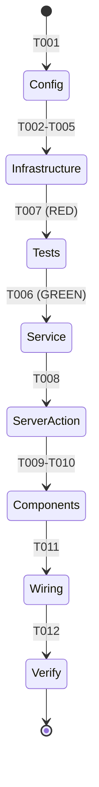
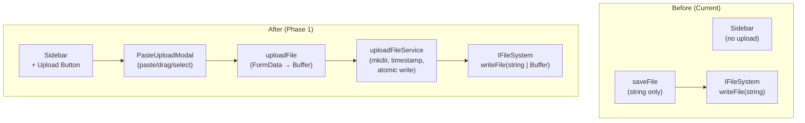

# Flight Plan: Phase 1 — Paste Upload

**Phase**: Phase 1 (entire plan — single phase)
**Tasks**: [tasks.md](./tasks.md)
**Plan**: [paste-upload-plan.md](../../paste-upload-plan.md)
**Status**: Ready

---

## Departure → Destination

**Where we are now**: The file browser has full read/write capabilities for text files via `IFileSystem`. Users can view, edit, and save files through the web UI. However, transferring binary files (screenshots, images, PDFs) to the server requires SSH/terminal access. `IFileSystem.writeFile` only accepts strings. No upload mechanism exists.

**Where we're going**: A single upload button in the sidebar header opens a modal where users can paste, drag, or browse files. Files land in `scratch/paste/` with timestamp names, written atomically via an extended `IFileSystem` that now supports `Buffer`. The entire flow — from Ctrl+V to toast confirmation — works without leaving the browser.

**Concrete outcomes**:
1. `IFileSystem.writeFile` accepts `string | Buffer` (backwards-compatible contract widening)
2. `uploadFileService` handles path validation, mkdir, timestamp naming, collision handling, atomic write
3. `uploadFile` server action accepts FormData with File blob, converts to Buffer, calls service
4. `PasteUploadModal` with paste/drag/select support + toast feedback
5. Upload button in sidebar header, visible when worktree context present

---

## Domain Context

### Domains We're Changing

| Domain | Slug | What Changes |
|--------|------|-------------|
| File Operations | _platform/file-ops | `IFileSystem.writeFile` widened to `string \| Buffer`. Adapter branches on typeof. Fake Map widened. Contract test added. |
| File Browser | file-browser | New upload service, server action, button component, modal component. Sidebar modified to host button. |

**Key files (file-ops)**:
- `packages/shared/src/interfaces/filesystem.interface.ts` — contract change
- `packages/shared/src/adapters/node-filesystem.adapter.ts` — implementation
- `packages/shared/src/fakes/fake-filesystem.ts` — test double
- `test/contracts/filesystem.contract.ts` — parity verification

**Key files (file-browser)**:
- `apps/web/src/features/041-file-browser/services/upload-file.ts` — new service
- `apps/web/app/actions/file-actions.ts` — new server action
- `apps/web/src/features/041-file-browser/components/paste-upload-button.tsx` — new component
- `apps/web/src/features/041-file-browser/components/paste-upload-modal.tsx` — new component
- `apps/web/src/components/dashboard-sidebar.tsx` — button mount point

### Domains We Depend On (consume)

| Domain | Contract | What We Use |
|--------|----------|-------------|
| _platform/file-ops | IFileSystem, IPathResolver, PathSecurityError | File write, path validation, error handling |
| _platform/notifications | toast() from sonner | Upload feedback (loading/success/error) |

---

## Flight Status

---

## Stages

- [ ] **Config** — Raise server action body size limit to 10MB (T001)
- [ ] **Infrastructure** — Widen IFileSystem.writeFile to string | Buffer + contract test (T002-T005)
- [ ] **Tests** — Write upload service tests first, TDD RED (T007)
- [ ] **Service** — Implement uploadFileService, pass tests GREEN (T006)
- [ ] **Server Action** — Add uploadFile(formData) to file-actions.ts (T008)
- [ ] **Components** — Create PasteUploadButton + PasteUploadModal (T009-T010)
- [ ] **Wiring** — Add button to sidebar header (T011)
- [ ] **Verify** — just fft + Next.js MCP zero errors (T012)

---

## Architecture: Before & After

---

## Acceptance Criteria

- [ ] Upload button visible in sidebar header when worktree selected
- [ ] Button hidden when no worktree context
- [ ] Click opens modal with "Upload to scratch/paste" title
- [ ] Modal accepts files via paste (Ctrl+V), drag-and-drop, and file picker
- [ ] Files written to `<worktree>/scratch/paste/<YYYYMMDDTHHMMSS>.<ext>`
- [ ] Directory auto-created on first upload
- [ ] Collision suffix `-1`, `-2` for same-second uploads
- [ ] Atomic write (tmp + rename)
- [ ] Toast feedback (loading → success with path / error with reason)
- [ ] Modal auto-closes on success, stays open on error
- [ ] 10MB size limit enforced
- [ ] Path validated (absolute, no traversal)
- [ ] `IFileSystem.writeFile` accepts `string | Buffer`
- [ ] Contract tests verify Buffer parity
- [ ] `just fft` passes, Next.js MCP reports zero errors

---

## Goals & Non-Goals

**Goals**: Frictionless file transfer via browser, predictable scratch/paste destination, safe atomic writes, minimal UI footprint

**Non-Goals**: Viewing uploads in browser, file type restrictions, configurable destination, global paste handler, auto-cleanup, e2e tests

---

## Checklist

| ID | Task | CS |
|----|------|----|
| T001 | Body size limit config | CS-1 |
| T002 | IFileSystem interface widen | CS-1 |
| T003 | NodeFileSystemAdapter Buffer branch | CS-1 |
| T004 | FakeFileSystem Buffer support | CS-1 |
| T005 | Contract test for Buffer | CS-1 |
| T007 | Upload service tests (TDD RED) | CS-2 |
| T006 | Upload service implementation | CS-2 |
| T008 | Server action (FormData → Buffer) | CS-1 |
| T009 | PasteUploadButton component | CS-1 |
| T010 | PasteUploadModal component | CS-2 |
| T011 | Sidebar wiring | CS-1 |
| T012 | Verification | CS-1 |
