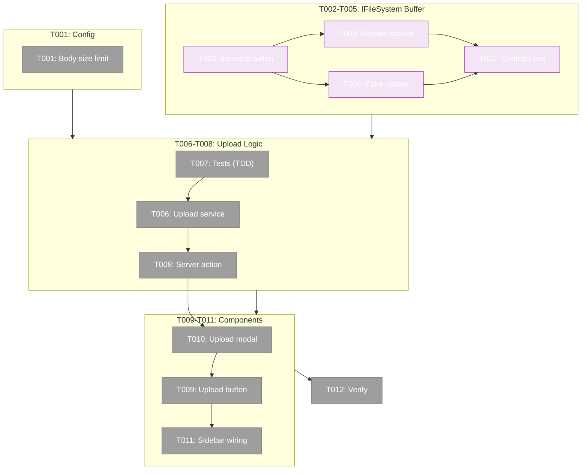
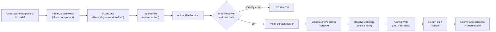
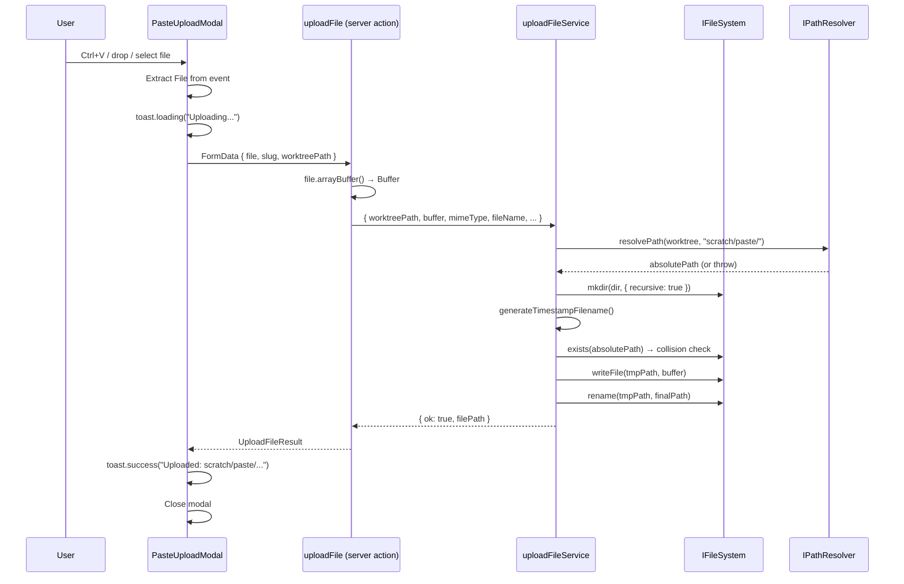

# Phase 1: Paste Upload — Tasks Dossier

**Phase**: Phase 1 (entire plan — single phase)
**Plan**: [paste-upload-plan.md](../../paste-upload-plan.md)
**Spec**: [paste-upload-spec.md](../../paste-upload-spec.md)
**Created**: 2026-02-24
**Status**: Ready

---

## Executive Briefing

**Purpose**: Add browser-based file upload (paste/drag/select) that writes files to `<worktree>/scratch/paste/` with timestamp names. This eliminates the need for SSH/terminal access when transferring screenshots or files to the server.

**What We're Building**: A small upload icon button in the sidebar header that opens a Radix Dialog modal. The modal accepts files via clipboard paste (Ctrl+V), drag-and-drop, or file picker. Files are written to disk via a server action that accepts FormData, converts the File blob to Buffer, and writes atomically using `IFileSystem`.

**Goals**:
- ✅ Widen `IFileSystem.writeFile` to accept `string | Buffer` (backwards-compatible)
- ✅ Raise Next.js server action body size limit from 500KB to 10MB
- ✅ Create upload service with timestamp naming, collision handling, atomic writes
- ✅ Create upload modal with paste/drag/select support + toast feedback
- ✅ Wire upload button into sidebar header (visible when worktree context present)
- ✅ Service-level tests + contract test for Buffer parity

**Non-Goals**:
- ❌ Viewing uploaded files in the browser (deferred — scratch files are gitignored + binary)
- ❌ Global paste handler (modal-only paste)
- ❌ E2e browser tests
- ❌ ExplorerPanel integration (sidebar placement is sufficient)

---

## Pre-Implementation Check

| File | Exists? | Action | Domain Check | Notes |
|------|---------|--------|-------------|-------|
| `apps/web/next.config.mjs` | ✅ Yes | Modify | file-browser ✅ | No `serverActions` config present — needs adding |
| `packages/shared/src/interfaces/filesystem.interface.ts` | ✅ Yes | Modify | _platform/file-ops ✅ | `writeFile(path: string, content: string)` — widen to `string \| Buffer` |
| `packages/shared/src/adapters/node-filesystem.adapter.ts` | ✅ Yes | Modify | _platform/file-ops ✅ | Line 41: hardcoded `'utf-8'` — branch on typeof |
| `packages/shared/src/fakes/fake-filesystem.ts` | ✅ Yes | Modify | _platform/file-ops ✅ | Line 13: `Map<string, string>` — widen to `string \| Buffer` |
| `test/contracts/filesystem.contract.ts` | ✅ Yes | Modify | _platform/file-ops ✅ | Lines 121-147: writeFile tests exist — add Buffer test |
| `apps/web/src/features/041-file-browser/services/upload-file.ts` | ❌ No | **Create** | file-browser ✅ | New upload service |
| `apps/web/app/actions/file-actions.ts` | ✅ Yes | Modify | file-browser ✅ | Has readFile + saveFile, no uploadFile yet |
| `apps/web/src/features/041-file-browser/components/paste-upload-button.tsx` | ❌ No | **Create** | file-browser ✅ | New component |
| `apps/web/src/features/041-file-browser/components/paste-upload-modal.tsx` | ❌ No | **Create** | file-browser ✅ | New component |
| `apps/web/src/components/dashboard-sidebar.tsx` | ✅ Yes | Modify | cross-domain ✅ | 209 lines, `'use client'`, sidebar header at line ~70 |
| `test/unit/web/features/041-file-browser/upload-file.test.ts` | ❌ No | **Create** | file-browser ✅ | New test file |

**Concept Duplication Check**:
- `uploadFile` function: ❌ Not found — clean slate
- FormData in server actions: ✅ Found in `workspace-actions.ts` — reusable pattern (Zod + `formData.get()`)
- Timestamp filename utility: ❌ Not found — create new
- File paste handler: ❌ Not found — create new
- Drag-drop file handler: ❌ Not found (workgraph DnD is unrelated)

---

## Architecture Map



---

## Tasks

| Status | ID | Task | Domain | Path(s) | Done When | Notes |
|--------|-----|------|--------|---------|-----------|-------|
| [ ] | T001 | Add `serverActions: { bodySizeLimit: '10mb' }` to Next.js config | file-browser | `/home/jak/substrate/041-file-browser/apps/web/next.config.mjs` | Config key present, dev server restarts cleanly | Finding 01. Default 500KB breaks uploads >500KB. |
| [ ] | T002 | Widen `IFileSystem.writeFile` to `(path: string, content: string \| Buffer): Promise<void>` | _platform/file-ops | `/home/jak/substrate/041-file-browser/packages/shared/src/interfaces/filesystem.interface.ts` | Interface updated, JSDoc reflects both types | Finding 02. **Contract change** — higher risk. Purely additive. |
| [ ] | T003 | Update `NodeFileSystemAdapter.writeFile` — branch on `typeof content`: omit `'utf-8'` for Buffer | _platform/file-ops | `/home/jak/substrate/041-file-browser/packages/shared/src/adapters/node-filesystem.adapter.ts` | Buffer written without encoding, string still uses utf-8 | Finding 02. Line 41: currently `fs.writeFile(path, content, 'utf-8')`. |
| [ ] | T004 | Update `FakeFileSystem` — widen `Map<string, string>` to `Map<string, string \| Buffer>`, update `setFile()`, `stat().size` uses `Buffer.byteLength` for Buffers, `readFile()` returns `buffer.toString('utf-8')` when content is Buffer (matches real adapter: `fs.readFile(path, 'utf-8')` returns garbled string, never throws) | _platform/file-ops | `/home/jak/substrate/041-file-browser/packages/shared/src/fakes/fake-filesystem.ts` | Map widened, setFile accepts both, stat size correct for Buffer, readFile returns decoded string for Buffer content | DYK-01: readFile must NOT throw on Buffer — fake/real parity. |
| [ ] | T005 | Add contract test: write Buffer → verify stat.size correct → verify readFile returns string (garbled but not throwing) | _platform/file-ops | `/home/jak/substrate/041-file-browser/test/contracts/filesystem.contract.ts` | New test block in writeFile section, runs for both NodeFS and FakeFS | DYK-01 corrected. Ensures fake/real parity per constitution §3.3. |
| [ ] | T007 | **Write upload service tests first (TDD RED)**: happy path write, mkdir creation, timestamp naming format, collision suffix `-1`/`-2`, path traversal rejection, size limit >10MB rejection | file-browser | `/home/jak/substrate/041-file-browser/test/unit/web/features/041-file-browser/upload-file.test.ts` | Tests written and failing (RED), covering 6 scenarios | TDD per constitution §2.3. Use FakeFileSystem + FakePathResolver. Test Doc format required. |
| [ ] | T006 | Create `uploadFileService(options)` — validate path via IPathResolver, `mkdir(recursive)` for scratch/paste/, generate `YYYYMMDDTHHMMSS.<ext>` filename, resolve collisions via `exists()` check, atomic write (tmp+rename). Return `{ ok, filePath?, error? }` | file-browser | `/home/jak/substrate/041-file-browser/apps/web/src/features/041-file-browser/services/upload-file.ts` | All T007 tests pass (GREEN). Service handles: path security, mkdir, timestamp naming, collision suffix, atomic write, 10MB limit | Workshop 01 + 04. Extension: filename → MIME type → `'bin'` fallback. |
| [ ] | T008 | Add `uploadFile(formData: FormData)` server action — extract File blob, validate size, convert `file.arrayBuffer()` → `Buffer.from()`, resolve DI container, call `uploadFileService`, return result | file-browser | `/home/jak/substrate/041-file-browser/apps/web/app/actions/file-actions.ts` | Server action exported, accepts FormData, returns `UploadFileResult` type | Workshop 01. Single-arg `(formData)` for `<form action>` compat (PL-01). Pattern: follow workspace-actions.ts FormData usage. |
| [ ] | T009 | Create `PasteUploadButton` — `'use client'`, Upload icon (lucide), Tooltip wrapper, manages Dialog open state, accepts `slug` + `worktreePath` props | file-browser | `/home/jak/substrate/041-file-browser/apps/web/src/features/041-file-browser/components/paste-upload-button.tsx` | Component renders icon button with tooltip, opens PasteUploadModal on click | Workshop 02. Use `Button variant="ghost" size="icon"` + `Tooltip` from `@/components/ui/tooltip`. |
| [ ] | T010 | Create `PasteUploadModal` — `'use client'`, Radix Dialog, dropzone with: `onPaste` (ClipboardEvent.clipboardData.files), `onDragOver`/`onDragLeave`/`onDrop` (DataTransfer.files), hidden `<input type="file" multiple>` with "Browse files..." button. Sequential upload with `toast.loading` → `toast.success/error`. Success toast includes "Copy path" action button (`navigator.clipboard.writeText`). Auto-close on all-success, stay open on any error. | file-browser | `/home/jak/substrate/041-file-browser/apps/web/src/features/041-file-browser/components/paste-upload-modal.tsx` | Modal opens, accepts files via all 3 methods, uploads sequentially, shows toast with copy action, auto-closes on success | Workshop 02. DYK-03: toast action for copy path. Semantic HTML (PL-14). Use `cn()`. |
| [ ] | T011 | Add `PasteUploadButton` to `DashboardSidebar` header — import, render in flex row at line ~79, conditioned on `currentWorktree` being non-null. Pass `workspaceSlug` and `currentWorktree` as props. | file-browser | `/home/jak/substrate/041-file-browser/apps/web/src/components/dashboard-sidebar.tsx` | Button visible in sidebar when worktree selected, hidden otherwise | Finding 04. Sidebar is already `'use client'` with `currentWorktree` from `useSearchParams`. |
| [ ] | T012 | Verify: `just fft` passes, `nextjs_index` + `nextjs_call get_errors` on port 3000 returns zero errors, manually confirm button appears and modal opens | file-browser | — | Zero lint/type/test errors, MCP reports no compilation errors, upload button renders in sidebar | Final gate. |

---

## Context Brief

### Key Findings from Plan

| # | Finding | Action |
|---|---------|--------|
| 01 | Next.js server action body size limit defaults to **500KB** | T001: Add `serverActions: { bodySizeLimit: '10mb' }` |
| 02 | `IFileSystem.writeFile` is string-only | T002-T005: Widen to `string \| Buffer` across interface, adapter, fake, contract test |
| 03 | `FakeFileSystem` stores `Map<string, string>` | T004: Widen Map, handle Buffer in stat + readFile |
| 04 | `DashboardSidebar` is `'use client'` with `currentWorktree` | T011: Clean integration — conditional render in sidebar header |
| 05 | `.gitignore` already has `scratch/*` | No action needed |

### Domain Dependencies (contracts consumed)

| Domain | Contract | Used For |
|--------|----------|----------|
| _platform/file-ops | `IFileSystem.writeFile`, `mkdir`, `stat`, `exists`, `rename` | Write uploaded files atomically, create scratch/paste/ dir |
| _platform/file-ops | `IPathResolver.resolvePath()` | Validate upload destination path, prevent traversal |
| _platform/file-ops | `PathSecurityError` | Catch and return `'security'` error to client |
| _platform/file-ops | `FakeFileSystem`, `FakePathResolver` | Testing upload service |
| _platform/notifications | `toast()` from sonner | Loading/success/error feedback (client-only) |
| file-browser | `Dialog`, `DialogContent`, `DialogHeader`, `DialogTitle` | Modal UI (from `@/components/ui/dialog`) |
| file-browser | `Tooltip`, `TooltipTrigger`, `TooltipContent` | Button label (from `@/components/ui/tooltip`) |
| file-browser | `Button` | Icon button in sidebar (from `@/components/ui/button`) |

### Domain Constraints

- **_platform/file-ops contract change** (T002): `IFileSystem.writeFile` widening is the only contract modification. Purely additive — all existing callers pass `string`. Requires contract test update (T005) per constitution §3.3.
- **file-browser import rules**: Upload service imports from `_platform/file-ops` interfaces only (never adapters). DI container resolves concrete implementations.
- **`toast()` is client-only**: Server action returns result → client calls toast. Never call toast in server action (PL from notifications domain gotchas).
- **Semantic HTML**: Biome rejects `div[role="button"]`. Use real `<button>`, `<label>`, `<input type="file">` (PL-14).

### Reusable from Existing Codebase

- **FormData pattern**: `workspace-actions.ts` uses `formData.get()` + Zod — follow for `uploadFile` action
- **Atomic write pattern**: `saveFileAction` in `file-actions.ts` uses tmp+rename (lines 169-171) — replicate for upload
- **Dialog pattern**: `DeleteSessionDialog` pattern — `open`/`onOpenChange` controlled Dialog
- **Toast pattern**: `browser-client.tsx` uses `toast.loading()` → `toast.success/error()` with unique ID
- **DI resolution**: `getContainer().resolve<IFileSystem>(SHARED_DI_TOKENS.FILESYSTEM)` — same as saveFile action
- **Path security**: `PathSecurityError` catch → return `{ ok: false, error: 'security' }` — same as saveFile

### System Flow





---

## Discoveries & Learnings

_Populated during implementation by plan-6._

| Date | Task | Type | Discovery | Resolution | References |
|------|------|------|-----------|------------|------------|

---

## Directory Layout

```
docs/plans/044-paste-upload/
├── paste-upload-spec.md
├── paste-upload-plan.md
├── research-dossier.md
├── workshops/
│   ├── 01-binary-upload-server-actions.md
│   ├── 02-upload-modal-ux-flow.md
│   ├── 03-explorer-panel-integration.md
│   └── 04-scratch-paste-folder-convention.md
└── tasks/phase-1-paste-upload/
    ├── tasks.md                  ← this file
    ├── tasks.fltplan.md          ← generated next
    └── execution.log.md          ← created by plan-6
```
