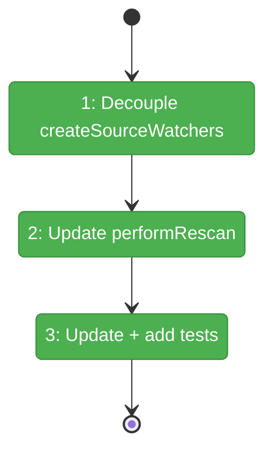
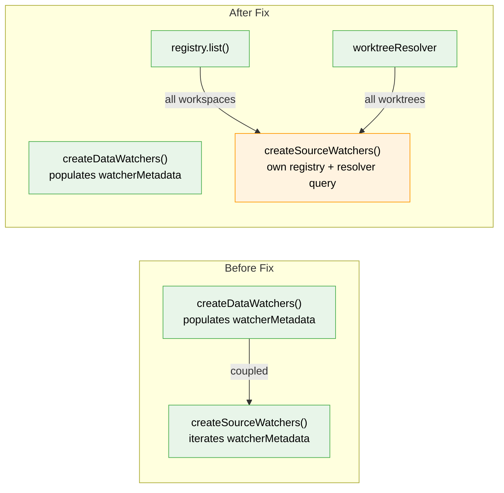

# Flight Plan: Fix FX001 — Source Watchers Gated on .chainglass/data/ Existence

**Fix**: [FX001-source-watcher-data-dir-coupling.md](./FX001-source-watcher-data-dir-coupling.md)
**Status**: Landed

## What → Why

**Problem**: Source watchers (Plan 045) only get created for worktrees that have `.chainglass/data/`, so newly added workspaces without Chainglass initialization get no live file events in the browser.

**Fix**: Decouple source watcher creation from data watcher metadata — source watchers should be created for ALL registered worktrees.

## Domain Context

| Domain | Relationship | What Changes |
|--------|-------------|-------------|
| _platform/events | modify | `CentralWatcherService` — source watcher discovery decoupled from data watcher gate |

## Flight Status

**Legend**: grey = pending | yellow = active | red = blocked/needs input | green = done

## Stages

- [x] **Stage 1: Decouple createSourceWatchers** — give it own worktree discovery via registry + resolver (`central-watcher.service.ts`)
- [x] **Stage 2: Update performRescan** — separate source watcher lifecycle from data watcher lifecycle (`central-watcher.service.ts`)
- [x] **Stage 3: Update + add tests** — fix existing count assertion, add no-data-dir and rescan tests (`central-watcher.service.test.ts`)

## Architecture: Before & After

**Legend**: existing (green, unchanged) | changed (orange, modified) | new (blue, created)

## Acceptance

- [x] Workspace without `.chainglass/data/` gets source watcher + SSE events
- [x] Data watchers still require `.chainglass/data/` (no regression)
- [x] `performRescan()` handles source watchers independently
- [x] All existing tests pass

## Checklist

- [x] FX001-1: Decouple `createSourceWatchers()` from `watcherMetadata`
- [x] FX001-2: Update `performRescan()` source watcher lifecycle
- [x] FX001-3: Update existing "skip worktrees without data dir" test
- [x] FX001-4: Add test: source watchers for workspaces without data dir
- [x] FX001-5: Add test: rescan adds source watchers for new workspaces without data dir
