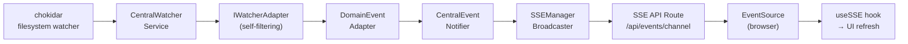
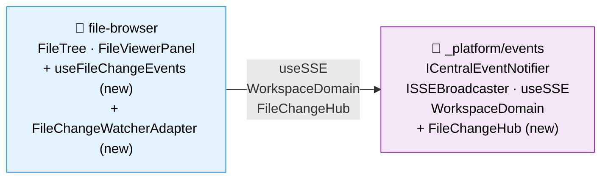

# Research Report: Worktree-Wide File Watching & Browser Event Hub

**Generated**: 2026-02-24T08:15:44Z
**Research Query**: "Expand file change watching to entire worktrees, browser-side event hub, rig tree view and file viewer for live changes"
**Mode**: Plan-Associated (041-file-browser)
**Location**: docs/plans/045-live-file-events/research.md
**FlowSpace**: Available
**Findings**: 65+ across 8 subagents

## Executive Summary

### What Exists Today
The codebase has a **mature, three-layer notification pipeline** (Plans 023, 027) that watches filesystem changes via chokidar, routes them through domain-specific adapters, and broadcasts minimal SSE events to connected browsers. The `CentralWatcherService` already watches **all worktrees across all workspaces** but is scoped to `.chainglass/data/` directories only. The file browser (Plan 041) was explicitly designed to be **compatible but not dependent** on this SSE infrastructure — it uses manual refresh and mtime-based conflict detection.

### What Needs to Happen
1. **Expand the watcher scope** from `.chainglass/data/` to the entire worktree (source files, configs, everything)
2. **Create a browser-side event hub** — a central client-side dispatcher that SSE events flow through, where UI components subscribe to specific file/directory change patterns
3. **Rig the tree view** to show file additions/removals/changes in-place (no full refresh, no scroll jump)
4. **Rig the file viewer/editor** to show a "file changed externally" banner when the open file is modified outside the editor
5. **Handle lifecycle** — start watcher when navigating to a worktree, stop when leaving or closing browser (heartbeat-based cleanup)

### Key Insights
1. The entire server-side pipeline is ready — `CentralWatcherService`, `IWatcherAdapter`, `DomainEventAdapter<T>`, SSE channels — all extensible without core changes
2. The current watcher watches `.chainglass/data/` per worktree; expanding to full worktree requires a new watch path + new adapter, NOT a new service
3. No new domain is needed — `_platform/events` already owns the infrastructure; `file-browser` domain owns the concrete adapters and consumer hooks
4. The browser-side "event hub" should be a lightweight dispatcher within `_platform/events` that SSE events flow through, with pattern-based subscriptions

### Quick Stats
- **Components to modify**: ~8 files
- **Components to create**: ~10-15 new files
- **Dependencies**: chokidar (existing), SSEManager (existing), useSSE (existing)
- **Test Coverage**: Existing contract test + fake infrastructure covers 70%+ of new code patterns
- **Prior Learnings**: 15 relevant discoveries from Plans 023, 027, 041
- **Domains**: 2 domains affected (_platform/events + file-browser)

## How It Currently Works

### Entry Points

| Entry Point | Type | Location | Purpose |
|------------|------|----------|---------|
| `instrumentation.ts` | Server startup | `apps/web/instrumentation.ts` | Bootstraps entire notification pipeline |
| `startCentralNotificationSystem()` | Bootstrap fn | `apps/web/src/features/027-central-notify-events/start-central-notifications.ts` | Wires DI → adapters → starts watcher |
| `/api/events/[channel]` | SSE endpoint | `apps/web/app/api/events/[channel]/route.ts` | Browser EventSource connection |
| `useSSE()` | Client hook | `apps/web/src/hooks/useSSE.ts` | Generic SSE connection management |
| `useWorkspaceSSE()` | Client hook | `apps/web/src/hooks/useWorkspaceSSE.ts` | Workspace-scoped SSE subscription |

### Core Execution Flow

```
[Server Startup]
instrumentation.ts
  → startCentralNotificationSystem()
    → Resolve CentralWatcherService from DI
    → Resolve CentralEventNotifier from DI
    → Create WorkGraphWatcherAdapter (filesystem filter)
    → Create WorkgraphDomainEventAdapter (domain → SSE)
    → Wire: watcher.onGraphChanged → domainAdapter.handleEvent
    → watcher.start()  ← activates chokidar per worktree

[Filesystem Change]
chokidar detects change in <worktree>/.chainglass/data/
  → CentralWatcherService.dispatchEvent(path, eventType, worktreePath, workspaceSlug)
    → for each registered IWatcherAdapter:
      → adapter.handleEvent(WatcherEvent)  [self-filtering]
        → WorkGraphWatcherAdapter matches /work-graphs/*/state.json/
          → emits WorkGraphChangedEvent to subscribers
            → WorkgraphDomainEventAdapter.handleEvent(event)
              → notifier.emit('workgraphs', 'graph-updated', { graphSlug })
                → SSEManagerBroadcaster.broadcast('workgraphs', 'graph-updated', data)
                  → SSEManager.broadcast() → all connected EventSource clients

[Browser]
EventSource connects to /api/events/workgraphs
  → useSSE hook receives message → { type: 'graph-updated', graphSlug }
    → useWorkGraphSSE filters by graphSlug → instance.refresh()
      → Full state fetch via REST (notification-fetch pattern, ADR-0007)
```

### Data Flow


### State Management
- **Server-side**: `CentralWatcherService` maintains `Map<worktreePath, IFileWatcher>` for active watchers
- **SSEManager**: `Map<channelId, Set<ReadableStreamController>>` for connections
- **Client-side**: `useSSE` manages EventSource lifecycle, message accumulation (max 1000), reconnection state
- **File browser**: mtime-based conflict detection (readFile returns mtime → client tracks → compare on save)

## Architecture & Design

### Component Map

#### Server-Side (Notification Pipeline)
- **CentralWatcherService** (`packages/workflow/`) — Domain-agnostic filesystem watcher, one chokidar instance per worktree data dir
- **IWatcherAdapter** (`packages/workflow/`) — Interface for domain-specific event filtering
- **WorkGraphWatcherAdapter** (`packages/workflow/`) — Filters for `state.json` changes, emits `WorkGraphChangedEvent`
- **DomainEventAdapter\<T>** (`packages/shared/`) — Abstract base, template method: `extractData()` → `notifier.emit()`
- **WorkgraphDomainEventAdapter** (`apps/web/`) — Concrete: emits to `workgraphs` channel
- **CentralEventNotifierService** (`apps/web/`) — Thin passthrough: `emit(domain, eventType, data)` → broadcaster
- **SSEManagerBroadcaster** (`apps/web/`) — Adapts SSEManager to ISSEBroadcaster interface
- **SSEManager** (`apps/web/src/lib/`) — Singleton (globalThis), manages SSE connections, broadcasts, heartbeats

#### Client-Side (Existing)
- **useSSE** (`apps/web/src/hooks/`) — Generic EventSource hook with reconnection
- **useWorkspaceSSE** (`apps/web/src/hooks/`) — Workspace-scoped SSE subscription (exemplar pattern)
- **useWorkGraphSSE** (`apps/web/src/features/022-workgraph-ui/`) — Domain-specific: filters graph-updated events

#### File Browser (Existing — No SSE Integration Yet)
- **FileTree** (`apps/web/src/features/041-file-browser/components/`) — Lazy-loading tree, callback-driven
- **FileViewerPanel** (`apps/web/src/features/041-file-browser/components/`) — Multi-mode viewer with conflict banner
- **BrowserClient** (`apps/web/app/(dashboard)/workspaces/[slug]/browser/`) — Client shell, manages state
- **readFile/saveFile** (`apps/web/app/actions/file-actions.ts`) — Server actions with mtime conflict detection

### Design Patterns Identified

| # | Pattern | Where Used | Purpose |
|---|---------|-----------|---------|
| 1 | Template Method | `DomainEventAdapter<T>` | Subclasses implement `extractData()` only |
| 2 | Adapter Chain | Watcher → adapters pipeline | Direct dispatch, no event bus |
| 3 | Singleton (globalThis) | SSEManager | Survives Next.js HMR |
| 4 | Parameter Injection | useSSE (EventSourceFactory) | Testability |
| 5 | Notification-Fetch | SSE → REST refresh | SSE hints, REST truth (ADR-0007) |
| 6 | Optimistic Locking | saveFile mtime check | Conflict detection |
| 7 | Callback Set | WatcherAdapter subscribers | `onX(cb) → unsubscribe fn` |
| 8 | Self-Filtering Adapters | IWatcherAdapter.handleEvent | Receive all, filter internally (ADR-02) |

### System Boundaries
- **CentralWatcherService** knows nothing about domains — pure filesystem watching
- **Domain adapters** own ALL domain knowledge (filtering, transformation)
- **SSE channel = domain name** (WorkspaceDomain const is single source of truth)
- **Client hooks** own UI integration — notification infrastructure provides transport only

## Dependencies & Integration

### Current Watch Scope
| What's Watched | Path Pattern | Adapter | Domain |
|---------------|-------------|---------|--------|
| Work graph state | `<worktree>/.chainglass/data/work-graphs/*/state.json` | WorkGraphWatcherAdapter | workgraphs |
| Registry changes | `~/.config/chainglass/workspaces.json` | Internal (rescan trigger) | — |

### What Would Change for Worktree-Wide Watching
| What to Watch | Path Pattern | New Adapter Needed | Domain |
|--------------|-------------|-------------------|--------|
| All source files | `<worktree>/**/*` | Yes: FileChangeWatcherAdapter | file-changes |
| Specific expanded dirs | `<worktree>/<dir>/**/*` | No: same adapter, filter by interest | file-changes |
| Open file changes | `<worktree>/<filePath>` | No: same adapter, match exact path | file-changes |

### SSE Channel Registry (Current + Proposed)
```typescript
// packages/shared/src/features/027-central-notify-events/workspace-domain.ts
export const WorkspaceDomain = {
  Workgraphs: 'workgraphs',    // ✅ Existing
  Agents: 'agents',             // ✅ Existing
  // FileChanges: 'file-changes', // 🆕 Proposed
} as const;
```

### Client Hook Dependency Chain (Proposed)
```
useFileChangeHub (new — browser event hub)
  → useSSE('/api/events/file-changes')
    → EventSource → /api/events/file-changes
      → SSEManager broadcasts file change events
        → CentralEventNotifier.emit('file-changes', ...)
          → FileChangeDomainEventAdapter.handleEvent()
            → FileChangeWatcherAdapter filters relevant paths
              → CentralWatcherService dispatches all FS events
```

## Quality & Testing

### Current Test Coverage (Relevant)
| Component | Tests | Status |
|-----------|-------|--------|
| CentralWatcherService | Unit + fake | ✅ Good |
| CentralEventNotifierService | Unit + contract | ✅ Excellent |
| useSSE hook | Unit (327 lines) | ✅ Good |
| SSEManager | Unit | ⚠️ Partial |
| SSE route handler | Integration | ⚠️ Minimal |
| Watcher → Notifier pipeline | Integration | ✅ Good |
| FileTree component | Unit | ✅ Good |
| FileViewerPanel | Unit | ✅ Good |
| File server actions | Unit | ✅ Good |
| Fakes (7 implementations) | Contract tests | ✅ Excellent |

### Testing Gaps for This Feature
- No useWorkspaceSSE hook tests
- No multi-worktree watcher tests
- No E2E browser tests for SSE-driven UI updates
- No performance tests for high-frequency file changes
- No tests for watcher lifecycle (start on navigate, stop on leave)

## Modification Considerations

### Safe to Modify
1. **WorkspaceDomain const** — Add `FileChanges` channel (additive, no breaking changes)
2. **startCentralNotificationSystem()** — Register new adapters (follows existing pattern exactly)
3. **BrowserClient state** — Add SSE subscription alongside existing refresh logic

### Modify with Caution
1. **CentralWatcherService watch paths** — Currently hardcoded to `.chainglass/data/`; expanding to full worktree needs careful ignore patterns (node_modules, .git, etc.)
2. **FileTree component** — Adding in-place updates requires careful scroll position preservation
3. **FileViewerPanel** — Adding "changed externally" banner needs to not conflict with existing conflict detection

### Danger Zones
1. **chokidar watching entire worktrees** — Could generate massive event volume; needs debouncing, ignore patterns, and possibly lazy watching (only watch expanded dirs)
2. **SSE message volume** — Full worktree watching could flood SSE; need server-side aggregation/debouncing
3. **Race conditions** — User editing + external change simultaneously needs careful ordering

### Extension Points (Ready to Use)
1. **IWatcherAdapter** — Register new adapter, no service changes needed
2. **DomainEventAdapter\<T>** — Extend abstract class, ~5 lines per new domain
3. **WorkspaceDomain** — Add const entry, SSE channel auto-created
4. **useSSE hook** — Compose new domain hooks on top
5. **SSE API route** — Dynamic channel routing, no route changes needed

## Prior Learnings (From Previous Implementations)

### PL-01: Chokidar Configuration is Battle-Proven
**Source**: Plan 023 Research Dossier
**Type**: decision
**Action**: Reuse `atomic: true` + `awaitWriteFinish: { stabilityThreshold: 200, pollInterval: 100 }` + `ignoreInitial: true` — don't customize per domain

### PL-02: 200ms Init Delay is Non-Negotiable
**Source**: Plan 023 Phase 1
**Type**: gotcha
**Action**: Watcher needs ~200ms after `start()` before detecting changes; account for this in tests and UX

### PL-03: Callback-Set Pattern, NOT EventEmitter
**Source**: Plan 023, ADR-0004
**Type**: decision
**Action**: All event systems use `Set<Callback>` with `onX(callback) → () => void` unsubscribe pattern

### PL-04: Double-Broadcast Race Condition
**Source**: Plan 023
**Type**: gotcha
**Action**: When UI saves a file, the watcher also detects the change → double event. Need `isRefreshing` guard or 500ms suppression window after UI-initiated saves

### PL-05: Notification-Fetch is Canonical
**Source**: Plan 027, ADR-0007
**Type**: decision
**Action**: SSE carries ONLY identifiers (`{ filePath }`), client fetches full data via REST. Never send file contents over SSE

### PL-06: Adapter Pattern is Domain-Agnostic
**Source**: Plan 023
**Type**: insight
**Action**: CentralWatcherService dispatches ALL events to ALL adapters; adapters self-filter. New file-browser adapter plugs in without modifying core watcher

### PL-07: "Subscribe Before Send" Pattern
**Source**: Plan 023
**Type**: gotcha
**Action**: Register adapters/subscribers BEFORE calling `watcher.start()`. Tests fail mysteriously if subscription happens after

### PL-08: SSE Route is Generic & Unlimited
**Source**: Plan 027
**Type**: insight
**Action**: No new SSE routes needed. Just broadcast to new channel name and subscribe client-side

### PL-09: globalThis Singleton for HMR Survival
**Source**: Plan 023
**Type**: workaround
**Action**: Any long-lived server service needs `globalThis` wrapping to survive Next.js HMR

### PL-10: Contract Tests Ensure Fake/Real Parity
**Source**: Plan 027
**Type**: decision
**Action**: Write contract tests FIRST; fakes serve as executable specs. Both fake and real pass same suite

### PL-11: DI Token Placement
**Source**: Plan 027
**Type**: decision
**Action**: New workspace service tokens go in `WORKSPACE_DI_TOKENS`

### PL-12: File System Event Type Variability
**Source**: Plan 023
**Type**: gotcha
**Action**: chokidar can emit spurious `unlink` → `add` sequences on atomic writes. Don't assume predictable event ordering

### PL-13: SSE Hyphens Allowed
**Source**: Plan 027
**Type**: gotcha
**Action**: Event type regex `/^[a-zA-Z0-9_-]+$/` allows hyphens. `file-changed`, `directory-updated` are valid

### PL-14: Container Access via bootstrap-singleton
**Source**: Plan 027
**Type**: gotcha
**Action**: Routes resolve services via `getContainer().resolve(TOKEN)`, not direct imports

### PL-15: Biome Import Sorting
**Source**: Plan 023, Plan 041
**Type**: gotcha
**Action**: Run `npx biome check --fix` after writing tests; use inline `type` keyword

### Prior Learnings Summary

| ID | Type | Source Plan | Key Insight | Action |
|----|------|-------------|-------------|--------|
| PL-01 | decision | 023 | Chokidar config is battle-proven | Reuse identical config |
| PL-02 | gotcha | 023 | 200ms init delay | Account in tests/UX |
| PL-03 | decision | 023 | Callback-set, not EventEmitter | Follow existing pattern |
| PL-04 | gotcha | 023 | Double-broadcast on UI save | Suppression window |
| PL-05 | decision | 027 | Notification-fetch only | No file contents in SSE |
| PL-06 | insight | 023 | Adapters self-filter | Plug in without core changes |
| PL-07 | gotcha | 023 | Subscribe before start() | Wire before watcher.start() |
| PL-08 | insight | 027 | SSE route is generic | No route changes needed |
| PL-09 | workaround | 023 | globalThis for HMR | Wrap long-lived services |
| PL-10 | decision | 027 | Contract tests for parity | Fakes = executable specs |
| PL-11 | decision | 027 | DI tokens in WORKSPACE_ | Follow naming convention |
| PL-12 | gotcha | 023 | Event type variability | Don't assume event order |
| PL-13 | gotcha | 027 | Hyphens in event types | Regex allows them |
| PL-14 | gotcha | 027 | bootstrap-singleton access | Use getContainer() |
| PL-15 | gotcha | 023/041 | Biome import sorting | Run biome check --fix |

## Domain Context

### Existing Domains Relevant to This Research

| Domain | Relationship | Relevant Contracts | Key Components |
|--------|-------------|-------------------|----------------|
| `_platform/events` | Primary infrastructure | ICentralEventNotifier, ISSEBroadcaster, ICentralWatcherService, IWatcherAdapter, useSSE, useWorkspaceSSE, WorkspaceDomain | CentralWatcherService, SSEManager, SSE route, bootstrap |
| `file-browser` | Primary consumer | FileTree, FileViewerPanel, readFile, saveFile, fileBrowserParams | BrowserClient, CodeEditor, file-actions |
| `_platform/file-ops` | Supporting | IFileSystem, IPathResolver | Used by file-actions for reads/writes |
| `_platform/viewer` | Supporting | FileViewer, MarkdownViewer, DiffViewer | Renders content in FileViewerPanel |
| `_platform/workspace-url` | Supporting | workspaceHref, worktree URL param | URL routing for worktree context |

### Domain Map Position


### Potential Domain Actions
- **Extend `_platform/events`**: Add `WorkspaceDomain.FileChanges` channel, browser-side event hub dispatcher
- **Extend `file-browser`**: Add `FileChangeWatcherAdapter`, `FileChangeDomainEventAdapter`, `useFileChangeEvents` hook, tree/viewer SSE integration
- **No new domains needed**: The existing domain boundaries are correct for this feature
- **No domain extraction needed**: The events domain already covers this infrastructure

## Critical Discoveries

### Discovery 01: CentralWatcherService Only Watches .chainglass/data/
**Impact**: Critical
**Source**: IA-01, DC-01, DB-02
**What**: The watcher hardcodes the watch path to `<worktree>/.chainglass/data/` (line 197 in central-watcher.service.ts). To watch source files, this must be configurable.
**Why It Matters**: This is the core blocker. The entire server pipeline is ready, but the watch scope is too narrow.
**Options**:
1. Make `CentralWatcherService` accept configurable watch paths per worktree
2. Create a separate watcher service for source files (parallel to existing)
3. Add a second watch path alongside `.chainglass/data/` (simplest)

### Discovery 02: No Browser-Side Event Hub Exists
**Impact**: Critical
**Source**: PS-10, DB-03, IC-08
**What**: The current design explicitly avoids a browser-side event bus (Plan 027 spec: "no in-browser event bus"). SSE hooks are per-domain. For file browser, we need a centralized dispatcher that:
- Receives all file change SSE events
- Lets components subscribe by path pattern (e.g., "notify me about changes in `src/components/`")
- Handles deduplication and debouncing
**Why It Matters**: Without a hub, every component would need its own SSE connection or manual event routing.

### Discovery 03: Worktree-Wide Watching Could Generate Massive Event Volume
**Impact**: High
**Source**: PL-01, PL-12, DC-01
**What**: Watching an entire worktree (potentially thousands of files) will generate far more events than watching `.chainglass/data/` (a handful of JSON files). Need:
- Aggressive ignore patterns (node_modules, .git, build artifacts)
- Server-side debouncing/aggregation (batch events within 200-500ms window)
- Possibly lazy watching (only watch directories the user has expanded in the tree)
**Why It Matters**: Without throttling, the SSE channel could be overwhelmed.

### Discovery 04: Watcher Lifecycle Tied to Navigation
**Impact**: High
**Source**: IA-01, IA-07, DC-10
**What**: Currently the watcher starts at server startup and watches ALL worktrees forever. For this feature:
- Watcher should start when user navigates to a worktree
- Watcher should stop when user navigates away (different worktree or closes browser)
- Heartbeat mechanism (30s interval) already exists — could detect client disconnect
- SSEManager already removes dead connections on heartbeat failure
**Why It Matters**: Watching unused worktrees wastes resources; need lifecycle management.

### Discovery 05: Double-Event Suppression Needed for Editor Saves
**Impact**: High
**Source**: PL-04, IA-12, PS-07
**What**: When user saves a file in the editor, the save triggers a filesystem change, which the watcher detects and broadcasts as an "external change" — creating a false "file changed externally" notification. Need suppression window (~500ms) after UI-initiated saves.
**Why It Matters**: Without suppression, every save would show a "changed externally" banner.

## Workshop Opportunities

Based on the research findings, the following complex topics would benefit from deeper design exploration before implementation:

### Workshop 1: Browser-Side Event Hub Design
**Why**: The current architecture explicitly avoids an in-browser event bus. We need to design a lightweight dispatcher that:
- Receives SSE file change events
- Supports pattern-based subscriptions (glob patterns for paths)
- Handles deduplication, debouncing, and ordering
- Is trivially easy to use (the "SDK For Us" concept)
- Cleans up subscriptions automatically

**Key Questions**:
- Single SSE connection per worktree, or per-component?
- How do components declare interest in specific paths?
- How to handle "expanded directory" tracking for tree view?
- React hook API design: `useFileChanges(pattern)` vs `useFileChangeHub().subscribe(pattern)`

### Workshop 2: Worktree-Wide Watcher Strategy
**Why**: Watching entire worktrees is fundamentally different from watching a few data files. Need to design:
- Ignore patterns (node_modules, .git, dist, build artifacts)
- Event volume management (debounce, batch, aggregate)
- Lazy vs eager watching (watch all vs watch expanded directories)
- Per-worktree vs per-workspace scoping
- What happens with very large repositories (monorepos with 10K+ files)

**Key Questions**:
- Should we watch the entire worktree or only directories the user has expanded?
- How to aggregate rapid file changes into batched SSE messages?
- What ignore patterns should be default vs configurable?
- How does this interact with git operations (checkout, merge, rebase)?

### Workshop 3: In-Place Tree Updates Without Scroll Jump
**Why**: The tree view must update when files are added/removed/changed without disrupting the user's scroll position or expanded state. This is a tricky UI problem:
- Adding a file to a directory must insert it in the correct sorted position
- Removing a file must remove it without collapsing parents
- Changing a file must update its status indicator (amber dot)
- None of these should cause scroll position to change

**Key Questions**:
- How to diff the tree state and apply minimal DOM changes?
- Should we use React key stability or explicit scroll position restoration?
- How to handle rapid consecutive changes (file system operations)?
- What visual feedback for added/removed files (animation, fade-in/out)?

## Recommendations

### If Expanding File Watching
1. **Add configurable watch paths** to `CentralWatcherService` — don't create a parallel service
2. **Create `FileChangeWatcherAdapter`** in `file-browser` domain — self-filters for source files
3. **Add `WorkspaceDomain.FileChanges`** channel — follows existing pattern exactly
4. **Implement server-side debouncing** — batch events within 300ms window
5. **Use aggressive ignore patterns** — `node_modules`, `.git`, `dist`, `build`, `.next`

### If Building Browser Event Hub
1. **Create `useFileChangeHub()` hook** — singleton per worktree, pattern-based subscriptions
2. **Use single SSE connection** per worktree — multiplex through hub
3. **Design the API to be trivially easy** — `useFileChanges('/src/components/')` returns `{ changes: FileChangeEvent[] }`
4. **Handle cleanup automatically** — React effect cleanup unsubscribes
5. **Debounce on client too** — aggregate rapid changes into single re-render

### If Rigging Tree View & File Viewer
1. **Tree view**: Subscribe to changes in expanded directories, insert/remove entries in-place
2. **File viewer**: Compare SSE mtime with cached mtime, show "changed externally" banner
3. **Editor**: Same banner, but also prevent auto-reload (user might have unsaved changes)
4. **Preview**: Auto-refresh content when file changes (no unsaved state to protect)
5. **Diff view**: Auto-refresh diff when file changes

## External Research Opportunities

### Research Opportunity 1: Efficient Filesystem Watching at Scale

**Why Needed**: Watching entire worktrees in large repositories could generate thousands of events per second during git operations (checkout, rebase). Need to understand best practices for event volume management.
**Impact on Plan**: Determines debouncing strategy, ignore patterns, and whether lazy watching is necessary.
**Source Findings**: PL-01, PL-12, Discovery 03

**Ready-to-use prompt:**
```
/deepresearch "Best practices for filesystem watching at scale in Node.js applications (2024-2026). Context: We use chokidar v4 to watch git worktrees in a Next.js application. Need to understand: (1) How to handle event storms during git operations (checkout, merge, rebase generating hundreds of changes in milliseconds), (2) Optimal ignore patterns for development worktrees (node_modules, .git, build artifacts), (3) Debouncing/batching strategies for SSE broadcast (server-side aggregation), (4) Memory/CPU impact of watching 10K+ files per worktree, (5) Comparison: chokidar vs fs.watch vs @parcel/watcher for this use case. Our current config: atomic: true, awaitWriteFinish: { stabilityThreshold: 200, pollInterval: 100 }, ignoreInitial: true."
```

### Research Opportunity 2: React In-Place List Updates Without Scroll Jump

**Why Needed**: The file tree must update when files are added/removed without disrupting scroll position. This is a known challenging UI pattern.
**Impact on Plan**: Determines the tree update strategy and component architecture.
**Source Findings**: Discovery 03, PS-05

**Ready-to-use prompt:**
```
/deepresearch "Best practices for React tree view components that update in-place without scroll jump (2024-2026). Context: We have a lazy-loading file tree component (React 19, Next.js 16) that receives file change events via SSE. Need to understand: (1) How to insert/remove tree nodes without causing scroll position changes, (2) React key stability patterns for dynamic lists with frequent updates, (3) Virtual scrolling compatibility with real-time updates (if applicable), (4) Animation patterns for added/removed items (fade-in/out), (5) How VS Code, JetBrains, and other IDEs handle tree view updates from filesystem watchers."
```

**Results location**: Save results to `docs/plans/041-file-browser/external-research/`

## Appendix: File Inventory

### Core Files (Notification Pipeline)
| File | Purpose | Package |
|------|---------|---------|
| `packages/workflow/src/features/023-central-watcher-notifications/central-watcher.service.ts` | Filesystem watcher orchestration | workflow |
| `packages/workflow/src/features/023-central-watcher-notifications/central-watcher.interface.ts` | ICentralWatcherService | workflow |
| `packages/workflow/src/features/023-central-watcher-notifications/watcher-adapter.interface.ts` | IWatcherAdapter + WatcherEvent | workflow |
| `packages/workflow/src/features/023-central-watcher-notifications/workgraph-watcher.adapter.ts` | WorkGraphWatcherAdapter | workflow |
| `packages/shared/src/features/027-central-notify-events/central-event-notifier.interface.ts` | ICentralEventNotifier | shared |
| `packages/shared/src/features/027-central-notify-events/domain-event-adapter.ts` | DomainEventAdapter\<T> base | shared |
| `packages/shared/src/features/027-central-notify-events/workspace-domain.ts` | WorkspaceDomain const | shared |
| `apps/web/src/features/027-central-notify-events/central-event-notifier.service.ts` | Production notifier | web |
| `apps/web/src/features/027-central-notify-events/start-central-notifications.ts` | Bootstrap function | web |
| `apps/web/src/features/027-central-notify-events/workgraph-domain-event-adapter.ts` | Workgraph domain adapter | web |
| `apps/web/src/features/019-agent-manager-refactor/sse-manager-broadcaster.ts` | SSEManager → ISSEBroadcaster | web |
| `apps/web/src/lib/sse-manager.ts` | SSEManager singleton | web |
| `apps/web/app/api/events/[channel]/route.ts` | SSE endpoint | web |
| `apps/web/instrumentation.ts` | Server startup hook | web |

### Client-Side SSE Hooks
| File | Purpose | Package |
|------|---------|---------|
| `apps/web/src/hooks/useSSE.ts` | Generic SSE hook | web |
| `apps/web/src/hooks/useWorkspaceSSE.ts` | Workspace-scoped SSE | web |
| `apps/web/src/features/022-workgraph-ui/use-workgraph-sse.ts` | Workgraph domain hook | web |

### File Browser Components
| File | Purpose | Package |
|------|---------|---------|
| `apps/web/src/features/041-file-browser/components/file-tree.tsx` | File tree component | web |
| `apps/web/src/features/041-file-browser/components/file-viewer-panel.tsx` | Multi-mode viewer | web |
| `apps/web/src/features/041-file-browser/components/code-editor.tsx` | CodeMirror wrapper | web |
| `apps/web/src/features/041-file-browser/services/file-actions.ts` | readFile/saveFile logic | web |
| `apps/web/src/features/041-file-browser/services/directory-listing.ts` | Directory listing | web |
| `apps/web/app/(dashboard)/workspaces/[slug]/browser/browser-client.tsx` | Browser client shell | web |
| `apps/web/app/actions/file-actions.ts` | Server actions | web |

### Test Files
| File | Purpose |
|------|---------|
| `test/unit/workflow/central-watcher.service.test.ts` | Watcher service tests |
| `test/unit/web/027-central-notify-events/central-event-notifier.service.test.ts` | Notifier tests |
| `test/unit/web/hooks/use-sse.test.tsx` | useSSE hook tests |
| `test/unit/web/services/sse-manager.test.ts` | SSEManager tests |
| `test/contracts/central-event-notifier.contract.ts` | Contract tests |
| `test/integration/027-central-notify-events/watcher-to-notifier.integration.test.ts` | Pipeline tests |
| `test/unit/web/features/041-file-browser/file-tree.test.tsx` | FileTree tests |
| `test/unit/web/features/041-file-browser/file-viewer-panel.test.tsx` | FileViewerPanel tests |

### Documentation
| File | Purpose |
|------|---------|
| `docs/adr/adr-0010-central-domain-event-notification-architecture.md` | Architecture ADR |
| `docs/how/sse-integration.md` | SSE integration guide |
| `docs/how/dev/central-events/1-overview.md` | Central events overview |
| `docs/how/dev/central-events/2-usage.md` | Usage guide |
| `docs/how/dev/central-events/3-adapters.md` | Adapter pattern guide |
| `docs/how/dev/central-events/4-testing.md` | Testing guide |
| `docs/plans/023-central-watcher-notifications/` | Watcher plan |
| `docs/plans/027-central-notify-events/` | Notification plan |
| `docs/domains/_platform/events/domain.md` | Notifications domain |
| `docs/domains/file-browser/domain.md` | File browser domain |

## Next Steps

**Workshops recommended before specification:**
1. **Workshop: Browser-Side Event Hub Design** — Critical for the "SDK For Us" easy-to-use API
2. **Workshop: Worktree-Wide Watcher Strategy** — Critical for performance and event volume
3. **Workshop: In-Place Tree Updates** — Important for UX quality

**After workshops:**
- Run `/plan-1b-specify` to create the feature specification
- Or `/deepresearch` prompts above for external research on scale/UX patterns

---

**Research Complete**: 2026-02-24T08:15:44Z
**Report Location**: docs/plans/045-live-file-events/research.md
