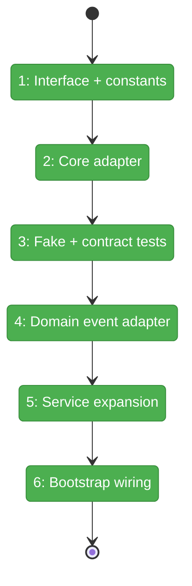
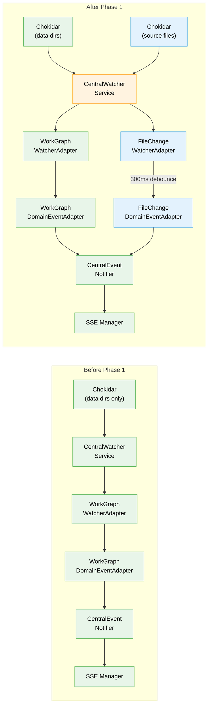

# Flight Plan: Phase 1 — Server-Side Event Pipeline

**Plan**: [live-file-events-plan.md](../../live-file-events-plan.md)
**Phase**: Phase 1: Server-Side Event Pipeline (1 of 3)
**Generated**: 2026-02-24
**Status**: All stages complete

---

## Departure → Destination

**Where we are**: The CentralWatcherService watches only `.chainglass/data/` directories for workgraph changes. It feeds those events through the three-layer notification pipeline (watcher → domain adapter → notifier → SSE). There is no awareness of user-authored source files — if someone saves a `.tsx` file in VS Code, the server has no idea. The `FileWatcherOptions` interface has no `ignored` field, and `WorkspaceDomain` has no file-change channel.

**Where we're going**: By the end of this phase, the server watches every file in every worktree (while filtering out noise like node_modules, .git, dist). File changes are batched into 300ms debounce windows, deduplicated, and broadcast as SSE events on a new `file-changes` channel. A developer can listen on `/api/events/file-changes` and receive `{ path, eventType }` payloads within ~700ms of a filesystem change.

---

## Flight Status

<!-- Updated by /plan-6: pending → active → done. Use blocked for problems/input needed. -->

**Legend**: grey = pending | yellow = active | red = blocked/needs input | green = done

---

## Stages

<!-- Updated by /plan-6 during implementation: [ ] → [~] → [x] -->

- [x] **Stage 1: Add `ignored` field and ignore constants** — extend `FileWatcherOptions` with an optional `ignored` field, pass it through in the chokidar adapter, and create the `SOURCE_WATCHER_IGNORED` patterns array (`file-watcher.interface.ts`, `chokidar-file-watcher.adapter.ts`, `source-watcher.constants.ts` — new file)
- [x] **Stage 2: Add file-changes channel** — add `FileChanges: 'file-changes'` to the `WorkspaceDomain` const so the domain adapter can reference it (`workspace-domain.ts`)
- [x] **Stage 3: Build the core FileChangeWatcherAdapter** — implement `IWatcherAdapter` with .chainglass filtering, absolute→relative path conversion, 300ms debounce batching, and last-event-wins deduplication. TDD: write failing tests first (`file-change-watcher.adapter.ts` — new file, `file-change-watcher.adapter.test.ts` — new file)
- [x] **Stage 4: Build the fake + contract tests** — create `FakeFileChangeWatcherAdapter` with event recording and `flushNow()`, then write a shared contract test suite that both real and fake pass (`fake-file-change-watcher.ts` — new file, contract test files — new files)
- [x] **Stage 5: Build the domain event adapter** — create `FileChangeDomainEventAdapter` extending `DomainEventAdapter<T>` with `extractData()` returning `{ changes: [{path, eventType, worktreePath, timestamp}] }` (`file-change-domain-event-adapter.ts` — new file)
- [x] **Stage 6: Expand CentralWatcherService** — add `sourceWatchers` map, `createSourceWatchers()` per worktree root with ignore patterns, wrap in try/catch so source watcher failure doesn't block data watchers. Refactor existing tests to query by path instead of index (`central-watcher.service.ts`, `central-watcher.service.test.ts`)
- [x] **Stage 7: Wire everything in bootstrap** — create `FileChangeWatcherAdapter(300)` and `FileChangeDomainEventAdapter(notifier)` in `startCentralNotificationSystem()`, wire `onFilesChanged → handleEvent`, and write an integration test proving file change → notifier.emit (`start-central-notifications.ts`, integration test — new file)

---

## Acceptance Criteria

- [ ] AC-01: File created → `file-changed` SSE event with `add` type within ~700ms
- [ ] AC-02: File modified → `file-changed` SSE event with `change` type
- [ ] AC-03: File deleted → `file-changed` SSE event with `unlink` type
- [ ] AC-04: node_modules/.git/dist/.next/.chainglass changes produce NO SSE events
- [ ] AC-05: Rapid changes within 300ms batched + deduplicated (last event wins)
- [ ] AC-06: WorkspaceDomain.FileChanges === 'file-changes'
- [ ] AC-28: Server watcher starts at startup via instrumentation.ts

---

## Goals & Non-Goals

**Goals**:
- Add `ignored` option to `FileWatcherOptions` interface + chokidar adapter passthrough
- Create `SOURCE_WATCHER_IGNORED` ignore patterns (node_modules, .git, dist, .next, .chainglass, lock files, etc.)
- Add `WorkspaceDomain.FileChanges` channel entry (`'file-changes'`)
- Create `FileChangeWatcherAdapter` with 300ms debounce + last-event-wins dedup
- Create `FakeFileChangeWatcherAdapter` with contract test parity
- Create `FileChangeDomainEventAdapter` extending `DomainEventAdapter<T>`
- Expand `CentralWatcherService` with source watchers alongside data watchers
- Wire file change adapters in `startCentralNotificationSystem()` bootstrap
- Refactor existing CentralWatcherService tests for source watcher awareness

**Non-Goals**:
- Client-side hooks or React components (Phase 2)
- FileChangeHub or FileChangeProvider (Phase 2)
- UI banners, tree animations, or auto-refresh (Phase 3)
- Double-event suppression after editor save (Phase 3)
- Configurable ignore patterns per workspace (future enhancement)
- DI token registration for FileChangeWatcherAdapter (directly instantiated in bootstrap)

---

## Architecture: Before & After

**Legend**: existing (green, unchanged) | changed (orange, modified) | new (blue, created)

---

## Checklist

- [x] T001: Add `ignored` field to FileWatcherOptions + ChokidarAdapter passthrough (CS-1)
- [x] T002: Create SOURCE_WATCHER_IGNORED constants (CS-1)
- [x] T003: Add FileChanges to WorkspaceDomain (CS-1)
- [x] T004: Create FileChangeWatcherAdapter with debounce + dedup (CS-3)
- [x] T005: Create FileChangeDomainEventAdapter (CS-1)
- [x] T006: Create FakeFileChangeWatcherAdapter + contract tests (CS-2)
- [x] T007: Write comprehensive unit tests for adapter (CS-2)
- [x] T008: Expand CentralWatcherService with source watchers (CS-3)
- [x] T009: Refactor existing CentralWatcherService tests (CS-2)
- [x] T010: Wire adapters in bootstrap + integration test (CS-2)

---

## PlanPak

Active — files organized under `features/045-live-file-events/` (client-side, Phase 2+) and `features/023-central-watcher-notifications/` (server-side adapters, this phase).
