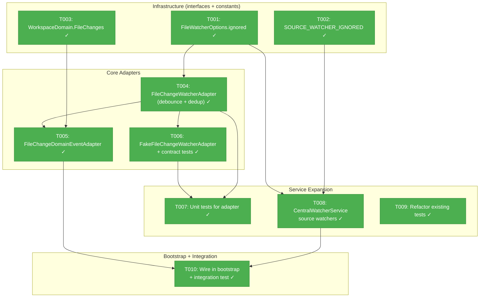
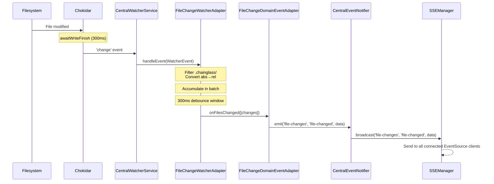

# Phase 1: Server-Side Event Pipeline — Tasks

**Plan**: [live-file-events-plan.md](../../live-file-events-plan.md)
**Spec**: [live-file-events-spec.md](../../live-file-events-spec.md)
**Phase**: 1 of 3
**Testing Approach**: Full TDD
**Date**: 2026-02-24

---

## Executive Briefing

### Purpose
This phase enables the server to watch entire worktrees for file changes and broadcast events through the existing SSE pipeline. Currently the `CentralWatcherService` only watches `.chainglass/data/` directories — this phase expands it to watch all user-authored source files while filtering out noise (node_modules, .git, build artifacts).

### What We're Building
A server-side event pipeline that:
- Watches all files in every worktree (with aggressive ignore patterns)
- Batches rapid changes into 300ms debounce windows with deduplication
- Routes file change events through the existing three-layer notification architecture
- Broadcasts minimal SSE payloads (`{ path, eventType }`) on a new `file-changes` channel

### User Value
After this phase, the SSE infrastructure carries file change events end-to-end. Phase 2 (client hub) and Phase 3 (UI wiring) will consume these events to make the file browser feel alive. This phase is the foundation — without it, no client-side reactivity is possible.

### Example
```
User saves src/components/Button.tsx in VS Code
  → chokidar detects change (300ms stabilization)
    → FileChangeWatcherAdapter batches + deduplicates
      → FileChangeDomainEventAdapter extracts minimal payload
        → SSE broadcast: { type: 'file-changed', changes: [{ path: 'src/components/Button.tsx', eventType: 'change' }] }
```

---

## Objectives & Scope

### Objective
Implement worktree-wide file watching and route file change events through the SSE pipeline per plan Phase 1 tasks 1.1–1.7.

### Goals

- ✅ Add `ignored` option to `FileWatcherOptions` interface + chokidar adapter passthrough
- ✅ Create `SOURCE_WATCHER_IGNORED` ignore patterns (node_modules, .git, dist, .next, .chainglass, etc.)
- ✅ Add `WorkspaceDomain.FileChanges` channel entry (`'file-changes'`)
- ✅ Create `FileChangeWatcherAdapter` with 300ms debounce + last-event-wins dedup
- ✅ Create `FakeFileChangeWatcherAdapter` with contract test parity
- ✅ Create `FileChangeDomainEventAdapter` extending `DomainEventAdapter<T>`
- ✅ Expand `CentralWatcherService` with source watchers alongside data watchers
- ✅ Wire file change adapters in `startCentralNotificationSystem()` bootstrap
- ✅ Refactor existing CentralWatcherService tests for source watcher awareness

### Non-Goals

- ❌ Client-side hooks or React components (Phase 2)
- ❌ FileChangeHub or FileChangeProvider (Phase 2)
- ❌ UI banners, tree animations, or auto-refresh (Phase 3)
- ❌ Double-event suppression after editor save (Phase 3)
- ❌ Configurable ignore patterns per workspace (future enhancement)
- ❌ DI token registration for FileChangeWatcherAdapter (directly instantiated in bootstrap, same as WorkGraphWatcherAdapter)

---

## Pre-Implementation Audit

### Summary
| File | Action | Origin | Modified By | Recommendation |
|------|--------|--------|-------------|----------------|
| `packages/workflow/src/interfaces/file-watcher.interface.ts` | Modify | Plan 023 | — | Add optional `ignored` field |
| `packages/workflow/src/adapters/chokidar-file-watcher.adapter.ts` | Modify | Plan 023 | — | Pass `ignored` through to chokidar |
| `packages/workflow/src/features/023-central-watcher-notifications/source-watcher.constants.ts` | Create | New | — | keep-as-is |
| `packages/shared/src/features/027-central-notify-events/workspace-domain.ts` | Modify | Plan 027 | — | Add FileChanges entry |
| `packages/workflow/src/features/023-central-watcher-notifications/file-change-watcher.adapter.ts` | Create | New | — | keep-as-is |
| `packages/workflow/src/features/023-central-watcher-notifications/fake-file-change-watcher.ts` | Create | New | — | keep-as-is |
| `packages/workflow/src/features/023-central-watcher-notifications/central-watcher.service.ts` | Modify | Plan 023 | — | Add sourceWatchers, wrap in try/catch |
| `apps/web/src/features/027-central-notify-events/file-change-domain-event-adapter.ts` | Create | New | — | keep-as-is |
| `apps/web/src/features/027-central-notify-events/start-central-notifications.ts` | Modify | Plan 027 | — | Wire file change adapters |

### Compliance Check
No violations found. All file naming follows R-CODE-003 (kebab-case, `.adapter.ts` suffix). All class naming follows R-CODE-002 (PascalCase, Adapter/Fake prefixes). Dependency direction correct per R-ARCH-001.

---

## Requirements Traceability

### Coverage Matrix
| AC | Description | Flow Summary | Files in Flow | Tasks | Status |
|----|-------------|-------------|---------------|-------|--------|
| AC-01 | File created → SSE `add` event ~700ms | chokidar→CentralWatcher→FileChangeAdapter→DomainAdapter→notifier→SSE | 6 files | T001,T004,T005,T007,T008,T009,T010 | ✅ Complete |
| AC-02 | File modified → SSE `change` event | Same flow, different event type | 6 files | T004,T005,T007,T008,T009,T010 | ✅ Complete |
| AC-03 | File deleted → SSE `unlink` event | Same flow, different event type | 6 files | T004,T005,T007,T008,T009,T010 | ✅ Complete |
| AC-04 | Ignored dirs → NO SSE events | chokidar `ignored` option + adapter .chainglass filter | 4 files | T001,T002,T004,T008 | ✅ Complete |
| AC-05 | 300ms batch + dedup | FileChangeWatcherAdapter debounce window | 1 file | T004 | ✅ Complete |
| AC-06 | WorkspaceDomain.FileChanges = 'file-changes' | workspace-domain.ts const | 1 file | T003 | ✅ Complete |
| AC-28 | Watcher starts at startup | instrumentation.ts → bootstrap → watcher.start() | 2 files | T010 | ✅ Complete |

### Gaps Found
No gaps — all acceptance criteria have complete file coverage.

### Orphan Files
| File | Tasks | Assessment |
|------|-------|------------|
| `fake-file-change-watcher.ts` | T006 | Test infrastructure — validates FileChangeWatcherAdapter parity |
| `source-watcher.constants.ts` | T002 | Configuration — supports AC-04 (ignore patterns) |

---

## Architecture Map

### Component Diagram
<!-- Status: grey=pending, orange=in-progress, green=completed, red=blocked -->
<!-- Updated by plan-6 during implementation -->



### Task-to-Component Mapping

<!-- Status: ⬜ Pending | 🟧 In Progress | ✅ Complete | 🔴 Blocked -->

| Task | Component(s) | Files | Status | Comment |
|------|-------------|-------|--------|---------|
| T001 | FileWatcherOptions + ChokidarAdapter | file-watcher.interface.ts, chokidar-file-watcher.adapter.ts | ✅ Complete | Added `ignored` field + passthrough |
| T002 | Source watcher constants | source-watcher.constants.ts | ✅ Complete | 23 ignore patterns |
| T003 | WorkspaceDomain | workspace-domain.ts | ✅ Complete | Added FileChanges channel |
| T004 | FileChangeWatcherAdapter | file-change-watcher.adapter.ts | ✅ Complete | Core: debounce + dedup + filtering |
| T005 | FileChangeDomainEventAdapter | file-change-domain-event-adapter.ts | ✅ Complete | Domain → SSE adapter |
| T006 | FakeFileChangeWatcherAdapter | fake-file-change-watcher.ts | ✅ Complete | Test fake + 16 contract tests |
| T007 | Adapter unit tests | file-change-watcher.adapter.test.ts | ✅ Complete | 20 comprehensive tests |
| T008 | CentralWatcherService | central-watcher.service.ts | ✅ Complete | Source watchers expansion |
| T009 | Existing test refactor | central-watcher.service.test.ts | ✅ Complete | Added findWatcherByPath, 7 new tests |
| T010 | Bootstrap wiring | start-central-notifications.ts | ✅ Complete | Wired + 5 integration tests |

---

## Tasks

| Status | ID | Task | CS | Type | Dependencies | Absolute Path(s) | Validation | Subtasks | Notes |
|--------|------|------|-----|------|-------------|-------------------|------------|----------|-------|
| [x] | T001 | Add `ignored` field to `FileWatcherOptions` interface + ChokidarFileWatcherAdapter passthrough | 1 | Core | – | `/home/jak/substrate/041-file-browser/packages/workflow/src/interfaces/file-watcher.interface.ts`, `/home/jak/substrate/041-file-browser/packages/workflow/src/adapters/chokidar-file-watcher.adapter.ts` | `ignored` field is optional in interface. Chokidar adapter maps it to chokidar options. Unit test passes `ignored: ['node_modules']` and verifies it reaches chokidar. | – | Per finding 01. Non-breaking additive change. Plan task 1.1. |
| [x] | T002 | Create `SOURCE_WATCHER_IGNORED` constants | 1 | Core | – | `/home/jak/substrate/041-file-browser/packages/workflow/src/features/023-central-watcher-notifications/source-watcher.constants.ts` | Exports `SOURCE_WATCHER_IGNORED` array with: `.git`, `node_modules`, `vendor`, `.pnpm-store`, `dist`, `build`, `.next`, `.turbo`, `.cache`, `coverage`, `__pycache__`, `.idea`, `.vscode`, `*.swp`, `*.swo`, `*~`, `.DS_Store`, `Thumbs.db`, `.chainglass`, `pnpm-lock.yaml`, `package-lock.json`, `yarn.lock`. | – | Per workshop 02. Plan task 1.2. |
| [x] | T003 | Add `FileChanges: 'file-changes'` to `WorkspaceDomain` const | 1 | Core | – | `/home/jak/substrate/041-file-browser/packages/shared/src/features/027-central-notify-events/workspace-domain.ts` | `WorkspaceDomain.FileChanges === 'file-changes'`. `WorkspaceDomainType` union includes the new value. Build compiles. | – | Per finding 02. Plan task 1.3. |
| [x] | T004 | Create `FileChangeWatcherAdapter` implementing `IWatcherAdapter` | 3 | Core | T001 | `/home/jak/substrate/041-file-browser/packages/workflow/src/features/023-central-watcher-notifications/file-change-watcher.adapter.ts` | Implements `IWatcherAdapter.handleEvent()`. Filters `.chainglass/` paths. Converts absolute→relative paths. Batches events in 300ms debounce window. Deduplicates: last-event-wins per `worktreePath:path` key. Emits via `onFilesChanged(callback)` callback-set. Error isolation: throwing subscriber doesn't block others. `flushNow()` for testing. `destroy()` cancels pending flush. | – | Core server logic. Plan task 1.4. |
| [x] | T005 | Create `FileChangeDomainEventAdapter` extending `DomainEventAdapter<T>` | 1 | Core | T003, T004 | `/home/jak/substrate/041-file-browser/apps/web/src/features/027-central-notify-events/file-change-domain-event-adapter.ts` | Extends `DomainEventAdapter<FileChangeBatchEvent>`. Constructor: `super(notifier, WorkspaceDomain.FileChanges, 'file-changed')`. `extractData()` returns `{ changes: [{path, eventType, worktreePath, timestamp}] }`. Unit test verifies payload shape matches SSE contract. | – | Follows WorkgraphDomainEventAdapter pattern. Plan task 1.5. |
| [x] | T006 | Create `FakeFileChangeWatcherAdapter` + contract tests | 2 | Test | T004 | `/home/jak/substrate/041-file-browser/packages/workflow/src/features/023-central-watcher-notifications/fake-file-change-watcher.ts`, `/home/jak/substrate/041-file-browser/test/contracts/file-change-watcher.contract.ts`, `/home/jak/substrate/041-file-browser/test/contracts/file-change-watcher.contract.test.ts` | Fake implements `IWatcherAdapter`. Records events via `handledEvents` array. Exposes `flushNow()` and `subscriberCount`. Contract test suite: both fake and real pass identical tests for handleEvent filtering, callback dispatch, error isolation, deduplication. | – | Follows FakeWatcherAdapter pattern. Plan task 1.4 (fake portion). |
| [x] | T007 | Write comprehensive unit tests for FileChangeWatcherAdapter | 2 | Test | T004, T006 | `/home/jak/substrate/041-file-browser/test/unit/workflow/file-change-watcher.adapter.test.ts` | Tests: filters .chainglass/ events, converts abs→rel paths, debounce batches rapid events, dedup last-event-wins, emits to all subscribers, isolates subscriber errors, `flushNow()` works, `destroy()` cancels pending. All pass. | – | Plan task 1.4 (test portion). |
| [x] | T008 | Expand `CentralWatcherService` with source watchers | 3 | Core | T001, T002 | `/home/jak/substrate/041-file-browser/packages/workflow/src/features/023-central-watcher-notifications/central-watcher.service.ts` | New `sourceWatchers: Map<string, IFileWatcher>`. `createSourceWatchers()` creates one chokidar watcher per worktree root with `SOURCE_WATCHER_IGNORED`. `start()` calls both `createDataWatchers()` + `createSourceWatchers()` (source wrapped in try/catch — failure doesn't block data). `stop()` closes both maps. `rescan()` handles both. Source watcher events dispatch through same `dispatchEvent()`. | – | Per finding 03 (partial failure). Plan task 1.6. |
| [x] | T009 | Refactor existing CentralWatcherService tests for source watcher awareness | 2 | Test | T008 | `/home/jak/substrate/041-file-browser/test/unit/workflow/central-watcher.service.test.ts` | Existing tests still pass. Tests no longer use `factory.getWatcher(0)` by index — refactored to query by path or purpose. New tests verify: source watchers created for each worktree, source watcher uses SOURCE_WATCHER_IGNORED, source watcher failure doesn't block data watchers, rescan handles both watcher types. | – | Per finding 04 (index regression). Plan task 1.6. |
| [x] | T010 | Wire file change adapters in `startCentralNotificationSystem()` + integration test | 2 | Integration | T004, T005, T008 | `/home/jak/substrate/041-file-browser/apps/web/src/features/027-central-notify-events/start-central-notifications.ts`, `/home/jak/substrate/041-file-browser/test/integration/045-live-file-events/watcher-to-file-change-notifier.integration.test.ts` | Bootstrap creates `FileChangeWatcherAdapter(300)` + `FileChangeDomainEventAdapter(notifier)`. Wires `onFilesChanged → handleEvent`. Registers adapter with watcher. Integration test: simulate file change → verify notifier.emit called with domain='file-changes', eventType='file-changed', data contains changes array. | – | Follows workgraph wiring pattern. Plan task 1.7. |

---

## Alignment Brief

### Critical Findings Affecting This Phase

| # | Finding | Constraint | Tasks |
|---|---------|-----------|-------|
| 01 | `FileWatcherOptions` missing `ignored` field | Must add before source watchers can use ignore patterns | T001 |
| 02 | `WorkspaceDomain` missing `FileChanges` entry | Must add before domain adapter can reference channel | T003 |
| 03 | Source watcher partial failure during `start()` | Source watcher creation must not block data watchers | T008 |
| 04 | Test index regression from source watchers | Tests using `factory.getWatcher(0)` will shift | T009 |

### ADR Decision Constraints

- **ADR-0007: Notification-Fetch Pattern** — SSE carries only identifiers (file paths, event types). No file content in SSE messages. Constrains: T005 `extractData()` payload shape. Addressed by: T005.
- **ADR-0008: Workspace Split Storage** — `.chainglass/data/` is already watched by data watchers. Source watchers must exclude it. Constrains: T002 ignore patterns, T004 `.chainglass/` filter. Addressed by: T002, T004.
- **ADR-0010: Three-Layer Notification Architecture** — New adapters must follow watcher → domain adapter → notifier pipeline. Constrains: T004, T005, T010 wiring. Addressed by: T004, T005, T010.

### Invariants & Guardrails

- **Debounce window**: 300ms server-side (T004). Higher than data watcher's 200ms stabilization to absorb editor write-rename-write sequences.
- **Event deduplication**: Last-event-wins per `worktreePath:path` key within a batch (T004).
- **Ignore patterns**: Must cover node_modules, .git, dist, .next, .chainglass, lock files, IDE dirs, OS files (T002).
- **Error isolation**: Source watcher failure must not block data watchers (T008). Subscriber errors must not block other subscribers (T004).
- **Callback-set pattern**: Use `onX(callback) → () => void` unsubscribe pattern, NOT EventEmitter (PL-03).

### Visual Alignment Aids

#### System Flow Diagram

```mermaid
flowchart LR
    A["chokidar<br/>(source watcher)"] -->|"WatcherEvent"| B["CentralWatcher<br/>Service"]
    B -->|"dispatchEvent"| C["FileChange<br/>WatcherAdapter"]
    C -->|"300ms debounce<br/>+ dedup"| D["onFilesChanged<br/>callback"]
    D --> E["FileChange<br/>DomainEventAdapter"]
    E -->|"extractData()"| F["CentralEvent<br/>Notifier"]
    F -->|"emit('file-changes')"| G["SSEManager<br/>Broadcaster"]
    G --> H["/api/events/<br/>file-changes"]
```


#### Event Sequence Diagram


### Test Plan (Full TDD)

| Test | File | Type | What It Validates | Fixtures |
|------|------|------|-------------------|----------|
| FileWatcherOptions ignored passthrough | `test/unit/workflow/chokidar-file-watcher.adapter.test.ts` | Unit | `ignored` option reaches chokidar | Existing fake factory |
| SOURCE_WATCHER_IGNORED completeness | `test/unit/workflow/source-watcher.constants.test.ts` | Unit | All required patterns present | None |
| WorkspaceDomain.FileChanges value | `test/unit/shared/workspace-domain.test.ts` | Unit | Value equals `'file-changes'` | None |
| FileChangeWatcherAdapter filtering | `test/unit/workflow/file-change-watcher.adapter.test.ts` | Unit | .chainglass/ filtered, abs→rel converted | WatcherEvent fixtures |
| FileChangeWatcherAdapter debounce | Same file | Unit | Events batched within 300ms window | `vi.useFakeTimers()` |
| FileChangeWatcherAdapter dedup | Same file | Unit | Last-event-wins per path | Multiple events same path |
| FileChangeWatcherAdapter error isolation | Same file | Unit | Throwing subscriber doesn't block others | Throwing callback |
| FakeFileChangeWatcherAdapter contract | `test/contracts/file-change-watcher.contract.test.ts` | Contract | Fake and real pass same suite | Contract test factory |
| FileChangeDomainEventAdapter payload | `test/unit/web/027/file-change-domain-event-adapter.test.ts` | Unit | extractData returns correct shape | FakeCentralEventNotifier |
| CentralWatcherService source watchers | `test/unit/workflow/central-watcher.service.test.ts` | Unit | Source watchers created, stopped, rescanned | FakeFileWatcherFactory |
| CentralWatcherService partial failure | Same file | Unit | Source failure doesn't block data watchers | Factory that throws |
| End-to-end pipeline | `test/integration/045-live-file-events/watcher-to-file-change-notifier.integration.test.ts` | Integration | File change → adapter → notifier.emit | FakeCentralEventNotifier |

### Implementation Order (Step-by-Step)

1. **T001**: Add `ignored` to `FileWatcherOptions` interface → update `ChokidarFileWatcherAdapter` → unit test
2. **T002**: Create `SOURCE_WATCHER_IGNORED` constants file
3. **T003**: Add `FileChanges: 'file-changes'` to `WorkspaceDomain`
4. **T004**: Create `FileChangeWatcherAdapter` (TDD: write failing tests → implement → refactor)
5. **T006**: Create `FakeFileChangeWatcherAdapter` + contract test suite
6. **T007**: Write comprehensive unit tests for adapter (edge cases)
7. **T005**: Create `FileChangeDomainEventAdapter` + unit test
8. **T008**: Expand `CentralWatcherService` with source watchers
9. **T009**: Refactor existing CentralWatcherService tests
10. **T010**: Wire adapters in bootstrap + integration test

### Commands to Run

```bash
# Run all tests
just test

# Run specific test files during development
pnpm vitest run test/unit/workflow/file-change-watcher.adapter.test.ts
pnpm vitest run test/unit/workflow/central-watcher.service.test.ts
pnpm vitest run test/contracts/file-change-watcher.contract.test.ts
pnpm vitest run test/integration/045-live-file-events/

# Watch mode for fast feedback
just test-watch 045

# Lint + format + test before commit
just fft

# Type check
just typecheck
```

### Risks & Unknowns

| Risk | Severity | Mitigation |
|------|----------|------------|
| Source watcher event volume during git checkout | Medium | 300ms debounce + dedup reduces 400 events → 2-5 SSE messages |
| chokidar `ignored` option compatibility | Low | chokidar v4 natively supports glob patterns in `ignored` |
| Test index regression in CentralWatcherService tests | High | T009 refactors to query by path, not index |
| Source watcher partial failure leaves service half-init | Medium | T008 wraps in separate try/catch, logs error, continues |

### Ready Check

- [x] ADR constraints mapped to tasks (ADR-0007→T005, ADR-0008→T002/T004, ADR-0010→T004/T005/T010)
- [x] All 7 Phase 1 ACs covered in task table
- [x] Pre-implementation audit complete (no reuse-existing findings)
- [x] Requirements flow tracing complete (no gaps)

---

## Phase Footnote Stubs

_Populated during implementation by plan-6._

| Footnote | Task | Description | Date |
|----------|------|-------------|------|
| | | | |

---

## Evidence Artifacts

- **Execution Log**: `docs/plans/045-live-file-events/tasks/phase-1-server-side-event-pipeline/execution.log.md`
- **Flight Plan**: `docs/plans/045-live-file-events/tasks/phase-1-server-side-event-pipeline/tasks.fltplan.md`

---

## Discoveries & Learnings

_Populated during implementation by plan-6. Log anything of interest to your future self._

| Date | Task | Type | Discovery | Resolution | References |
|------|------|------|-----------|------------|------------|
| 2026-02-24 | T009 | insight | Source watcher creation order is data→source→registry, not data→registry→source. Factory.create call indices shifted. | Fixed test to throw on call 2 (source) instead of call 3 (registry) | log#task-t009 |
| 2026-02-24 | T008 | decision | Source watchers use 300ms awaitWriteFinish (vs 200ms for data watchers) to absorb editor write-rename-write sequences | Per Workshop 02 recommendation | log#task-t008 |
| 2026-02-24 | T008 | insight | Source watchers listen for addDir/unlinkDir in addition to file events (data watchers only listen for add/change/unlink) | Needed for tree directory updates in Phase 3 | log#task-t008 |
| 2026-02-24 | all | insight | Pre-existing build failure in packages/shared fake-filesystem.ts (Buffer type issue) unrelated to Plan 045 changes | Ignored per instructions — all tests pass, lint clean | N/A |

**Types**: `gotcha` | `research-needed` | `unexpected-behavior` | `workaround` | `decision` | `debt` | `insight`

**What to log**:
- Things that didn't work as expected
- External research that was required
- Implementation troubles and how they were resolved
- Gotchas and edge cases discovered
- Decisions made during implementation
- Technical debt introduced (and why)
- Insights that future phases should know about

_See also: `execution.log.md` for detailed narrative._

---

## Directory Layout

```
docs/plans/045-live-file-events/
├── live-file-events-plan.md
├── live-file-events-spec.md
├── research.md
├── workshops/
│   ├── 01-browser-event-hub-design.md
│   ├── 02-worktree-wide-watcher-strategy.md
│   └── 03-in-place-tree-viewer-updates.md
└── tasks/
    └── phase-1-server-side-event-pipeline/
        ├── tasks.md                 ← this file
        ├── tasks.fltplan.md         # generated by /plan-5b
        └── execution.log.md        # created by /plan-6
```
