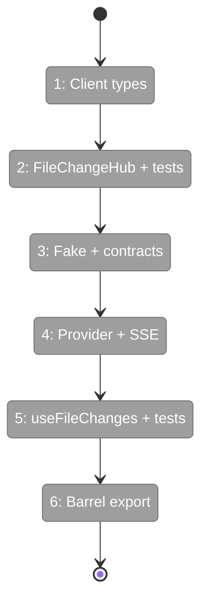
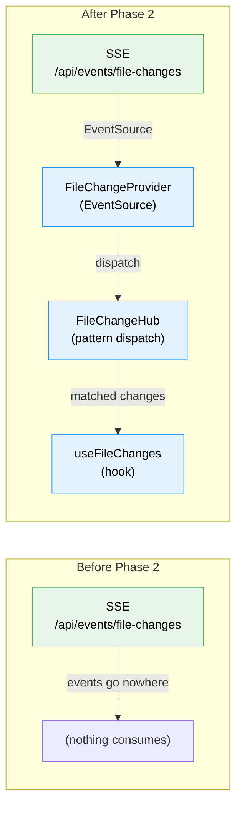

# Flight Plan: Phase 2 — Browser-Side Event Hub

**Plan**: [live-file-events-plan.md](../../live-file-events-plan.md)
**Phase**: Phase 2: Browser-Side Event Hub (2 of 3)
**Generated**: 2026-02-24
**Status**: Ready for takeoff

---

## Departure → Destination

**Where we are**: Phase 1 established the server-side pipeline — file changes are detected via chokidar, batched/deduped by `FileChangeWatcherAdapter`, and broadcast as SSE events on the `file-changes` channel. The SSE endpoint `/api/events/file-changes` is live and streaming `{ type: 'file-changed', changes: [...] }` payloads. But no browser-side code consumes these events — they flow into the void.

**Where we're going**: By the end of this phase, any React component can subscribe to file changes with a one-liner: `const { hasChanges } = useFileChanges('src/components/')`. A `FileChangeProvider` wraps the worktree view, managing a single SSE connection. A `FileChangeHub` inside it dispatches incoming events to subscribers based on path patterns. The complete client-side SDK is ready for Phase 3 to wire into FileTree, FileViewerPanel, and ChangesView.

---

## Domain Context

### Domains We're Changing

| Domain | Relationship | Key Files | What Changes |
|--------|-------------|-----------|-------------|
| `_platform/events` | modify | `apps/web/src/features/045-live-file-events/` | New feature folder: FileChangeHub, FileChangeProvider, useFileChanges, FakeFileChangeHub, types, barrel export |

### Domains We Depend On

| Domain | Contract | How We Use It |
|--------|----------|---------------|
| `_platform/events` | `WorkspaceDomain.FileChanges` | Channel name for EventSource URL (`/api/events/file-changes`) |
| `_platform/events` | SSE Route `/api/events/[channel]` | The EventSource endpoint we connect to |
| `_platform/events` | `FileChangeBatchItem` type | Reference shape for client-side `FileChange` type |

---

## Flight Status

**Legend**: grey = pending | yellow = active | red = blocked/needs input | green = done

---

## Stages

- [ ] **Stage 1: Client types** — Create `FileChange` and `FileChangeSSEEvent` types in the feature folder. Subset of server `FileChangeBatchItem` (no `worktreePath` in `FileChange` — hub handles worktree filtering).
- [ ] **Stage 2: FileChangeHub + unit tests** — TDD: write pattern matching tests first (exact, directory, recursive, wildcard), then implement hub class with `subscribe()`, `dispatch()`, error isolation, and `subscriberCount`.
- [ ] **Stage 3: FakeFileChangeHub + contract tests** — Create test double that records dispatches. Write shared contract suite both real and fake pass.
- [ ] **Stage 4: FileChangeProvider + SSE lifecycle** — Create React context component. Opens raw `EventSource` to `/api/events/file-changes`. Parses SSE messages, filters by worktreePath, dispatches to hub. Closes on unmount. `useFileChangeHub()` throws outside provider.
- [ ] **Stage 5: useFileChanges hook + unit tests** — TDD: write hook tests first (mount/unmount, debounce, modes, clearChanges, outside-provider throw), then implement. Uses FakeFileChangeHub for testing.
- [ ] **Stage 6: Barrel export** — Create `index.ts` exporting all public APIs.

---

## Acceptance Criteria

- [ ] AC-07: `useFileChanges('src/App.tsx')` → hasChanges true on modification
- [ ] AC-08: `useFileChanges('src/components/')` → direct children only
- [ ] AC-09: `useFileChanges('src/**')` → recursive match
- [ ] AC-10: `useFileChanges('*')` → wildcard match
- [ ] AC-11: Unmount cleans up subscription, no memory leaks
- [ ] AC-12: Single SSE connection per worktree
- [ ] AC-13: useFileChanges outside FileChangeProvider throws

---

## Goals & Non-Goals

**Goals**:
- FileChangeHub with 4 pattern types + error isolation
- FileChangeProvider managing single SSE connection per worktree
- useFileChanges hook with debounce + accumulate/replace modes
- FakeFileChangeHub for Phase 3 component testing
- Feature folder barrel export
- Full TDD with hub + hook unit tests + contract tests

**Non-Goals**:
- UI wiring (Phase 3)
- useTreeDirectoryChanges multi-directory hook (Phase 3)
- Double-event suppression (Phase 3)
- Domain doc updates (Phase 3 cleanup)

---

## Architecture: Before & After

**Legend**: existing (green, unchanged) | new (blue, created)

---

## Checklist

- [ ] T001: Client-side types (CS-1)
- [ ] T002: FileChangeHub class (CS-2)
- [ ] T003: FakeFileChangeHub + contract tests (CS-2)
- [ ] T004: Hub unit tests (CS-2)
- [ ] T005: FileChangeProvider + SSE (CS-2)
- [ ] T006: useFileChanges hook (CS-2)
- [ ] T007: Hook unit tests (CS-2)
- [ ] T008: Barrel export (CS-1)

---

## PlanPak

Active — all files under `apps/web/src/features/045-live-file-events/`. Tests under `test/unit/web/features/045-live-file-events/` and `test/contracts/`.
