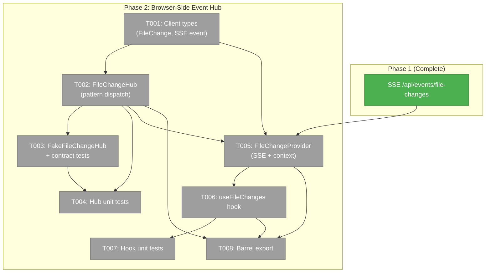
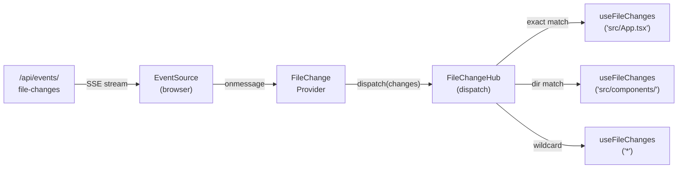
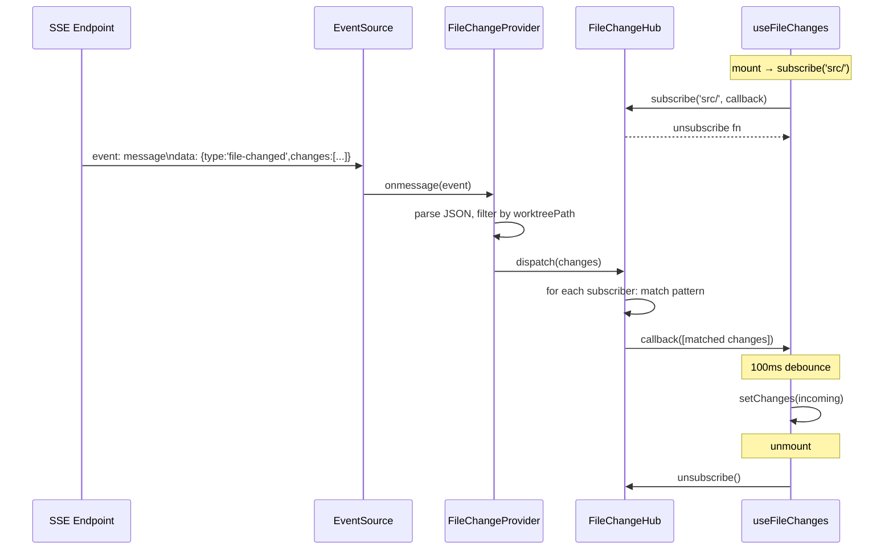

# Phase 2: Browser-Side Event Hub — Tasks

**Plan**: [live-file-events-plan.md](../../live-file-events-plan.md)
**Spec**: [live-file-events-spec.md](../../live-file-events-spec.md)
**Phase**: 2 of 3
**Testing Approach**: Full TDD
**Date**: 2026-02-24

---

## Executive Briefing

### Purpose
This phase builds the client-side event distribution system. Phase 1 established server-side file watching and SSE broadcasting — events now flow to `/api/events/file-changes`. Phase 2 creates the **consumer-facing SDK** that makes subscribing to those events a one-liner: `useFileChanges('src/components/')`.

### What We're Building
A three-layer client stack:
1. **FileChangeHub** — a plain TypeScript class that receives SSE events and dispatches them to subscribers via path-pattern matching (exact, directory, recursive, wildcard)
2. **FileChangeProvider** — a React context that owns the single SSE connection per worktree and feeds the hub
3. **useFileChanges** — a React hook that subscribes to the hub, debounces state updates, and auto-cleans up on unmount

Plus a barrel export from the `045-live-file-events` feature folder.

### User Value
After this phase, any component anywhere in the app can subscribe to file changes with a single hook call. This is the "SDK For Us" concept — tuck away the SSE connection, pattern matching, debouncing, and cleanup behind a trivially simple API that encourages reactive UI behavior.

### Example
```typescript
// In any component under FileChangeProvider:
const { hasChanges, changes, clearChanges } = useFileChanges('src/components/');
// hasChanges === true when any file in src/components/ is added/modified/deleted
// changes === [{ path: 'src/components/Button.tsx', eventType: 'change', timestamp: ... }]
```

### Goals
- ✅ `FileChangeHub` class with 4 pattern types (exact, directory, recursive, wildcard)
- ✅ `FileChangeProvider` React context managing single SSE connection per worktree
- ✅ `useFileChanges` hook with configurable debounce (100ms default) and accumulate/replace modes
- ✅ Barrel export from `045-live-file-events` feature folder
- ✅ Unit tests for hub (pattern matching, dispatch, error isolation) + hook (lifecycle, cleanup)
- ✅ `FakeFileChangeHub` for downstream component testing (Phase 3)

### Non-Goals
- ❌ UI wiring (FileTree animations, viewer banners, preview refresh) — Phase 3
- ❌ `useTreeDirectoryChanges` multi-directory hook — Phase 3
- ❌ Double-event suppression after editor save — Phase 3
- ❌ Domain documentation updates (domain.md, domain-map.md) — will be done as part of Phase 3 final cleanup
- ❌ Integration with `useSSE` existing hook — we use raw `EventSource` per workshop 01 decision (browser auto-reconnect is sufficient)

---

## Prior Phase Context

### Phase 1: Server-Side Event Pipeline (Complete ✅)

**A. Deliverables:**
| File | Type | Purpose |
|------|------|---------|
| `packages/workflow/src/features/023-central-watcher-notifications/file-change-watcher.adapter.ts` | Created | Core adapter: 300ms debounce, last-event-wins dedup, .chainglass filtering |
| `packages/workflow/src/features/023-central-watcher-notifications/file-change.types.ts` | Created | Shared types: `FileChangeBatchItem`, `FilesChangedCallback` |
| `packages/workflow/src/features/023-central-watcher-notifications/fake-file-change-watcher.ts` | Created | Test double with contract parity |
| `packages/workflow/src/features/023-central-watcher-notifications/source-watcher.constants.ts` | Created | 23 ignore patterns for source watchers |
| `packages/workflow/src/features/023-central-watcher-notifications/central-watcher.service.ts` | Modified | Added `sourceWatchers` map alongside data watchers |
| `packages/shared/src/features/027-central-notify-events/workspace-domain.ts` | Modified | Added `FileChanges: 'file-changes'` |
| `apps/web/src/features/027-central-notify-events/file-change-domain-event-adapter.ts` | Created | Routes file changes to SSE: `notifier.emit('file-changes', 'file-changed', { changes })` |
| `apps/web/src/features/027-central-notify-events/start-central-notifications.ts` | Modified | Bootstrap wires both workgraph + file-change adapters |

**B. Dependencies Exported (for Phase 2):**
- `WorkspaceDomain.FileChanges === 'file-changes'` — SSE channel name for EventSource URL
- `FileChangeBatchItem` type: `{ path: string, eventType: string, worktreePath: string, timestamp: number }` — the SSE payload shape that `FileChangeProvider` parses
- SSE events arrive as: `{ type: 'file-changed', data: { changes: FileChangeBatchItem[] } }`

**C. Gotchas & Debt:**
- F002: Subscriber error catch in adapter now has `console.warn` (fixed in review follow-up)
- F007: No `maxWaitMs` ceiling on debounce — pathological event storms delay indefinitely. Not a Phase 2 concern (server-side only).
- Paths in SSE payload are relative to worktree root (e.g., `src/app.tsx` not `/repo/src/app.tsx`)

**D. Incomplete Items:** None blocking. Minor test coverage gaps (AC-04 pattern completeness, AC-28 startup chain) don't affect Phase 2.

**E. Patterns to Follow:**
- Callback-set pattern: `subscribe(pattern, callback) → () => void` (not EventEmitter)
- Error isolation: throwing subscriber must not block others
- Contract test parity: real + fake pass same suite
- Import types from shared files (not cross-importing between adapter/fake)
- `FakeEventSource` exists at `test/fakes/fake-event-source.ts` for SSE testing

---

## Pre-Implementation Check

| File | Exists? | Domain Check | Notes |
|------|---------|-------------|-------|
| `apps/web/src/features/045-live-file-events/file-change-hub.ts` | No (create) | events ✅ | Core hub class |
| `apps/web/src/features/045-live-file-events/file-change-provider.tsx` | No (create) | events ✅ | React context + SSE lifecycle |
| `apps/web/src/features/045-live-file-events/use-file-changes.ts` | No (create) | events ✅ | Consumer hook |
| `apps/web/src/features/045-live-file-events/file-change.types.ts` | No (create) | events ✅ | Client-side types (FileChange, FileChangeSSEEvent) |
| `apps/web/src/features/045-live-file-events/fake-file-change-hub.ts` | No (create) | events ✅ | Test fake for hub |
| `apps/web/src/features/045-live-file-events/index.ts` | No (create) | events ✅ | Barrel export |
| `test/unit/web/features/045-live-file-events/file-change-hub.test.ts` | No (create) | test ✅ | Hub unit tests |
| `test/unit/web/features/045-live-file-events/use-file-changes.test.tsx` | No (create) | test ✅ | Hook unit tests |

All files are new (creates), correctly placed under `045-live-file-events` feature folder per PlanPak. No concept duplication — `FileChangeHub` is distinct from server-side `FileChangeWatcherAdapter` (client dispatch vs server debounce/dedup).

---

## Architecture Map



### Task-to-Component Mapping

| Task | Component(s) | Files | Status | Comment |
|------|-------------|-------|--------|---------|
| T001 | Client-side types | file-change.types.ts | ⬜ Pending | FileChange, FileChangeSSEEvent |
| T002 | FileChangeHub | file-change-hub.ts | ⬜ Pending | Pattern matching + subscriber dispatch |
| T003 | FakeFileChangeHub | fake-file-change-hub.ts | ⬜ Pending | Test double + contract tests |
| T004 | Hub unit tests | file-change-hub.test.ts | ⬜ Pending | 4 patterns + edge cases |
| T005 | FileChangeProvider | file-change-provider.tsx | ⬜ Pending | SSE + React context |
| T006 | useFileChanges | use-file-changes.ts | ⬜ Pending | Consumer hook |
| T007 | Hook unit tests | use-file-changes.test.tsx | ⬜ Pending | Lifecycle + cleanup |
| T008 | Barrel export | index.ts | ⬜ Pending | Public API |

---

## Tasks

| Status | ID | Task | Domain | Path(s) | Done When | Notes |
|--------|-----|------|--------|---------|-----------|-------|
| [ ] | T001 | Create client-side `FileChange` and `FileChangeSSEEvent` types | events | `/home/jak/substrate/041-file-browser/apps/web/src/features/045-live-file-events/file-change.types.ts` | `FileChange` type: `{ path, eventType, timestamp }`. `FileChangeSSEEvent` type: `{ type: 'file-changed', changes: FileChange[] }`. Types compile and are importable. | Client-side types are a subset of server `FileChangeBatchItem` (no `worktreePath` — hub filters by worktree before dispatch). Per workshop 01. |
| [ ] | T002 | Create `FileChangeHub` class with pattern-based dispatch | events | `/home/jak/substrate/041-file-browser/apps/web/src/features/045-live-file-events/file-change-hub.ts` | `subscribe(pattern, callback) → unsubscribe`. `dispatch(changes)` fans out to matching subscribers. Pattern matching: exact (`src/App.tsx`), directory (`src/components/`), recursive (`src/**`), wildcard (`*`). `subscriberCount` getter. Error isolation: throwing subscriber doesn't block others. | Core of Phase 2. Per workshop 01. Callback-set pattern per PL-03. No external glob library — 3 patterns only. |
| [ ] | T003 | Create `FakeFileChangeHub` + contract tests | events | `/home/jak/substrate/041-file-browser/apps/web/src/features/045-live-file-events/fake-file-change-hub.ts`, `/home/jak/substrate/041-file-browser/test/contracts/file-change-hub.contract.ts`, `/home/jak/substrate/041-file-browser/test/contracts/file-change-hub.contract.test.ts` | Fake records dispatched events. Exposes `dispatchedBatches` for test inspection. Same `subscribe`/`dispatch` API as real. Contract tests: both real and fake pass identical pattern matching + dispatch tests. | Follows FakeFileChangeWatcherAdapter pattern from Phase 1. Phase 3 components use this for testing. |
| [ ] | T004 | Write comprehensive unit tests for FileChangeHub | events | `/home/jak/substrate/041-file-browser/test/unit/web/features/045-live-file-events/file-change-hub.test.ts` | Tests: exact match, directory match (non-recursive), recursive match, wildcard match, no-match (no dispatch), subscriber unsubscription, error isolation, subscriberCount, empty dispatch no-op, edge cases (root path, trailing slashes). All pass. | TDD: write tests first, then implement T002. |
| [ ] | T005 | Create `FileChangeProvider` React context + SSE lifecycle | events | `/home/jak/substrate/041-file-browser/apps/web/src/features/045-live-file-events/file-change-provider.tsx` | `'use client'` component. Creates `FileChangeHub` per worktree (new hub on worktreePath change). Opens `EventSource` to `/api/events/file-changes`. Parses SSE `message` events as `FileChangeSSEEvent`. Dispatches to hub. Closes EventSource on unmount. `useFileChangeHub()` context accessor throws if used outside provider. | Per workshop 01. Raw EventSource (browser auto-reconnect). Filter SSE messages to only dispatch changes matching current worktreePath. |
| [ ] | T006 | Create `useFileChanges` hook | events | `/home/jak/substrate/041-file-browser/apps/web/src/features/045-live-file-events/use-file-changes.ts` | `'use client'` hook. Returns `{ changes, hasChanges, clearChanges }`. Subscribes to hub via pattern. Debounce configurable (default 100ms). Mode: `replace` (default) or `accumulate`. Auto-unsubscribe on unmount. Clears timer on unmount (no memory leaks). | Per workshop 01. The "SDK For Us" API. |
| [ ] | T007 | Write unit tests for `useFileChanges` hook | events | `/home/jak/substrate/041-file-browser/test/unit/web/features/045-live-file-events/use-file-changes.test.tsx` | Tests: subscribe on mount, unsubscribe on unmount, debounce delays state update, replace mode replaces changes, accumulate mode appends, clearChanges resets, hasChanges reflects state, pattern change re-subscribes, throws outside provider. All pass. | Uses FakeFileChangeHub from T003. React Testing Library + `renderHook`. |
| [ ] | T008 | Create feature folder barrel export | events | `/home/jak/substrate/041-file-browser/apps/web/src/features/045-live-file-events/index.ts` | Exports: `FileChangeHub`, `FileChangeProvider`, `useFileChangeHub`, `useFileChanges`, `FakeFileChangeHub`, `FileChange`, `FileChangeSSEEvent`. Imports work from `@/features/045-live-file-events`. | PlanPak barrel pattern. |

---

## Context Brief

### Key Findings from Plan

| # | Finding | Phase 2 Action |
|---|---------|---------------|
| 05 | FileViewerPanel has no `externallyChanged` prop | Phase 3 — but `useFileChanges` built here enables it |
| 06 | BrowserClient has no SSE/FileChangeProvider integration | Phase 3 — but `FileChangeProvider` built here enables it |

No findings directly block Phase 2. Findings 01-04 were resolved in Phase 1.

### Domain Dependencies

| Domain | Contract | Usage |
|--------|----------|-------|
| `_platform/events` | `WorkspaceDomain.FileChanges` | SSE channel name for EventSource URL construction |
| `_platform/events` | `FileChangeBatchItem` | Shape of server-side SSE payload — client types derive from this |
| `_platform/events` | SSE Route `/api/events/[channel]` | EventSource endpoint for file-changes channel |

### Domain Constraints

- All Phase 2 files go under `apps/web/src/features/045-live-file-events/` (events domain, contract classification)
- `FileChangeHub` must NOT import from server-side packages (`@chainglass/workflow`) — it only knows client types
- `FileChangeProvider` may import `WorkspaceDomain` from `@chainglass/shared` for channel name
- Test fakes co-locate with source in the feature folder (not in `test/fakes/`)

### Reusable from Phase 1

- `FakeEventSource` at `test/fakes/fake-event-source.ts` — for testing FileChangeProvider's SSE connection
- Contract test pattern from `test/contracts/file-change-watcher.contract.ts` — same structure for hub contracts
- `FileChangeBatchItem` type from `@chainglass/workflow` — reference for client `FileChange` type shape

### System Flow Diagram



### Sequence Diagram



### Test Plan (Full TDD)

| Test | File | Type | What It Validates | Fixtures |
|------|------|------|-------------------|----------|
| Hub exact match | `file-change-hub.test.ts` | Unit | `subscribe('src/App.tsx')` matches only exact path | FileChange fixtures |
| Hub directory match | Same | Unit | `subscribe('src/components/')` matches direct children only | FileChange fixtures |
| Hub recursive match | Same | Unit | `subscribe('src/**')` matches all descendants | FileChange fixtures |
| Hub wildcard match | Same | Unit | `subscribe('*')` matches everything | FileChange fixtures |
| Hub error isolation | Same | Unit | Throwing subscriber doesn't block others | Throwing callback |
| Hub unsubscribe | Same | Unit | Unsubscribed callback not called | — |
| Contract: real + fake parity | `file-change-hub.contract.test.ts` | Contract | Both pass same pattern tests | Contract factory |
| Hook subscribe/unsubscribe | `use-file-changes.test.tsx` | Unit | Mount subscribes, unmount unsubscribes | FakeFileChangeHub |
| Hook debounce | Same | Unit | Changes not immediate, arrive after debounce | `vi.useFakeTimers()` |
| Hook replace mode | Same | Unit | New changes replace previous | FakeFileChangeHub |
| Hook accumulate mode | Same | Unit | New changes append | FakeFileChangeHub |
| Hook clearChanges | Same | Unit | Resets changes and hasChanges | FakeFileChangeHub |
| Hook outside provider | Same | Unit | Throws meaningful error | No provider wrapper |

### Implementation Order

1. **T001**: Client types (FileChange, FileChangeSSEEvent)
2. **T002**: FileChangeHub (TDD: write T004 tests first → implement hub)
3. **T004**: Hub unit tests (written alongside T002)
4. **T003**: FakeFileChangeHub + contract tests
5. **T005**: FileChangeProvider (SSE + context)
6. **T006**: useFileChanges hook (TDD: write T007 tests first → implement)
7. **T007**: Hook unit tests (written alongside T006)
8. **T008**: Barrel export

### Commands to Run

```bash
# Run Phase 2 tests
pnpm vitest run test/unit/web/features/045-live-file-events/
pnpm vitest run test/contracts/file-change-hub.contract.test.ts

# Watch mode
just test-watch 045

# Full suite
pnpm test

# Lint + format + test before commit
just fft
```

### Risks & Unknowns

| Risk | Severity | Mitigation |
|------|----------|------------|
| React Testing Library renderHook with context provider | Low | Well-documented pattern; wrapper prop in renderHook |
| EventSource onmessage data format from SSEManager | Low | Verified in Phase 1 integration test; SSE payload shape is `{ changes: [...] }` |
| worktreePath filtering in provider | Low | SSE messages include worktreePath; provider compares against its prop |

---

## Discoveries & Learnings

_Populated during implementation by plan-6._

| Date | Task | Type | Discovery | Resolution | References |
|------|------|------|-----------|------------|------------|
| | | | | | |

**Types**: `gotcha` | `research-needed` | `unexpected-behavior` | `workaround` | `decision` | `debt` | `insight`

---

## Evidence Artifacts

- **Execution Log**: `docs/plans/045-live-file-events/tasks/phase-2-browser-side-event-hub/execution.log.md`
- **Flight Plan**: `docs/plans/045-live-file-events/tasks/phase-2-browser-side-event-hub/tasks.fltplan.md`

---

## Directory Layout

```
docs/plans/045-live-file-events/
├── live-file-events-plan.md
├── live-file-events-spec.md
├── research.md
├── workshops/
│   ├── 01-browser-event-hub-design.md
│   ├── 02-worktree-wide-watcher-strategy.md
│   └── 03-in-place-tree-viewer-updates.md
├── reviews/
│   ├── review.phase-1-server-side-event-pipeline.md
│   └── _computed.diff
└── tasks/
    ├── phase-1-server-side-event-pipeline/
    │   ├── tasks.md               ✅ Complete
    │   ├── tasks.fltplan.md       ✅ Complete
    │   └── execution.log.md      ✅ Complete
    └── phase-2-browser-side-event-hub/
        ├── tasks.md               ← this file
        ├── tasks.fltplan.md       # generated by /plan-5b
        └── execution.log.md      # created by /plan-6
```
