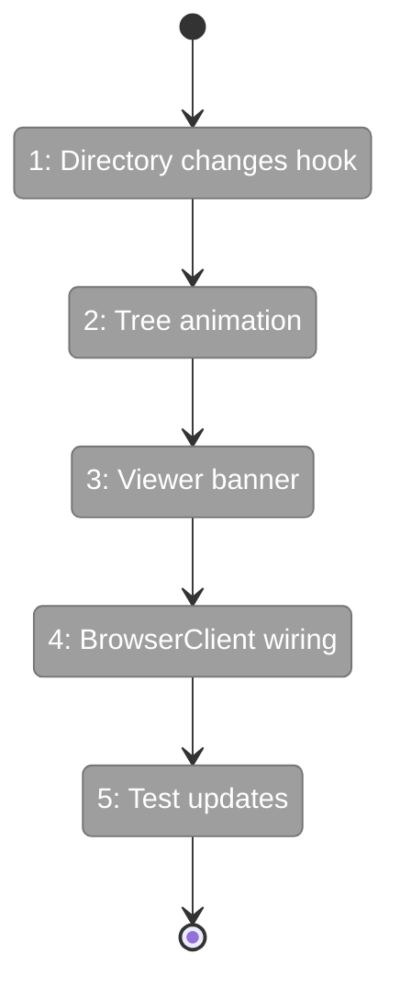
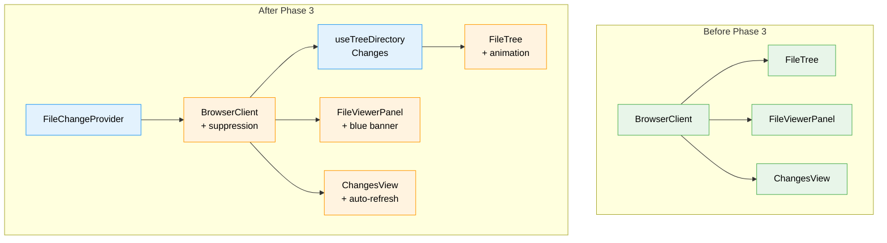

# Flight Plan: Phase 3 — UI Wiring

**Plan**: [live-file-events-plan.md](../../live-file-events-plan.md)
**Phase**: Phase 3: UI Wiring (3 of 3)
**Generated**: 2026-02-24
**Status**: Ready for takeoff

---

## Departure → Destination

**Where we are**: The server watches all worktree files and broadcasts changes via SSE (Phase 1). The browser has a `FileChangeHub` that dispatches events to subscribers via `useFileChanges('pattern')` (Phase 2). But no UI component consumes these events — the file browser is still fully manual-refresh.

**Where we're going**: The file browser reacts to filesystem changes in real-time. New files fade in with a green animation, deleted files vanish, modified files trigger banners or auto-refresh depending on mode. The changes sidebar auto-updates. A 2-second suppression window prevents false banners after the user saves. The entire experience feels alive without any scroll jumps or unexpected content replacement.

---

## Domain Context

### Domains We're Changing

| Domain | Relationship | Key Files | What Changes |
|--------|-------------|-----------|-------------|
| file-browser | modify | `hooks/use-tree-directory-changes.ts` | New multi-directory subscription hook |
| file-browser | modify | `components/file-tree.tsx` | Add newlyAddedPaths prop + CSS animation |
| file-browser | modify | `components/file-viewer-panel.tsx` | Add externallyChanged prop + blue banner |
| file-browser | modify | `browser-client.tsx` | Wrap with FileChangeProvider, wire all hooks |
| file-browser | modify | `components/changes-view.tsx` | Auto-refresh capability (via BrowserClient) |

### Domains We Depend On

| Domain | Contract | How We Use It |
|--------|----------|---------------|
| `_platform/events` | `FileChangeProvider` | Wrap BrowserClient for SSE connection |
| `_platform/events` | `useFileChanges(pattern, options)` | Subscribe to file change events |
| `_platform/events` | `FileChange` type | Event shape in callbacks |

---

## Flight Status

**Legend**: grey = pending | yellow = active | green = done

---

## Stages

- [ ] **Stage 1: useTreeDirectoryChanges hook** — Create multi-directory subscription hook that watches expanded dirs and returns changedDirs, newPaths, removedPaths. Unit test with FakeFileChangeHub.
- [ ] **Stage 2: FileTree animation** — Add `newlyAddedPaths` prop to FileTree with `tree-entry-new` CSS class and green fade-in animation (1.5s). Update file-tree.test.tsx.
- [ ] **Stage 3: FileViewerPanel banner** — Add `externallyChanged` prop with blue info banner in edit/diff modes. Preview mode: no banner (auto-refreshed in Stage 4). Update file-viewer-panel.test.tsx.
- [ ] **Stage 4: BrowserClient wiring** — Wrap with FileChangeProvider, wire useFileChanges for open file, useTreeDirectoryChanges for tree dirs, useFileChanges('*') for ChangesView refresh, preview auto-refresh useEffect, double-event suppression (2s window).
- [ ] **Stage 5: Test verification** — Ensure all existing tests pass with new props, add any remaining edge case tests.

---

## Acceptance Criteria

- [ ] AC-14: File created in expanded dir → entry appears at correct sorted position
- [ ] AC-15: File deleted from expanded dir → entry disappears, parent stays expanded
- [ ] AC-16: File modified in expanded dir → amber indicator
- [ ] AC-17: Tree updates preserve scroll position + expand state
- [ ] AC-17a: Manual refresh button remains as fallback
- [ ] AC-18: New files show green fade-in animation (~1.5s)
- [ ] AC-19: Edit mode: blue "modified outside editor" banner with Refresh
- [ ] AC-20: Edit mode: unsaved content NOT replaced
- [ ] AC-21: Preview mode: auto-refresh without banner
- [ ] AC-22: Diff mode: blue "diff may be outdated" banner with Refresh
- [ ] AC-23: Preview auto-refresh preserves scroll position
- [ ] AC-24: Editor save → no false banner for ~2s
- [ ] AC-25: External change after suppression window → banner shows
- [ ] AC-26: Navigate away → SSE connection closes
- [ ] AC-27: Close tab → server cleans up within 30s

---

## Goals & Non-Goals

**Goals**:
- Wire FileChangeProvider into BrowserClient
- useTreeDirectoryChanges for live tree updates
- Blue "externally changed" banner in edit/diff modes
- Preview auto-refresh without banner
- ChangesView auto-refresh on any file change
- Double-event suppression (2s window)
- Green fade-in animation for new tree entries
- Update existing component tests

**Non-Goals**:
- Server-side changes (Phase 1 complete)
- Event hub changes (Phase 2 complete)
- Reconnection "stale" indicator (future)
- Configurable debounce per component (defaults sufficient)

---

## Architecture: Before & After

**Legend**: existing (green) | changed (orange) | new (blue)

---

## Checklist

- [ ] T001: useTreeDirectoryChanges hook (CS-2)
- [ ] T002: FileTree newlyAddedPaths prop + animation (CS-2)
- [ ] T003: FileViewerPanel externallyChanged banner (CS-2)
- [ ] T004: Wire BrowserClient with FileChangeProvider (CS-2)
- [ ] T005: ChangesView auto-refresh (CS-1)
- [ ] T006: Double-event suppression (CS-2)
- [ ] T007: Update existing tests (CS-1)

---

## PlanPak

Active — hook in `features/041-file-browser/hooks/`, components in `features/041-file-browser/components/`, wiring in `browser-client.tsx`. Consumes from `features/045-live-file-events/`.
