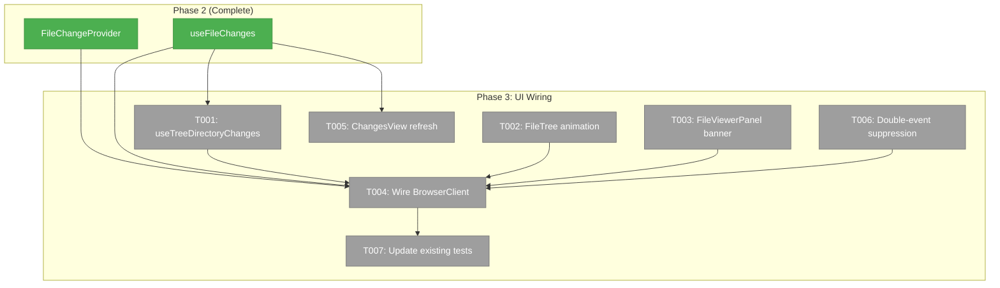
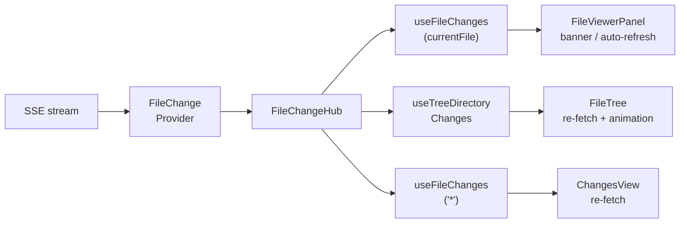
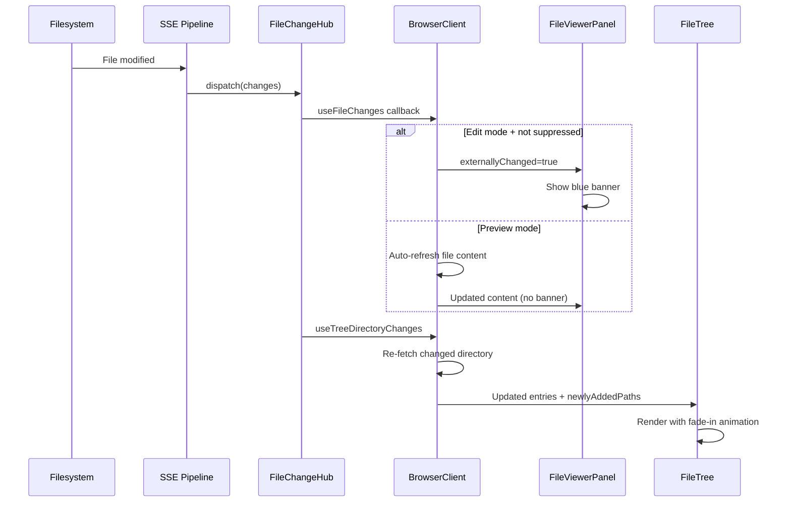

# Phase 3: UI Wiring — Tasks

**Plan**: [live-file-events-plan.md](../../live-file-events-plan.md)
**Spec**: [live-file-events-spec.md](../../live-file-events-spec.md)
**Phase**: 3 of 3
**Testing Approach**: Full TDD
**Date**: 2026-02-24

---

## Executive Briefing

### Purpose
This phase wires the event hub (Phase 2) into the file browser UI. The server watches files (Phase 1), the hub dispatches events (Phase 2) — now the UI reacts. After this phase, the file browser feels alive: trees update in-place, viewers show "externally changed" banners, previews auto-refresh, and the changes sidebar stays current.

### What We're Building
- A `useTreeDirectoryChanges` hook that subscribes to all expanded directories
- Green fade-in animation for new tree entries
- Blue "modified outside editor" banner in the file viewer (distinct from amber conflict)
- Preview mode auto-refresh (no banner, preserves scroll)
- Diff mode "may be outdated" banner
- ChangesView auto-refresh on any file change
- Double-event suppression (2s window after editor save)
- FileChangeProvider wrapping BrowserClient

### Goals
- ✅ FileTree shows new/deleted files in-place without full refresh
- ✅ FileViewerPanel shows blue banner when open file changes externally
- ✅ Preview mode auto-refreshes content without user action
- ✅ ChangesView re-fetches working changes when files change
- ✅ Double-event suppression prevents false banners after save
- ✅ All updates preserve scroll position and expand state

### Non-Goals
- ❌ Server-side changes (Phase 1 complete)
- ❌ Event hub changes (Phase 2 complete)
- ❌ Configurable ignore patterns per workspace (future)
- ❌ File content diffing in the event stream (ADR-0007: identifiers only)
- ❌ Reconnection "stale" indicator (future enhancement per DYK #4)

---

## Prior Phase Context

### Phase 1: Server-Side Event Pipeline (Complete ✅)
**Deliverables**: FileChangeWatcherAdapter (300ms debounce, dedup), FileChangeDomainEventAdapter, CentralWatcherService source watchers, WorkspaceDomain.FileChanges channel, bootstrap wiring.
**Available for Phase 3**: SSE events flow on `/api/events/file-changes` with `{ type: 'file-changed', changes: [{path, eventType, worktreePath, timestamp}] }`.
**Gotchas**: .chainglass paths filtered at adapter level. Server debounce is 300ms.

### Phase 2: Browser-Side Event Hub (Complete ✅)
**Deliverables**: FileChangeHub (4 pattern types), FileChangeProvider (SSE + worktreePath filtering), useFileChanges hook (debounce + modes), FakeFileChangeHub, barrel export.
**Available for Phase 3**:
- `FileChangeProvider` — wrap BrowserClient, pass `worktreePath`
- `useFileChanges(pattern, options)` — returns `{ changes, hasChanges, clearChanges }`
- `FakeFileChangeHub` — for testing components with file changes
- `FileChange` type: `{ path, eventType, timestamp }`
**Gotchas**: Provider filters by worktreePath (DYK #1). Replace mode drops intermediate batches (DYK #5). Client types include addDir/unlinkDir (DYK #2).
**Patterns**: Callback-set pattern, error isolation, contract test parity.

---

## Pre-Implementation Check

| File | Exists? | Domain Check | Notes |
|------|---------|-------------|-------|
| `apps/web/src/features/041-file-browser/hooks/use-tree-directory-changes.ts` | No (create) | file-browser ✅ | New hook |
| `apps/web/src/features/041-file-browser/components/file-tree.tsx` | Yes (modify) | file-browser ✅ | Add newlyAddedPaths prop + CSS animation |
| `apps/web/src/features/041-file-browser/components/file-viewer-panel.tsx` | Yes (modify) | file-browser ✅ | Add externallyChanged prop + blue banner |
| `apps/web/app/(dashboard)/workspaces/[slug]/browser/browser-client.tsx` | Yes (modify) | file-browser ✅ | Wrap with FileChangeProvider, wire hooks |
| `apps/web/src/features/041-file-browser/components/changes-view.tsx` | Yes (modify) | file-browser ✅ | Add onRefresh prop or internal hook |
| `test/unit/web/features/041-file-browser/file-tree.test.tsx` | Yes (modify) | test ✅ | Add newlyAddedPaths tests |
| `test/unit/web/features/041-file-browser/file-viewer-panel.test.tsx` | Yes (modify) | test ✅ | Add externallyChanged tests |
| `test/unit/web/features/045-live-file-events/use-tree-directory-changes.test.tsx` | No (create) | test ✅ | New hook tests |

No concept duplication. `useTreeDirectoryChanges` is distinct from `useFileChanges` — it manages dynamic multi-directory subscriptions as dirs expand/collapse.

---

## Architecture Map



### Task-to-Component Mapping

| Task | Component(s) | Files | Status | Comment |
|------|-------------|-------|--------|---------|
| T001 | useTreeDirectoryChanges | use-tree-directory-changes.ts + test | ⬜ Pending | Multi-directory subscription hook |
| T002 | FileTree | file-tree.tsx | ⬜ Pending | newlyAddedPaths prop + CSS animation |
| T003 | FileViewerPanel | file-viewer-panel.tsx | ⬜ Pending | externallyChanged prop + blue banner |
| T004 | BrowserClient | browser-client.tsx | ⬜ Pending | FileChangeProvider + all wiring |
| T005 | ChangesView | changes-view.tsx or browser-client.tsx | ⬜ Pending | Auto-refresh on file changes |
| T006 | BrowserClient | browser-client.tsx | ⬜ Pending | Double-event suppression (2s) |
| T007 | Tests | file-tree.test.tsx, file-viewer-panel.test.tsx | ⬜ Pending | New prop tests |

---

## Tasks

| Status | ID | Task | Domain | Path(s) | Done When | Notes |
|--------|-----|------|--------|---------|-----------|-------|
| [ ] | T001 | Create `useTreeDirectoryChanges` hook | file-browser | `/home/jak/substrate/041-file-browser/apps/web/src/features/041-file-browser/hooks/use-tree-directory-changes.ts`, `/home/jak/substrate/041-file-browser/test/unit/web/features/045-live-file-events/use-tree-directory-changes.test.tsx` | Single `useFileChanges('**')` subscription (NOT per-dir hook calls — DYK #1 Rules of Hooks). Filter changes client-side to expanded dirs. Returns `{ changes, changedDirs, clearAll }`. FileTree exposes `getExpandedDirs()` via `useImperativeHandle` ref (DYK #4). Test: file added in expanded dir → changedDirs includes dir. | DYK #1: Cannot call hooks in loops. DYK #4: expandPaths ≠ expanded dirs — use ref. |
| [ ] | T002 | Add `newlyAddedPaths` prop + fade-in animation to FileTree | file-browser | `/home/jak/substrate/041-file-browser/apps/web/src/features/041-file-browser/components/file-tree.tsx` | New optional prop `newlyAddedPaths?: Set<string>`. Entries whose path is in the set get a `tree-entry-new` CSS class. CSS animation: green bg → transparent over 1.5s. No fade-out for deletions (instant removal via re-render). Also: expose `getExpandedDirs()` via `useImperativeHandle`/`forwardRef` for DYK #4. | Per workshop 03. Also adds ref handle for T001/T004 (DYK #4). |
| [ ] | T003 | Add `externallyChanged` prop + blue info banner to FileViewerPanel | file-browser | `/home/jak/substrate/041-file-browser/apps/web/src/features/041-file-browser/components/file-viewer-panel.tsx` | New optional prop `externallyChanged?: boolean`. Banner shown only when file has unsaved edits (dirty state). Clean edit mode + preview mode: auto-refresh silently (DYK #3). Diff mode: banner says "Diff may be outdated". Blue bg (`bg-blue-50 dark:bg-blue-950`), distinct from amber conflict. Read file-viewer-panel.tsx fresh at implementation time (DYK #2: Plan 046 parallel changes). | DYK #3: Auto-refresh unless dirty. DYK #2: Read fresh, don't assume prior structure. |
| [ ] | T004 | Wire FileChangeProvider + subscriptions into BrowserClient | file-browser | `/home/jak/substrate/041-file-browser/apps/web/app/(dashboard)/workspaces/[slug]/browser/browser-client.tsx` | Wrap content with `<FileChangeProvider worktreePath={worktreePath}>`. Use `useFileChanges(currentFilePath)` for open file → auto-refresh if clean or preview, show banner only if dirty edits (DYK #3). Use ref to get expanded dirs from FileTree (DYK #4), pass to `useTreeDirectoryChanges`. Preview auto-refresh: call `readFile` again, preserve scroll position. Connect `clearChanges` after handling. | Core integration. DYK #3 simplifies banner logic. DYK #4 for expanded dirs. |
| [ ] | T005 | Wire ChangesView auto-refresh | file-browser | `/home/jak/substrate/041-file-browser/apps/web/app/(dashboard)/workspaces/[slug]/browser/browser-client.tsx` | Use `useFileChanges('*', { debounce: 500 })` in BrowserClient. When changes detected, re-fetch working changes via `fetchWorkingChanges(worktreePath)` and update `workingChanges` state. Debounce at 500ms to avoid thrashing during rapid changes. | Per spec. Wired in BrowserClient alongside T004. |
| [ ] | T006 | Implement double-event suppression | file-browser | `/home/jak/substrate/041-file-browser/apps/web/app/(dashboard)/workspaces/[slug]/browser/browser-client.tsx` | Track recently-saved paths in a `useRef<Set<string>>`. After successful save, add path to set. Clear path from set after 2s timeout. Before showing banner or suppressing auto-refresh, check if path is in suppression set. 2s window provides ~1.3s margin over watcher latency (DYK #5). | DYK #5: Don't shrink the 2s window — watcher latency is ~600-700ms. |
| [ ] | T007 | Update existing tests for new props | file-browser | `/home/jak/substrate/041-file-browser/test/unit/web/features/041-file-browser/file-tree.test.tsx`, `/home/jak/substrate/041-file-browser/test/unit/web/features/041-file-browser/file-viewer-panel.test.tsx` | FileTree test: render with `newlyAddedPaths` set → verify `tree-entry-new` class on matching entries. FileViewerPanel test: render with `externallyChanged=true` + dirty edits → verify blue banner text + Refresh button; clean edit mode → no banner (auto-refreshes); Refresh click calls onRefresh. | Per finding 05. DYK #3 changes banner test expectations. |

---

## Context Brief

### Key Findings from Plan

| # | Finding | Phase 3 Action |
|---|---------|---------------|
| 05 | FileViewerPanel has no `externallyChanged` prop | T003: Add prop + blue banner |
| 06 | BrowserClient has no SSE/FileChangeProvider | T004: Wrap with FileChangeProvider |

### Domain Dependencies

| Domain | Contract | Usage |
|--------|----------|-------|
| `_platform/events` | `FileChangeProvider` | Wraps BrowserClient for SSE connection |
| `_platform/events` | `useFileChanges(pattern, options)` | Subscribe to file changes in hooks |
| `_platform/events` | `FileChange` type | Change event shape in callbacks |
| `file-browser` | `fetchWorkingChanges` server action | Re-fetch git status for ChangesView |
| `file-browser` | `useFileNavigation.handleSave` | Track save paths for suppression |

### Domain Constraints

- All Phase 3 source changes are in `file-browser` domain (consumer of `_platform/events`)
- Import direction: file-browser → events ✅ (business → infrastructure)
- `useTreeDirectoryChanges` lives in file-browser hooks (consumer), not in 045-live-file-events (provider)
- No changes to Phase 1/2 files

### Reusable from Prior Phases

- `FakeFileChangeHub` — for testing `useTreeDirectoryChanges` in isolation
- `FakeEventSource` — for integration tests with FileChangeProvider
- `createFakeEventSourceFactory()` — pattern from Phase 2 hook tests
- Existing `file-tree.test.tsx` and `file-viewer-panel.test.tsx` — extend with new prop tests

### System Flow Diagram



### Sequence Diagram



### Test Plan

| Test | File | Type | What It Validates |
|------|------|------|-------------------|
| useTreeDirectoryChanges subscribe/unsubscribe | use-tree-directory-changes.test.tsx | Unit | Expand dir → subscribe; collapse → unsubscribe |
| useTreeDirectoryChanges change detection | Same | Unit | File added in expanded dir → changedDirs includes dir |
| FileTree newlyAddedPaths class | file-tree.test.tsx | Component | Matching entries get `tree-entry-new` class |
| FileViewerPanel blue banner in edit mode | file-viewer-panel.test.tsx | Component | `externallyChanged=true` renders banner + Refresh |
| FileViewerPanel no banner in preview mode | Same | Component | `externallyChanged=true` in preview → no banner |
| FileViewerPanel Refresh click | Same | Component | Click Refresh → calls onRefresh |

### Implementation Order

1. **T001**: useTreeDirectoryChanges hook + tests
2. **T002**: FileTree newlyAddedPaths prop + CSS animation
3. **T003**: FileViewerPanel externallyChanged prop + blue banner
4. **T007**: Update existing tests for new props
5. **T004**: Wire BrowserClient (FileChangeProvider + all subscriptions)
6. **T005**: ChangesView auto-refresh (wired in BrowserClient)
7. **T006**: Double-event suppression (wired in BrowserClient)

### Commands to Run

```bash
# Phase 3 specific tests
pnpm vitest run test/unit/web/features/045-live-file-events/use-tree-directory-changes.test.tsx
pnpm vitest run test/unit/web/features/041-file-browser/file-tree.test.tsx
pnpm vitest run test/unit/web/features/041-file-browser/file-viewer-panel.test.tsx

# Watch mode
just test-watch 041
just test-watch 045

# Full suite + lint before commit
just fft
```

### Risks & Unknowns

| Risk | Severity | Mitigation |
|------|----------|------------|
| Scroll position reset on tree re-render | Medium | React key stability (path-based keys already used) |
| Double-event suppression timing edge cases | Medium | 2s window is generous; test with fake timers |
| Preview auto-refresh race with content loading | Low | Guard with loading state; skip refresh if already loading |
| BrowserClient complexity growth | Medium | Keep new code in hooks; BrowserClient remains a thin wiring layer |

---

## DYK Insights (Pre-Implementation)

| # | Insight | Impact | Decision |
|---|---------|--------|----------|
| DYK-1 | Cannot call `useFileChanges` in a loop per expanded dir — violates React Rules of Hooks | T001 design broken as originally specified | Single `useFileChanges('**')` subscription, filter to expanded dirs client-side |
| DYK-2 | Plan 046 is modifying `file-viewer-panel.tsx` in parallel (minor scroll fixes) | T003 must read file fresh at implementation time | Read current state, don't assume prior audit structure |
| DYK-3 | Auto-refresh should happen unless user has dirty (unsaved) edits. Preview always refreshes, clean edit mode refreshes too | T003/T004 banner logic simpler than spec AC-19/AC-21 implied | Banner only when dirty edits exist; auto-refresh otherwise |
| DYK-4 | `expandPaths` state in BrowserClient ≠ expanded dirs. Expansion state is internal to FileTree | T001/T004 can't consume `expandPaths` for directory subscriptions | FileTree exposes `getExpandedDirs()` via `useImperativeHandle` ref |
| DYK-5 | 2s suppression window has ~1.3s margin over watcher latency (~600-700ms) | T006 timing is safe for localhost | Don't shrink the 2s window in future optimizations |

---

## Discoveries & Learnings

_Populated during implementation by plan-6._

| Date | Task | Type | Discovery | Resolution | References |
|------|------|------|-----------|------------|------------|
| | | | | | |

**Types**: `gotcha` | `research-needed` | `unexpected-behavior` | `workaround` | `decision` | `debt` | `insight`

---

## Evidence Artifacts

- **Execution Log**: `docs/plans/045-live-file-events/tasks/phase-3-ui-wiring/execution.log.md`
- **Flight Plan**: `docs/plans/045-live-file-events/tasks/phase-3-ui-wiring/tasks.fltplan.md`

---

## Directory Layout

```
docs/plans/045-live-file-events/
├── live-file-events-plan.md
├── live-file-events-spec.md
├── research.md
├── workshops/
│   ├── 01-browser-event-hub-design.md
│   ├── 02-worktree-wide-watcher-strategy.md
│   └── 03-in-place-tree-viewer-updates.md
├── reviews/
│   └── review.phase-1-server-side-event-pipeline.md
└── tasks/
    ├── phase-1-server-side-event-pipeline/ ✅ Complete
    ├── phase-2-browser-side-event-hub/    ✅ Complete
    └── phase-3-ui-wiring/
        ├── tasks.md                       ← this file
        ├── tasks.fltplan.md
        └── execution.log.md
```
