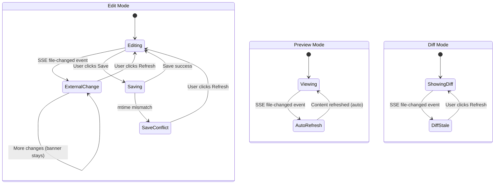

# Workshop 03: In-Place Tree & Viewer Updates

**Type**: Integration Pattern / UX Design
**Plan**: 041-file-browser
**Spec**: `file-browser-spec.md`
**Research**: `research.md`
**Created**: 2026-02-24
**Status**: Draft

**Related Documents**:
- `workshops/01-browser-event-hub-design.md` — Event hub providing `useFileChanges` hook
- `workshops/02-worktree-wide-watcher-strategy.md` — Server-side watcher producing events
- `workshops/file-viewer-integration.md` — Existing file viewer integration design

**Domain Context**:
- **Primary Domain**: `file-browser` — owns FileTree, FileViewerPanel, BrowserClient
- **Related Domains**: `_platform/events` — provides event hub infrastructure; `_platform/viewer` — FileViewer, MarkdownViewer, DiffViewer

---

## Purpose

Design how the file tree, file viewer, code editor, and markdown preview respond to live file change events — updating in-place without scroll jumps, full page refreshes, or layout shifts. Define the exact UI behaviors, state transitions, and visual feedback for each component.

## Key Questions Addressed

- How does FileTree add/remove entries without scroll position jumping?
- How does FileViewerPanel show "changed externally" without disrupting editing?
- How does preview mode auto-refresh without scroll jump?
- How does edit mode protect unsaved changes while notifying of external edits?
- What visual indicators show that something changed (animations, badges, banners)?
- How do diff views handle underlying file changes?

---

## Overview

Three components receive file change events from the browser event hub (Workshop 01). Each has different update semantics:

| Component | Event Scope | Update Behavior | User Impact |
|-----------|-------------|-----------------|-------------|
| **FileTree** | Expanded directories | Insert/remove entries in-place | Scroll preserved |
| **FileViewerPanel** (edit) | Open file | Show "changed externally" banner | No auto-refresh |
| **FileViewerPanel** (preview) | Open file | Auto-refresh content | Scroll preserved |
| **DiffViewer** | Open file | Show "changed externally" banner | No auto-refresh |
| **ChangesView** | All changes | Re-fetch working changes | List updates in-place |

## FileTree: In-Place Entry Updates

### Current Architecture

```typescript
// FileTree receives entries as props:
interface FileTreeProps {
  entries: FileEntry[];                         // Root-level entries
  childEntries?: Record<string, FileEntry[]>;   // Lazy-loaded subdirectories
  selectedFile?: string;
  changedFiles?: string[];
  onExpand: (dirPath: string) => void;          // Parent fetches children
  onRefresh: () => void;
  // ... other callbacks
}

// FileEntry shape:
interface FileEntry {
  name: string;
  type: 'file' | 'directory';
  path: string;
}
```

### Update Strategy: Incremental Entry Patching

When a file change event arrives for an expanded directory, the parent (`BrowserClient`) re-fetches that directory's entries and patches the `childEntries` state. The tree does NOT do a full re-render — only the affected directory's children update.

```typescript
// In BrowserClient — handling tree directory changes

const dirChanges = useTreeDirectoryChanges(expandedDirs);

useEffect(() => {
  for (const [dir, changes] of dirChanges) {
    if (changes.length > 0) {
      // Re-fetch only the changed directory, not the whole tree
      refreshDirectory(dir);
    }
  }
}, [dirChanges]);

async function refreshDirectory(dirPath: string) {
  const response = await fetch(
    `/api/workspaces/${slug}/files?worktree=${encodeURIComponent(worktreePath)}&dir=${encodeURIComponent(dirPath)}`
  );
  const data = await response.json();

  setChildEntries((prev) => ({
    ...prev,
    [dirPath]: data.entries,
  }));
}
```

**Why re-fetch instead of applying the event directly:**
- Events tell us WHAT changed, not the new state (notification-fetch pattern)
- Directory listing includes metadata we don't get from events (size, type)
- Re-fetching a single directory is fast (~5ms server-side)
- Sorting and deduplication happen server-side consistently

### Scroll Position Preservation

**Problem:** When React re-renders a list with changed items, the scroll position can jump if DOM elements above the viewport change height or are added/removed.

**Solution:** React key stability + minimal DOM mutation.

```typescript
// FileTree entry keys — stable across re-renders
function TreeItem({ entry }: { entry: FileEntry }) {
  // Key is the full path — stable as long as the file exists
  // React reconciles by key, so unchanged entries don't re-render
  return <div key={entry.path}>{/* ... */}</div>;
}
```

**Why this works:**
1. `entry.path` is a stable key — files don't change path unless renamed
2. React's reconciler diffs by key — unchanged entries keep their DOM nodes
3. Adding a file: React inserts a new DOM node at the correct position
4. Removing a file: React removes that specific DOM node
5. No existing DOM nodes move → scroll position stays put

**Edge case — file rename (unlink + add):**
- Two events: `unlink('old.txt')` + `add('new.txt')`
- After debounce, batch contains both events
- Re-fetch returns new directory listing without `old.txt` and with `new.txt`
- React removes old key, inserts new key
- Scroll position stable as long as renamed file isn't at viewport boundary

### Visual Feedback for Changes

```
Before change:
┌─────────────────────────┐
│ 📁 src/                 │
│   📁 components/        │
│     📄 Button.tsx       │
│     📄 Input.tsx        │
│   📄 App.tsx            │
└─────────────────────────┘

After new file added (src/components/Select.tsx):
┌─────────────────────────┐
│ 📁 src/                 │
│   📁 components/        │
│     📄 Button.tsx       │
│     📄 Input.tsx        │
│     📄 Select.tsx  ← 🟢 │  ← Briefly highlighted (fade-in)
│   📄 App.tsx            │
└─────────────────────────┘

After file deleted (src/components/Input.tsx):
┌─────────────────────────┐
│ 📁 src/                 │
│   📁 components/        │
│     📄 Button.tsx       │
│     📄 Select.tsx       │  ← Input.tsx gone, no gap
│   📄 App.tsx            │
└─────────────────────────┘
```

**Animation approach:** CSS `@keyframes` fade-in for new entries, no animation for removals (instant removal is less jarring than fade-out).

```css
/* New entry highlight animation */
@keyframes tree-entry-appear {
  from { background-color: hsl(var(--accent) / 0.2); }
  to { background-color: transparent; }
}

.tree-entry-new {
  animation: tree-entry-appear 1.5s ease-out;
}
```

**How to know which entries are "new":**
- Compare previous `childEntries[dir]` paths with new listing
- Entries in new but not in previous → animate with `tree-entry-new` class
- Track "new paths" in a ref, clear after animation completes (1.5s)

```typescript
// In BrowserClient — track new entries for animation
const previousEntries = useRef<Record<string, Set<string>>>({});

function refreshDirectory(dirPath: string) {
  // ... fetch new entries ...

  // Compute new paths for animation
  const prevPaths = previousEntries.current[dirPath] ?? new Set();
  const newPaths = new Set(data.entries.map((e: FileEntry) => e.path));
  const addedPaths = [...newPaths].filter((p) => !prevPaths.has(p));

  // Store for animation
  setNewlyAdded((prev) => new Set([...prev, ...addedPaths]));

  // Update previous for next diff
  previousEntries.current[dirPath] = newPaths;

  // Clear animation class after timeout
  setTimeout(() => {
    setNewlyAdded((prev) => {
      const next = new Set(prev);
      for (const p of addedPaths) next.delete(p);
      return next;
    });
  }, 1500);
}
```

### Changed File Indicator

Files that changed (not added or removed, but modified) get the existing amber dot treatment:

```
┌─────────────────────────┐
│   📄 Button.tsx    🟠   │  ← Modified externally (amber dot)
│   📄 Input.tsx          │
└─────────────────────────┘
```

This uses the existing `changedFiles` prop. When a `change` event arrives, add the file path to `changedFiles` state.

```typescript
// In BrowserClient
const { changes } = useFileChanges('*', { mode: 'accumulate' });

useEffect(() => {
  if (changes.length > 0) {
    const modifiedPaths = changes
      .filter((c) => c.eventType === 'change')
      .map((c) => c.path);
    setChangedFiles((prev) => [...new Set([...(prev ?? []), ...modifiedPaths])]);
  }
}, [changes]);
```

## FileViewerPanel: External Change Handling

### Edit Mode — Show Banner, Protect Content

When the user is editing a file and it changes externally, show a prominent info banner. Do NOT auto-refresh — the user may have unsaved changes.

```
┌──────────────────────────────────────────────────────────────┐
│  ℹ️  This file was modified outside the editor.  [Refresh]   │
│     Your unsaved changes will be preserved until you refresh. │
└──────────────────────────────────────────────────────────────┘
┌──────────────────────────────────────────────────────────────┐
│  1 │ import React from 'react';                              │
│  2 │ // user's unsaved edits here...                         │
│  3 │                                                         │
└──────────────────────────────────────────────────────────────┘
```

**Banner design:**
- **Color:** Blue/info (`bg-blue-50 dark:bg-blue-950 border-blue-200`) — distinct from save conflict (amber)
- **Position:** Top of FileViewerPanel, above mode toggle
- **Dismissible:** No — stays until user clicks Refresh or navigates away
- **Refresh action:** Re-reads file from server, replaces editor content, clears banner

**Distinction from existing conflict banner:**

| Scenario | Banner Color | Message | Trigger |
|----------|-------------|---------|---------|
| Save conflict (mtime mismatch on save) | Amber | "Save conflict" | User clicks Save, server detects mtime change |
| External change (SSE event) | Blue | "Modified outside editor" | File change event from watcher |

```typescript
// In BrowserClient — file viewer integration

const { hasChanges: fileChanged, clearChanges } = useFileChanges(
  currentFile ?? '', // Watch the currently open file
);

// Only show banner in edit mode — preview auto-refreshes
const showExternalChangeBanner = fileChanged && params.mode === 'edit';

<FileViewerPanel
  // ... existing props ...
  externallyChanged={showExternalChangeBanner}
  onRefreshFile={() => {
    handleRefreshFile();  // Existing: re-read from server
    clearChanges();       // Clear the event hub state
  }}
/>
```

### Preview Mode — Auto-Refresh Content

In preview mode, there are no unsaved changes to protect. Auto-refresh the content when the file changes.

```typescript
// In BrowserClient — auto-refresh preview

const { hasChanges, clearChanges } = useFileChanges(currentFile ?? '');

useEffect(() => {
  if (hasChanges && params.mode === 'preview') {
    handleRefreshFile();  // Re-read and re-render
    clearChanges();
  }
}, [hasChanges, params.mode]);
```

**Scroll position preservation in preview:**
- `FileViewer` (Shiki HTML) renders into a `<pre>` element
- Re-rendering the `<pre>` content doesn't change scroll position IF the DOM element is reused (same React key)
- `MarkdownViewer` renders into a `<div>` — same principle

**Risk: Content length change.**
- If the file grows significantly, the scroll position is preserved relative to the top
- This is acceptable — the user sees "something changed" and can scroll to find it
- No scroll restoration needed — natural browser behavior is correct

### Diff Mode — Show Banner, No Auto-Refresh

Diff view shows the difference between the working copy and HEAD. If the file changes, the diff is stale.

```
┌──────────────────────────────────────────────────────────────┐
│  ℹ️  This file was modified. Diff may be outdated.  [Refresh] │
└──────────────────────────────────────────────────────────────┘
┌──────────────────────────────────────────────────────────────┐
│  SPLIT VIEW                                                  │
│  - old line                          + new line              │
└──────────────────────────────────────────────────────────────┘
```

Refresh clears the diff cache and re-fetches:

```typescript
// In BrowserClient
if (hasChanges && params.mode === 'diff') {
  // Don't auto-refresh — diff computation is expensive
  // Show banner and let user click Refresh
}
```

## CodeEditor: Scroll Position During External Refresh

When the user clicks "Refresh" on the external change banner, the file content is re-read and the editor's content is replaced. CodeMirror 6 handles this gracefully:

```typescript
// CodeEditor receives new `value` prop
// @uiw/react-codemirror preserves cursor and scroll position
// when value changes externally (controlled component pattern)

<ReactCodeMirror
  value={content}          // Updated on refresh
  onChange={handleChange}   // User edits
  // ... extensions, theme
/>
```

**CodeMirror 6's controlled mode:**
- When `value` prop changes, CodeMirror applies a transaction
- The transaction preserves cursor position (or moves to nearest valid position)
- Scroll position is maintained unless the cursor was at a position that no longer exists
- This is the same behavior as VS Code's "file changed on disk" refresh

**If content is completely different (e.g., git checkout changed the file):**
- CodeMirror will show the new content
- Cursor moves to position 0 if old position is out of bounds
- Scroll resets to top — acceptable for a complete file replacement
- The user asked for this by clicking "Refresh"

## ChangesView: Live Working Changes

The ChangesView sidebar shows git working changes (modified, added, deleted files). When file changes occur, re-fetch the working changes list.

```typescript
// In ChangesView or BrowserClient
const { hasChanges, clearChanges } = useFileChanges('*', { debounce: 500 });

useEffect(() => {
  if (hasChanges) {
    refreshWorkingChanges();  // Re-run git status --porcelain
    clearChanges();
  }
}, [hasChanges]);
```

**Debounce: 500ms** — Working changes involves running `git status`, which is heavier than a directory listing. Higher debounce reduces unnecessary git invocations.

**In-place list updates:**
- ChangesView renders a flat list of files with status badges
- React keys are file paths — stable across re-renders
- Adding/removing entries doesn't cause scroll jump (same principle as FileTree)

## State Transition Diagram



## Integration Points Summary

### BrowserClient Changes

```typescript
// New state/hooks in BrowserClient

// 1. Wrap children in FileChangeProvider
<FileChangeProvider worktreePath={worktreePath}>
  {/* FileTree, FileViewerPanel, etc. */}
</FileChangeProvider>

// 2. Watch open file for external changes
const { hasChanges: fileChanged, clearChanges: clearFileChange } = useFileChanges(
  params.file ?? ''
);

// 3. Watch expanded directories for tree updates
const dirChanges = useTreeDirectoryChanges(expandedDirs);

// 4. Auto-refresh preview mode
useEffect(() => {
  if (fileChanged && params.mode === 'preview') {
    handleRefreshFile();
    clearFileChange();
  }
}, [fileChanged, params.mode]);

// 5. Update changed files list from events
const { changes: allChanges } = useFileChanges('*', { mode: 'accumulate', debounce: 500 });
useEffect(() => {
  if (allChanges.length > 0) {
    refreshChangedFiles();
  }
}, [allChanges]);
```

### FileViewerPanel Props Addition

```typescript
interface FileViewerPanelProps {
  // ... existing props ...

  /** True when file was modified externally (SSE event) */
  externallyChanged?: boolean;

  /** Called when user clicks Refresh on external change banner */
  onRefreshFile?: () => void;
}
```

### FileTree Props Addition

```typescript
interface FileTreeProps {
  // ... existing props ...

  /** Set of paths that were recently added (for animation) */
  newlyAddedPaths?: Set<string>;
}
```

## Open Questions

### Q1: Should we animate file removals?

**RESOLVED: No animation for removals.**
- Fade-out animation requires keeping the DOM node temporarily after removal
- This complicates React reconciliation and can cause stale click handlers
- Instant removal is less jarring than a lingering ghost element
- Consistent with VS Code, which removes entries instantly

### Q2: Should preview auto-refresh have a debounce?

**RESOLVED: Yes, 300ms via useFileChanges default.**
- Prevents rapid re-renders during bulk changes
- 300ms is perceptibly instant to humans
- If a file changes 10 times in 1 second, preview refreshes ~3 times (not 10)

### Q3: What if the user is scrolled to the bottom of a file and content is added at the top?

**RESOLVED: Accept natural browser behavior.**
- New content at top pushes existing content down
- User's scroll position (in pixels from top) is preserved
- The content they were looking at shifts down — this is correct and expected
- Same behavior as tailing a log file in a terminal

### Q4: Should we show a counter of pending changes?

**OPEN → DEFERRED: Not for v1.**
- "3 files changed" badge on the tree tab could be useful
- But adds UI complexity for marginal value
- The tree already shows amber dots per changed file
- Revisit after core functionality is working

### Q5: How does this interact with the "changed only" tree filter?

**RESOLVED: Changed-only filter re-evaluates when changedFiles updates.**
- `changedFiles` state already drives the filter
- When SSE events add paths to `changedFiles`, the filter automatically shows new changed files
- No special handling needed — existing filter logic works as-is

---

## Quick Reference

### Component Behaviors

| Component | Mode | On File Change | Visual Feedback | Auto-Refresh? |
|-----------|------|---------------|-----------------|---------------|
| FileTree | — | Re-fetch directory | Green fade-in (new), amber dot (modified) | Yes (directory re-fetch) |
| FileViewerPanel | Edit | Show blue banner | ℹ️ blue info banner | No (protects unsaved) |
| FileViewerPanel | Preview | Auto-refresh | Content updates in-place | Yes |
| FileViewerPanel | Diff | Show blue banner | ℹ️ "diff may be outdated" | No (expensive) |
| CodeEditor | Edit | Content preserved | Banner above editor | No |
| ChangesView | — | Re-fetch git status | List updates in-place | Yes (500ms debounce) |

### New Props/Hooks

| Component | New Prop/Hook | Type | Purpose |
|-----------|--------------|------|---------|
| BrowserClient | `useFileChanges(path)` | Hook | Watch open file |
| BrowserClient | `useTreeDirectoryChanges(dirs)` | Hook | Watch expanded dirs |
| FileViewerPanel | `externallyChanged` | boolean prop | Show blue banner |
| FileTree | `newlyAddedPaths` | Set\<string> prop | Animate new entries |

### Visual Language

| State | Color | Icon | Where |
|-------|-------|------|-------|
| New file (just appeared) | Green fade-in bg | — | Tree entry |
| Modified file | Amber dot | 🟠 | Tree entry |
| External change (edit mode) | Blue banner | ℹ️ | FileViewerPanel top |
| Save conflict | Amber banner | ⚠️ | FileViewerPanel top |
| Stale diff | Blue banner | ℹ️ | DiffViewer top |
