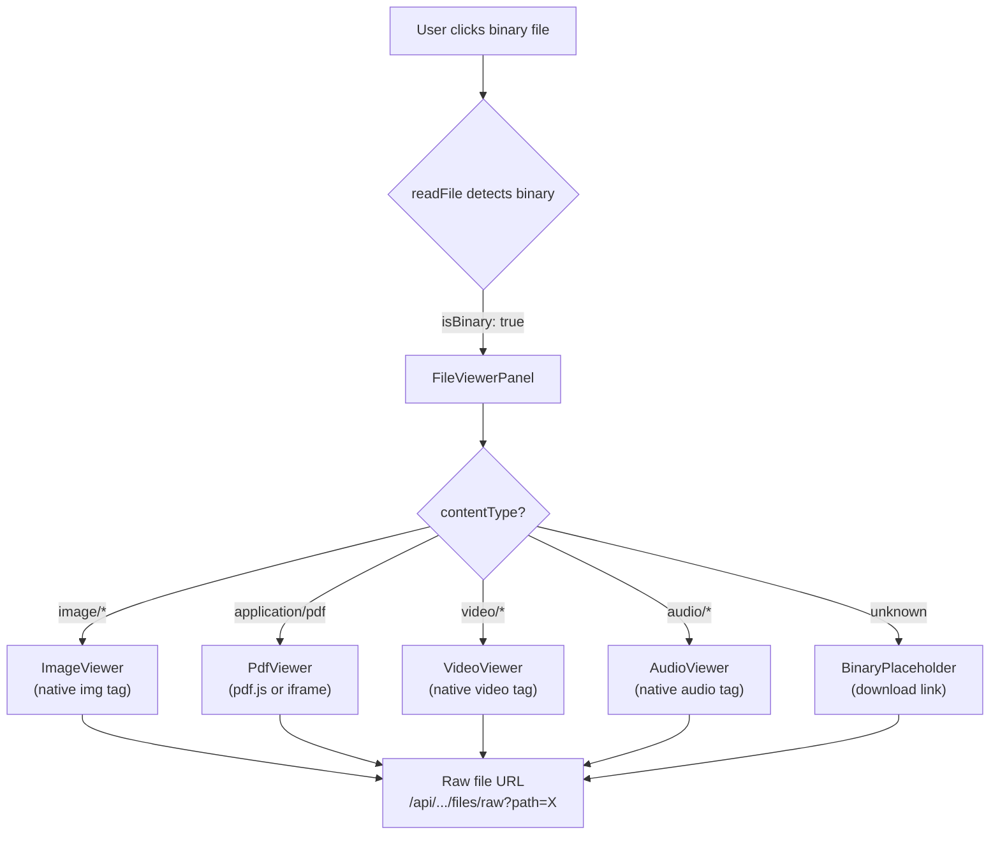

# Research Report: Binary File Viewers

**Generated**: 2026-02-24T10:36:00Z
**Research Query**: "We have no binary viewing. We need to add supported stuff — PDF, images, video. What else?"
**Mode**: Pre-Plan
**Location**: docs/plans/046-binary-file-viewers/research-dossier.md
**FlowSpace**: Available
**Findings**: 56 across 8 subagents

## Executive Summary

### What It Does (Currently)
The file browser detects binary files via null-byte scanning of the first 8KB and rejects them with a static "Binary files cannot be displayed" message. Uploads accept binary files (images, PDFs) via the paste-upload system (Plan 044) but there is no way to VIEW them after upload.

### Business Purpose
Users paste screenshots, upload PDFs, and work with image assets. Currently they must leave the browser to view these files. Adding inline binary viewers completes the file browser as a useful tool for the full range of files in a workspace.

### Key Insights
1. **The viewer domain (`_platform/viewer`) is the right home** for new binary viewer components — they're rendering primitives, not file-browser-specific
2. **A raw file serving API route is needed** — server actions return text; binary content needs streaming via `GET /api/workspaces/[slug]/files/raw`
3. **The existing `readFileAction` must evolve** — instead of returning `error: 'binary-file'`, return `{ ok: true, isBinary: true, contentType: 'image/png' }` so the viewer can decide rendering

### Quick Stats
- **Current binary handling**: Reject with error message
- **New components needed**: ~4 viewer components (Image, PDF, Video, Audio)
- **New API routes**: 1 raw file endpoint
- **NPM deps to add**: 1-2 (PDF viewer library, possibly nothing else — browser handles images/video natively)
- **Relevant domains**: `_platform/viewer` (new components), `file-browser` (raw endpoint, mode changes)

## How It Currently Works

### Binary Detection Flow
1. User clicks file in tree → `readFile(slug, worktree, path)` server action
2. Server checks `stat().size` > 5MB → return `{ error: 'file-too-large' }`
3. Server reads file as UTF-8 string
4. Scans first 8KB for null bytes → `{ error: 'binary-file' }`
5. FileViewerPanel receives `errorType: 'binary-file'` → shows static message

### Key Files
| File | Role | Binary Relevance |
|------|------|-----------------|
| `apps/web/src/features/041-file-browser/services/file-actions.ts:86-89` | Null-byte binary detection | Gates all binary content |
| `apps/web/src/features/041-file-browser/components/file-viewer-panel.tsx:80-87` | "Binary file" error display | Where new viewers would integrate |
| `apps/web/app/actions/file-actions.ts` | Server action wrapper | Needs binary-aware response |
| `apps/web/app/api/workspaces/[slug]/files/route.ts` | Directory listing only | Needs sibling raw file route |
| `apps/web/src/lib/language-detection.ts` | 70+ extension → language map | Needs content type detection companion |
| `packages/shared/src/interfaces/filesystem.interface.ts` | `readFile → Promise<string>` | Text-only; raw route reads Buffer directly |

## Architecture & Design

### Proposed Binary Viewing Architecture



### Content Type Categories

| Category | Extensions | Rendering Strategy | NPM Dependency |
|----------|-----------|-------------------|----------------|
| **Images** | png, jpg, jpeg, gif, webp, svg, ico, bmp, avif | Native `` tag with object-fit | None (browser native) |
| **PDF** | pdf | `<iframe>` with browser PDF viewer OR react-pdf (pdfjs) | None for iframe; `react-pdf` for embedded |
| **Video** | mp4, webm, mov, avi, mkv | Native `<video>` tag with controls | None (browser native) |
| **Audio** | mp3, wav, ogg, flac, aac, m4a | Native `<audio>` tag with controls | None (browser native) |
| **SVG** | svg | Inline render (sanitized) OR `` tag | None |
| **Fonts** | ttf, otf, woff, woff2 | Font preview with sample text | None (CSS @font-face) |
| **3D/CAD** | stl, obj | Future consideration | Out of scope |
| **Archives** | zip, tar, gz | Show file listing (future) | Out of scope |
| **Binary fallback** | exe, bin, dll, so, etc. | Download button + file metadata | None |

### Recommended Supported Types (Phase 1)

**Must have:**
1. **Images** — png, jpg, gif, webp, svg, ico, avif, bmp
2. **PDF** — pdf (via browser iframe — simplest, zero deps)
3. **Video** — mp4, webm
4. **Audio** — mp3, wav, ogg

**Nice to have (Phase 2):**
5. **Fonts** — preview with sample text
6. **SVG** — inline rendered (not just as image)

**Out of scope:**
- Archives (zip/tar) — requires server-side extraction
- 3D models — niche
- Office docs (docx, xlsx) — requires conversion engine

## Dependencies & Integration

### What Needs to Change

#### 1. New Raw File API Route (file-browser domain)
```
GET /api/workspaces/[slug]/files/raw?worktree=<path>&file=<relativePath>
```
- Returns raw binary content with proper `Content-Type` header
- Uses `IFileSystem.readFile()` at Node level (reads as Buffer)
- Security: same path validation as existing file actions (realpath, traversal check)
- Caching: `Cache-Control: private, max-age=0` (files change frequently)

#### 2. Content Type Detection Utility (viewer domain)
```typescript
// apps/web/src/lib/content-type-detection.ts
function detectContentType(filename: string): ContentTypeInfo {
  // Returns { category: 'image' | 'pdf' | 'video' | 'audio' | 'font' | 'binary', mimeType: string }
}
```

#### 3. Evolve readFileAction Response (file-browser domain)
Currently: `{ ok: false, error: 'binary-file' }`
Proposed: `{ ok: true, isBinary: true, contentType: 'image/png', size: 1234567 }`
- FileViewerPanel can then route to correct binary viewer
- Raw content fetched via URL, not server action (too large for JSON)

#### 4. New Viewer Components (viewer domain)
All lazy-loaded, following existing patterns:
- `ImageViewer` — `` with zoom/pan, fit-to-container
- `PdfViewer` — `<iframe src={rawUrl}>` (browser PDF viewer)
- `VideoViewer` — `<video>` with native controls
- `AudioViewer` — `<audio>` with native controls
- `BinaryPlaceholder` — download link + file metadata for unsupported types

#### NPM Dependencies
- **None required for Phase 1** — browser natively handles images, video, audio, and PDF (via iframe)
- Optional: `react-pdf` if embedded PDF viewing with page navigation is desired later

### What Does NOT Need to Change
- `IFileSystem` interface — already supports Buffer writes; raw route reads at Node level
- `FakeFileSystem` — already stores `string | Buffer`
- File tree — no changes needed (already shows all files)
- Upload system — already handles binary uploads
- Path security — reuse existing validation

## Prior Learnings (From Previous Implementations)

### PL-01: Shiki Must Stay Server-Side
**Source**: Plan 006 Phase 2
**Relevance**: Binary viewers must also be lazy-loaded client components, not server components. Follow the same `serverExternalPackages` pattern for any heavy rendering lib.

### PL-03: Binary Detection via Null-Byte
**Source**: Plan 041 Phase 4
**Action**: We're CHANGING this behavior — instead of rejecting binary, we detect and route to appropriate viewer.

### PL-09: Size Limits Are Tiered
**Source**: Plans 041, 044
**Action**: Binary files served via streaming API route, not server action. No 5MB limit applies — raw route can serve up to filesystem limits. Consider adding a reasonable viewer limit (e.g., 500MB for video).

### PL-12: Next.js serverActions Under Experimental
**Source**: Plan 044
**Action**: Raw file route is a regular API route, NOT a server action. No bodySizeLimit applies.

### PL-14: Buffer Handling Parity
**Source**: Plan 044
**Action**: Raw file route reads as Buffer and streams directly. No UTF-8 conversion.

## Domain Context

### Domain Impact Assessment

| Domain | Action | Changes |
|--------|--------|---------|
| `_platform/viewer` | **Extend** | Add ImageViewer, PdfViewer, VideoViewer, AudioViewer, BinaryPlaceholder components. Add `detectContentType()` utility. Expand barrel exports. |
| `file-browser` | **Modify** | Add raw file API route. Evolve readFileAction to return binary metadata instead of error. Update FileViewerPanel to route to binary viewers. |
| `_platform/file-ops` | No change | IFileSystem already handles binary via Node.js fs |
| `_platform/panel-layout` | No change | Panel infrastructure unchanged |

### Contract Expansions

**Viewer domain new contracts:**
| Contract | Type | Consumers |
|----------|------|-----------|
| `ImageViewer` | Component | file-browser FileViewerPanel |
| `PdfViewer` | Component | file-browser FileViewerPanel |
| `VideoViewer` | Component | file-browser FileViewerPanel |
| `AudioViewer` | Component | file-browser FileViewerPanel |
| `BinaryPlaceholder` | Component | file-browser FileViewerPanel |
| `detectContentType()` | Function | readFileAction, FileViewerPanel |
| `ContentTypeInfo` | Type | All binary-aware consumers |

## Critical Discoveries

### Discovery 01: No Raw File Endpoint Exists
**Impact**: Critical
Binary content cannot be served through server actions (too large, wrong format). A new streaming API route is the only viable approach.

### Discovery 02: Browser Handles Most Binary Types Natively
**Impact**: High (simplifies implementation)
Images (``), video (`<video>`), audio (`<audio>`), and PDF (`<iframe>`) all work with just a URL pointing to the raw file endpoint. Zero NPM dependencies for Phase 1.

### Discovery 03: readFileAction Must Return Binary Metadata, Not Error
**Impact**: High
The current `error: 'binary-file'` response provides no information about WHAT kind of binary. The viewer needs `contentType` to route to the correct component.

### Discovery 04: ViewerMode Type Needs Extension
**Impact**: Medium
Current `ViewerMode = 'edit' | 'preview' | 'diff'`. Binary files should show `'preview'` mode only (no edit, no diff). The mode buttons should be hidden/disabled for binary files.

## Recommendations

### Implementation Approach
1. **Start with the raw file API route** — everything depends on having a URL to point at
2. **Add `detectContentType()`** — simple extension-based lookup (like `detectLanguage()`)
3. **Evolve readFileAction** — return binary metadata instead of error
4. **Build viewer components** — one at a time, simplest first (Image → PDF → Video → Audio)
5. **Update FileViewerPanel** — add binary routing logic
6. **Test with real files** — use scratch/paste/ uploads as test fixtures

### Testing Strategy
- Unit test `detectContentType()` with extension mapping
- Unit test raw file API route (security, content-type header, streaming)
- Component tests for each viewer (render with mock URL)
- Integration: upload a PNG via paste-upload, navigate to it, verify it renders

## External Research Opportunities

### Research Opportunity 1: PDF Viewer Strategy

**Why Needed**: Browser iframe PDF rendering varies significantly across browsers and may not work in all contexts. Need to determine if `<iframe>` is sufficient or if `react-pdf` (pdfjs-dist) is needed.

**Ready-to-use prompt:**
```
/deepresearch "Best approach for rendering PDF files inline in a Next.js 16 React 19 application.
Compare: (1) browser iframe with raw URL, (2) react-pdf with pdfjs-dist, (3) pdf.js viewer.
Criteria: simplicity, bundle size, mobile support, dark mode, zoom/scroll.
Our stack: Next.js 16, React 19, Tailwind CSS v4, App Router, standalone output mode."
```

---

**Research Complete**: 2026-02-24T10:36:00Z
**Report Location**: docs/plans/046-binary-file-viewers/research-dossier.md
