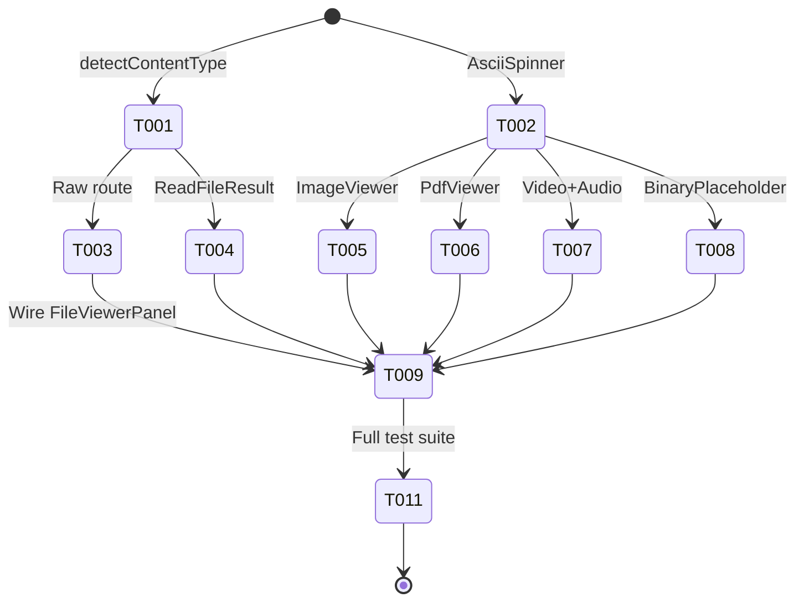
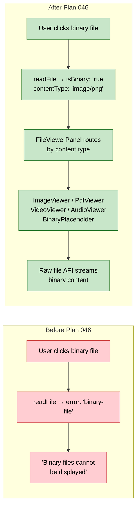

# Flight Plan: Phase 1 — Binary File Viewers

**Plan**: [binary-file-viewers-plan.md](../../binary-file-viewers-plan.md)
**Tasks**: [tasks.md](./tasks.md)
**Status**: Ready

---

## Departure → Destination

**Where we are**: Binary files in the file browser show "Binary files cannot be displayed." Users upload screenshots and PDFs via paste-upload but cannot view them. No raw file serving endpoint exists.

**Where we're going**: Selecting a binary file renders it inline — images as images, PDFs in browser viewer, video/audio with native controls, unknown binaries with download button. A streaming raw file API route serves binary content with Range support for video seeking. `readFileAction` returns binary metadata instead of an error. Everything deep-linkable.

**Concrete outcomes**:
- 1 new API route (`/api/workspaces/[slug]/files/raw`)
- 1 new utility (`detectContentType()`)
- 1 extracted component (`AsciiSpinner`)
- 5 new viewer components (ImageViewer, PdfViewer, VideoViewer, AudioViewer, BinaryPlaceholder)
- 1 evolved type (`ReadFileResult` with `isBinary` variant)
- 28 acceptance criteria satisfied

---

## Domain Context

### Domains We Change

| Domain | What Changes |
|--------|-------------|
| `_platform/viewer` | Add `detectContentType()` in `apps/web/src/lib/content-type-detection.ts` |
| `_platform/panel-layout` | Extract `AsciiSpinner` from ExplorerPanel, add to barrel |
| `file-browser` | Raw file route, ReadFileResult evolution, 5 viewer components, FileViewerPanel routing |

### Domains We Consume

| Domain | Contract | Usage |
|--------|----------|-------|
| `_platform/file-ops` | `IPathResolver.resolvePath()` | Path security in raw route |
| `_platform/file-ops` | `IFileSystem.stat()` | File size for Content-Length |
| `_platform/workspace-url` | Deep-link infrastructure | Binary file URLs |

---

## Flight Status

---

## Stages

- [ ] **T001**: Create `detectContentType()` utility + unit tests (extension → category + MIME)
- [ ] **T002**: Extract `AsciiSpinner` from ExplorerPanel into reusable component
- [ ] **T003**: Create raw file API route with streaming, Range support, Content-Disposition, security + tests
- [ ] **T004**: Evolve ReadFileResult type with `isBinary` variant + guard all consumers (4-file atomic change)
- [ ] **T005**: Create ImageViewer (`` + fit-to-container + loading spinner)
- [ ] **T006**: Create PdfViewer (`<iframe>` + loading spinner)
- [ ] **T007**: Create VideoViewer + AudioViewer (native controls)
- [ ] **T008**: Create BinaryPlaceholder (metadata + download button)
- [ ] **T009**: Wire FileViewerPanel binary routing + raw URL computation in BrowserClient
- [ ] **T011**: Run `just fft` — all tests pass, zero regressions

---

## Architecture: Before & After

---

## Acceptance Criteria

- [ ] AC-01→05: Raw endpoint security + correct Content-Type
- [ ] AC-06→10: `detectContentType()` for all categories
- [ ] AC-11→12: Binary metadata response, no text regression
- [ ] AC-13→15: Image viewing (9 formats)
- [ ] AC-16→17: PDF viewing
- [ ] AC-18→19: Video viewing
- [ ] AC-20→21: Audio viewing
- [ ] AC-22→23: Binary fallback with download
- [ ] AC-24→26: Viewer panel integration (Preview only, refresh, deep link)
- [ ] AC-27→28: Range request support

---

## Goals & Non-Goals

**Goals**: Inline binary viewing, streaming raw endpoint, browser-native rendering, zero NPM deps

**Non-Goals**: Binary editing, thumbnails, font preview, archives, office docs, component tests for thin wrappers

---

## Checklist

| ID | CS | Task |
|----|-----|------|
| T001 | 1 | detectContentType() + tests |
| T002 | 1 | AsciiSpinner extraction |
| T003 | 2 | Raw file route + Range + streaming + tests |
| T004 | 2 | ReadFileResult evolution + consumer guards |
| T005 | 1 | ImageViewer |
| T006 | 1 | PdfViewer |
| T007 | 1 | VideoViewer + AudioViewer |
| T008 | 1 | BinaryPlaceholder |
| T009 | 2 | FileViewerPanel wiring |
| T011 | 1 | Full test suite |
