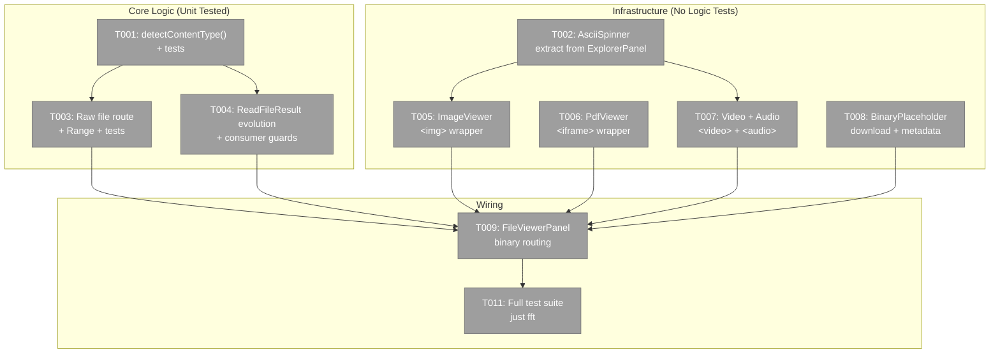
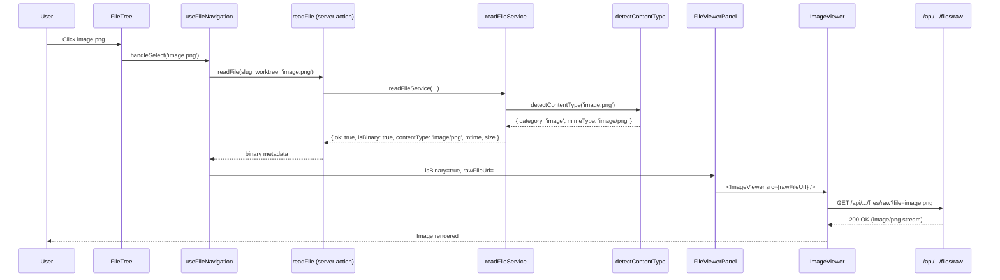
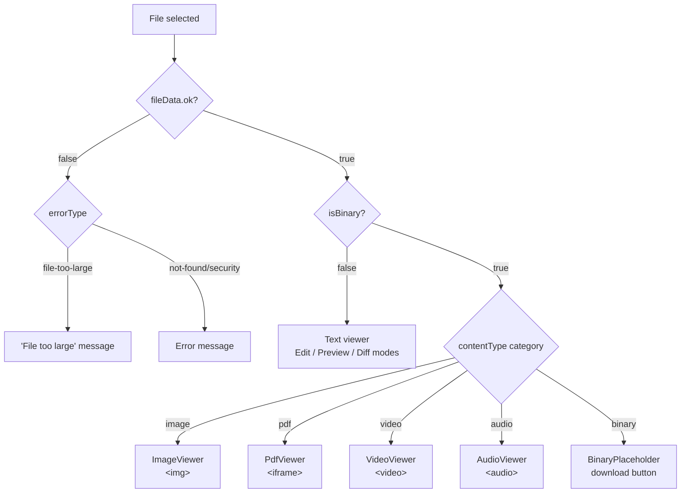

# Phase 1: Binary File Viewers — Task Dossier

**Plan**: [binary-file-viewers-plan.md](../../binary-file-viewers-plan.md)
**Phase**: Phase 1 (Simple mode — single phase)
**Created**: 2026-02-24

---

## Executive Briefing

**Purpose**: Enable inline viewing of images, PDFs, video, and audio in the file browser. Currently all binary files show "Binary files cannot be displayed." After this phase, selecting a PNG shows an image, a PDF renders in-browser, an MP4 plays, and unsupported binaries offer a download button.

**What We're Building**:
- A raw file streaming API route (`/api/workspaces/[slug]/files/raw`) with Range request support
- A `detectContentType()` utility mapping file extensions to MIME types and categories
- 5 thin viewer components (ImageViewer, PdfViewer, VideoViewer, AudioViewer, BinaryPlaceholder)
- An extracted reusable `AsciiSpinner` component
- Evolution of `readFileAction` from binary-error to binary-metadata response
- FileViewerPanel routing to the correct binary viewer

**Goals**:
- ✅ Images render inline (png, jpg, gif, webp, svg, ico, avif, bmp)
- ✅ PDFs render in embedded browser viewer
- ✅ Video/audio play with native controls
- ✅ Unsupported binaries show download button
- ✅ Deep-linkable binary file preview
- ✅ Raw endpoint with Range support for video seeking
- ✅ Same path security as existing file actions

**Non-Goals**:
- ❌ Binary file editing (no image editor, PDF annotator, video trimmer)
- ❌ Thumbnail generation in file tree
- ❌ Component tests for thin viewer wrappers
- ❌ IFileSystem interface changes

---

## Pre-Implementation Check

| File | Exists? | Domain Check | Notes |
|------|---------|-------------|-------|
| `apps/web/src/lib/content-type-detection.ts` | No (create) | viewer ✅ | Companion to `language-detection.ts` in same dir |
| `apps/web/src/features/_platform/panel-layout/components/ascii-spinner.tsx` | No (create) | panel-layout ✅ | Extract from explorer-panel.tsx |
| `apps/web/app/api/workspaces/[slug]/files/raw/route.ts` | No (create) | file-browser ✅ | Sibling to existing `files/route.ts` |
| `apps/web/src/features/041-file-browser/services/file-actions.ts` | Yes (modify) | file-browser ✅ | Lines 22-32: ReadFileResult type. Lines 86-89: binary detection |
| `apps/web/app/actions/file-actions.ts` | Yes (modify) | file-browser ✅ | Pass-through server action wrapper |
| `apps/web/src/features/041-file-browser/hooks/use-file-navigation.ts` | Yes (modify) | file-browser ✅ | All `.content` access already guarded by `.ok` |
| `apps/web/app/(dashboard)/workspaces/[slug]/browser/browser-client.tsx` | Yes (modify) | file-browser ✅ | Line 268: errorType cast to remove 'binary-file' |
| `apps/web/src/features/041-file-browser/components/file-viewer-panel.tsx` | Yes (modify) | file-browser ✅ | Lines 80-87: replace `errorType === 'binary-file'` with viewer routing |
| `apps/web/src/features/_platform/panel-layout/components/explorer-panel.tsx` | Yes (modify) | panel-layout ✅ | Lines 28-29, 36, 51-58, 132-135: spinner to extract |
| `apps/web/src/features/041-file-browser/components/image-viewer.tsx` | No (create) | file-browser ✅ | |
| `apps/web/src/features/041-file-browser/components/pdf-viewer.tsx` | No (create) | file-browser ✅ | |
| `apps/web/src/features/041-file-browser/components/video-viewer.tsx` | No (create) | file-browser ✅ | |
| `apps/web/src/features/041-file-browser/components/audio-viewer.tsx` | No (create) | file-browser ✅ | |
| `apps/web/src/features/041-file-browser/components/binary-placeholder.tsx` | No (create) | file-browser ✅ | |
| `test/unit/web/lib/content-type-detection.test.ts` | No (create) | viewer ✅ | |
| `test/unit/web/features/041-file-browser/raw-file-route.test.ts` | No (create) | file-browser ✅ | |
| `test/unit/web/features/041-file-browser/file-actions.test.ts` | Yes (modify) | file-browser ✅ | Lines 64-78: binary test to update |
| `apps/web/src/features/_platform/panel-layout/index.ts` | Yes (modify) | panel-layout ✅ | Add AsciiSpinner to barrel |

**Concept Duplication Check**: No existing `detectContentType`, MIME detection, or binary viewer found. Upload service has partial `MIME_TO_EXT` map in `upload-file.ts` — `detectContentType()` replaces this concern.

---

## Architecture Map



---

## Tasks

| Status | ID | Task | Domain | Path(s) | Done When | Notes |
|--------|-----|------|--------|---------|-----------|-------|
| [ ] | T001 | Create `detectContentType()` utility + tests | viewer | `apps/web/src/lib/content-type-detection.ts`, `test/unit/web/lib/content-type-detection.test.ts` | Maps extensions → `{ category, mimeType }`. Image: png/jpg/jpeg/gif/webp/svg/ico/avif/bmp. PDF: pdf. Video: mp4/webm. Audio: mp3/wav/ogg. Binary fallback for unknown. AC-06→AC-10 pass. | Per finding 04. Model after `language-detection.ts`. Export `ContentTypeInfo` type. |
| [ ] | T002 | Extract `AsciiSpinner` reusable component | panel-layout | `apps/web/src/features/_platform/panel-layout/components/ascii-spinner.tsx`, `apps/web/src/features/_platform/panel-layout/components/explorer-panel.tsx`, `apps/web/src/features/_platform/panel-layout/index.ts` | Component renders spinning `\| / — \\` at 80ms interval. Props: `{ active: boolean, className?: string }`. ExplorerPanel refactored to use it (lines 28-29, 36, 51-58, 132-135). Barrel export added. No behavior change. | DYK-05. Reused by binary viewers for loading state. |
| [ ] | T003 | Create raw file API route with Range + streaming + tests | file-browser | `apps/web/app/api/workspaces/[slug]/files/raw/route.ts`, `test/unit/web/features/041-file-browser/raw-file-route.test.ts` | GET streams binary with correct Content-Type (from `detectContentType`). `Content-Disposition: inline` default; `?download=true` → `attachment; filename="X"`. Range → 206 + `Content-Range`. Traversal → 403. Symlink → 403. Missing params → 400. Not found → 404. Bad range → 416. AC-01→05, AC-27→28 pass. | DYK-01: `fs.createReadStream({ start, end })` — never buffer full file. DYK-03: Content-Disposition for PDF iframe. Uses `IPathResolver.resolvePath()` for security. Model security after existing `files/route.ts`. |
| [ ] | T004 | Evolve ReadFileResult + guard all consumers | file-browser | `apps/web/src/features/041-file-browser/services/file-actions.ts`, `apps/web/app/actions/file-actions.ts`, `apps/web/src/features/041-file-browser/hooks/use-file-navigation.ts`, `apps/web/app/(dashboard)/workspaces/[slug]/browser/browser-client.tsx`, `test/unit/web/features/041-file-browser/file-actions.test.ts` | ReadFileResult gets 3rd variant: `{ ok: true, isBinary: true, contentType: string, mtime: string, size: number }`. Detection: extension-first via `detectContentType()`, null-byte fallback. Browser-client line 268: remove 'binary-file' from error cast, add binary metadata props. use-file-navigation: `.content` access already guarded by `.ok` — add `&& !result.isBinary` where `setEditContent` is called (line 86). Test: update binary test from `error: 'binary-file'` to `isBinary: true`. AC-11, AC-12. | DYK-04: 4-file atomic change. Key insight from pre-impl: all `.content` access in hook + browser-client already has `.ok` guards via ternary — but `setEditContent(result.content)` at hook line 86 needs explicit `!isBinary` check. |
| [ ] | T005 | Create ImageViewer component | file-browser | `apps/web/src/features/041-file-browser/components/image-viewer.tsx` | `` with `object-fit: contain`, `max-width: 100%`, `max-height: 100%`, centered in flex container. Loading state via AsciiSpinner + `onLoad`. SVG rendered via `` only (finding 05 — no inline SVG). AC-13→15. | Thin wrapper. No component test (constitution deviation documented). |
| [ ] | T006 | Create PdfViewer component | file-browser | `apps/web/src/features/041-file-browser/components/pdf-viewer.tsx` | `<iframe src={src} className="w-full h-full">` with loading spinner. Browser PDF viewer handles scroll/zoom. AC-16, AC-17. | Zero deps. iframe approach. |
| [ ] | T007 | Create VideoViewer + AudioViewer | file-browser | `apps/web/src/features/041-file-browser/components/video-viewer.tsx`, `apps/web/src/features/041-file-browser/components/audio-viewer.tsx` | Video: `<video src={src} controls>` centered, `max-width: 100%`. Audio: `<audio src={src} controls>` centered with filename label. Both with loading state. AC-18→21. | Browser-native controls. |
| [ ] | T008 | Create BinaryPlaceholder | file-browser | `apps/web/src/features/041-file-browser/components/binary-placeholder.tsx` | File icon + formatted size (KB/MB/GB) + MIME type + download `<a href={src}?download=true download={filename}>` button. AC-22, AC-23. | Download triggers via raw route `?download=true` → `Content-Disposition: attachment`. |
| [ ] | T009 | Update FileViewerPanel for binary routing | file-browser | `apps/web/src/features/041-file-browser/components/file-viewer-panel.tsx`, `apps/web/app/(dashboard)/workspaces/[slug]/browser/browser-client.tsx` | Replace `errorType === 'binary-file'` branch (lines 80-87) with binary viewer routing based on content type category. Add new props: `isBinary?: boolean`, `binaryContentType?: string`, `binarySize?: number`, `rawFileUrl?: string`. Hide Edit/Diff buttons when `isBinary`. Refresh works (key change on rawFileUrl). Compute `rawFileUrl` in BrowserClient from slug + worktree + file path. AC-24→26. | Last wiring task. Binary viewers lazy-loaded in Suspense boundary. |
| [ ] | T010 | ~~Merged into T004~~ | — | — | — | DYK-04 |
| [ ] | T011 | Run full test suite | — | — | `just fft` passes. Zero regressions. All 28 ACs verified. | Final gate. |

### Recommended Implementation Order

```
T001 → T002 → T003 → T004 → T005/T006/T007/T008 (parallel) → T009 → T011
```

T001 (detectContentType) is a dependency for T003 (raw route Content-Type) and T004 (binary detection by extension). T002 (AsciiSpinner) is needed by viewer components T005-T008. T003+T004 are independent of each other but both feed into T009 (wiring). T009 is the final assembly task.

---

## Context Brief

### Key Findings from Plan

| # | Finding | Action |
|---|---------|--------|
| 01 | ReadFileResult consumers assume `.content` exists when `ok: true` | Pre-impl revealed: all accesses already guarded by `.ok` ternaries EXCEPT `setEditContent(result.content)` in hook line 86. One guard needed. |
| 02 | `IFileSystem.readFile()` returns string only | Raw route uses Node `fs.createReadStream()` directly. |
| 03 | No built-in Range handling in Next.js | Parse `Range` header manually. Single-range only. |
| 04 | Upload service has partial MIME map | `detectContentType()` replaces as canonical source. |
| 05 | SVG XSS risk if rendered inline | `` tag only — never `dangerouslySetInnerHTML`. |
| 06 | Binary detection reads full content wastefully | Extension-first via `detectContentType()`, null-byte fallback. |

### Domain Dependencies (Contracts Consumed)

| Domain | Contract | What We Use It For |
|--------|----------|-------------------|
| `_platform/file-ops` | `IPathResolver.resolvePath()` | Security validation in raw file route |
| `_platform/file-ops` | `IFileSystem.stat()` | File size for Content-Length + Range validation |
| `_platform/workspace-url` | `workspaceHref()` | Deep-link URL construction (existing) |
| `_platform/panel-layout` | `PanelShell`, `ExplorerPanel`, `LeftPanel`, `MainPanel` | Page layout (existing, unchanged) |

### Domain Constraints

- Binary viewer components live in `file-browser` domain (`features/041-file-browser/components/`) — NOT in `_platform/viewer`. They're too thin for shared infra.
- `detectContentType()` lives in `apps/web/src/lib/` (viewer domain utility, like `language-detection.ts`)
- Raw route bypasses `IFileSystem` for binary reads — uses Node `fs` directly with `IPathResolver` for security. Documented constitution deviation.
- Import `detectContentType` from `@/lib/content-type-detection` (not from a domain barrel)

### Reusable from Prior Plans

| What | Where | Used For |
|------|-------|----------|
| `language-detection.ts` | `apps/web/src/lib/` | Pattern for `detectContentType()` — same extension-map approach |
| `files/route.ts` | `apps/web/app/api/workspaces/[slug]/files/` | Security validation pattern for raw route |
| `FakeFileSystem` + `FakePathResolver` | `packages/shared/src/fakes/` | Route test fakes |
| ExplorerPanel spinner | `panel-layout/components/explorer-panel.tsx` | ASCII spinner frames + interval to extract |

### Data Flow: Binary File Selection



### System States: FileViewerPanel Routing



---

## Discoveries & Learnings

_Populated during implementation by plan-6._

| Date | Task | Type | Discovery | Resolution | References |
|------|------|------|-----------|------------|------------|

---

## Directory Layout

```
docs/plans/046-binary-file-viewers/
  ├── binary-file-viewers-spec.md
  ├── binary-file-viewers-plan.md
  ├── research-dossier.md
  └── tasks/phase-1-binary-file-viewers/
      ├── tasks.md                    ← this file
      ├── tasks.fltplan.md            ← generated next
      └── execution.log.md            ← created by plan-6
```
