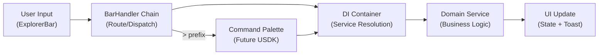
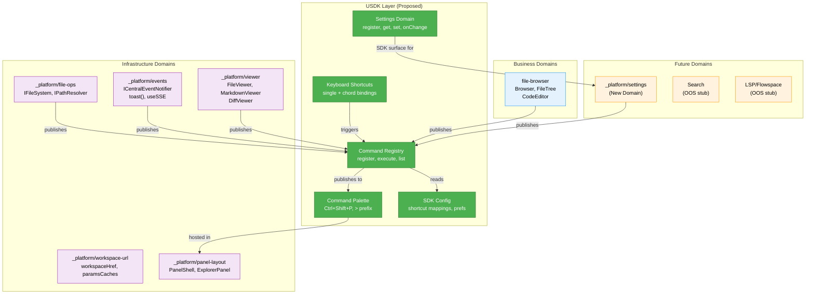
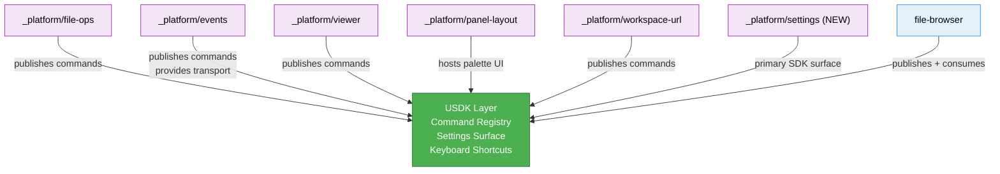

# Research Report: USDK — Internal SDK System for Chainglass

**Generated**: 2026-02-24T20:49:08.807Z
**Research Query**: "SDK FOR US — turn the 'SDK For US' concept into a first-class consideration called USDK"
**Mode**: Pre-Plan
**Location**: docs/plans/047-usdk/research-dossier.md
**FlowSpace**: Available
**Findings**: 71 total (IA:10, DC:10, PS:10, QT:10, IC:10, DE:10, PL:15, DB:8)

---

## Executive Summary

### What It Does
The USDK (Us SDK) is a proposed internal SDK layer for Chainglass — analogous to VS Code's extension API — where domains self-publish commands, settings, and UI actions to a standardized surface. It provides a command palette (Ctrl+Shift+P), keyboard shortcuts, domain-scoped settings, and cross-domain feature consumption through a homogeneous, discoverable interface.

### Business Purpose
The USDK exists to **enforce domain boundaries while enabling cross-domain interoperability**. Today, domains consume each other via DI injection or direct imports. USDK adds a published, discoverable layer that standardizes how features are exposed, configured, and invoked — dogfooding the SDK pattern internally before (potentially) exposing it to external consumers.

### Key Insights
1. **The foundation exists in scattered form** — event registries (032), DI containers, handler patterns, and domain contracts are all present but not unified into a coherent SDK surface.
2. **The explorer bar is the natural command palette** — the existing ExplorerPanel with its BarHandler chain is architecturally positioned to become a VS Code-style command palette with `>` prefix for commands.
3. **A settings domain is the ideal first SDK dogfood** — settings need their own domain, and building it as an SDK surface validates the entire publish/consume pattern before scaling to other domains.

### Quick Stats
- **Existing Domains**: 6 (5 infrastructure + 1 business)
- **Candidate SDK Commands**: 8+ identified (file.open, file.goToLine, toast.show, worktree.setIcon, etc.)
- **Existing Interfaces**: 10+ published contracts ready for SDK wrapping
- **Test Infrastructure**: Enterprise-grade (45+ contract tests, fakes-only policy, 50% coverage threshold)
- **Prior Learnings**: 15 relevant discoveries from previous implementations
- **Architecture**: Interface-first DI with module registration pattern (ADR-0004, ADR-0009)

---

## How It Currently Works

### There Is No SDK Today

Currently, cross-domain consumption happens through three mechanisms:

| Mechanism | Example | Pros | Cons |
|-----------|---------|------|------|
| **DI Container** | file-browser resolves IFileSystem | Type-safe, testable, decoupled | No discoverability, no UI surface |
| **Direct Import** | `import { toast } from 'sonner'` | Simple | Bypasses domain contracts, hidden coupling |
| **Domain Contracts** | file-browser → _platform/viewer | Documented boundaries | Manual documentation, no runtime registry |

### Entry Points for SDK-Like Behavior

| Entry Point | Type | Location | Purpose |
|------------|------|----------|---------|
| ExplorerPanel | UI Component | `apps/web/src/features/041-file-browser/components/explorer-panel.tsx` | Top bar with input field — natural command palette host |
| BarHandler chain | Pattern | `apps/web/src/features/041-file-browser/components/bar-handlers/` | Composable input processing — extensible for `>` prefix |
| DI Container | Infrastructure | `apps/web/src/lib/di-container.ts` | Service resolution — could register SDK commands |
| NodeEventRegistry | Pattern | `packages/positional-graph/src/features/032-node-event-system/` | Runtime registry with Zod validation — blueprint for command registry |
| toast() | Function | `apps/web/src/components/ui/toaster.tsx` (sonner) | Global feedback — first SDK action candidate |
| workspaceHref() | Function | `apps/web/src/lib/workspace-url.ts` | URL-driven navigation — "go to file" command foundation |

### Core Execution Flow (File Navigation as SDK Command Exemplar)

1. **User types path in explorer bar** → ExplorerPanel input fires onChange
2. **BarHandler chain processes input** → FilePathHandler validates path, checks existence
3. **Navigation triggered** → `useFileNavigation.handleSelect(path)` → URL state updated via nuqs
4. **File loaded** → Server action `readFile()` resolves IFileSystem from DI container
5. **Content displayed** → FileViewer/MarkdownViewer/DiffViewer selected by detectContentType()

This flow demonstrates how an SDK command (`file.open`) would work: user trigger → command handler → service resolution → action execution → UI feedback.

### Data Flow


### State Management
- **URL State**: nuqs params (`dir`, `file`, `mode`, `panel`) — bookmarkable, shareable
- **React Context**: WorkspaceContext provides workspace identity (emoji, color, slug)
- **DI Singletons**: AgentManagerService, SSEManager — global in-memory state
- **File Storage**: `~/.config/chainglass/workspaces.json` — persistent preferences
- **Per-Worktree**: `<worktree>/.chainglass/data/<domain>/` — domain-scoped data

---

## Architecture & Design

### Component Map



### Design Patterns Identified

#### 1. Registry Pattern (from NodeEventRegistry — IA-01, PS-03)
```typescript
// Existing pattern in packages/positional-graph
registry.register({ type: 'node:accepted', schema: z.object({...}), domain: 'orchestration' });
registry.on('node:accepted', handler, { context: 'both', name: 'handleAccepted' });

// USDK equivalent
sdk.commands.register({
  id: 'file.open',
  title: 'Go to File',
  domain: 'file-browser',
  params: z.object({ path: z.string() }),
  handler: async (params) => { /* ... */ },
  shortcut: { key: 'ctrl+p' },
});
```

#### 2. Module Registration (from ADR-0009 — DC-10, DE-02)
```typescript
// Existing: packages self-register their services
registerWorkgraphServices(container);

// USDK: domains self-register their SDK contributions
registerFileBrowserSDK(sdk);  // Adds file.open, file.goToLine, etc.
registerEventsSDK(sdk);       // Adds toast.show, toast.error, etc.
registerSettingsSDK(sdk);     // Adds settings.open, settings.get, etc.
```

#### 3. DI + Interface-First (from ADR-0004 — PS-01, PS-02, DE-01)
```typescript
// All SDK services are interface-defined
interface ICommandRegistry {
  register(command: SDKCommand): void;
  execute(id: string, params?: unknown): Promise<void>;
  list(filter?: { domain?: string }): SDKCommand[];
  getShortcuts(): Map<string, string>;
}

// Production + Fake implementations
class CommandRegistry implements ICommandRegistry { /* ... */ }
class FakeCommandRegistry implements ICommandRegistry { /* ... */ }
```

#### 4. Handler Context Filtering (from event-handler-registry — PS-08)
```typescript
// Commands can specify where they're available
sdk.commands.register({
  id: 'worktree.setIcon',
  context: 'web',          // web-only (needs UI)
  // vs 'cli' | 'both'
});
```

### System Boundaries
- **Internal**: SDK layer sits between domains and the UI/CLI presentation layer
- **External**: Not a plugin system — internal domains only (explicitly stated in requirements)
- **Integration**: ExplorerPanel becomes the command palette host; keyboard shortcuts are global

---

## Dependencies & Integration

### What USDK Depends On

#### Internal Dependencies
| Dependency | Type | Purpose | Risk if Changed |
|------------|------|---------|-----------------|
| DI Container (tsyringe) | Required | Service resolution, token-based lookup | Low — abstracted behind interfaces |
| ExplorerPanel / BarHandler | Required | Command palette UI host | Medium — tightly coupled to panel-layout |
| Events domain (toast, SSE) | Required | Feedback and real-time updates | Low — already interface-contracted |
| nuqs (URL state) | Optional | Deep-linking for settings/commands | Low — thin wrapper |
| Zod | Required | Command parameter validation | Low — well-established |

#### External Dependencies
| Service/Library | Version | Purpose | Criticality |
|-----------------|---------|---------|-------------|
| sonner | Current | Toast notifications | Medium — already in use |
| nuqs | Current | URL param management | Low — optional integration |
| tsyringe | Current | DI container | High — foundational |

### What Will Depend on USDK

#### Direct Consumers
- **file-browser**: Publishes file.open, file.goToLine commands; consumes settings
- **_platform/events**: Publishes toast.show, toast.error commands
- **_platform/settings (new)**: The primary SDK surface for settings registration
- **Future domains**: workgraph-ui, agent-ui (already informal consumers of events)

---

## Quality & Testing

### Current Test Coverage
- **Contract Tests**: 45+ across all domains — ensures fake/real parity (QT-03)
- **DI Container Tests**: Production + test container verification (QT-02)
- **Event System Tests**: Central notifier, SSE broadcast, file change hub — comprehensive (QT-04)
- **File Browser Tests**: 22 test files covering path handler, explorer panel, context (QT-05)
- **Integration Tests**: 30+ cross-domain flows tested with real services (QT-06)

### Test Strategy for USDK
- **Fake-First**: Create `FakeCommandRegistry`, `FakeSettingsStore` (per PL-14)
- **Contract Tests**: Verify fake/real parity for all SDK interfaces
- **No Mocks**: Follow codebase convention of fake objects only (QT-08)
- **Fixture Pattern**: Extend `serviceTest` fixture for SDK services (QT-07)

### Known Issues & Technical Debt
| Issue | Severity | Location | Impact |
|-------|----------|----------|---------|
| toast() imported directly from sonner | Medium | Various client components | Bypasses domain contract (DB-05) |
| No keyboard shortcut system exists | High | N/A | Must be built from scratch |
| Settings are workspace-scoped only | Medium | workspaces.json registry | No user-global settings yet |
| ExplorerBar is file-browser specific | Medium | ExplorerPanel component | Needs generalization for command palette |
| Phase 5 subtask 001 still in progress | Low | 041/phase-5 | Worktree prefs may shift settings shape |

---

## Modification Considerations

### Safe to Modify
1. **ExplorerPanel input handling**: Well-tested, BarHandler chain designed for extension
2. **DI Container registration**: Module registration pattern (ADR-0009) makes adding new services safe
3. **Navigation utils**: Data-driven NavItem arrays are easy to extend
4. **Feature flags**: Simple boolean toggles for progressive USDK rollout

### Modify with Caution
1. **Workspace preferences schema**: Phase 5 subtask 001 is still modifying this — coordinate changes
   - Risk: Schema conflicts between worktree prefs and SDK settings
   - Mitigation: Wait for subtask completion, then integrate
2. **SSE channel routing**: Domain names = channel names (DC-03) — adding new SDK domains affects SSE routing
   - Risk: Channel name collision or routing errors
   - Mitigation: Use `sdk/` prefix for SDK-specific events
3. **Panel-layout PanelMode type**: Hardcoded union — extending for command palette needs careful type management

### Danger Zones
1. **DI token constants**: `SHARED_DI_TOKENS`, `WORKSPACE_DI_TOKENS` are the single source of truth — changes ripple everywhere
2. **SSEManager globalThis singleton**: Shared mutable state across all server components and API routes
3. **Package barrel exports**: Client/server split must be maintained (PL-01, PL-06) — SDK exports need careful subpath design

### Extension Points
1. **BarHandler chain**: Designed for composable input processing — add `CommandPaletteHandler` for `>` prefix
2. **Module registration functions**: Each package exports `registerXxxServices()` — SDK follows same pattern
3. **Domain event system**: `ICentralEventNotifier.emit(domain, type, data)` — SDK events use this transport
4. **Navigation config arrays**: Data-driven sidebar items — SDK can contribute navigation entries

---

## Prior Learnings (From Previous Implementations)

### Prior Learning PL-01: Package Barrel Splits Require Subpath Exports
**Source**: Plan 041, Phase 5
**Type**: gotcha
**What They Found**: Client components cannot import from shared `@chainglass/workflow` barrel — pulls in server-side code (fast-glob → fs).
**Resolution**: Subpath exports: `"@chainglass/workflow/constants/workspace-palettes"`
**Action for USDK**: SDK package MUST split client/server exports. Use `@chainglass/usdk/client` and `@chainglass/usdk/server` subpaths.

### Prior Learning PL-02: Event-Sourced Storage Before Broadcast
**Source**: Plan 015, Phase 1
**Type**: decision
**What They Found**: Events must persist BEFORE SSE broadcast. Storage is truth, not the broadcast.
**Action for USDK**: SDK settings changes must persist before firing onChange events.

### Prior Learning PL-03: Three-Layer Type Sync Must Be Atomic
**Source**: Plan 015, Phase 1
**Type**: gotcha
**What They Found**: Zod schema → TypeScript types → Storage schema must update together.
**Action for USDK**: Command parameter schemas (Zod) derive TypeScript types via `z.infer<>`. Single source of truth.

### Prior Learning PL-04: Path Traversal Validation at Every Entry Point
**Source**: Plans 015, 018
**Type**: security
**Action for USDK**: All SDK command parameters involving file paths must validate against traversal attacks.

### Prior Learning PL-07: Toast is Client-Only, Silent No-Op on Server
**Source**: Plan 042
**Type**: gotcha
**Action for USDK**: SDK toast commands must document client-only constraint. Provide server-side logging fallback.

### Prior Learning PL-08: SSE as Notification Signal, Not Data Source
**Source**: Plan 015, Phase 3
**Type**: decision
**Action for USDK**: Settings change events should be lightweight signals, not carry full settings payloads. Consumers refetch.

### Prior Learnings Summary

| ID | Type | Source Plan | Key Insight | Action |
|----|------|-------------|-------------|--------|
| PL-01 | gotcha | 041/P5 | Client barrel imports pull server code | Split SDK client/server exports |
| PL-02 | decision | 015/P1 | Persist before broadcast | Settings persist before onChange |
| PL-03 | gotcha | 015/P1 | Zod → TS → storage must sync | Zod-first for command params |
| PL-04 | security | 015, 018 | Path traversal at every entry | Validate all file path params |
| PL-06 | architecture | 041/P5 | Can't import server barrel in client | Subpath exports mandatory |
| PL-07 | gotcha | 042 | toast() is client-only | Document constraint, add server fallback |
| PL-08 | decision | 015/P3 | SSE = signal, not data | Lightweight settings change events |
| PL-11 | gotcha | 006/P2 | Register handlers before trigger | Subscribe before execute pattern |
| PL-13 | design | 018/P1 | All data workspace-scoped | SDK settings workspace-scoped via ADR-0008 |
| PL-14 | testing | 015/P1 | Dual-layer: fake first, contract parity | FakeCommandRegistry + contract tests |

---

## Domain Context

### Existing Domains Relevant to This Research

| Domain | Relationship | Relevant Contracts | SDK Role |
|--------|-------------|-------------------|----------|
| _platform/file-ops | Directly relevant | IFileSystem, IPathResolver | Publishes: file.read, file.write, file.exists |
| _platform/workspace-url | Directly relevant | workspaceHref(), paramsCaches | Publishes: navigation.goto, navigation.deepLink |
| _platform/viewer | Directly relevant | FileViewer, detectContentType | Publishes: viewer.open, viewer.detectLanguage |
| _platform/events | Directly relevant | toast(), ICentralEventNotifier, useSSE | Publishes: toast.show, toast.error; provides SDK event transport |
| _platform/panel-layout | Directly relevant | PanelShell, ExplorerPanel | Hosts command palette UI |
| file-browser | Primary consumer | Browser page, FileTree | Publishes: file.open, file.goToLine; consumes all SDK services |

### Domain Map Position

The USDK sits as a **horizontal layer across all domains**:



### Potential Domain Actions
- **Extract new domain**: `_platform/settings` — centralize user preferences (DB-03)
- **Create SDK package**: `packages/usdk/` — separate package for SDK exports (DB-04)
- **Formalize consumers**: `workgraph-ui` and `agent-ui` should be in domain registry (DB-08)
- **Fix boundary violation**: toast() should route through events domain, not direct sonner import (DB-05)

---

## Critical Discoveries

### Critical Finding 01: Explorer Bar is Ready-Made Command Palette Host
**Impact**: Critical
**Source**: IA-05, DE-09, DB-06
**What**: The ExplorerPanel with its BarHandler chain is architecturally designed for composable input processing. Adding a `>` prefix handler for commands requires minimal changes to existing code.
**Why It Matters**: No need to build a command palette UI from scratch — extend what exists.
**Required Action**: Design `CommandPaletteHandler` as a new BarHandler that intercepts `>` prefix input and dispatches to command registry.

### Critical Finding 02: NodeEventRegistry is the Command Registry Blueprint
**Impact**: Critical
**Source**: IA-01, IA-07, PS-03
**What**: The 032-node-event-system already implements a domain-scoped registry with Zod validation, handler registration, context filtering, and runtime dispatch. This is 80% of what the USDK command registry needs.
**Why It Matters**: Don't reinvent — adapt the existing pattern.
**Required Action**: Study NodeEventRegistry and EventHandlerRegistry interfaces. Design USDK command registry as an evolution of this pattern.

### Critical Finding 03: Settings Domain is Missing and Needed
**Impact**: Critical
**Source**: DB-03, DE-07, user requirements
**What**: No domain currently owns user preferences/settings. Workspace preferences are in the global registry (workspaces.json), but there's no settings UI, no domain-scoped settings registration, and no change event system for settings.
**Why It Matters**: Settings is the ideal first SDK dogfood — it validates the publish/consume pattern while delivering user value.
**Required Action**: Design `_platform/settings` domain with SDK-first architecture: domains register settings schemas, settings domain provides the UI and persistence.

### Critical Finding 04: Phase 5 Subtask 001 May Conflict
**Impact**: High
**Source**: User input, plan 041/phase-5/subtask-001
**What**: The worktree identity subtask is still in progress and modifies workspace preferences schema (adding `worktreePreferences` to `WorkspacePreferences`). The settings workshop also discusses this storage mechanism.
**Why It Matters**: USDK settings will need to integrate with the same preferences system. Starting too early risks schema conflicts.
**Required Action**: Coordinate with subtask 001 completion. Use the final preferences shape as input to settings domain design.

### Critical Finding 05: Client/Server Export Split is Non-Negotiable
**Impact**: High
**Source**: PL-01, PL-06, DB-04
**What**: Importing server-side code in client components causes bundle bloat and build failures. Multiple prior learnings document this gotcha.
**Why It Matters**: SDK package must have clean client/server boundaries from day one.
**Required Action**: Design SDK with subpath exports: `@chainglass/usdk/client` (hooks, components, types) and `@chainglass/usdk/server` (services, adapters, actions).

---

## SDK Command Candidates

Based on requirements and codebase analysis:

| Command ID | Domain | Params | Description |
|------------|--------|--------|-------------|
| `file.open` | file-browser | `{ path: string }` | Navigate to file in browser |
| `file.goToLine` | file-browser | `{ path: string, line: number }` | Open file at specific line (path#L92 syntax) |
| `toast.show` | _platform/events | `{ message: string, type: 'success'\|'error'\|'info' }` | Show toast notification |
| `log.write` | _platform/events | `{ message: string, level: 'info'\|'warn'\|'error' }` | Write to server log |
| `worktree.setIcon` | _platform/settings | `{ emoji: string }` | Set worktree emoji |
| `worktree.setColor` | _platform/settings | `{ color: string }` | Set worktree accent color |
| `worktree.setAlert` | _platform/settings | `{ status: 'none'\|'warning'\|'error' }` | Set menu bar alert status |
| `settings.open` | _platform/settings | `{ domain?: string }` | Open settings page, optionally to domain |

### Command Palette Modes (Explorer Bar)

| Prefix | Mode | Status |
|--------|------|--------|
| `>` | Show commands (type to filter) | **In scope** |
| (none) | Search files/content | OOS — implement stub |
| `#` | LSP/Flowspace symbol search | OOS — implement stub |

---

## Recommendations

### If Building USDK
1. **Start with command registry interface** — define `ICommandRegistry` and `SDKCommand` types first (interface-first per ADR-0004)
2. **Settings domain as first consumer** — validates the publish/consume pattern with real user value
3. **Explorer bar generalization** — extend BarHandler chain for `>` prefix before building standalone palette
4. **Wait for phase 5 subtask 001** — preferences schema must stabilize before settings domain design

### If Extending the Pattern
1. **Follow module registration** — each domain exports `registerXxxSDK(sdk)` (per ADR-0009)
2. **Zod-first parameters** — all command params validated at registration time (per PL-03)
3. **Fake-first testing** — `FakeCommandRegistry` before real implementation (per PL-14)

### If Refactoring Existing Code
1. **Route toast() through events domain** — fix boundary violation (DB-05)
2. **Formalize workgraph-ui and agent-ui** — add to domain registry (DB-08)
3. **Split SDK client/server exports** — subpath exports mandatory (PL-01)

---

## External Research Opportunities

### Research Opportunity 1: VS Code Extension API Architecture

**Why Needed**: The USDK is explicitly modeled after VS Code's SDK. Understanding VS Code's command palette implementation, extension contribution points, and keybinding resolution would inform USDK design.
**Impact on Plan**: Directly affects command registry interface design, keyboard shortcut chord handling, and settings schema structure.
**Source Findings**: IA-01, IA-07, PS-03

**Ready-to-use prompt:**
```
/deepresearch "VS Code Extension API Architecture for Internal SDK Design

PROBLEM: We're building an internal SDK (USDK) for a web-based IDE-like application (Next.js/React). We want to model it after VS Code's extension API patterns — specifically:

TECHNOLOGY STACK:
- Next.js 16 with React 19 Server Components
- TypeScript 5.7+ strict mode
- tsyringe for DI (no decorators, RSC-compatible)
- Zod for runtime validation
- sonner for toast notifications

SPECIFIC QUESTIONS:
1. How does VS Code's command palette resolve and execute commands? What's the registration → dispatch flow?
2. How does VS Code handle keyboard shortcut chords (e.g., Ctrl+K Ctrl+C)? What's the keybinding resolution algorithm?
3. How does VS Code's settings system work? How do extensions contribute settings schemas, and how are settings organized by category?
4. What is VS Code's 'contribution points' model? How do extensions declare what they contribute (commands, settings, views, menus)?
5. How does VS Code's when-clause context system work for enabling/disabling commands?

INTEGRATION CONSIDERATIONS:
- We're NOT building a plugin system — this is internal domains publishing to a central registry
- Our domains are like VS Code extensions but compiled into the application
- We use React Server Components, so client/server boundary is critical
- We need Zod validation for command parameters (not JSON Schema like VS Code)
- Our DI uses factory functions, not decorators"
```

**Results location**: Save results to `docs/plans/047-usdk/external-research/vscode-extension-api.md`

### Research Opportunity 2: Keyboard Shortcut Chord Handling in React

**Why Needed**: USDK requires keyboard shortcuts including chord sequences. React's synthetic event system may complicate chord detection.
**Impact on Plan**: Affects keyboard shortcut implementation approach.
**Source Findings**: IA-01 (no existing shortcut system found)

**Ready-to-use prompt:**
```
/deepresearch "Keyboard Shortcut Chord Handling in React Web Applications

PROBLEM: We need to implement VS Code-style keyboard shortcuts in a Next.js 16 / React 19 web application, including:
- Single shortcuts (Ctrl+P, Ctrl+Shift+P)
- Chord sequences (Ctrl+K followed by Ctrl+C)
- Configurable user-defined shortcuts
- Conflict detection between shortcuts

SPECIFIC QUESTIONS:
1. What libraries exist for React keyboard shortcut management? (react-hotkeys-hook, mousetrap, tinykeys, etc.)
2. How do chord sequences work in web browsers? What's the state machine for detecting Ctrl+K followed by Ctrl+C?
3. How should shortcuts be stored and configured? What's the best schema for shortcut definitions?
4. How to handle shortcut conflicts between browser defaults, OS defaults, and application shortcuts?
5. How to support 'when' clauses — shortcuts only active in certain contexts (e.g., only when editor is focused)?
6. Performance considerations for global keydown listeners in React 19?

CONSTRAINTS:
- Must work with React Server Components (no useEffect in RSC)
- Must be configurable via JSON/settings file
- Must support both single shortcuts and chord sequences
- Must handle focus management (different shortcuts in different panels)"
```

**Results location**: Save results to `docs/plans/047-usdk/external-research/keyboard-shortcuts-react.md`

---

## Appendix: File Inventory

### Core Files (Existing, Relevant to USDK)

| File | Purpose | Lines |
|------|---------|-------|
| `apps/web/src/lib/di-container.ts` | DI container — service registration | 681 |
| `apps/web/src/features/041-file-browser/components/explorer-panel.tsx` | Explorer bar — future command palette | ~150 |
| `packages/positional-graph/src/features/032-node-event-system/node-event-registry.ts` | Event registry — blueprint for command registry | ~100 |
| `packages/positional-graph/src/features/032-node-event-system/event-handler-registry.ts` | Handler registry — blueprint for command handlers | ~80 |
| `packages/shared/src/di-tokens.ts` | DI token constants | ~50 |
| `apps/web/src/components/ui/toaster.tsx` | Toast system | ~30 |
| `apps/web/src/lib/workspace-url.ts` | URL builder | 44 |
| `apps/web/src/lib/navigation-utils.ts` | Navigation config | 115 |
| `apps/web/src/lib/feature-flags.ts` | Feature flags | 35 |
| `docs/domains/registry.md` | Domain registry | ~40 |
| `docs/domains/domain-map.md` | Domain topology | ~80 |

### Relevant ADRs

| ADR | Topic | Relevance |
|-----|-------|-----------|
| ADR-0001 | MCP Tool Design Patterns | Command naming and schema conventions |
| ADR-0002 | Exemplar-Driven Development | USDK needs exemplar domains |
| ADR-0004 | DI Container Architecture | Interface-first pattern for SDK services |
| ADR-0007 | SSE Single-Channel Routing | Event transport for SDK notifications |
| ADR-0008 | Workspace-Scoped Data | Settings storage must follow this ADR |
| ADR-0009 | Module Registration Pattern | Domain self-registration into SDK |
| ADR-0010 | Central Event Notification | SDK event broadcasting |

### Relevant Workshops

| Workshop | Topic | Relevance |
|----------|-------|-----------|
| file-path-utility-bar.md | Explorer bar design | Command palette host |
| workspace-preferences-data-model.md | Preferences storage | Settings domain foundation |
| ux-vision-workspace-experience.md | UX principles | SDK UX consistency |
| left-panel-view-modes.md | Panel mode switching | Command palette integration point |

---

## Next Steps

**External Research Suggested:**
1. VS Code Extension API Architecture — run `/deepresearch` prompt above
2. Keyboard Shortcut Chord Handling in React — run `/deepresearch` prompt above

Save results to: `docs/plans/047-usdk/external-research/`

- **Next step (with research)**: Run `/deepresearch` prompts, then `/plan-1b-specify "USDK internal SDK system"`
- **Next step (skip research)**: Run `/plan-1b-specify "USDK internal SDK system"` directly
- **Note**: Wait for Plan 041 Phase 5 Subtask 001 to complete before implementing settings domain

---

**Research Complete**: 2026-02-24T20:49:08.807Z
**Report Location**: docs/plans/047-usdk/research-dossier.md
