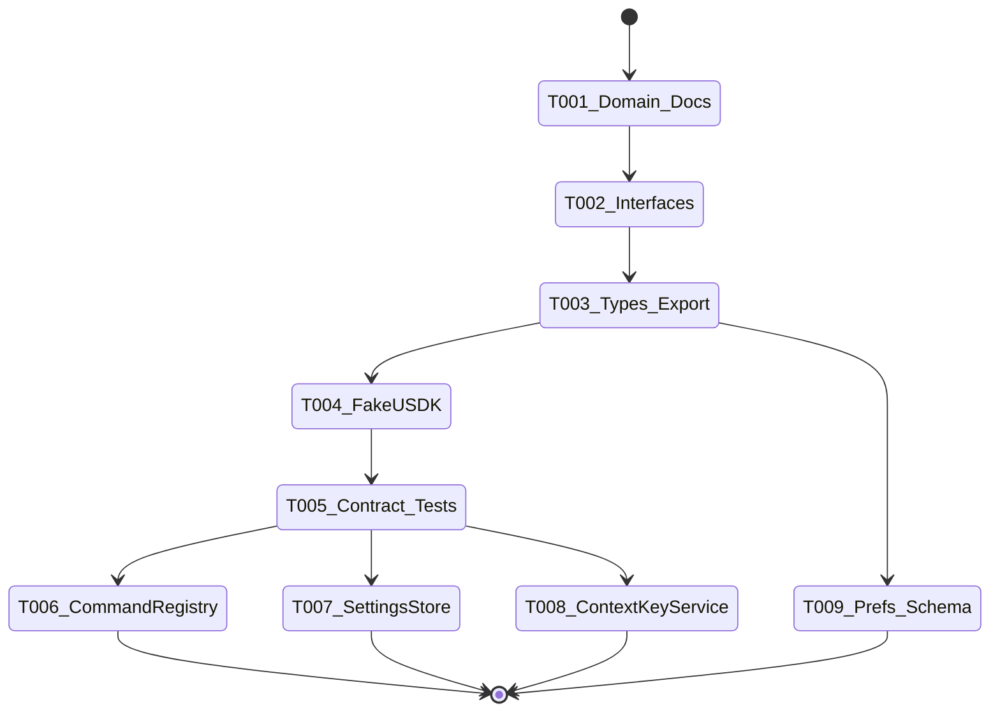
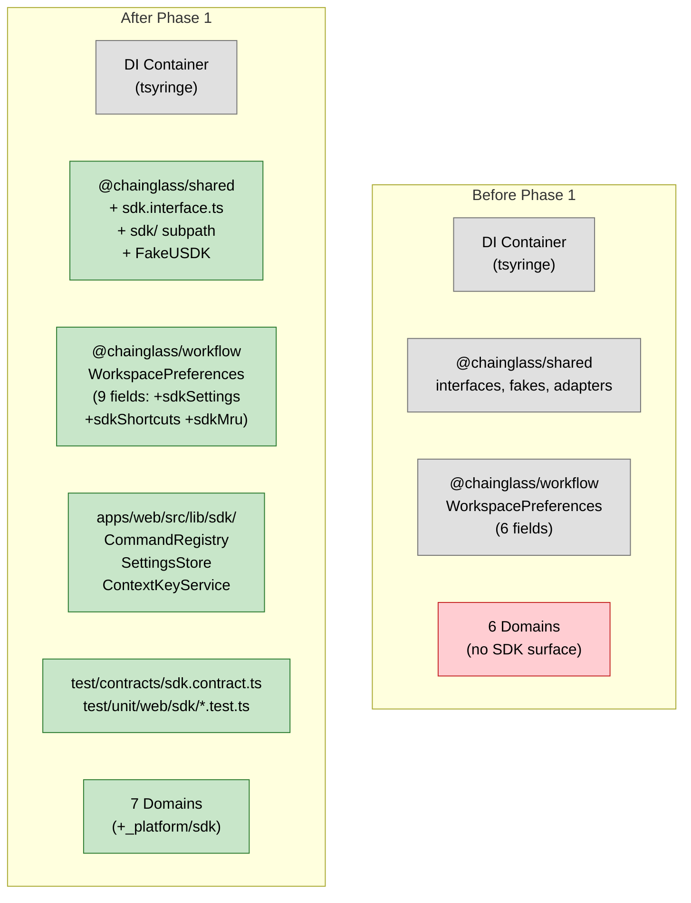

# Flight Plan: Phase 1 — SDK Foundation

**Phase**: Phase 1: SDK Foundation
**Plan**: [usdk-plan.md](../../usdk-plan.md)
**Tasks**: [tasks.md](./tasks.md)
**Status**: Landed

---

## Departure → Destination

**Where we are**: The Chainglass codebase has 6 domains with cross-domain features consumed via DI injection and direct imports. No SDK surface, no command registry, no settings store, no typed contribution system. The `@chainglass/shared` package exports interfaces, fakes, and adapters but has no SDK-related types.

**Where we're going**: A fully typed SDK foundation with three in-memory engines (CommandRegistry, SettingsStore, ContextKeyService) behind well-defined interfaces, a FakeUSDK for testing, contract parity tests, and a `@chainglass/shared/sdk` subpath export. WorkspacePreferences gains SDK storage fields. The `_platform/sdk` domain is registered and documented.

**Concrete outcomes**:
- `import { type IUSDK, type SDKCommand } from '@chainglass/shared/sdk'` works
- `new CommandRegistry()` registers/executes commands with Zod validation
- `new SettingsStore()` contributes/gets/sets settings with onChange listeners
- `new ContextKeyService()` evaluates when-clauses for command availability
- `createFakeUSDK()` provides a test double with inspection methods
- Contract tests verify fake/real parity across all SDK interfaces
- `WorkspacePreferences.sdkSettings`, `.sdkShortcuts`, `.sdkMru` fields exist

---

## Domain Context

### Domains We Change

| Domain | Relationship | Changes | Key Files |
|--------|-------------|---------|-----------|
| `_platform/sdk` | **CREATE** | New domain: interfaces, types, fakes, implementations, tests, documentation | `packages/shared/src/interfaces/sdk.interface.ts`, `packages/shared/src/sdk/types.ts`, `packages/shared/src/fakes/fake-usdk.ts`, `apps/web/src/lib/sdk/command-registry.ts`, `apps/web/src/lib/sdk/settings-store.ts`, `apps/web/src/lib/sdk/context-key-service.ts` |
| (cross-domain) | **MODIFY** | Extend WorkspacePreferences with 3 fields; add subpath export to shared | `packages/workflow/src/entities/workspace.ts`, `packages/shared/package.json`, `docs/domains/registry.md`, `docs/domains/domain-map.md` |

### Domains We Depend On

| Domain | Contract | Usage |
|--------|----------|-------|
| (none) | — | Phase 1 is self-contained — no domain dependencies |

---

## Flight Status

---

## Stages

- [x] Domain docs + registry update (T001)
- [x] SDK interfaces in shared/interfaces/ (T002)
- [x] SDK value types + subpath export (T003)
- [x] FakeUSDK with inspection methods (T004)
- [x] Contract test factory (T005)
- [x] CommandRegistry TDD implementation (T006)
- [x] SettingsStore TDD implementation (T007)
- [x] ContextKeyService TDD implementation (T008)
- [x] WorkspacePreferences schema extension (T009)

---

## Architecture: Before & After

---

## Acceptance Criteria

- [x] AC-01: Domain registers command, appears in list
- [x] AC-02: Command executes with validated params
- [x] AC-03: Invalid params throw Zod error before handler
- [x] AC-04: When-clause filters command availability
- [x] AC-16: Domain contributes setting, appears in list
- [x] AC-17: get() returns persisted override or schema default
- [x] AC-19a: SettingsStore.onChange fires callback when value changes
- [x] AC-20: reset() returns to default, removes override
- [x] AC-33: FakeUSDK works without server/persistence
- [x] AC-34: Contract tests verify fake/real parity

---

## Goals & Non-Goals

**Goals**: SDK type system, in-memory registries, test infrastructure, WorkspacePreferences extension, domain registration.

**Non-Goals**: No React hooks, no UI, no persistence wiring, no command palette, no keyboard shortcuts, no domain contributions.

---

## Checklist

| ID | Task | CS |
|----|------|----|
| T001 | Domain docs + registry | CS-1 |
| T002 | SDK interfaces | CS-2 |
| T003 | SDK value types + subpath export | CS-2 |
| T004 | FakeUSDK | CS-2 |
| T005 | Contract test factory | CS-2 |
| T006 | CommandRegistry (TDD) | CS-3 |
| T007 | SettingsStore (TDD) | CS-3 |
| T008 | ContextKeyService (TDD) | CS-2 |
| T009 | WorkspacePreferences extension | CS-1 |
