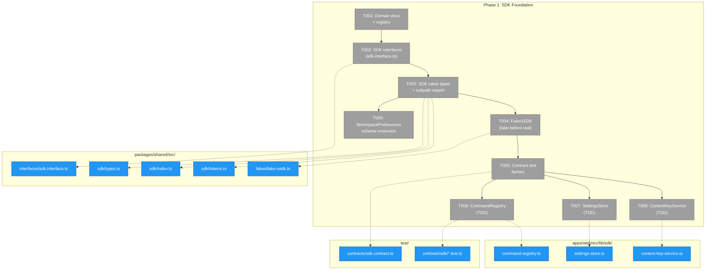
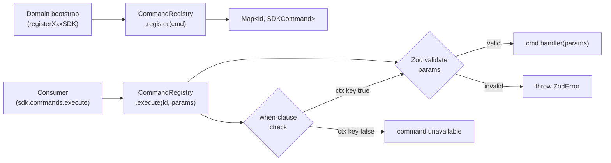
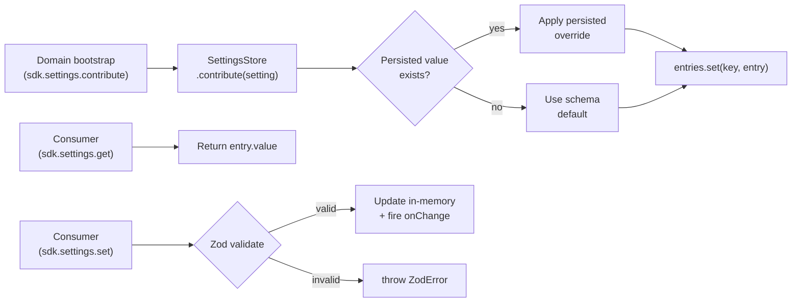
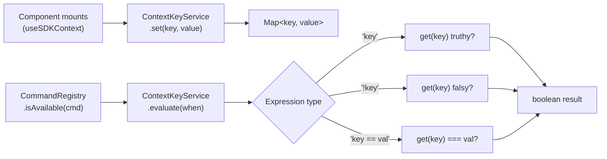

# Phase 1: SDK Foundation — Tasks

**Plan**: [usdk-plan.md](../../usdk-plan.md)
**Phase**: 1 of 6
**Domain**: `_platform/sdk` (NEW)
**Status**: Complete
**Created**: 2026-02-24

---

## Executive Briefing

**Purpose**: Build the core SDK framework — type definitions, in-memory registries, and test infrastructure — that all subsequent phases depend on. No user-facing changes; this is pure foundation.

**What We're Building**: Three in-memory engines (CommandRegistry, SettingsStore, ContextKeyService) behind well-defined interfaces, with a FakeUSDK for testing, contract parity tests, and a new `@chainglass/shared/sdk` subpath export. Also extends WorkspacePreferences with SDK storage fields.

**Goals**:
- ✅ SDK interfaces and value types defined in shared package
- ✅ CommandRegistry: register, execute (Zod-validated), list, when-clause filtering
- ✅ SettingsStore: contribute, get, set, reset, onChange, hydrate, toPersistedRecord
- ✅ ContextKeyService: set, get, evaluate when-clauses
- ✅ FakeUSDK with inspection methods for test consumers
- ✅ Contract test factory verifying fake/real parity
- ✅ WorkspacePreferences extended with sdkSettings, sdkShortcuts, sdkMru
- ✅ `@chainglass/shared/sdk` subpath export (types only, no client-side code)
- ✅ `_platform/sdk` domain registered in domain registry

**Non-Goals**:
- ❌ No React hooks, context providers, or UI (Phase 2)
- ❌ No command palette or keyboard shortcuts (Phases 3-4)
- ❌ No settings page (Phase 5)
- ❌ No server actions or persistence wiring (Phase 2)
- ❌ No domain SDK contributions — file-browser, events etc. register later (Phase 6)

---

## Prior Phase Context

_Phase 1 is the first phase. No prior phases to review._

---

## Pre-Implementation Check

| File | Exists? | Domain Check | Notes |
|------|---------|-------------|-------|
| `packages/shared/src/interfaces/sdk.interface.ts` | No → **create** | ✅ `_platform/sdk` — correct per R-ARCH-002 | New interface file |
| `packages/shared/src/sdk/types.ts` | No → **create** | ✅ `_platform/sdk` | New value types (not interfaces) |
| `packages/shared/src/sdk/index.ts` | No → **create** | ✅ `_platform/sdk` | Barrel re-exports interfaces + types |
| `packages/shared/src/sdk/tokens.ts` | No → **create** | ✅ `_platform/sdk` | DI tokens |
| `packages/shared/src/fakes/fake-usdk.ts` | No → **create** | ✅ `_platform/sdk` | Fake in standard fakes dir |
| `apps/web/src/lib/sdk/command-registry.ts` | No → **create** | ✅ `_platform/sdk` | Real implementation in web app |
| `apps/web/src/lib/sdk/settings-store.ts` | No → **create** | ✅ `_platform/sdk` | Real implementation in web app |
| `apps/web/src/lib/sdk/context-key-service.ts` | No → **create** | ✅ `_platform/sdk` | Real implementation in web app |
| `packages/shared/package.json` | Yes → **modify** | cross-domain | Add `./sdk` to exports field |
| `packages/shared/src/interfaces/index.ts` | Yes → **modify** | cross-domain | Re-export SDK interfaces |
| `packages/shared/src/fakes/index.ts` | Yes → **modify** | cross-domain | Re-export FakeUSDK |
| `packages/workflow/src/entities/workspace.ts` | Yes → **modify** | cross-domain | Add 3 fields to WorkspacePreferences + DEFAULT_PREFERENCES |
| `test/contracts/sdk.contract.ts` | No → **create** | `_platform/sdk` | Contract test factory |
| `test/unit/web/sdk/command-registry.test.ts` | No → **create** | `_platform/sdk` | TDD unit tests |
| `test/unit/web/sdk/settings-store.test.ts` | No → **create** | `_platform/sdk` | TDD unit tests |
| `test/unit/web/sdk/context-key-service.test.ts` | No → **create** | `_platform/sdk` | TDD unit tests |
| `docs/domains/_platform/sdk/domain.md` | No → **create** | `_platform/sdk` | Domain documentation |
| `docs/domains/registry.md` | Yes → **modify** | cross-domain | Add `_platform/sdk` row |
| `docs/domains/domain-map.md` | Yes → **modify** | cross-domain | Add SDK layer to mermaid |

**Concept duplication check**: ✅ No existing CommandRegistry, SettingsStore, ContextKeyService, or IUSDK implementations found. Clean slate. NodeEventRegistry in 032-node-event-system is architectural reference only — different domain, different types, no code sharing.

---

## Architecture Map



---

## Tasks

| Status | ID | Task | Domain | Path(s) | Done When | Notes |
|--------|-----|------|--------|---------|-----------|-------|
| [x] | T001 | Create `_platform/sdk` domain documentation. Write `domain.md` with public contracts (IUSDK, ICommandRegistry, ISDKSettings, IContextKeyService). Add row to `registry.md`. Update `domain-map.md` mermaid to show SDK as horizontal layer consumed by all domains. | `_platform/sdk` | `docs/domains/_platform/sdk/domain.md`, `docs/domains/registry.md`, `docs/domains/domain-map.md` | Domain doc exists with contracts listed; registry has `_platform/sdk` row with status "active"; domain-map shows SDK layer | |
| [x] | T002 | Define SDK interfaces in `sdk.interface.ts`. Interfaces: `IUSDK` (top-level facade), `ICommandRegistry` (register/execute/list/isAvailable), `ISDKSettings` (contribute/get/set/reset/onChange/list), `IContextKeyService` (set/get/evaluate). Export from `interfaces/index.ts`. **DYK-02**: Document on ISDKSettings.get() that returned references MUST be stable (same object identity when value unchanged) — required for useSyncExternalStore in Phase 2. **DYK-03**: IUSDK should accept optional `onSettingsPersist` callback — global provider, lazy persistence when workspace context available. | `_platform/sdk` | `packages/shared/src/interfaces/sdk.interface.ts`, `packages/shared/src/interfaces/index.ts` | Interfaces compile with `just typecheck`. Import `{ type IUSDK } from '@chainglass/shared/interfaces'` works. All method signatures match workshop 001 §2-6. get() JSDoc states referential stability invariant. | Per R-ARCH-002: interfaces in interfaces/. Per R-CODE-003: `.interface.ts` suffix. |
| [x] | T003 | Define SDK value types + subpath export. Types: `SDKCommand`, `SDKSetting`, `SDKKeybinding`, `SDKContribution`. Create `sdk/types.ts`, `sdk/index.ts` (barrel re-exporting interfaces + types), `sdk/tokens.ts` (SDK_DI_TOKENS). Add `"./sdk"` subpath to `packages/shared/package.json` exports. | `_platform/sdk` | `packages/shared/src/sdk/types.ts`, `packages/shared/src/sdk/index.ts`, `packages/shared/src/sdk/tokens.ts`, `packages/shared/package.json` | `import { type SDKCommand, type IUSDK } from '@chainglass/shared/sdk'` compiles. `pnpm build` in shared succeeds. | Per finding 04: subpath export prevents barrel pollution. |
| [x] | T004 | Create FakeUSDK with sub-fakes (FakeCommandRegistry, FakeSettingsStore, FakeContextKeyService). Each sub-fake implements the corresponding interface. FakeUSDK has inspection methods: `getRegisteredCommands()`, `getExecutionLog()`, `getContributedSettings()`, `getContextKeys()`. Export from `fakes/index.ts`. | `_platform/sdk` | `packages/shared/src/fakes/fake-usdk.ts`, `packages/shared/src/fakes/index.ts` | FakeUSDK implements IUSDK. Inspection methods return internal state. `import { FakeUSDK } from '@chainglass/shared/fakes'` works. | Per constitution P2: fake before real. Per P4: fakes over mocks. Per workshop 001 §8.1. |
| [x] | T005 | Create contract test factory `sdkContractTests()` in `test/contracts/sdk.contract.ts`. Tests cover: command register/execute/list, settings contribute/get/set/reset/onChange, context set/get/evaluate. Run against FakeUSDK first (all pass), then against real implementations in T006-T008. **DYK-01**: Include test that `register()` with duplicate ID throws. **DYK-02**: Include test that `get()` returns same reference on consecutive calls (referential stability). | `_platform/sdk` | `test/contracts/sdk.contract.ts`, `test/contracts/sdk.contract.test.ts` | Contract factory defined. `pnpm test -- test/contracts/sdk.contract.test.ts` passes for FakeUSDK. Includes duplicate-ID and referential-stability tests. | Per constitution P2: tests using fake before real adapter. Per R-TEST-008. |
| [x] | T006 | Implement CommandRegistry (TDD). Map-based storage. `register()` stores command — **DYK-01**: throws if ID already registered (single-owner, fail-fast). `execute()` validates params with Zod, **DYK-05**: wraps handler in try/catch — on error logs to console.error and shows toast (swallow + toast pattern, never crashes caller). `list()` returns all or filtered by domain. `isAvailable()` checks when-clause via IContextKeyService. Run contract tests against real implementation. | `_platform/sdk` | `apps/web/src/lib/sdk/command-registry.ts`, `test/unit/web/sdk/command-registry.test.ts` | Contract tests pass against real CommandRegistry. Unit tests cover: register + list, register duplicate throws, execute valid params, execute invalid params throws ZodError, execute with throwing handler shows toast (doesn't propagate), list with domain filter, when-clause filtering. | Per finding 06: mirror NodeEventRegistry pattern. TDD: write test → implement → refactor. |
| [x] | T007 | Implement SettingsStore (TDD). `hydrate()` seeds persisted values. `contribute()` registers definition, applies persisted override. `get()` returns current value — **DYK-02**: MUST return stable reference (same object identity when unchanged, for useSyncExternalStore). `set()` validates + updates + fires listeners. `reset()` reverts to default. `onChange()` returns disposable subscription. `toPersistedRecord()` exports only overrides. Run contract tests. | `_platform/sdk` | `apps/web/src/lib/sdk/settings-store.ts`, `test/unit/web/sdk/settings-store.test.ts` | Contract tests pass. Unit tests cover: contribute → get returns default, hydrate → contribute → get returns persisted, set → onChange fires, set invalid → throws ZodError, reset → default restored, toPersistedRecord only includes overrides, consecutive get() returns Object.is-equal reference. | Per workshop 003 §4: SettingsStore implementation. |
| [x] | T008 | Implement ContextKeyService (TDD). In-memory Map. `set(key, value)` stores and fires listeners. `get(key)` returns value. `evaluate(expr)` handles: simple key (truthy check), `!key` (negation), `key == value` (equality). Run contract tests. | `_platform/sdk` | `apps/web/src/lib/sdk/context-key-service.ts`, `test/unit/web/sdk/context-key-service.test.ts` | Contract tests pass. Unit tests cover: set/get roundtrip, evaluate 'key' true when set, evaluate '!key' true when unset, evaluate 'key == value' equality. | Simple when-clause evaluator. Not a full expression parser — just the 3 patterns above for v1. |
| [x] | T009 | Extend WorkspacePreferences with 3 new fields: `sdkSettings: Record<string, unknown>`, `sdkShortcuts: Record<string, string>`, `sdkMru: string[]`. Update DEFAULT_PREFERENCES with empty defaults (`{}`, `{}`, `[]`). Verify existing tests still pass — spread merge handles missing fields gracefully. | cross-domain | `packages/workflow/src/entities/workspace.ts` | `just test` passes. WorkspacePreferences interface has 3 new fields. DEFAULT_PREFERENCES has matching defaults. Existing workspace JSON without new fields loads without error. | Per finding 03: additive, non-breaking. No Zod schema on read currently — new fields are optional via spread merge in `Workspace.create()`. |

---

## Context Brief

### Key Findings from Plan

- **Finding 03** (High): No Zod schema on WorkspacePreferences read. Our new fields are safe via spread merge (`{ ...DEFAULT_PREFERENCES, ...input.preferences }`), but be aware there's no runtime validation of persisted data. If a future read gets unexpected types in sdkSettings, it will surface at the SDK layer, not the adapter layer.
- **Finding 04** (High): Barrel import pollution. The `@chainglass/shared` root export MUST NOT include SDK types that pull in Zod runtime code. Use subpath `@chainglass/shared/sdk` exclusively. SDK hooks (Phase 2) stay in `apps/web/src/lib/sdk/` — never in shared.
- **Finding 06** (High): NodeEventRegistry in `packages/positional-graph/src/features/032-node-event-system/node-event-registry.ts` is the architectural reference for CommandRegistry. Mirror the Map-based `register()/get()/list()` pattern. Don't import it — different domain.

### DYK Insights (Clarity Session 2026-02-24)

- **DYK-01**: `register()` MUST throw on duplicate command ID. Single-owner semantics, fail-fast. Two domains cannot own the same command ID.
- **DYK-02**: `SettingsStore.get()` MUST return stable object references (same identity when value unchanged). Required for `useSyncExternalStore` in Phase 2 — inconsistent references cause infinite re-renders.
- **DYK-03**: SDKProvider is global (not workspace-scoped). Settings persistence is lazy — a `onSettingsPersist` callback is provided when workspace context is available, undefined otherwise. Commands use when-clause `workspace.active` for workspace-dependent features.
- **DYK-04**: Workshop code examples use Zod v3 syntax. Codebase uses Zod v4 (`^4.3.5`). Do NOT copy workshop snippets verbatim — especially `schema._def.innerType` (v3 internal API). Write against Zod v4 docs.
- **DYK-05**: `CommandRegistry.execute()` wraps handler in try/catch. On error: `console.error()` + toast. Never propagates handler errors to callers (swallow + toast pattern, matches VS Code).

### Domain Dependencies

This phase **creates** the `_platform/sdk` domain. It consumes:

| Domain | Contract | What We Use |
|--------|----------|-------------|
| (none) | — | Phase 1 is self-contained. SDK interfaces and implementations have no domain dependencies. |

It **modifies** cross-domain files:

| File | What Changes |
|------|-------------|
| `packages/shared/package.json` | Add `"./sdk"` subpath export |
| `packages/shared/src/interfaces/index.ts` | Re-export SDK interfaces |
| `packages/shared/src/fakes/index.ts` | Re-export FakeUSDK |
| `packages/workflow/src/entities/workspace.ts` | 3 new fields on WorkspacePreferences |
| `docs/domains/registry.md` | New domain row |
| `docs/domains/domain-map.md` | SDK layer in mermaid |

### Domain Constraints

- **R-ARCH-002**: Interfaces MUST go in `packages/shared/src/interfaces/sdk.interface.ts` with `.interface.ts` suffix
- **R-CODE-002**: Interface prefix `I` (e.g., `IUSDK`, `ICommandRegistry`). Fake prefix `Fake` (e.g., `FakeUSDK`).
- **R-ARCH-004**: Types shared in `packages/shared`. Implementations in `apps/web` (app-specific, client-only).
- **R-TEST-006**: Unit tests in `test/unit/web/sdk/`. Contract tests in `test/contracts/`. NOT colocated with source.
- **R-TEST-007**: No `vi.mock()`, `vi.fn()`, `vi.spyOn()`. FakeUSDK is the test double.
- **Constitution P2**: Development order: interface → fake → tests → real implementation. Enforced in task ordering.
- **PL-01/PL-06**: SDK types exported via subpath, never from root barrel.

### Reusable from Prior Phases

- **NodeEventRegistry pattern** (`packages/positional-graph/src/features/032-node-event-system/node-event-registry.ts`): Map-based registration with `register()`, `get()`, `list()`, `listByDomain()`, `validatePayload()`. Architectural reference for CommandRegistry.
- **Existing contract test pattern** (`test/contracts/`): 48 existing contract test files. Follow the parameterized factory pattern: `function sdkContractTests(name, createSDK)`.
- **WorkspacePreferences spread merge** (`Workspace.create()`): `{ ...DEFAULT_PREFERENCES, ...input.preferences }` — new fields with defaults are automatically handled.
- **Existing fakes pattern** (`packages/shared/src/fakes/`): FakeLogger, FakeCopilotClient etc. — follow same inspection method patterns.

### System Flow: Command Registration & Execution



### System Flow: Settings Contribute → Get → Set



### System Flow: Context Key Evaluation



---

## Discoveries & Learnings

_Populated during implementation by plan-6._

| Date | Task | Type | Discovery | Resolution | References |
|------|------|------|-----------|------------|------------|

---

## Directory Layout

```
docs/plans/047-usdk/
  ├── usdk-spec.md
  ├── usdk-plan.md
  ├── research-dossier.md
  ├── external-research/
  ├── workshops/
  │   ├── 001-sdk-surface-consumer-publisher-experience.md
  │   ├── 002-initial-sdk-candidates.md
  │   ├── 003-settings-domain-data-model.md
  │   └── 004-sdk-event-firing-via-events-domain.md
  └── tasks/
      └── phase-1-sdk-foundation/
          ├── tasks.md              ← this file
          ├── tasks.fltplan.md      ← flight plan (below)
          └── execution.log.md     ← created by plan-6
```
