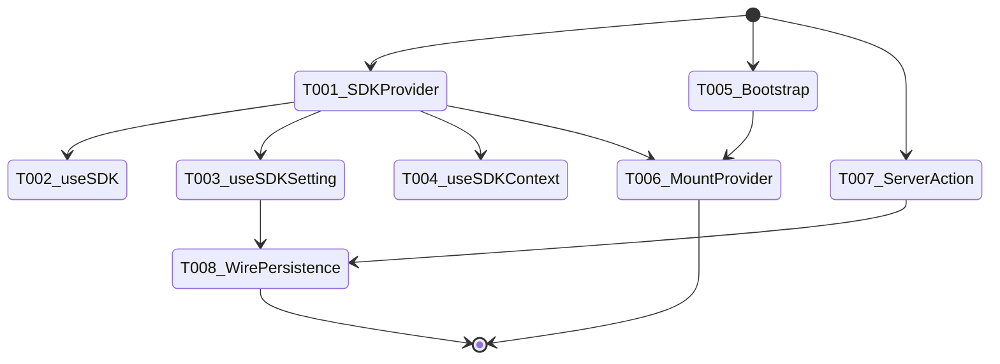
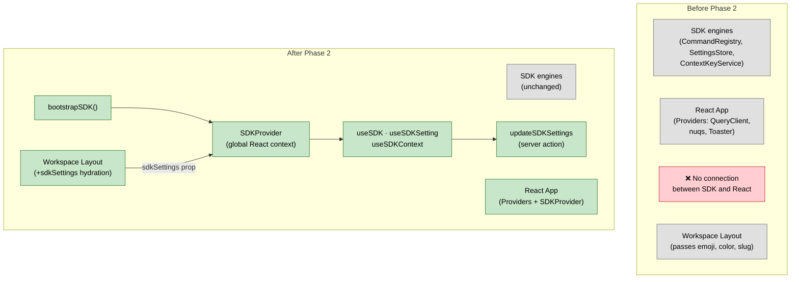

# Flight Plan: Phase 2 — SDK Provider & Bootstrap

**Phase**: Phase 2: SDK Provider & Bootstrap
**Plan**: [usdk-plan.md](../../usdk-plan.md)
**Tasks**: [tasks.md](./tasks.md)
**Status**: Landed

---

## Departure → Destination

**Where we are**: Phase 1 delivered SDK interfaces, types, three in-memory engines (CommandRegistry, SettingsStore, ContextKeyService), FakeUSDK, and 46 contract tests. The SDK exists as pure TypeScript classes but is not wired into the React app — no component can use it yet.

**Where we're going**: The SDK is globally available to every client component via `useSDK()`. Settings can be read, written, and persisted to workspaces.json. The full roundtrip works: server reads `sdkSettings` → hydrates provider → hooks consume → setter persists back.

**Concrete outcomes**:
- `const sdk = useSDK()` works from any client component
- `const [val, setVal] = useSDKSetting('key')` subscribes with auto re-render
- `useSDKContext('key', true)` sets context key on mount, clears on unmount
- `bootstrapSDK()` creates a configured IUSDK instance
- `updateSDKSettings(slug, record)` persists to workspaces.json
- Workspace layout hydrates SDK with persisted settings on page load
- Outside workspace routes, SDK still works (commands, context) — settings just don't persist

---

## Domain Context

### Domains We Change

| Domain | Relationship | Changes | Key Files |
|--------|-------------|---------|-----------|
| `_platform/sdk` | **extend** | Add provider, hooks, bootstrap | `apps/web/src/lib/sdk/sdk-provider.tsx`, `use-sdk.ts`, `use-sdk-setting.ts`, `use-sdk-context.ts`, `sdk-bootstrap.ts` |
| `_platform/settings` | **create** (partial) | Server action for SDK settings persistence | `apps/web/app/actions/sdk-settings-actions.ts` |
| (cross-domain) | **modify** | Mount provider, pass hydration data | `apps/web/src/components/providers.tsx`, `apps/web/app/(dashboard)/workspaces/[slug]/layout.tsx` |

### Domains We Depend On

| Domain | Contract | Usage |
|--------|----------|-------|
| `_platform/sdk` (Phase 1) | CommandRegistry, SettingsStore, ContextKeyService | Bootstrap instantiates them |
| `_platform/events` (existing) | `toast()` from sonner | Toast fallback in bootstrap |

---

## Flight Status

---

## Stages

- [x] Create SDKProvider with React context (T001)
- [x] Create useSDK hook (T002)
- [x] Create useSDKSetting hook with useSyncExternalStore (T003)
- [x] Create useSDKContext hook with auto-cleanup (T004)
- [x] Create bootstrapSDK function (T005)
- [x] Mount SDKProvider in app Providers (T006)
- [x] Create updateSDKSettings server action (T007)
- [x] Wire end-to-end persistence via workspace layout (T008)
- [x] Fix test regression (1 failing test — transient, resolved on re-run)

---

## Architecture: Before & After

---

## Acceptance Criteria

- [ ] AC-18: set() validates, updates in-memory, fires onChange, persists
- [ ] AC-19b: useSDKSetting re-renders consuming components on change
- [ ] AC-23: Settings change persists, consuming components update without refresh

---

## Goals & Non-Goals

**Goals**: SDKProvider, hooks, bootstrap, server action, persistence roundtrip.

**Non-Goals**: No command palette, no keyboard shortcuts, no settings page, no domain contributions.

---

## Checklist

| ID | Task | CS |
|----|------|----|
| T001 | SDKProvider (React context) | CS-2 |
| T002 | useSDK hook | CS-1 |
| T003 | useSDKSetting hook | CS-2 |
| T004 | useSDKContext hook | CS-1 |
| T005 | bootstrapSDK() | CS-2 |
| T006 | Mount in Providers | CS-1 |
| T007 | updateSDKSettings server action | CS-2 |
| T008 | Wire persistence roundtrip | CS-2 |
