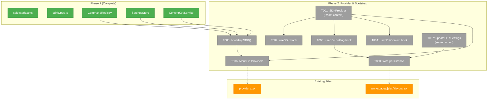
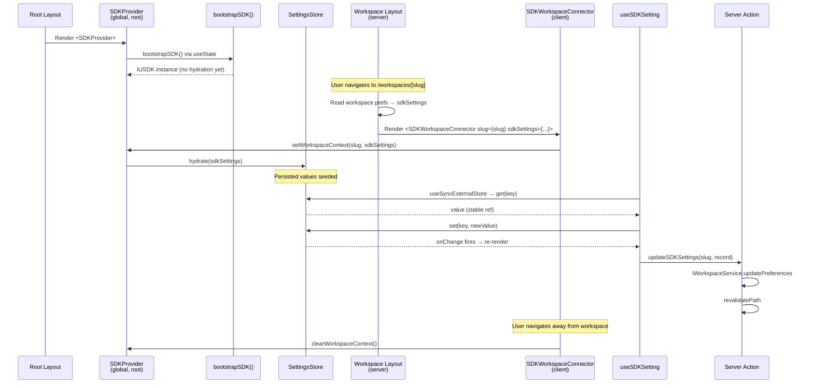
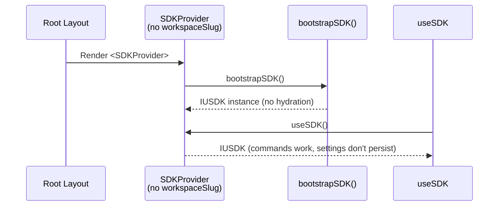

# Phase 2: SDK Provider & Bootstrap — Tasks

**Plan**: [usdk-plan.md](../../usdk-plan.md)
**Phase**: 2 of 6
**Domain**: `_platform/sdk` + `_platform/settings`
**Status**: Complete
**Created**: 2026-02-24

---

## Executive Briefing

**Purpose**: Wire the SDK foundation (Phase 1) into the React app so components can consume it. Create the provider, hooks, bootstrap, and settings persistence server action.

**What We're Building**: A `<SDKProvider>` React context that wraps the app globally, three hooks (`useSDK`, `useSDKSetting`, `useSDKContext`) for component consumption, a bootstrap function that orchestrates domain registrations, and a server action that persists SDK settings to workspaces.json. After this phase, any client component can call `const sdk = useSDK()` and interact with the SDK.

**Goals**:
- ✅ `<SDKProvider>` wraps the app globally (inside existing `<Providers>` component)
- ✅ `useSDK()` returns `IUSDK` from any client component
- ✅ `useSDKSetting(key)` returns `[value, setter]` with automatic re-render on change
- ✅ `useSDKContext(key, value)` sets context keys that auto-clear on unmount
- ✅ `bootstrapSDK()` creates configured IUSDK with domain registrations
- ✅ `updateSDKSettings` server action persists to workspace sdkSettings field
- ✅ Settings roundtrip works: set → in-memory → persist → reload → hydrate → same value

**Non-Goals**:
- ❌ No command palette UI (Phase 3)
- ❌ No keyboard shortcuts (Phase 4)
- ❌ No settings page (Phase 5)
- ❌ No domain SDK contributions yet — bootstrap is wired but empty (Phase 6 populates)

---

## Prior Phase Context

### Phase 1: SDK Foundation (Complete ✅)

**A. Deliverables**:
- `packages/shared/src/interfaces/sdk.interface.ts` — IUSDK, ICommandRegistry, ISDKSettings, IContextKeyService
- `packages/shared/src/sdk/types.ts` — SDKCommand, SDKSetting, SDKKeybinding, SDKContribution
- `packages/shared/src/sdk/index.ts` + `tokens.ts` — subpath export + DI tokens
- `packages/shared/src/fakes/fake-usdk.ts` — FakeUSDK with inspection methods
- `apps/web/src/lib/sdk/command-registry.ts` — real CommandRegistry
- `apps/web/src/lib/sdk/settings-store.ts` — real SettingsStore
- `apps/web/src/lib/sdk/context-key-service.ts` — real ContextKeyService
- `test/contracts/sdk.contract.ts` — 23-test contract factory (46 total: fake + real)

**B. Dependencies Exported**:
- `IUSDK` facade with `commands`, `settings`, `context`, `toast`
- `ISDKSettings.get()` returns stable references (DYK-02)
- `CommandRegistry` constructor takes `(contextKeys: IContextKeyService, onError?: fn)`
- `SettingsStore.hydrate(sdkSettings)` seeds persisted values before contributions
- `SettingsStore.toPersistedRecord()` exports only overrides
- `createFakeUSDK()` factory returns `FakeUSDKInstance`

**C. Gotchas & Debt**:
- DYK-02: `get()` must return stable references — Phase 2 hooks depend on this
- DYK-04: Zod v4, not v3 — don't copy workshop snippets verbatim
- No Zod schema on WorkspacePreferences read — unexpected types surface at SDK layer
- `execute()` swallows handler errors (DYK-05) — consumers never see handler throws

**D. Incomplete Items**: None. All 9 tasks complete, 46 contract tests pass.

**E. Patterns to Follow**:
- Interface-first, fake-first, contract-test-first development order
- `@chainglass/shared/sdk` subpath for type imports (never root barrel)
- `for...of` instead of `forEach` (biome lint requirement)
- Additive WorkspacePreferences fields with defaults

---

## Pre-Implementation Check

| File | Exists? | Domain Check | Notes |
|------|---------|-------------|-------|
| `apps/web/src/lib/sdk/sdk-provider.tsx` | No → **create** | ✅ `_platform/sdk` | Client component (`'use client'`) |
| `apps/web/src/lib/sdk/use-sdk.ts` | No → **create** | ✅ `_platform/sdk` | Client hook |
| `apps/web/src/lib/sdk/use-sdk-setting.ts` | No → **create** | ✅ `_platform/sdk` | Client hook with `useSyncExternalStore` |
| `apps/web/src/lib/sdk/use-sdk-context.ts` | No → **create** | ✅ `_platform/sdk` | Client hook with `useEffect` cleanup |
| `apps/web/src/lib/sdk/sdk-bootstrap.ts` | No → **create** | ✅ `_platform/sdk` | Pure JS, no React dependency |
| `apps/web/app/actions/sdk-settings-actions.ts` | No → **create** | ✅ `_platform/settings` | Server action (`'use server'`) |
| `apps/web/src/lib/sdk/sdk-workspace-connector.tsx` | No → **create** | ✅ `_platform/sdk` | Client component for workspace layout |
| `apps/web/src/components/providers.tsx` | Yes → **modify** | cross-domain | Add SDKProvider inside existing Providers wrapper |
| `apps/web/app/(dashboard)/workspaces/[slug]/layout.tsx` | Yes → **modify** | cross-domain | Pass `sdkSettings` prop for hydration |

**Concept duplication check**: No existing SDK provider, hooks, or bootstrap found. Clean slate for Phase 2 files. The existing `WorkspaceProvider` provides workspace identity (slug, emoji, color) — SDKProvider is separate and global.

---

## Architecture Map



---

## Tasks

| Status | ID | Task | Domain | Path(s) | Done When | Notes |
|--------|-----|------|--------|---------|-----------|-------|
| [x] | T001 | Create `SDKProvider` — client component that creates SDK instance (CommandRegistry + SettingsStore + ContextKeyService), exposes via React context. **DYK-P2-01**: Does NOT accept workspace data as props. Exposes `setWorkspaceContext(slug, sdkSettings)` via context for child components to connect workspace data imperatively. **DYK-P2-05**: Wrap `bootstrapSDK()` in try/catch — on failure return no-op IUSDK stub so app doesn't crash. | `_platform/sdk` | `apps/web/src/lib/sdk/sdk-provider.tsx` | `<SDKProvider>` renders children. `useSDK()` inside returns IUSDK. Bootstrap failure logs error and returns stub (app still works). | `'use client'` component. SDK instance created once via `useState` (survives re-renders). |
| [x] | T002 | Create `useSDK` hook — thin wrapper that reads IUSDK from SDKProvider context. Throws if called outside provider. | `_platform/sdk` | `apps/web/src/lib/sdk/use-sdk.ts` | `useSDK()` returns IUSDK instance. Calling outside provider throws clear error. | `'use client'` hook. |
| [x] | T003 | Create `useSDKSetting` hook — uses `useSyncExternalStore` to subscribe to a setting key. Returns `[value, setter]` tuple. Setter calls `sdk.settings.set()` then persists via `onSettingsPersist` callback if available. Per DYK-02: relies on stable reference from `get()`. | `_platform/sdk` | `apps/web/src/lib/sdk/use-sdk-setting.ts` | `useSDKSetting('key')` returns current value. Changing value via setter causes re-render. No infinite loop (stable references). | `'use client'` hook. `useSyncExternalStore` for concurrent-safe reads. Per Workshop 001 §6.2. |
| [x] | T004 | Create `useSDKContext` hook — calls `sdk.context.set(key, value)` on mount, clears (`set(key, undefined)`) on unmount via `useEffect` cleanup. **DYK-P2-03**: Add comment that strict mode double-fires effects (dev only), briefly clearing context key between runs. | `_platform/sdk` | `apps/web/src/lib/sdk/use-sdk-context.ts` | `useSDKContext('key', true)` sets context key. Unmounting clears it. Context keys visible in `sdk.context.get()`. | `'use client'` hook. Per Workshop 001 §6.3. |
| [x] | T005 | Create `bootstrapSDK()` function — instantiates ContextKeyService, CommandRegistry, SettingsStore, wires them into an IUSDK-shaped object with toast convenience methods. **DYK-P2-02**: Toast methods import `toast` from sonner directly — NOT via `sdk.commands.execute()` (toast.show not registered until Phase 6). No domain registrations yet (Phase 6 adds them). Returns `IUSDK`. | `_platform/sdk` | `apps/web/src/lib/sdk/sdk-bootstrap.ts` | `bootstrapSDK()` returns IUSDK. `sdk.commands.list()` returns empty. `sdk.toast.success('hi')` shows toast via sonner (no command needed). | Pure JS — no React. Direct sonner import for toast. |
| [x] | T006 | Mount `<SDKProvider>` inside existing `<Providers>` component in `providers.tsx`. SDKProvider wraps children alongside QueryClientProvider and NuqsAdapter. No workspace context needed at root (DYK-03: global). | cross-domain | `apps/web/src/components/providers.tsx` | `useSDK()` accessible from any client component in the app. Existing providers (QueryClient, nuqs, Toaster) still work. | Add import + wrap. Minimal change. |
| [x] | T007 | Create `updateSDKSettings` server action. Accepts `slug` and `sdkSettings` record. Uses `IWorkspaceService.updatePreferences(slug, { sdkSettings })` and `revalidatePath()`. **DYK-P2-04**: Document theoretical race with concurrent preference writes (disjoint fields, near-zero impact). | `_platform/settings` | `apps/web/app/actions/sdk-settings-actions.ts` | Server action persists sdkSettings to workspaces.json. Reading workspace back shows updated sdkSettings field. | `'use server'`. Per Workshop 003 §5.3. Per plan finding 05: separate action from existing updateWorkspacePreferences. |
| [x] | T008 | Wire settings persistence end-to-end. **DYK-P2-01**: Create `<SDKWorkspaceConnector>` client component for workspace layout — reads workspace data from props, calls `setWorkspaceContext(slug, sdkSettings)` on mount, clears on unmount. This replaces the original "pass props to SDKProvider" approach since React props can't flow up the tree. | cross-domain | `apps/web/src/lib/sdk/sdk-workspace-connector.tsx`, `apps/web/app/(dashboard)/workspaces/[slug]/layout.tsx` | Full roundtrip: contribute setting → set value → value persists → page reload → hydrated value matches. Navigating away from workspace clears persistence context. | SDKWorkspaceConnector is a thin client component. Workspace layout renders it with server-fetched data. |

---

## Context Brief

### Key Findings from Plan

- **Finding 04** (High): Barrel import pollution. SDK hooks (`useSDK`, `useSDKSetting`, `useSDKContext`) stay in `apps/web/src/lib/sdk/` — NEVER exported from `@chainglass/shared`. Import types from `@chainglass/shared/sdk` only.
- **Finding 05** (High): `updateWorkspacePreferences` ignores unknown fields. We need a dedicated `updateSDKSettings` server action that uses `IWorkspaceService.updatePreferences()` directly with `{ sdkSettings }`.

### DYK Insights (Phase 1)

- **DYK-02**: `useSyncExternalStore` calls `getSnapshot` on every render. `SettingsStore.get()` returns stable references — the hook relies on this. Do NOT wrap `get()` return values.
- **DYK-03**: SDKProvider is global (in root `<Providers>`). Settings persistence is lazy — only active when workspace context is connected. Outside workspace routes, SDK works but settings don't persist.
- **DYK-05**: `execute()` swallows handler errors. Toast convenience methods in bootstrap should NOT route through execute.

### DYK Insights (Phase 2 Clarity Session 2026-02-24)

- **DYK-P2-01**: **SDKProvider can't receive workspace data as props from nested WorkspaceLayout** — React props flow down, not up. Solution: SDKProvider exposes `setWorkspaceContext(slug, sdkSettings)` via context. A thin `<SDKWorkspaceConnector>` client component in workspace layout calls this on mount and clears on unmount. This replaces the T008 "pass props" approach.
- **DYK-P2-02**: **Toast convenience methods must import sonner directly** — NOT route through `sdk.commands.execute('toast.show', ...)`. The `toast.show` command won't be registered until Phase 6, and the "command not registered" throw is NOT caught by DYK-05's handler try/catch. `bootstrapSDK()` imports `{ toast } from 'sonner'` directly for the convenience methods.
- **DYK-P2-03**: **useSDKContext double-fires in React strict mode (dev only)** — Effects run twice: set → clear → set. Context key briefly disappears. Add comment documenting this is expected and production-only effects run once.
- **DYK-P2-04**: **Theoretical race between updateSDKSettings and existing preference actions** — both call `updatePreferences()` with read-modify-write. Disjoint fields, near-zero practical impact. Document in server action; no fix needed for v1.
- **DYK-P2-05**: **Wrap bootstrapSDK() in try/catch** — if bootstrap throws inside `useState` initializer, the entire Providers tree crashes (white screen). Catch and return a no-op IUSDK stub so the app keeps working without SDK. Log error to console.

### Domain Dependencies

| Domain | Contract | What We Use |
|--------|----------|-------------|
| `_platform/sdk` (Phase 1) | CommandRegistry, SettingsStore, ContextKeyService constructors | Bootstrap instantiates them |
| `_platform/sdk` (Phase 1) | IUSDK, ICommandRegistry, ISDKSettings, IContextKeyService | Types for provider context |
| `_platform/events` (existing) | `toast()` from sonner | Toast fallback in bootstrap (direct sonner import until events domain registers toast command) |

### Domain Constraints

- **Client/server boundary**: Provider, hooks = `'use client'`. Server action = `'use server'`. Bootstrap = plain JS (importable from both but only used client-side).
- **R-ARCH-004**: Hooks stay in `apps/web/src/lib/sdk/`. Types imported from `@chainglass/shared/sdk`.
- **DYK-P2-01 mount architecture**: SDKProvider at root. `SDKWorkspaceConnector` in workspace layout connects workspace data imperatively (not props). Props can't flow up.

### Reusable from Phase 1

- `CommandRegistry` constructor: `new CommandRegistry(contextKeys, onError?)`
- `SettingsStore` methods: `hydrate()`, `contribute()`, `get()`, `set()`, `toPersistedRecord()`
- `ContextKeyService` constructor: `new ContextKeyService()`
- `FakeUSDK` for testing hooks: `createFakeUSDK()` from `@chainglass/shared/fakes`
- Contract tests in `test/contracts/sdk.contract.ts` — extend if needed

### System Flow: Provider + Workspace Connector + Persistence



### System Flow: Global Provider (No Workspace)



---

## Discoveries & Learnings

_Populated during implementation by plan-6._

| Date | Task | Type | Discovery | Resolution | References |
|------|------|------|-----------|------------|------------|

---

## Directory Layout

```
docs/plans/047-usdk/
  ├── usdk-spec.md
  ├── usdk-plan.md
  ├── research-dossier.md
  ├── external-research/
  ├── workshops/
  └── tasks/
      ├── phase-1-sdk-foundation/
      │   ├── tasks.md              (complete ✅)
      │   ├── tasks.fltplan.md
      │   └── execution.log.md
      └── phase-2-sdk-provider-bootstrap/
          ├── tasks.md              ← this file
          ├── tasks.fltplan.md      ← flight plan (below)
          └── execution.log.md     ← created by plan-6
```
