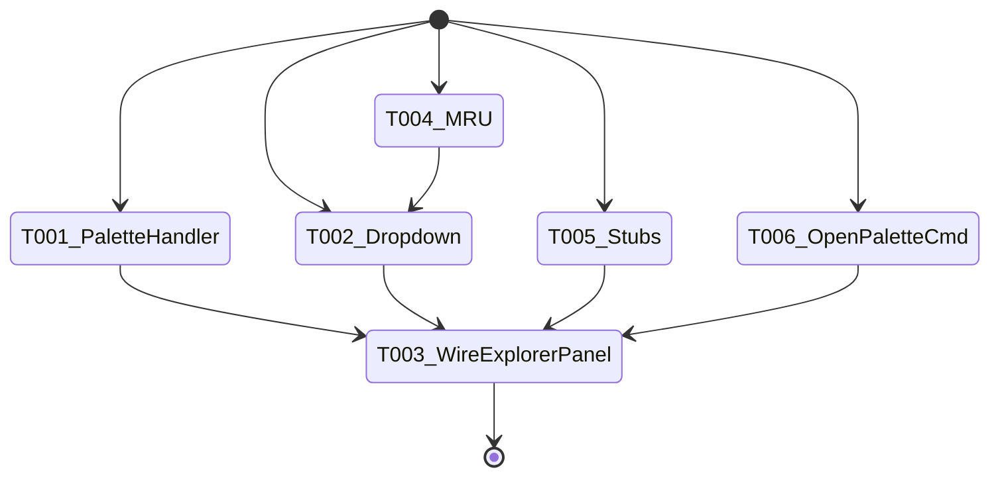
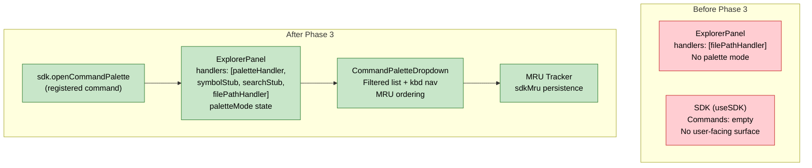

# Flight Plan: Phase 3 — Command Palette

**Phase**: Phase 3: Command Palette
**Plan**: [usdk-plan.md](../../usdk-plan.md)
**Tasks**: [tasks.md](./tasks.md)
**Status**: Landed

---

## Departure → Destination

**Where we are**: The SDK foundation (Phase 1) and React integration (Phase 2) are complete. `useSDK()` works from any component and `CommandRegistry` stores commands — but there are no registered commands and no user-facing way to discover or invoke them. The ExplorerPanel has a BarHandler chain for file paths only.

**Where we're going**: Users can type `>` in the explorer bar to see a filtered, keyboard-navigable list of SDK commands. MRU ordering surfaces recently-used commands. Stubs show "coming soon" for search (`#`) and file search (no prefix). `sdk.openCommandPalette` is a registered command. The existing file path navigation is completely untouched.

**Concrete outcomes**:
- `>toggle` in explorer bar shows filtered command list with keyboard navigation
- `#MyClass` shows "Symbol search coming later" toast
- Non-path text shows "Search coming soon" toast
- `sdk.commands.execute('sdk.openCommandPalette')` focuses bar in palette mode
- MRU persists to sdkMru in workspace preferences
- File paths (`src/index.ts`) still navigate normally

---

## Domain Context

### Domains We Change

| Domain | Relationship | Changes | Key Files |
|--------|-------------|---------|-----------|
| `_platform/panel-layout` | **modify** | Add command palette handler, dropdown component, palette mode state to ExplorerPanel, stub handlers | `command-palette-handler.ts`, `command-palette-dropdown.tsx`, `explorer-panel.tsx`, `stub-handlers.ts`, `types.ts` |
| `_platform/sdk` | **extend** | Add MRU tracker, register openCommandPalette command, add palette opener coordination | `mru-tracker.ts`, `sdk-bootstrap.ts`, `sdk-provider.tsx` |

### Domains We Depend On

| Domain | Contract | Usage |
|--------|----------|-------|
| `_platform/sdk` (Phase 1) | `ICommandRegistry.list()`, `.execute()`, `.isAvailable()` | Read, filter, execute commands in palette |
| `_platform/sdk` (Phase 2) | `useSDK()` | Access SDK from dropdown component |
| `_platform/panel-layout` (existing) | `BarHandler`, `BarContext`, `ExplorerPanelHandle` | Integration with existing handler chain |

---

## Flight Status

---

## Stages

- [x] Reposition ExplorerPanel as centered command bar with border/shadow (T000)
- [x] Palette mode detection via onChange in ExplorerPanel (T001)
- [x] Create command palette dropdown with filtering + keyboard nav (T002)
- [x] Wire palette into ExplorerPanel (keyboard delegation, openPalette handle, search fallback) (T003)
- [x] Create MRU tracker for palette ordering (T004)
- [x] Create `#` symbol search stub handler (T005)
- [x] Register `sdk.openCommandPalette` via useEffect in browser-client (T006)

---

## Architecture: Before & After

---

## Acceptance Criteria

- [~] AC-05: Ctrl+Shift+P focuses explorer bar in command mode (via `sdk.openCommandPalette` — shortcut binding in Phase 4)
- [x] AC-06: Typing with `>` filters commands by title
- [x] AC-07: Selecting command executes it
- [x] AC-08: Escape exits command mode
- [x] AC-09: `#` prefix shows stub message
- [x] AC-10: No-prefix text shows stub message (paths still work)

---

## Goals & Non-Goals

**Goals**: Command palette `>` mode, dropdown with filtering/keyboard nav, MRU, stubs, openCommandPalette command.

**Non-Goals**: No Ctrl+Shift+P binding (Phase 4), no settings page (Phase 5), no domain registrations (Phase 6), no parameter input in palette.

---

## Checklist

| ID | Task | CS |
|----|------|----|
| T000 | Reposition ExplorerPanel as centered command bar | CS-2 |
| T001 | Palette mode onChange detection | CS-2 |
| T002 | Command palette dropdown | CS-3 |
| T003 | Wire into ExplorerPanel (keyboard, handle, fallback) | CS-3 |
| T004 | MRU tracker | CS-2 |
| T005 | `#` symbol stub handler | CS-1 |
| T006 | openCommandPalette via useEffect | CS-2 |
