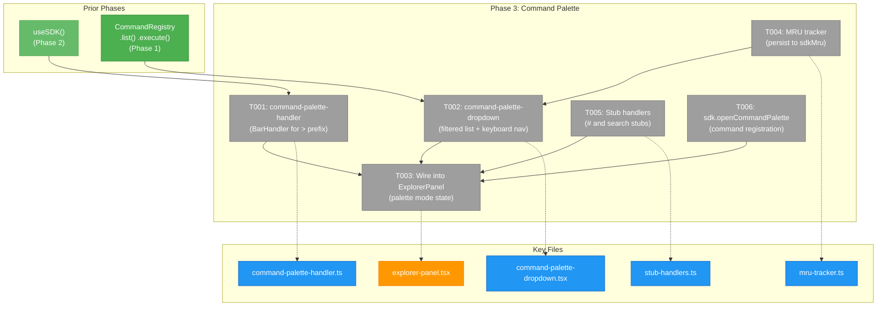
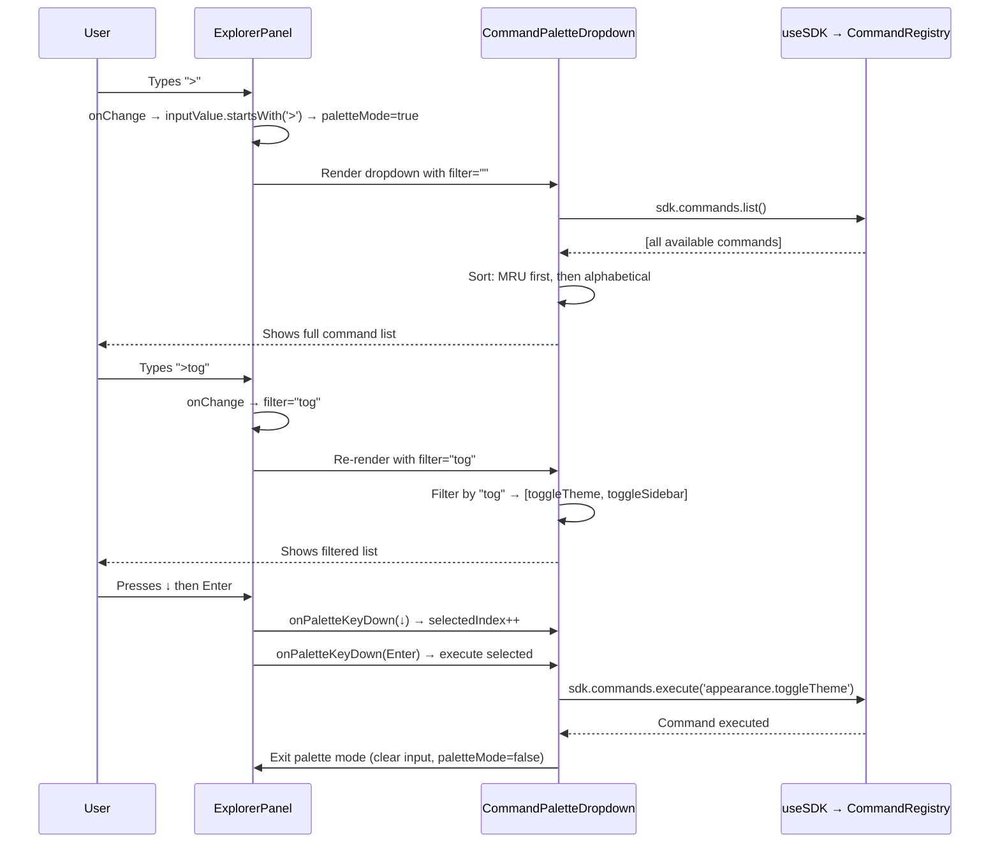
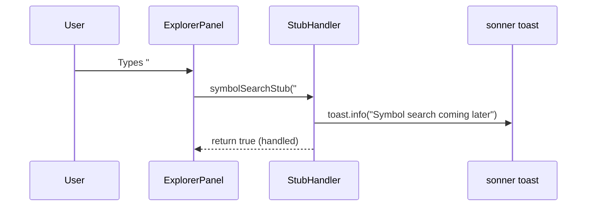

# Phase 3: Command Palette — Tasks

**Plan**: [usdk-plan.md](../../usdk-plan.md)
**Phase**: 3 of 6
**Domain**: `_platform/panel-layout` (modify) + `_platform/sdk` (extend)
**Status**: Complete
**Created**: 2026-02-24

---

## Executive Briefing

**Purpose**: Give users a VS Code-style command palette by extending the existing ExplorerPanel. Users type `>` to discover and execute SDK commands. This is the first user-facing SDK surface.

**What We're Building**: A `>` prefix BarHandler that intercepts command input, a dropdown component that renders filtered command results with keyboard navigation, MRU tracking for ordering, and two out-of-scope stubs (`#` for symbol search, no-prefix for file search). Also the `sdk.openCommandPalette` command that focuses the bar in palette mode.

**Goals**:
- ✅ Explorer bar repositioned as VS Code-style centered command bar (always visible, top-center, border/shadow)
- ✅ `>` prefix in explorer bar activates command palette mode
- ✅ Typing after `>` fuzzy-filters commands by title
- ✅ Arrow keys navigate results, Enter executes, Escape exits
- ✅ MRU ordering — recently used commands float to top
- ✅ `#` prefix shows "Symbol search coming later" stub toast
- ✅ No-prefix non-path text shows "Search coming soon" stub toast
- ✅ `sdk.openCommandPalette` command focuses bar with `>` prefix
- ✅ Existing file path navigation is completely unaffected

**Non-Goals**:
- ❌ No keyboard shortcuts (Phase 4 — Ctrl+Shift+P binding happens there)
- ❌ No settings page (Phase 5)
- ❌ No domain SDK contributions — palette will show commands once domains register in Phase 6
- ❌ No parameter input in palette — commands that need params open their own UI
- ❌ No actual search or LSP — stubs only

---

## Prior Phase Context

### Phase 1: SDK Foundation (Complete ✅)

**A. Deliverables**: SDK interfaces (`IUSDK`, `ICommandRegistry`, `ISDKSettings`, `IContextKeyService`), value types (`SDKCommand`, `SDKSetting`), real implementations (`CommandRegistry`, `SettingsStore`, `ContextKeyService`), `FakeUSDK`, 50 contract tests, `WorkspacePreferences` extended with `sdkSettings`/`sdkShortcuts`/`sdkMru`.

**B. Dependencies for Phase 3**:
- `ICommandRegistry.list(filter?)` — returns `SDKCommand[]` for palette display
- `ICommandRegistry.execute(id, params?)` — executes selected command
- `ICommandRegistry.isAvailable(id)` — checks when-clause for filtering
- `SDKCommand.title`, `.domain`, `.category`, `.icon` — display fields for palette items

**C. Gotchas**: `execute()` swallows handler errors (DYK-05). Register throws on duplicate ID (DYK-01). Zod v4 not v3 (DYK-04).

**D. Incomplete Items**: None.

**E. Patterns**: Map-based registries, `for...of` over `forEach`, interface-first development.

### Phase 2: SDK Provider & Bootstrap (Complete ✅)

**A. Deliverables**: `SDKProvider`, `useSDK()`, `useSDKSetting()`, `useSDKContext()`, `bootstrapSDK()`, `SDKWorkspaceConnector`, `updateSDKSettings` server action. SDKProvider mounted globally in `<Providers>`.

**B. Dependencies for Phase 3**:
- `useSDK()` — access IUSDK from palette components (client-side)
- `useSDKInternal()` — access full context for imperative operations
- `bootstrapSDK()` — SDK is active and available when palette mounts

**C. Gotchas**: DYK-P2-01 (workspace data flows up imperatively, not via props). DYK-P2-02 (toast imports sonner directly). DYK-P2-05 (bootstrap failure returns no-op stub).

**D. Incomplete Items**: None. Review fixes (FT-001 through FT-006) all applied.

**E. Patterns**: Global provider, workspace connector, `useSyncExternalStore` for reactivity.

---

## Pre-Implementation Check

| File | Exists? | Domain Check | Notes |
|------|---------|-------------|-------|
| `apps/web/src/features/_platform/panel-layout/components/command-palette-dropdown.tsx` | No → **create** | ✅ `_platform/panel-layout` | New client component |
| `apps/web/src/features/_platform/panel-layout/components/explorer-panel.tsx` | Yes → **modify** | ✅ `_platform/panel-layout` | Add palette mode state, onChange detection, keyboard delegation, openPalette handle |
| `apps/web/src/features/_platform/panel-layout/types.ts` | Yes → **modify** | ✅ `_platform/panel-layout` | Extend ExplorerPanelHandle with openPalette() |
| `apps/web/src/features/_platform/panel-layout/stub-handlers.ts` | No → **create** | ✅ `_platform/panel-layout` | `#` symbol stub only |
| `apps/web/src/lib/sdk/mru-tracker.ts` | No → **create** | ✅ `_platform/sdk` | MRU tracking for palette ordering |
| `apps/web/src/features/041-file-browser/components/browser-client.tsx` | Yes → **modify** | ✅ `file-browser` | Register openCommandPalette command via useEffect (DYK-P3-05) |
| `apps/web/src/features/_platform/panel-layout/index.ts` | Yes → **modify** | ✅ `_platform/panel-layout` | Export stub handler |

**Concept duplication check**: No existing command palette, dropdown, or MRU tracker in codebase. No combobox/autocomplete component in `apps/web/src/components/ui/`. Dropdown must be built custom (simple — a positioned `<ul>` below the input).

---

## Architecture Map



---

## Tasks

| Status | ID | Task | Domain | Path(s) | Done When | Notes |
|--------|-----|------|--------|---------|-----------|-------|
| [x] | T000 | **Reposition ExplorerPanel as centered command bar** — move from panel-header position to a VS Code-style centered bar at top of the browser viewport. Always visible, always centered. Visual changes: (1) Center horizontally with `max-w-2xl mx-auto` or similar. (2) Add subtle border, rounded corners, shadow (`border rounded-lg shadow-sm`). (3) Increase visual prominence — slightly larger padding, clear visual hierarchy as the primary interaction surface. (4) Maintain all existing functionality (file path display, copy button, input mode, handler chain). The bar IS the command palette host — it just looks the part now. | `_platform/panel-layout` | `apps/web/src/features/_platform/panel-layout/components/explorer-panel.tsx`, potentially `apps/web/src/features/041-file-browser/components/browser-client.tsx` (if layout wrapper changes needed) | Bar is visually centered at top of viewport with border/shadow. Looks like VS Code command bar. All existing file navigation works. Responsive on smaller screens. | Tailwind only. No new components — restyle existing ExplorerPanel. May need to adjust parent container layout to accommodate centering. |
| [x] | T001 | **Palette mode detection in ExplorerPanel onChange** — NOT a BarHandler (DYK-P3-01). When `inputValue.startsWith('>')`, set `paletteMode = true`. Filter text is `inputValue.slice(1)`. BarHandler chain is bypassed entirely in palette mode. When `>` is removed (user deletes it), exit palette mode. | `_platform/panel-layout` | `apps/web/src/features/_platform/panel-layout/components/explorer-panel.tsx` | Typing `>` instantly shows palette dropdown. Removing `>` exits palette. No Enter press needed to activate. | DYK-P3-01: onChange detection, not BarHandler. This is inline logic in ExplorerPanel, not a separate file. |
| [x] | T002 | Create `command-palette-dropdown.tsx` — client component that renders a positioned list of filtered SDK commands below the explorer bar input. Features: (1) Filter commands by title substring match. (2) MRU ordering — recently used first, then alphabetical. (3) Keyboard navigation via `onKeyDown` callback from ExplorerPanel (DYK-P3-03): up/down change selection, Enter executes, Escape exits. (4) Each item shows: icon, title, domain badge. (5) Empty state. (6) **DYK-P3-02**: Container has `onMouseDown={e => e.preventDefault()}` to prevent blur stealing focus. | `_platform/panel-layout` | `apps/web/src/features/_platform/panel-layout/components/command-palette-dropdown.tsx` | Dropdown appears when palette mode active. Items filter as user types. Arrow keys move selection. Enter executes. Escape closes. Click on item executes (no blur issue). | Custom `<ul role="listbox">`. Dropdown receives `onKeyDown` delegation from ExplorerPanel. |
| [x] | T003 | Wire palette mode into ExplorerPanel. Add `paletteMode`/`selectedIndex` state. (1) Render `<CommandPaletteDropdown>` below input when `paletteMode`. (2) **DYK-P3-03**: When `paletteMode`, delegate `handleKeyDown` to dropdown callback — dropdown owns arrow nav, Enter, Escape. (3) Extend `ExplorerPanelHandle` with `openPalette()` — sets `editing=true`, `inputValue='>'`, focuses input. (4) **DYK-P3-04**: Change fallback (all handlers return false) from "Not found: X" to "Search coming soon" toast for non-path input. | `_platform/panel-layout` | `apps/web/src/features/_platform/panel-layout/components/explorer-panel.tsx`, `apps/web/src/features/_platform/panel-layout/types.ts` | `>` prefix shows dropdown. Regular paths navigate. Escape exits palette then edit. `openPalette()` works. Non-path fallback shows search stub toast. | Per finding 01: check `processing === false` before palette. |
| [x] | T004 | Create `mru-tracker.ts` — tracks recently executed command IDs. `recordExecution(commandId)` adds to front of list (dedup, cap at 20). `getOrder()` returns ordered IDs for palette sorting. Persist to `sdkMru` via workspace preferences (uses existing `updateSDKSettings` pattern). Hydrate from workspace preferences on load. | `_platform/sdk` | `apps/web/src/lib/sdk/mru-tracker.ts` | Recently executed commands appear first in palette results. MRU list persists across page reloads (via sdkMru in WorkspacePreferences). | Per spec OQ-3 resolution: MRU first, then alphabetical. Cap at 20 items. |
| [x] | T005 | Create `stub-handlers.ts` — ONE BarHandler: `createSymbolSearchStub()` — intercepts `#` prefix, shows toast "Symbol search (LSP/Flowspace) coming later", returns true. **DYK-P3-04**: No search stub handler — search fallback moved to ExplorerPanel's "all handlers returned false" path in T003. | `_platform/panel-layout` | `apps/web/src/features/_platform/panel-layout/stub-handlers.ts` | `#foo` shows stub toast. Non-path text that fails all handlers shows "Search coming soon" via ExplorerPanel fallback (not a handler). | Only `#` stub as handler. Search stub is fallback, not handler. |
| [x] | T006 | Register `sdk.openCommandPalette` command. **DYK-P3-05**: Register in `browser-client.tsx` via `useEffect`, NOT in bootstrap. Handler is a closure over the ExplorerPanel ref: `explorerRef.current?.openPalette()`. Dispose on unmount. The command appears in the SDK registry (palette-discoverable) but the binding lives where the ref lives. | `file-browser` | `apps/web/src/features/041-file-browser/components/browser-client.tsx` | `sdk.commands.execute('sdk.openCommandPalette')` focuses bar in palette mode. Command appears in `sdk.commands.list()`. Unmounting browser-client disposes the registration. | useEffect register + dispose pattern. Same SDK registry, different registration site. |

---

## Context Brief

### Key Findings from Plan

- **Finding 01** (Critical): ExplorerPanel `focusInput()` race. The `processing` flag can trap input in focused state. Check `processing === false` before palette activation. ExplorerPanel line 110: `handleBlur` skips exit when `processing` is true.
- **Finding 02** (Critical): No bar-handlers directory. BarHandlers are standalone functions (not in a directory). `createFilePathHandler()` is in `file-browser/services/`. Command palette handler follows same pattern — function in `_platform/panel-layout/`, composed via ExplorerPanel `handlers` prop.

### DYK Insights (Phase 3 Clarity Session 2026-02-25)

- **DYK-P3-01**: **Palette must activate on typing, not on Enter**. The BarHandler chain fires on submit (Enter), but the palette should appear instantly when user types `>`. Don't make palette a BarHandler — detect `>` prefix directly in ExplorerPanel's `onChange`. `paletteMode = inputValue.startsWith('>')`. Filter text is `inputValue.slice(1)`. BarHandler chain is bypassed entirely in palette mode.
- **DYK-P3-02**: **handleBlur will close palette before dropdown clicks register**. Browser event order: blur fires before click. Input loses focus → palette closes → dropdown unmounts → click lands on nothing. Fix: add `onMouseDown={(e) => e.preventDefault()}` on the dropdown container to keep input focused.
- **DYK-P3-03**: **Delegate all keyboard events to dropdown in palette mode**. When `paletteMode` is true, ExplorerPanel's `handleKeyDown` should delegate to the dropdown component via a callback (`onPaletteKeyDown`). Dropdown owns arrow nav, Enter-to-execute, Escape-to-close. Clean split: `paletteMode ? dropdown.onKeyDown(e) : existing handleKeyDown(e)`.
- **DYK-P3-04**: **Search stub will false-positive on valid filenames** (README, Makefile, justfile). Drop the search stub as a BarHandler. Instead, change ExplorerPanel's fallback error (when all handlers return false) from "Not found: X" to "Search coming soon" toast. The `#` symbol stub is fine as a BarHandler — `#` is unambiguous.
- **DYK-P3-05**: **openCommandPalette registers in the component that owns the ref**, not in bootstrap. The command is still in the SDK registry (shows in palette), but the `register()` call lives in browser-client.tsx's `useEffect` because the handler needs the ExplorerPanel ref. No new SDKProvider coordination needed. Dispose on unmount.

### Domain Dependencies

| Domain | Contract | What We Use |
|--------|----------|-------------|
| `_platform/sdk` (Phase 1) | `ICommandRegistry.list()`, `.execute()`, `.isAvailable()` | Read command list for dropdown, execute on selection, filter by availability |
| `_platform/sdk` (Phase 1) | `SDKCommand.title`, `.domain`, `.category`, `.icon` | Display fields in dropdown items |
| `_platform/sdk` (Phase 2) | `useSDK()` | Access IUSDK from dropdown component |
| `_platform/panel-layout` (existing) | `BarHandler`, `BarContext`, `ExplorerPanelHandle` | Handler chain integration, context for stubs |

### Domain Constraints

- **`_platform/panel-layout` owns the UI**: dropdown component and ExplorerPanel modifications belong here.
- **`_platform/sdk` owns MRU tracking**: MRU is SDK state (persisted in sdkMru), not panel-layout state.
- **DYK-P3-01**: Palette mode is NOT a BarHandler — it's onChange detection in ExplorerPanel. Handler chain is bypassed in palette mode.
- **DYK-P3-04**: `#` stub is a BarHandler. Search stub is ExplorerPanel's fallback path (not a handler).
- **DYK-P3-05**: `openCommandPalette` registers via useEffect in browser-client.tsx, not in bootstrap.
- **No breaking existing navigation**: File path handler still works for all non-prefixed, non-`#` paths.

### Reusable from Prior Phases

- `useSDK()` hook — access `sdk.commands.list()` and `sdk.commands.execute()` from dropdown
- `SDKCommand` type — display fields available: `id`, `title`, `domain`, `category`, `icon`, `when`
- `BarHandler` type — `(input: string, context: BarContext) => Promise<boolean>`
- `ExplorerPanelHandle` — extend with `openPalette()` alongside existing `focusInput()`
- `createFilePathHandler()` — exemplar for how to write a BarHandler

### System Flow: Command Palette Interaction


    CPD->>SDK: sdk.commands.execute('appearance.toggleTheme')
    SDK-->>CPD: Command executed
    CPD->>EP: Exit palette mode
```

### System Flow: Stub Handler



### ExplorerPanel Integration Points

```
ExplorerPanel (existing)
├── State: editing, inputValue, processing
├── NEW State: paletteMode, selectedIndex
├── onChange: DYK-P3-01 → detect '>' prefix → set paletteMode
├── Handler chain: [symbolStub, filePathHandler] (unchanged — bypassed in palette mode)
├── handleKeyDown: DYK-P3-03 → paletteMode ? delegate to dropdown : existing behavior
├── handleSubmit: paletteMode ? no-op (dropdown handles Enter) : existing handler chain
├── Fallback: DYK-P3-04 → all handlers false → "Search coming soon" toast (not "Not found")
├── ImperativeHandle: EXTEND with openPalette()
└── Render: EXTEND with <CommandPaletteDropdown> when paletteMode
```

### Backend/LSP Command Pattern

SDK commands are always client-side handlers. Commands that need server-side work
call server actions or API routes from within the handler:
```
sdk.commands.register({ handler: async () => {
  const result = await serverAction(params);  // server hop
  sdk.toast.success('Done');                   // client feedback
}});
```
No special "backend command" type needed. Server actions are the bridge.

---

## Discoveries & Learnings

_Populated during implementation by plan-6._

| Date | Task | Type | Discovery | Resolution | References |
|------|------|------|-----------|------------|------------|
| 2026-02-25 | T002/T003 | Bug | `z.object({}).parse(undefined)` throws ZodError — no-param commands fail when `execute(id)` called without params | Default `params ?? {}` in CommandRegistry.execute and FakeCommandRegistry.execute | `command-registry.ts:52`, `fake-usdk.ts:54` |
| 2026-02-25 | T006 | Design | `sdk.openCommandPalette` appears inside the palette itself — circular UX | Filter out `sdk.openCommandPalette` from palette dropdown results | `command-palette-dropdown.tsx:80` |
| 2026-02-25 | T002 | Enhancement | VS Code shows dropdown immediately on click/focus, not just on `>` prefix — multi-mode dropdown (search hints, commands, symbols) | Extended dropdown with `mode` prop: `'commands'` / `'symbols'` / `'search'` — always shows on edit, content changes by prefix | `command-palette-dropdown.tsx`, `explorer-panel.tsx` |
| 2026-02-25 | T003 | Enhancement | Navigating to a folder expands it but doesn't scroll into view | Added `data-tree-path` attribute + scrollIntoView with green flash animation (15s fade) | `file-tree.tsx`, `browser-client.tsx`, `globals.css` |

---

## Directory Layout

```
docs/plans/047-usdk/
  └── tasks/
      ├── phase-1-sdk-foundation/       (complete ✅)
      ├── phase-2-sdk-provider-bootstrap/ (complete ✅)
      └── phase-3-command-palette/
          ├── tasks.md              ← this file
          ├── tasks.fltplan.md      ← flight plan (below)
          └── execution.log.md     ← created by plan-6
```
