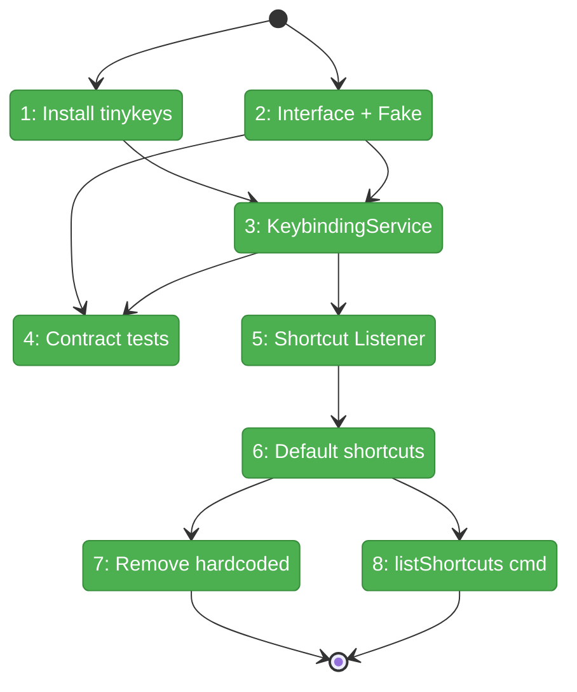
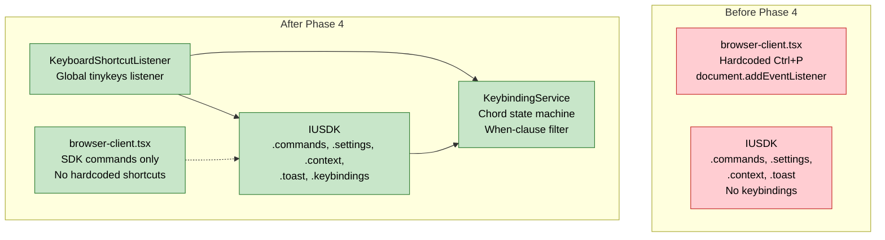

# Flight Plan: Phase 4 — Keyboard Shortcuts

**Phase**: Phase 4: Keyboard Shortcuts
**Plan**: [usdk-plan.md](../../usdk-plan.md)
**Tasks**: [tasks.md](./tasks.md)
**Status**: Landed

---

## Departure → Destination

**Where we are**: The SDK foundation (Phase 1), React integration (Phase 2), and command palette (Phase 3) are complete. Commands can be registered and executed via palette. But keyboard shortcuts are hardcoded — a single `document.addEventListener('keydown')` in browser-client.tsx handles Ctrl+P manually using deprecated `navigator.platform`. There is no shortcut registration, no chord support, no when-clause filtering, and no user configuration.

**Where we're going**: A KeybindingService manages all keyboard shortcuts through the SDK. Shortcuts support single keys and chord sequences with ~1000ms timeout. When-clauses conditionally enable shortcuts based on context. Ctrl+Shift+P opens the command palette, Ctrl+P focuses the file path bar — both through SDK-managed shortcuts. Users can view registered shortcuts via `sdk.listShortcuts`. The hardcoded Ctrl+P handler is deleted.

**Concrete outcomes**:
- Ctrl+Shift+P opens command palette via SDK shortcut (completes AC-05 from Phase 3)
- Ctrl+P focuses explorer bar for file navigation via SDK shortcut
- Chord sequences like Ctrl+K Ctrl+C resolve within 1000ms
- Shortcuts respect when-clauses (e.g., `!editorFocus`)
- `sdk.listShortcuts` shows all registered shortcuts in the palette
- Zero hardcoded keyboard listeners remain in the codebase

---

## Domain Context

### Domains We Change

| Domain | Relationship | Changes | Key Files |
|--------|-------------|---------|-----------|
| `_platform/sdk` | **extend** | Add IKeybindingService interface, KeybindingService implementation, FakeKeybindingService, KeyboardShortcutListener component, default shortcut bindings, sdk.listShortcuts command | `keybinding-service.ts`, `keyboard-shortcut-listener.tsx`, `sdk.interface.ts`, `fake-usdk.ts`, `sdk-bootstrap.ts` |
| `file-browser` | **modify** | Remove hardcoded Ctrl+P, register `file-browser.goToFile` SDK command | `browser-client.tsx` |

### Domains We Depend On

| Domain | Contract | Usage |
|--------|----------|-------|
| `_platform/sdk` (Phase 1) | `IContextKeyService.evaluate()` | When-clause check before shortcut fires |
| `_platform/sdk` (Phase 1) | `ICommandRegistry.execute()` | Execute command when shortcut resolves |
| `_platform/sdk` (Phase 2) | `useSDK()` | Access SDK from KeyboardShortcutListener |
| `_platform/sdk` (Phase 3) | `sdk.openCommandPalette` | Bind Ctrl+Shift+P to this command |

---

## Flight Status

**Legend**: grey = pending | yellow = active | red = blocked/needs input | green = done

---

## Stages

- [x] Install tinykeys dependency (T001)
- [x] Add IKeybindingService interface + FakeKeybindingService (T003)
- [x] Create KeybindingService (thin layer over tinykeys) (T002)
- [x] Add keybinding contract tests (T004)
- [x] Create KeyboardShortcutListener component (T005)
- [x] Register default shortcuts: Ctrl+Shift+P, Ctrl+P (T006)
- [x] Remove hardcoded Ctrl+P handler from browser-client (T007)
- [x] Register sdk.listShortcuts command (T008)

---

## Architecture: Before & After

---

## Acceptance Criteria

- [x] AC-05: Ctrl+Shift+P focuses explorer bar in command mode (deferred from Phase 3)
- [x] AC-11: Shortcuts trigger bound commands
- [x] AC-12: Chord sequences supported with ~1000ms timeout
- [x] AC-13: Hardcoded Ctrl+P removed, replaced by SDK shortcut
- [x] AC-14: Shortcuts respect when-clauses
- [x] AC-15: Users can view registered shortcuts
- [x] AC-30: Ctrl+P triggers go-to-file through SDK

---

## Goals & Non-Goals

**Goals**: tinykeys integration, KeybindingService with chord state machine, KeyboardShortcutListener component, default shortcut bindings, hardcoded Ctrl+P removal, sdk.listShortcuts command.

**Non-Goals**: No graphical shortcut editor (Phase 5), no domain-contributed shortcuts (Phase 6), no chord state indicator UI, no shortcut conflict resolution UI.

---

## Checklist

| ID | Task | CS |
|----|------|----|
| T001 | Install tinykeys | CS-1 |
| T002 | KeybindingService (thin layer over tinykeys) | CS-2 |
| T003 | IKeybindingService interface + FakeKeybindingService | CS-2 |
| T004 | Keybinding contract tests | CS-2 |
| T005 | KeyboardShortcutListener component | CS-2 |
| T006 | Register default shortcuts (Ctrl+Shift+P, Ctrl+P) | CS-2 |
| T007 | Remove hardcoded Ctrl+P from browser-client | CS-2 |
| T008 | Register sdk.listShortcuts command | CS-1 |
