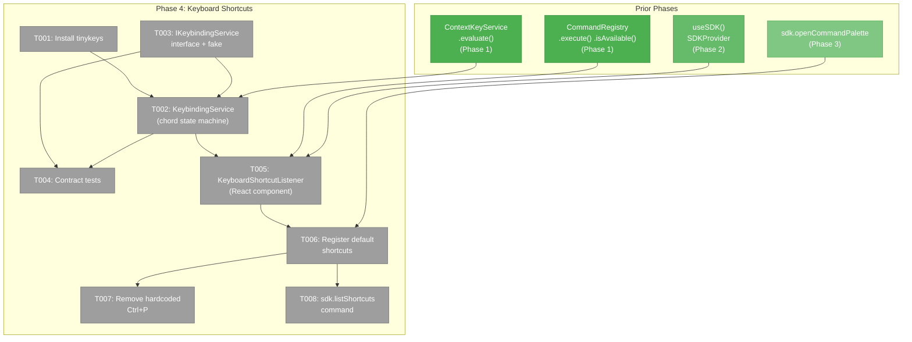
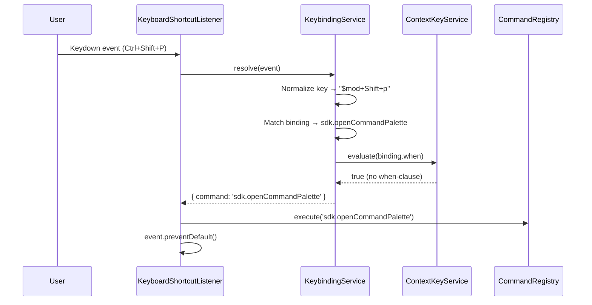
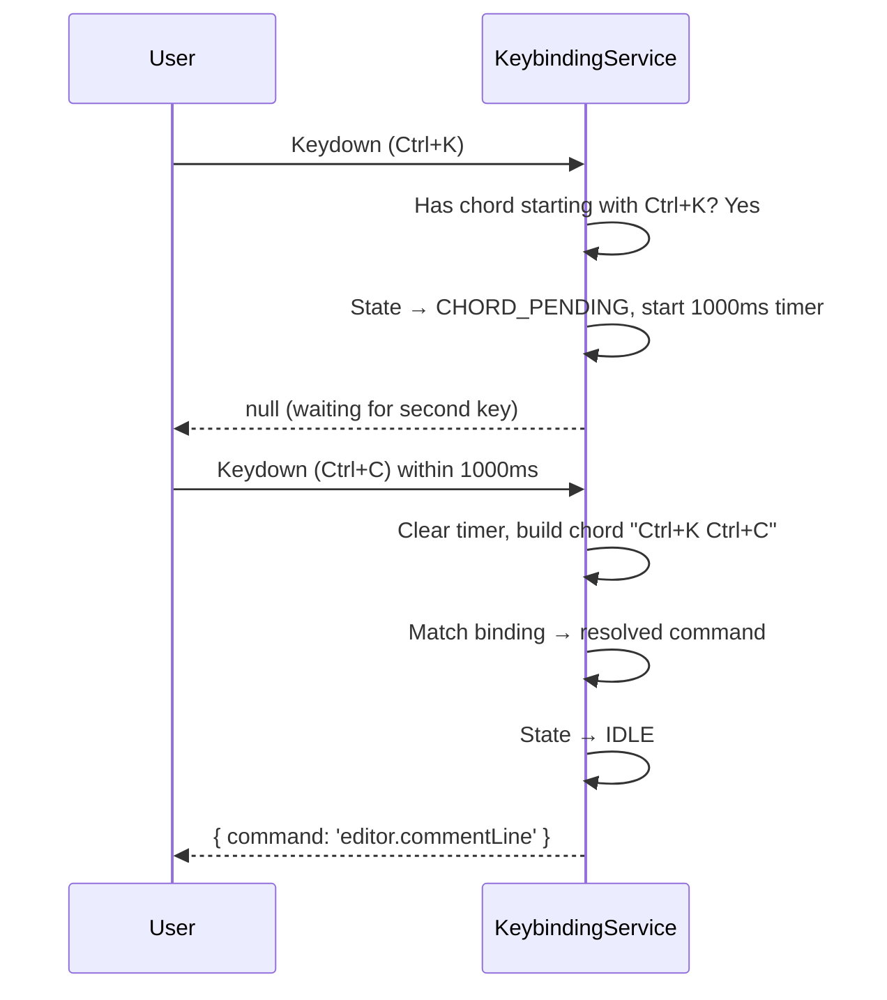

# Phase 4: Keyboard Shortcuts — Tasks

**Plan**: [usdk-plan.md](../../usdk-plan.md)
**Phase**: 4 of 6
**Domain**: `_platform/sdk` (extend) + `file-browser` (modify)
**Status**: Complete
**Created**: 2026-02-25

---

## Executive Briefing

**Purpose**: Add configurable keyboard shortcuts with chord support, replacing the hardcoded Ctrl+P handler with an SDK-managed shortcut system. This is the last infrastructure phase before user-facing settings.

**What We're Building**: A `KeybindingService` that resolves single shortcuts and chord sequences (e.g., Ctrl+K Ctrl+C) with when-clause filtering. A `<KeyboardShortcutListener>` client component that mounts a global keydown listener via tinykeys. Default bindings for Ctrl+Shift+P (palette), Ctrl+P (go-to-file). Shortcut persistence via sdkShortcuts in WorkspacePreferences.

**Goals**:
- ✅ tinykeys installed and integrated as shortcut engine
- ✅ Single shortcuts (Ctrl+P) trigger bound commands
- ✅ Chord sequences (Ctrl+K Ctrl+C) supported with ~1000ms timeout
- ✅ Shortcuts respect when-clauses from ContextKeyService
- ✅ Hardcoded Ctrl+P in browser-client.tsx removed, replaced by SDK shortcut
- ✅ Ctrl+Shift+P opens command palette via SDK shortcut
- ✅ `sdk.listShortcuts` command shows registered shortcuts in palette

**Non-Goals**:
- ❌ No settings page for shortcuts (Phase 5 — graphical shortcut editor)
- ❌ No domain SDK contributions (Phase 6 — domains register their shortcuts)
- ❌ No chord state indicator in the UI (future enhancement)
- ❌ No shortcut conflict resolution UI — just prevent duplicates at registration time
- ❌ No shortcut persistence/user overrides (Phase 5 — settings page)

---

## Prior Phase Context

### Phase 1: SDK Foundation (Complete ✅)

**A. Deliverables**: SDK interfaces (IUSDK, ICommandRegistry, ISDKSettings, IContextKeyService), value types (SDKCommand, SDKSetting, SDKKeybinding, SDKContribution), real implementations (CommandRegistry, SettingsStore, ContextKeyService), FakeUSDK, 50 contract tests, WorkspacePreferences extended with sdkSettings/sdkShortcuts/sdkMru.

**B. Dependencies for Phase 4**:
- `IContextKeyService.evaluate(expression)` — when-clause evaluation for shortcut filtering
- `ICommandRegistry.execute(id, params?)` — execute command when shortcut fires
- `ICommandRegistry.isAvailable(id)` — check if bound command is available
- `SDKKeybinding` type — already defined in `types.ts` (key, command, when?, args?)
- `sdkShortcuts: Record<string, string>` — already on WorkspacePreferences

**C. Gotchas**: DYK-01 (throws on duplicate command ID). DYK-05 (execute swallows handler errors). Zod v4 not v3. Subpath import `@chainglass/shared/sdk` only.

**D. Incomplete Items**: None.

**E. Patterns**: Map-based registries, `for...of` over `forEach`, interface-first development, contract tests.

### Phase 2: SDK Provider & Bootstrap (Complete ✅)

**A. Deliverables**: SDKProvider, useSDK(), useSDKSetting(), useSDKContext(), bootstrapSDK(), SDKWorkspaceConnector, updateSDKSettings server action.

**B. Dependencies for Phase 4**:
- `useSDK()` — access IUSDK for shortcut resolution
- `bootstrapSDK()` — shortcut listener needs the SDK instance
- SDKProvider mounted globally — keyboard listener can mount inside it
- `SDKWorkspaceConnector` hydrates sdkShortcuts — shortcut overrides available on load

**C. Gotchas**: DYK-P2-01 (imperative workspace data flow). DYK-P2-05 (bootstrap failure → no-op stub). useRef vs useState for mutable functions.

**D. Incomplete Items**: None.

**E. Patterns**: Global provider, workspace connector, useSyncExternalStore for reactivity.

### Phase 3: Command Palette (Complete ✅)

**A. Deliverables**: CommandPaletteDropdown (multi-mode), MruTracker, stub handlers, ExplorerPanel with palette mode, openPalette() handle, sdk.openCommandPalette command.

**B. Dependencies for Phase 4**:
- `sdk.openCommandPalette` — command to bind Ctrl+Shift+P to
- `ExplorerPanelHandle.focusInput()` — command to bind Ctrl+P to (go-to-file)
- `ExplorerPanelHandle.openPalette()` — already registered as SDK command

**C. Gotchas**: z.object({}).parse(undefined) → default `params ?? {}`. Processing guard on openPalette/focusInput. Only delegate Escape/Arrow/Enter to dropdown.

**D. Incomplete Items**: AC-05 (Ctrl+Shift+P) deferred to this phase.

**E. Patterns**: Register commands in the component that owns the ref (useEffect). Dispose on unmount.

---

## Pre-Implementation Check

| File | Exists? | Domain Check | Notes |
|------|---------|-------------|-------|
| `apps/web/src/lib/sdk/keybinding-service.ts` | No → **create** | ✅ `_platform/sdk` | Core shortcut resolution + chord state machine |
| `apps/web/src/lib/sdk/keyboard-shortcut-listener.tsx` | No → **create** | ✅ `_platform/sdk` | React client component mounting global listener |
| `apps/web/src/lib/sdk/sdk-bootstrap.ts` | Yes → **modify** | ✅ `_platform/sdk` | Wire keybinding service into IUSDK |
| `apps/web/src/lib/sdk/sdk-provider.tsx` | Yes → **modify** | ✅ `_platform/sdk` | Mount KeyboardShortcutListener |
| `apps/web/app/(dashboard)/workspaces/[slug]/browser/browser-client.tsx` | Yes → **modify** | ✅ `file-browser` | Remove hardcoded Ctrl+P, register SDK shortcut |
| `packages/shared/src/interfaces/sdk.interface.ts` | Yes → **modify** | ✅ `_platform/sdk` | Add IKeybindingService to IUSDK |
| `packages/shared/src/fakes/fake-usdk.ts` | Yes → **modify** | ✅ `_platform/sdk` | Add FakeKeybindingService |
| `test/contracts/sdk.contract.ts` | Yes → **modify** | ✅ `_platform/sdk` | Add keybinding contract tests |

**Concept duplication check**: No existing keybinding service, shortcut listener, or tinykeys usage in codebase. The hardcoded Ctrl+P in browser-client.tsx (lines 285-301) is the only keyboard shortcut handler — to be replaced.

---

## Architecture Map



---

## Tasks

| Status | ID | Task | Domain | Path(s) | Done When | Notes |
|--------|-----|------|--------|---------|-----------|-------|
| [x] | T001 | **Install tinykeys** — `pnpm add tinykeys` in apps/web. Verify importable. | `_platform/sdk` | `apps/web/package.json` | `import { tinykeys } from 'tinykeys'` compiles without error | Per finding 07. tinykeys uses `code` property (layout-independent). |
| [x] | T002 | **Create KeybindingService** — Thin registration and when-clause layer over tinykeys (DYK-P4-01: tinykeys owns chord resolution). Methods: `register(binding: SDKKeybinding): { dispose }`, `getBindings(): SDKKeybinding[]`, `buildTinykeysMap(): Record<string, (e: KeyboardEvent) => void>` (generates tinykeys-compatible binding map with when-clause checks + command execution). When-clause: check `contextKeys.evaluate(binding.when)` before executing. Key format: tinykeys native format (`$mod+Shift+p`, `$mod+k $mod+c` for chords). Conflict detection: throws on duplicate key binding. | `_platform/sdk` | `apps/web/src/lib/sdk/keybinding-service.ts` | Single shortcuts resolve. Chord sequences resolve (via tinykeys). When-clause blocks disabled shortcuts. Duplicate key throws. | DYK-P4-01: No custom chord state machine — tinykeys handles it. CS-2. |
| [x] | T003 | **Add IKeybindingService to SDK interface + FakeKeybindingService** — Interface: `register`, `getBindings`, `resolve`, `dispose`. Add `keybindings: IKeybindingService` to IUSDK. Create FakeKeybindingService in fake-usdk.ts with same map-based pattern as FakeCommandRegistry. Update createNoOpSDK stub in sdk-provider. | `_platform/sdk` | `packages/shared/src/interfaces/sdk.interface.ts`, `packages/shared/src/fakes/fake-usdk.ts`, `apps/web/src/lib/sdk/sdk-provider.tsx` | IUSDK has `.keybindings` field. FakeKeybindingService tracks registrations. No-op stub compiles. | Interface-first development per Phase 1 pattern. |
| [x] | T004 | **Add keybinding contract tests** — Extend `sdk.contract.ts` with keybinding tests. Test: (1) register single shortcut, (2) register chord, (3) resolve single shortcut, (4) resolve chord within timeout, (5) chord timeout resets to idle, (6) when-clause blocks resolution, (7) duplicate key throws, (8) dispose removes binding, (9) getBindings returns all. Run against both Fake and Real. | `_platform/sdk` | `test/contracts/sdk.contract.ts`, `test/contracts/sdk.contract.test.ts` | 9+ keybinding contract tests pass for both Fake and Real implementations | Per Phase 1 pattern: contract factory with parameterized create function. |
| [x] | T005 | **Create KeyboardShortcutListener** — Client component mounted inside SDKProvider. Uses tinykeys to attach a global keydown listener on `document`. On keydown: (1) normalize event, (2) call `sdk.keybindings.resolve(event)`, (3) if resolved and command available → `sdk.commands.execute(binding.command, binding.args)`, (4) `event.preventDefault()`. Listens for keybinding changes to re-bind. Cleanup on unmount. | `_platform/sdk` | `apps/web/src/lib/sdk/keyboard-shortcut-listener.tsx` | Global shortcuts fire. Component cleanup removes listeners. | Mount in SDKProvider. tinykeys cleanup via returned unsubscribe. |
| [x] | T006 | **Register default shortcuts** — In bootstrap, register default bindings (DYK-P4-05: bindings are static key→commandId maps, no command existence check needed): (1) `$mod+Shift+p` → `sdk.openCommandPalette`, (2) `$mod+p` → `file-browser.goToFile`. Register `file-browser.goToFile` command in browser-client.tsx useEffect (same ref closure pattern as openCommandPalette). KeyboardShortcutListener checks `isAvailable()` at fire time — graceful no-op if command not mounted. | `_platform/sdk`, `file-browser` | `apps/web/src/lib/sdk/sdk-bootstrap.ts`, `apps/web/app/(dashboard)/workspaces/[slug]/browser/browser-client.tsx` | Ctrl+Shift+P opens palette. Ctrl+P focuses explorer bar for file path. Both via SDK shortcuts. | DYK-P4-05: Bindings static in bootstrap, commands dynamic via useEffect. |
| [x] | T007 | **Remove hardcoded Ctrl+P handler** — Delete the `useEffect` at browser-client.tsx lines 285-301 that manually listens for Ctrl+P/Cmd+P. The SDK shortcut from T006 replaces it. DYK-P4-03: Keep the CodeMirror focus guard as an inline check in the `file-browser.goToFile` command handler (`if (document.activeElement?.closest('.cm-editor')) return`) — no context key wiring needed yet. | `file-browser` | `apps/web/app/(dashboard)/workspaces/[slug]/browser/browser-client.tsx` | No `document.addEventListener('keydown')` for Ctrl+P. Ctrl+P still works via SDK shortcut. CodeMirror focus doesn't trigger shortcut. | DYK-P4-03: Inline `.cm-editor` check in handler, not context key. |
| [x] | T008 | **Register sdk.listShortcuts command** — Command that lists all registered shortcuts. Handler: collect `sdk.keybindings.getBindings()`, format as readable list, show in toast or log to console. Registered in bootstrap. | `_platform/sdk` | `apps/web/src/lib/sdk/sdk-bootstrap.ts` | `sdk.commands.execute('sdk.listShortcuts')` shows registered shortcuts. Command appears in palette. | Simple command — logs to console and toasts summary. |

---

## Context Brief

### Key Findings from Plan

- **Finding 07** (Medium): No tinykeys installed. Install in apps/web. Single global listener approach per external research.
- **Finding 08** (Medium): Hardcoded Ctrl+P uses deprecated `navigator.platform`. Two risks: deprecated API and race with SDK palette. Remove and replace.
- **Risk**: Browser shortcut conflicts (Ctrl+P = Print). tinykeys' `preventDefault` mitigates. Document known conflicts.
- **Risk**: tinykeys edge cases (international layouts, chords). Manual testing; fallback to document unsupported.

### DYK Insights from Prior Phases (Relevant)

- **DYK-01**: `register()` throws on duplicate ID. Same pattern for keybinding registration — throw on duplicate key.
- **DYK-05**: `execute()` swallows handler errors. Shortcut listener relies on this — no extra error handling needed after `execute()`.
- **DYK-P3-05**: Register commands in the component that owns the ref. `file-browser.goToFile` handler needs `explorerRef` — register in browser-client.tsx useEffect.

### External Research (keyboard-shortcuts-react.md)

- **tinykeys**: Uses `code` property (physical key, layout-independent). Chord support via space-separated syntax `"$mod+k $mod+c"` with configurable timeout (default 1000ms). Minimal size.
- **Chord state machine**: IDLE → CHORD_PENDING(firstKey, timeoutId) → RESOLVED/TIMEOUT → IDLE.
- **Key normalization**: `$mod` → Ctrl on Windows/Linux, Cmd on macOS. Use `event.key` for printable characters, `event.code` for special keys.
- **Cannot override**: Ctrl+T (new tab), Ctrl+W (close tab), Ctrl+N (new window), F11 (fullscreen).
- **Safe to override**: Ctrl+P (print), Ctrl+S (save), Ctrl+G (find next), Ctrl+K (chord starter), Ctrl+Shift+P (no default).

### Domain Dependencies

| Domain | Contract | What We Use |
|--------|----------|-------------|
| `_platform/sdk` (Phase 1) | `ICommandRegistry.execute()`, `.isAvailable()` | Execute command when shortcut resolves |
| `_platform/sdk` (Phase 1) | `IContextKeyService.evaluate()` | When-clause check before shortcut fires |
| `_platform/sdk` (Phase 1) | `SDKKeybinding` type | Binding data structure |
| `_platform/sdk` (Phase 2) | `useSDK()` | Access SDK from KeyboardShortcutListener |
| `_platform/sdk` (Phase 2) | `bootstrapSDK()` | Wire keybinding service at bootstrap |
| `_platform/sdk` (Phase 3) | `sdk.openCommandPalette` | Command to bind Ctrl+Shift+P to |

### Domain Constraints

- **`_platform/sdk` owns keyboard infrastructure**: KeybindingService, KeyboardShortcutListener, default bindings.
- **`file-browser` owns its commands**: `file-browser.goToFile` registered where the ref lives (browser-client.tsx).
- **No breaking existing navigation**: Ctrl+P must still focus the explorer bar after migration.
- **Interface changes require fake update**: Adding `IKeybindingService` to IUSDK means updating FakeUSDK and no-op stub.

### Reusable from Prior Phases

- `IContextKeyService.evaluate()` — ready for when-clause checks
- `ICommandRegistry.execute(id, params)` — shortcut resolution calls this
- `SDKKeybinding` type — already defined, unchanged
- `sdkShortcuts` field on WorkspacePreferences — already defined, unused until now
- Contract test factory pattern — extend for keybinding tests
- useEffect register/dispose pattern from Phase 3 — same pattern for command registration

### System Flow: Shortcut Resolution



### System Flow: Chord Sequence



---

## Critical Insights (2026-02-25)

| # | Insight | Decision |
|---|---------|----------|
| DYK-P4-01 | tinykeys already handles chords natively — custom state machine in T002 is redundant | KeybindingService is thin registration + when-clause layer; tinykeys owns chord resolution. T002 drops to CS-2. |
| DYK-P4-02 | Plan task 4.5 (shortcut persistence via sdkShortcuts) was dropped from dossier | Defer persistence to Phase 5 (settings page). Phase 4 registers defaults in code only. Removed persistence goal from briefing. |
| DYK-P4-03 | T007's CodeMirror guard via `editorFocus` context key — no task sets it | Keep inline `.cm-editor` check in command handler. Context key wiring deferred. |
| DYK-P4-04 | Adding `keybindings` to IUSDK ripples through FakeUSDK, createNoOpSDK, bootstrapSDK, contract tests | T003 executes first to establish type shape. Update all IUSDK-shaped objects in one pass. |
| DYK-P4-05 | Default shortcut bindings can't require commands to exist at registration time | Bindings register in bootstrap (static key→commandId maps). KeyboardShortcutListener checks `isAvailable()` at fire time — graceful no-op if command not mounted. |

---

## Discoveries & Learnings

_Populated during implementation by plan-6._

| Date | Task | Type | Discovery | Resolution | References |
|------|------|------|-----------|------------|------------|

---

## Directory Layout

```
docs/plans/047-usdk/
  └── tasks/
      ├── phase-1-sdk-foundation/       (complete ✅)
      ├── phase-2-sdk-provider-bootstrap/ (complete ✅)
      ├── phase-3-command-palette/       (complete ✅)
      └── phase-4-keyboard-shortcuts/
          ├── tasks.md              ← this file
          ├── tasks.fltplan.md      ← flight plan (below)
          └── execution.log.md     ← created by plan-6
```
