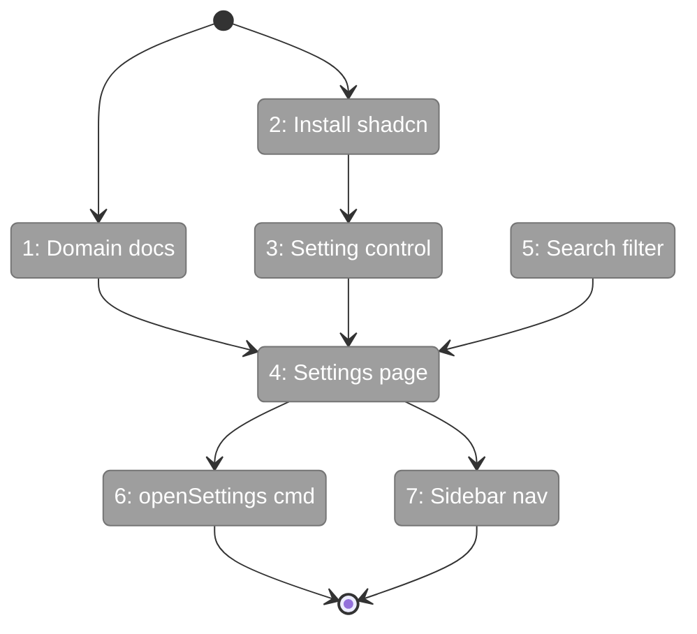
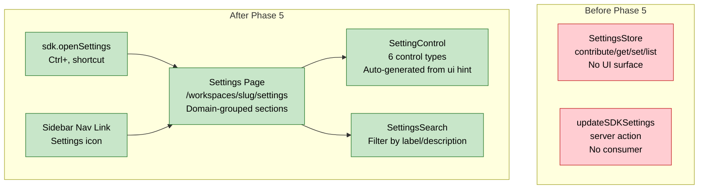

# Flight Plan: Phase 5 — Settings Domain & Page

**Phase**: Phase 5: Settings Domain & Page
**Plan**: [usdk-plan.md](../../usdk-plan.md)
**Tasks**: [tasks.md](./tasks.md)
**Status**: Landed

---

## Departure → Destination

**Where we are**: The SDK has a fully working settings store (Phase 1) with React hooks (Phase 2), a command palette (Phase 3), and keyboard shortcuts (Phase 4). Settings can be contributed, read, written, and persisted — but there's no UI for users to discover or modify them. The only way to change an SDK setting is programmatically.

**Where we're going**: Users can navigate to `/workspaces/{slug}/settings` (or Ctrl+,) and see all contributed settings organized by domain/section. Each setting renders the appropriate control (toggle, select, text, number, color, emoji). Changes persist immediately and survive page reload. The settings page is the first real dogfood of the SDK's publish/consume pattern.

**Concrete outcomes**:
- `/workspaces/slug/settings` renders a searchable, domain-grouped settings page
- Toggle a boolean setting → Switch component → value persists
- Select an enum setting → Select dropdown → value persists
- Ctrl+, opens settings from anywhere in the workspace
- "Open Settings" appears in command palette
- Settings sidebar link appears in workspace navigation
- Empty state shows gracefully when no domains have contributed settings (until Phase 6)

---

## Domain Context

### Domains We Change

| Domain | Relationship | Changes | Key Files |
|--------|-------------|---------|-----------|
| `_platform/settings` | **NEW** | New domain: settings page, controls, search, domain docs | `settings-page.tsx`, `setting-control.tsx`, `settings-search.tsx`, `domain.md` |
| `_platform/sdk` | **extend** | Register openSettings command + Ctrl+, shortcut | `sdk-bootstrap.ts` |

### Domains We Depend On

| Domain | Contract | Usage |
|--------|----------|-------|
| `_platform/sdk` (Phase 1) | `ISDKSettings.list()`, `.get()`, `.set()`, `.reset()` | Settings data operations |
| `_platform/sdk` (Phase 2) | `useSDK()`, `useSDKSetting()` | React hooks for settings reactivity |
| `_platform/sdk` (Phase 4) | `IKeybindingService.register()` | Ctrl+, shortcut binding |

---

## Flight Status

**Legend**: grey = pending | yellow = active | red = blocked/needs input | green = done

---

## Stages

- [x] Create settings domain documentation + registry (T001)
- [x] Install shadcn Switch and Select components (T002)
- [x] Create setting-control.tsx renderer (T003)
- [x] Create settings search/filter (T005)
- [x] Create settings page route + component (T004)
- [x] Register sdk.openSettings command + Ctrl+, (T006)
- [x] Wire existing settings button to unified settings page (T007)

---

## Architecture: Before & After

---

## Acceptance Criteria

- [x] AC-21: Settings page renders all contributed settings grouped by section
- [x] AC-22: Appropriate control renders per ui hint
- [x] AC-23: Settings roundtrip works end-to-end through settings page
- [x] AC-24: Search filters settings by label/description
- [~] AC-27: Separate contribution manifest from handler binding (Phase 6)

---

## Goals & Non-Goals

**Goals**: Settings page with auto-generated controls, domain-grouped sections, search/filter, openSettings command with Ctrl+, shortcut, sidebar navigation link.

**Non-Goals**: No shortcut editor, no import/export, no per-worktree settings, no domain contributions (Phase 6), no settings migration.

---

## Checklist

| ID | Task | CS |
|----|------|----|
| T001 | Settings domain documentation | CS-1 |
| T002 | Install shadcn Switch + Select | CS-1 |
| T003 | Setting control renderer (4 types) | CS-2 |
| T004 | Settings page route + component | CS-3 |
| T005 | Settings search/filter | CS-2 |
| T006 | openSettings command + Ctrl+, | CS-2 |
| T007 | Sidebar nav link | CS-1 |
