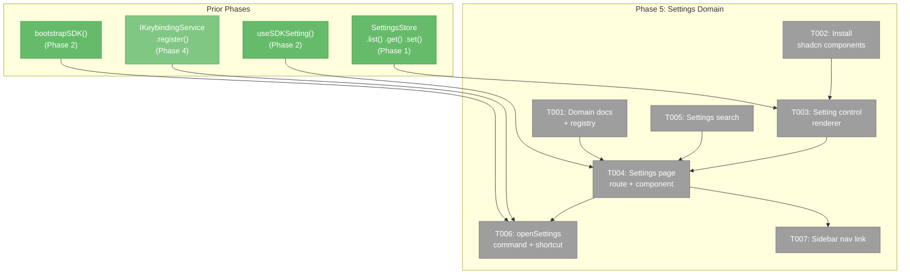
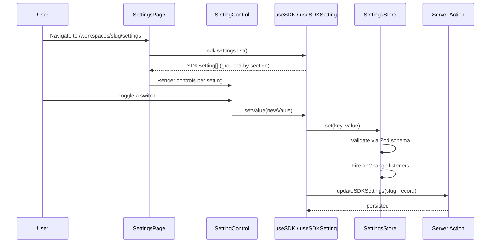
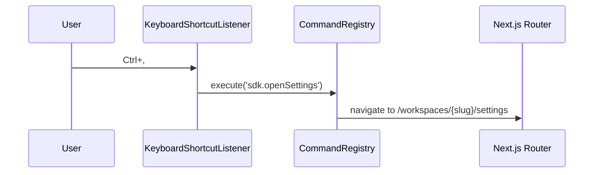

# Phase 5: Settings Domain & Page — Tasks

**Plan**: [usdk-plan.md](../../usdk-plan.md)
**Phase**: 5 of 6
**Domain**: `_platform/settings` (NEW) + `_platform/sdk` (extend)
**Status**: Complete
**Created**: 2026-02-25

---

## Executive Briefing

**Purpose**: Create the settings domain with a domain-organised settings page where users can view and modify SDK settings contributed by any domain. This is the first real dogfood of the SDK system — the settings page itself is an SDK consumer.

**What We're Building**: A new route at `/workspaces/[slug]/settings` with a settings page that auto-generates UI controls from `SDKSetting.ui` hints. Settings are grouped by domain/section, searchable by label/description, and persist via the existing sdkSettings mechanism in WorkspacePreferences. An `sdk.openSettings` command navigates to the page from the command palette.

**Goals**:
- ✅ Settings page at `/workspaces/[slug]/settings` with domain-organised sections
- ✅ Auto-generated controls: toggle (Switch), select (Select), text (Input), number (Input)
- ✅ Settings search/filter by label and description
- ✅ Settings roundtrip: edit → persist → reload → value preserved
- ✅ `sdk.openSettings` command registered, appears in palette
- ✅ Ctrl+, shortcut bound to open settings
- ✅ Settings domain documentation (`docs/domains/_platform/settings/domain.md`)

**Non-Goals**:
- ❌ No graphical shortcut editor (future enhancement)
- ❌ No settings import/export
- ❌ No per-worktree settings (all workspace-scoped via WorkspacePreferences)
- ❌ No domain SDK contributions (Phase 6 — domains register their settings)
- ❌ No settings migration/versioning
- ❌ No color/emoji control types (Phase 6 — extract pickers from file-browser to shared UI first)

---

## Prior Phase Context

### Phases 1-4 Summary

**A. Available APIs for Phase 5**:
- `ISDKSettings`: `contribute()`, `get()`, `set()`, `reset()`, `onChange()`, `list()`, `toPersistedRecord()`
- `useSDK()` — access IUSDK from settings page components
- `useSDKSetting(key)` — `[value, setter]` with auto re-render via useSyncExternalStore
- `SDKSetting` type — `key`, `domain`, `label`, `description`, `schema`, `ui`, `options`, `section`
- `SDKWorkspaceConnector` — hydrates sdkSettings from WorkspacePreferences on mount
- `updateSDKSettings` server action — persists sdkSettings to workspace
- `IKeybindingService.register()` — bind Ctrl+, to settings command
- `bootstrapSDK()` — wire settings command and shortcut here

**B. Gotchas**:
- DYK-02: `SettingsStore.get()` returns stable references — don't wrap in new objects
- DYK-04: Zod v4 (`^4.3.5`), not v3 — workshop examples use v3 syntax
- DYK-P2-02: Toast imports sonner directly (not via execute)
- DYK-P4-02: Shortcut persistence deferred — register Ctrl+, binding in bootstrap code only

**C. Deferred to Phase 5**:
- Settings page UI (no UI exists yet for viewing/editing SDK settings)
- Domain-contributed settings will be empty until Phase 6 — page must handle empty state

---

## Pre-Implementation Check

| File | Exists? | Domain Check | Notes |
|------|---------|-------------|-------|
| `docs/domains/_platform/settings/domain.md` | No → **create** | ✅ `_platform/settings` | New domain documentation |
| `apps/web/app/(dashboard)/workspaces/[slug]/settings/page.tsx` | No → **create** | ✅ `_platform/settings` | Server component route entry |
| `apps/web/src/features/settings/components/settings-page.tsx` | No → **create** | ✅ `_platform/settings` | Client component — settings UI |
| `apps/web/src/features/settings/components/setting-control.tsx` | No → **create** | ✅ `_platform/settings` | Generic control renderer |
| `apps/web/src/features/settings/components/settings-search.tsx` | No → **create** | ✅ `_platform/settings` | Search/filter input |
| `apps/web/src/lib/sdk/sdk-bootstrap.ts` | Yes → **modify** | ✅ `_platform/sdk` | Register openSettings + Ctrl+, binding |
| `apps/web/src/components/dashboard-sidebar.tsx` | Yes → **modify** | ✅ cross-domain | Add workspace-level settings nav link |
| `apps/web/src/components/ui/switch.tsx` | No → **install** | ✅ shadcn | `npx shadcn@latest add switch` |
| `apps/web/src/components/ui/select.tsx` | No → **install** | ✅ shadcn | `npx shadcn@latest add select` |

**Concept duplication check**: No existing settings page in `/workspaces/[slug]/settings`. Existing `/settings/workspaces` is a global workspace management page (different purpose). No existing `setting-control` or `settings-search` components.

---

## Architecture Map



---

## Tasks

| Status | ID | Task | Domain | Path(s) | Done When | Notes |
|--------|-----|------|--------|---------|-----------|-------|
| [x] | T001 | **Create settings domain documentation** — `docs/domains/_platform/settings/domain.md` with purpose, boundary, contracts, composition, source location, dependencies. Update `docs/domains/registry.md` (add row) and `docs/domains/domain-map.md` (add node + edges). | `_platform/settings` | `docs/domains/_platform/settings/domain.md`, `docs/domains/registry.md`, `docs/domains/domain-map.md` | Domain registered in registry, domain.md exists with standard sections, domain-map has settings node | Per plan task 5.1 |
| [x] | T002 | **Install shadcn Switch and Select** — `npx shadcn@latest add switch select`. These are needed for toggle and enum setting controls. Verify imports work. | `_platform/settings` | `apps/web/src/components/ui/switch.tsx`, `apps/web/src/components/ui/select.tsx` | Switch and Select components importable from `@/components/ui/` | Per workshop 003 §7: Switch for boolean, Select for enum |
| [x] | T003 | **Create setting-control.tsx** — Generic renderer that takes an `SDKSetting` and current value, renders the appropriate control based on `setting.ui` hint. Controls: `'toggle'` → `<Switch>`, `'select'` → `<Select>` with `setting.options`, `'text'` → `<Input>`, `'number'` → `<Input type="number">`. DYK-P5-02: No color/emoji controls — pickers live in file-browser domain, can't import cross-domain. Each control calls `sdk.settings.set(key, value)` on change. Show label, description, and reset-to-default button. | `_platform/settings` | `apps/web/src/features/settings/components/setting-control.tsx` | All 4 ui hint types render correct control. Changing value calls sdk.settings.set(). Reset button restores default. | Per workshop 003 §7. Use useSDKSetting hook for reactivity. |
| [x] | T004 | **Create settings page route + component** — Server component at `/workspaces/[slug]/settings/page.tsx` (resolves workspace, passes slug). Client component `settings-page.tsx` reads `sdk.settings.list()`, groups by `setting.section` (falls back to `setting.domain`), renders sections with `<SettingControl>` per setting. DYK-P5-01: Register 2–3 demo settings in bootstrapSDK to dogfood (e.g., `appearance.theme` toggle, `editor.fontSize` number, `editor.wordWrap` select). DYK-P5-05: Single unified page — shows conditional "Worktree" section when `useWorkspaceContext()` has a slug. Persistence via `useSDKSetting` hook. DYK-P5-04: Add 300ms debounce to persist calls in useSDKSetting to prevent concurrent write races. | `_platform/settings` | `apps/web/app/(dashboard)/workspaces/[slug]/settings/page.tsx`, `apps/web/src/features/settings/components/settings-page.tsx` | Page renders at `/workspaces/[slug]/settings`. Settings grouped by section. Demo settings render and persist. Edit → reload → value preserved. Worktree section appears only inside workspace. | AC-21, AC-23. DYK-P5-01, DYK-P5-04, DYK-P5-05. |
| [x] | T005 | **Create settings-search.tsx** — Search input at top of settings page. Filters visible settings by matching label or description (case-insensitive substring). Clears on Escape. Shows match count. | `_platform/settings` | `apps/web/src/features/settings/components/settings-search.tsx` | Typing filters settings. Empty search shows all. Escape clears. Match count displayed. | AC-24. Simple client-side filter — no debounce needed. |
| [x] | T006 | **Register sdk.openSettings command + Ctrl+, shortcut** — Register `sdk.openSettings` command in bootstrapSDK. DYK-P5-03: Handler parses workspace slug from `window.location.pathname` at execution time (`pathname.match(/\/workspaces\/([^/]+)/)?.[1]`). If no workspace in URL, toast "Open a workspace first". Register `$mod+Comma` keybinding → `sdk.openSettings`. | `_platform/sdk` | `apps/web/src/lib/sdk/sdk-bootstrap.ts` | `sdk.openSettings` appears in palette. Ctrl+, navigates to settings page. Shows toast if not in workspace. | DYK-P5-03: Slug from URL at execution time. |
| [x] | T007 | **Wire existing settings button to unified settings page** — DYK-P5-05: Single settings page, one button. The existing `/settings/workspaces` link in `dashboard-sidebar.tsx` should route to the SDK settings page instead (or alongside). When inside a workspace (slug available via `useWorkspaceContext()`), navigate to `/workspaces/{slug}/settings`. When outside workspace, navigate to `/settings/workspaces` (existing global settings). Settings page shows a conditional "Worktree" section only when workspace context is available. | cross-domain | `apps/web/src/components/dashboard-sidebar.tsx` | Settings button navigates to workspace settings when in workspace. Navigates to global settings when not. No new sidebar links added. | DYK-P5-05: One button, one page, conditional sections. |

---

## Context Brief

### Key Findings from Plan

- **Workshop 003 §7**: Setting controls auto-generated from `SDKSetting.ui` hints. Six control types mapped to shadcn/existing components.
- **Workshop 003 §5.3**: Settings persist via `updateSDKSettings` server action → `WorkspacePreferences.sdkSettings`.
- **OQ-1 Resolution**: Shortcuts live in `sdkShortcuts` (separate from `sdkSettings`). Settings page doesn't touch shortcuts.
- **Risk**: Settings page UX may need iteration. Empty state is expected until Phase 6 adds domain contributions.

### Domain Dependencies

| Domain | Contract | What We Use |
|--------|----------|-------------|
| `_platform/sdk` (Phase 1) | `ISDKSettings.list()`, `.get()`, `.set()`, `.reset()` | Read settings list, get/set values, reset to default |
| `_platform/sdk` (Phase 1) | `SDKSetting` type | `.ui`, `.label`, `.description`, `.section`, `.domain`, `.options` for rendering |
| `_platform/sdk` (Phase 2) | `useSDKSetting(key)` | Reactive setting value + setter in controls |
| `_platform/sdk` (Phase 2) | `useSDK()` | Access sdk.settings.list() for full settings list |
| `_platform/sdk` (Phase 4) | `IKeybindingService.register()` | Bind Ctrl+, to openSettings |

### Domain Constraints

- **`_platform/settings` owns settings UI**: Page, controls, search all in `features/settings/`.
- **`_platform/sdk` owns settings data**: SettingsStore, persistence, hooks. Settings domain only reads/writes through SDK API.
- **No direct WorkspacePreferences access**: Settings page uses `useSDKSetting()` hook, never reads WorkspacePreferences directly.
- **Shadcn components**: Use existing `Switch`, `Select`, `Input` from `@/components/ui/`. Install Switch + Select if missing.

### Reusable from Prior Phases

- `useSDKSetting(key)` — returns `[value, setValue]`, auto re-renders on change, auto-persists
- `useSDK()` — access `sdk.settings.list()` for the full settings catalog
- `SDKSetting` type — all display fields available
- `updateSDKSettings` server action — already wired in SDKWorkspaceConnector

### System Flow: Settings Page



### System Flow: openSettings Command



---

## Critical Insights (2026-02-25)

| # | Insight | Decision |
|---|---------|----------|
| DYK-P5-01 | Settings page empty until Phase 6 — no domains contribute SDKSettings yet | Register 2–3 demo settings in bootstrapSDK (theme toggle, fontSize number, wordWrap select). Phase 6 moves to domain contributions. |
| DYK-P5-02 | ColorPicker/EmojiPicker live in file-browser domain — importing violates domain boundaries | Drop color/emoji control types from Phase 5. Only toggle, select, text, number. Extract pickers to shared in Phase 6. |
| DYK-P5-03 | sdk.openSettings registered in bootstrap but needs workspace slug from URL | Parse slug from `window.location.pathname` at execution time. Toast "Open a workspace first" if not in workspace. |
| DYK-P5-04 | Rapid setting changes fire concurrent server actions — last-write-wins can lose data | Add 300ms debounce to persist call in useSDKSetting. In-memory updates instant, server action batched. |
| DYK-P5-05 | Single settings page with conditional worktree section, not a second sidebar link | One settings button, one page. Worktree section visible only when useWorkspaceContext() has slug. |

---

## Discoveries & Learnings

_Populated during implementation by plan-6._

| Date | Task | Type | Discovery | Resolution | References |
|------|------|------|-----------|------------|------------|

---

## Directory Layout

```
docs/plans/047-usdk/
  └── tasks/
      ├── phase-1-sdk-foundation/       (complete ✅)
      ├── phase-2-sdk-provider-bootstrap/ (complete ✅)
      ├── phase-3-command-palette/       (complete ✅)
      ├── phase-4-keyboard-shortcuts/    (complete ✅)
      └── phase-5-settings-domain/
          ├── tasks.md              ← this file
          ├── tasks.fltplan.md      ← flight plan (below)
          └── execution.log.md     ← created by plan-6
```
