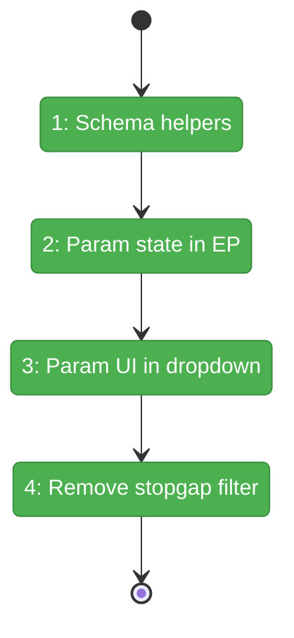
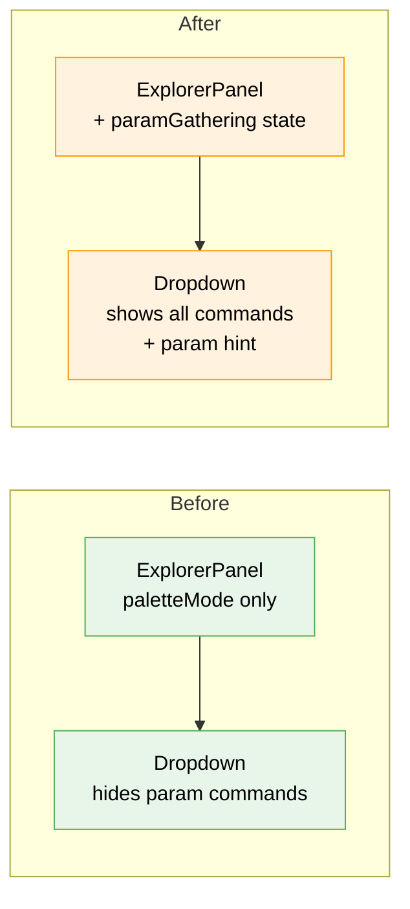

# Flight Plan: Subtask 001 — Palette Single-Parameter Input

**Subtask**: [001-subtask-palette-param-input.md](./001-subtask-palette-param-input.md)
**Phase**: Phase 6: SDK Wraps, Go-to-Line & Polish
**Plan**: [usdk-plan.md](../../usdk-plan.md)
**Status**: Landed

---

## Departure → Destination

**Where we are**: Parameterised commands are hidden from the palette via `safeParse({})` filter. Selecting them would crash with ZodError. `toast.show` and `openFileAtLine` are invisible to users.

**Where we're going**: Users select `> Show Toast Notification`, the palette prompts for a message, user types it, presses Enter, toast appears. All commands visible and usable.

---

## Domain Context

### Domains We Change

| Domain | Relationship | Changes | Key Files |
|--------|-------------|---------|-----------|
| `_platform/panel-layout` | **modify** | Param gathering state, schema introspection, inline input, remove stopgap filter | `explorer-panel.tsx`, `command-palette-dropdown.tsx` |

### Domains We Depend On

| Domain | Contract | Usage |
|--------|----------|-------|
| `_platform/sdk` | `ICommandRegistry.execute(id, params)` | Execute with gathered params |
| `_platform/sdk` | `SDKCommand.params` (Zod schema) | Introspect for required fields |

---

## Flight Status

**Legend**: grey = pending | yellow = active | red = blocked/needs input | green = done

---

## Stages

- [x] Create `hasRequiredParams` + `extractFirstRequired` helpers (ST001)
- [x] Add param gathering state to ExplorerPanel (ST002)
- [x] Render param input hint in dropdown (ST003)
- [x] Remove safeParse stopgap filter (ST004)

---

## Architecture: Before & After

---

## Acceptance Criteria

- [x] `toast.show` visible in palette, prompts for message, executes with typed value
- [x] Commands with no required params execute immediately (no prompt)
- [x] Escape from param input returns to command list
- [x] Enter with empty input does nothing (no crash)

---

## Checklist

| ID | Task | CS |
|----|------|----|
| ST001 | Schema introspection helpers | CS-1 |
| ST002 | Param gathering state in ExplorerPanel | CS-2 |
| ST003 | Param input hint in dropdown | CS-1 |
| ST004 | Remove stopgap filter | CS-1 |
