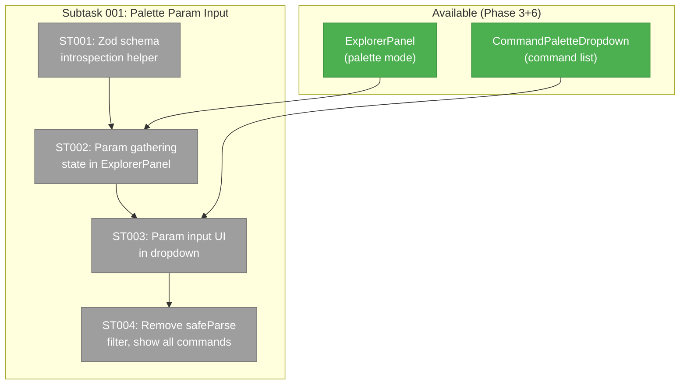
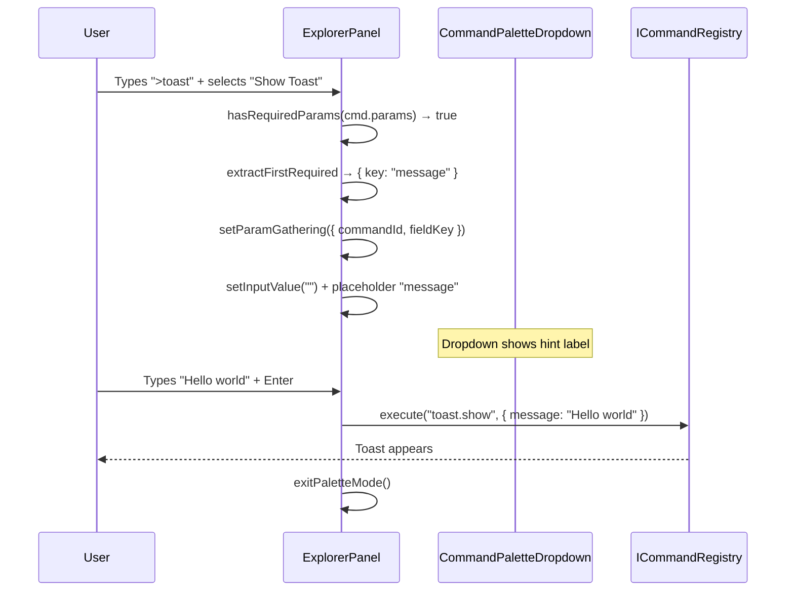

# Subtask 001: Command Palette Single-Parameter Input

**Parent Phase**: Phase 6: SDK Wraps, Go-to-Line & Polish
**Parent Task**: T002 (events/toast SDK contribution) — `toast.show` is the primary use case
**Plan**: [usdk-plan.md](../../usdk-plan.md)
**Workshop**: [005-command-palette-parameter-gathering.md](../../workshops/005-command-palette-parameter-gathering.md)
**Status**: Pending
**Created**: 2026-02-25

---

## Parent Context

Phase 6 registered parameterised SDK commands (`toast.show`, `file-browser.openFileAtLine`) to the palette. However, the palette has no way to gather parameters — selecting a parameterised command crashed with a ZodError. A stopgap was applied (hide commands that fail `safeParse({})`) but this defeats discoverability. This subtask implements the "single-string parameter input" tier from Workshop 005.

---

## Executive Briefing

**Purpose**: When a user selects a command with a required string parameter from the command palette, the palette should transition to an inline input step — asking for the value before executing. This restores `toast.show` (and similar commands) to the palette while preventing ZodError crashes.

**What We're Building**: A param-gathering state in the ExplorerPanel + CommandPaletteDropdown that detects required params via Zod schema introspection, shows an inline text input for the first required string field, applies defaults for optional fields, and executes the command with the gathered values.

**Goals**:
- ✅ `toast.show` appears in palette and prompts for `message` before executing
- ✅ Commands with only optional/defaulted params execute immediately (no prompt)
- ✅ Escape from param input returns to command list
- ✅ Enter submits the param and executes the command

**Non-Goals**:
- ❌ No multi-field sequential input (defer)
- ❌ No enum chip selector (use default for enums)
- ❌ No number input (string only for MVP)
- ❌ No full form modal

---

## Pre-Implementation Check

| File | Exists? | Domain Check | Notes |
|------|---------|-------------|-------|
| `apps/web/src/features/_platform/panel-layout/components/explorer-panel.tsx` | Yes → **modify** | ✅ `_platform/panel-layout` | Add `paramGathering` state, modify `handlePaletteExecute` |
| `apps/web/src/features/_platform/panel-layout/components/command-palette-dropdown.tsx` | Yes → **modify** | ✅ `_platform/panel-layout` | Remove `safeParse` filter, add param input mode rendering |
| `apps/web/src/features/_platform/panel-layout/components/param-input.tsx` | No → **create** | ✅ `_platform/panel-layout` | Inline param input component (optional — may inline) |

---

## Architecture Map



---

## Tasks

| Status | ID | Task | Domain | Path(s) | Done When | Notes |
|--------|-----|------|--------|---------|-----------|-------|
| [ ] | ST001 | **Create `hasRequiredParams` + `extractFirstRequired` helpers** — `hasRequiredParams(schema)` returns true if `safeParse({})` fails. `extractFirstRequired(schema)` inspects `ZodObject.shape` to find the first key where `isOptional() === false`, returning `{ key, label }`. Export from a new utility file or inline. | `_platform/panel-layout` | `apps/web/src/features/_platform/panel-layout/components/command-palette-dropdown.tsx` | `hasRequiredParams(z.object({ m: z.string() }))` returns true. `extractFirstRequired(...)` returns `{ key: 'message' }`. | Workshop 005 §Schema Introspection. Keep simple — just check `.isOptional()` on each shape key. |
| [ ] | ST002 | **Add param gathering state to ExplorerPanel** — New state: `paramGathering: { commandId, fieldKey, fieldLabel } | null`. Modify `handlePaletteExecute`: if command has required params, set `paramGathering` state instead of executing. When `paramGathering` is active, input shows field label as placeholder, Enter gathers the typed value and calls `execute(commandId, { [fieldKey]: value })`. Escape clears `paramGathering` and returns to command list. | `_platform/panel-layout` | `apps/web/src/features/_platform/panel-layout/components/explorer-panel.tsx` | Selecting `toast.show` transitions input to `message: [___]` prompt. Typing + Enter executes with `{ message: "typed text" }`. Escape returns to command list. | Reuse existing input — replace palette filter text with param prompt. Per Workshop 005 Q1. |
| [ ] | ST003 | **Render param input mode in dropdown** — When `paramGathering` is active, dropdown shows a hint label (e.g., "Enter message for Show Toast Notification") instead of the command list. The actual input is the existing explorer bar input (reused). | `_platform/panel-layout` | `apps/web/src/features/_platform/panel-layout/components/command-palette-dropdown.tsx` | Dropdown displays contextual hint when gathering params. | Minimal UI — hint label only. Input is the explorer bar. |
| [ ] | ST004 | **Remove safeParse stopgap filter** — Remove the `if (!c.params.safeParse({}).success) return false` filter from `CommandPaletteDropdown`. All available commands now show. Parameterised ones transition to input step. No-param ones execute immediately. | `_platform/panel-layout` | `apps/web/src/features/_platform/panel-layout/components/command-palette-dropdown.tsx` | `toast.show` and `openFileAtLine` visible in palette. Selecting `toast.show` prompts for message. Selecting `Copy Path` executes immediately. | Must complete after ST002+ST003 — removing filter without param input would re-introduce the crash. |

---

## Context Brief

### Key Findings

- **Workshop 005**: `safeParse({})` is the simplest check for required params. `isOptional()` on ZodObject shape keys identifies required fields. Defaults make fields optional.
- **DYK-P3-01**: Palette activates on `>` typing — param input should reuse the same input field.
- **DYK-P3-03**: Only Escape/Arrow/Enter delegated to dropdown — param input mode needs similar delegation.

### Domain Dependencies

| Domain | Contract | What We Use |
|--------|----------|-------------|
| `_platform/sdk` (Phase 1) | `ICommandRegistry.execute(id, params)` | Execute command with gathered params |
| `_platform/sdk` (Phase 1) | `SDKCommand.params` (Zod schema) | Introspect to detect required fields |

### Domain Constraints

- Changes are entirely within `_platform/panel-layout` — no cross-domain impact.
- No new contracts created. Existing `CommandPaletteDropdownProps` may gain a new prop for param mode.

### Reusable

- Explorer bar input is reused for param input (Workshop 005 Q1).
- Existing `handlePaletteExecute` extended, not replaced.
- `exitPaletteMode()` already handles cleanup.

### System Flow



---

## Discoveries & Learnings

_Populated during implementation by plan-6._

| Date | Task | Type | Discovery | Resolution | References |
|------|------|------|-----------|------------|------------|

---

## After Subtask Completion

- Remove this subtask from blocked status
- Update Phase 6 execution log with subtask results
- Verify: `> Show Toast` prompts for message, executes, shows toast
- Verify: `> Copy Path` still executes immediately (no prompt)
- Verify: Escape from param input returns to command list

---

## Directory Layout

```
docs/plans/047-usdk/
  └── tasks/phase-6-wraps-polish/
      ├── tasks.md
      ├── tasks.fltplan.md
      ├── execution.log.md
      └── 001-subtask-palette-param-input.md  ← this file
```
