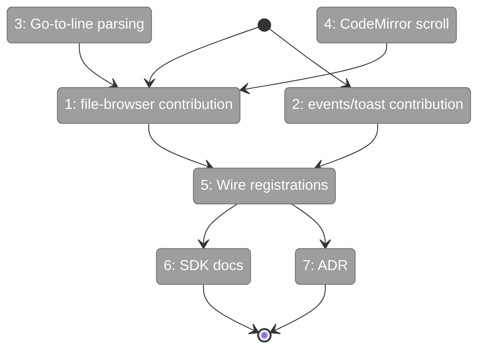
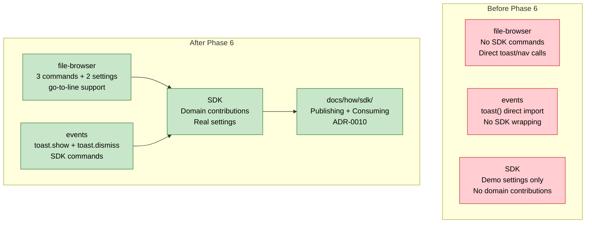

# Flight Plan: Phase 6 — SDK Wraps, Go-to-Line & Polish

**Phase**: Phase 6: SDK Wraps, Go-to-Line & Polish
**Plan**: [usdk-plan.md](../../usdk-plan.md)
**Tasks**: [tasks.md](./tasks.md)
**Status**: Ready

---

## Departure → Destination

**Where we are**: The SDK infrastructure is complete — command registry, settings store, keybinding service, command palette, keyboard shortcuts, and settings page all work. But only demo settings and internal SDK commands are registered. No real domain has published its features to the SDK yet. File navigation doesn't support go-to-line. No developer documentation exists.

**Where we're going**: File-browser and events domains publish their features as SDK contributions (commands, settings, keybindings). Users can type `src/index.ts:42` in the explorer bar and jump directly to line 42. Developers have guides for publishing and consuming SDK features. An ADR explains the architecture decisions behind the USDK.

**Concrete outcomes**:
- `>Open File` in palette navigates to a file (with path param)
- `>Copy Path` copies current file path to clipboard
- `>Show Toast` triggers a toast via SDK command
- `src/index.ts:42` or `src/index.ts#L42` in explorer bar → opens file at line 42
- `?file=src/index.ts&line=42` deep links directly to a line
- Settings page shows file-browser settings (showHiddenFiles, previewOnClick)
- `docs/how/sdk/` has publishing + consuming guides
- ADR-0010 documents all USDK architecture decisions

---

## Domain Context

### Domains We Change

| Domain | Relationship | Changes | Key Files |
|--------|-------------|---------|-----------|
| `file-browser` | **modify** | SDK contribution (3 commands, 2 settings), go-to-line parsing, CodeMirror scroll, line URL param | `sdk/contribution.ts`, `sdk/register.ts`, `file-path-handler.ts`, `code-editor.tsx`, `file-browser.params.ts` |
| `_platform/events` | **modify** | SDK contribution (toast.show, toast.dismiss) | `sdk/contribution.ts`, `sdk/register.ts` |
| `_platform/sdk` | **extend** | Wire domain registrations in bootstrap, move demo settings | `sdk-bootstrap.ts` |
| docs | **create** | Publishing guide, consuming guide, ADR-0010 | `docs/how/sdk/`, `docs/adr/` |

### Domains We Depend On

| Domain | Contract | Usage |
|--------|----------|-------|
| `_platform/sdk` (Phases 1-5) | Full IUSDK surface | Register commands, settings, keybindings |
| `_platform/panel-layout` (Phase 3) | `ExplorerPanelHandle` | openFile/openFileAtLine handlers |
| sonner (npm) | `toast()` | Toast command handler |

---

## Flight Status

**Legend**: grey = pending | yellow = active | red = blocked/needs input | green = done

---

## Stages

- [ ] Create file-browser SDK contribution (2 commands, 2 settings) (T001)
- [ ] Create events/toast SDK contribution (T002)
- [ ] Implement go-to-line URL param + path parsing (T003)
- [ ] Expose CodeMirror scroll-to-line via prop (T004)
- [ ] Wire domain registrations into bootstrap (T005)
- [x] Create USDK Architecture Decision Record (T007)
- [ ] Create SDK developer documentation (T006)

---

## Architecture: Before & After

---

## Acceptance Criteria

- [ ] AC-25: file-browser publishes 3+ commands, 2+ settings
- [ ] AC-26: events publishes toast.show, toast.dismiss
- [ ] AC-27: Separate contribution manifest from handler binding
- [ ] AC-28: toast.show produces same toast as direct toast()
- [ ] AC-29: file-browser.openFile navigates to file
- [ ] AC-31: openFileAtLine scrolls to specified line
- [ ] AC-32: Explorer bar accepts `path:42` / `path#L42` syntax

---

## Goals & Non-Goals

**Goals**: Domain SDK contributions (file-browser + events), go-to-file+line, developer documentation, USDK ADR.

**Non-Goals**: No plugin system, no settings import/export, no symbol search implementation, no cross-device sync, no color/emoji setting controls.

---

## Checklist

| ID | Task | CS |
|----|------|----|
| T001 | file-browser SDK contribution | CS-3 |
| T002 | events/toast SDK contribution | CS-2 |
| T003 | Go-to-line URL param + parsing | CS-2 |
| T004 | CodeMirror scroll-to-line | CS-3 |
| T005 | Wire domain registrations | CS-2 |
| T006 | SDK developer documentation | CS-2 |
| T007 | USDK ADR | CS-2 |
