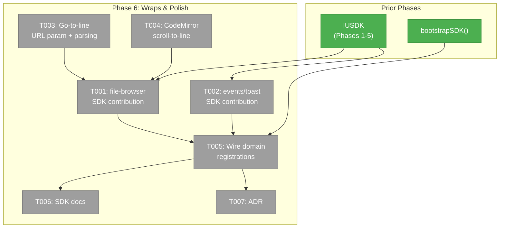
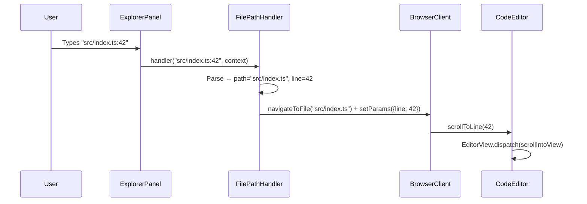
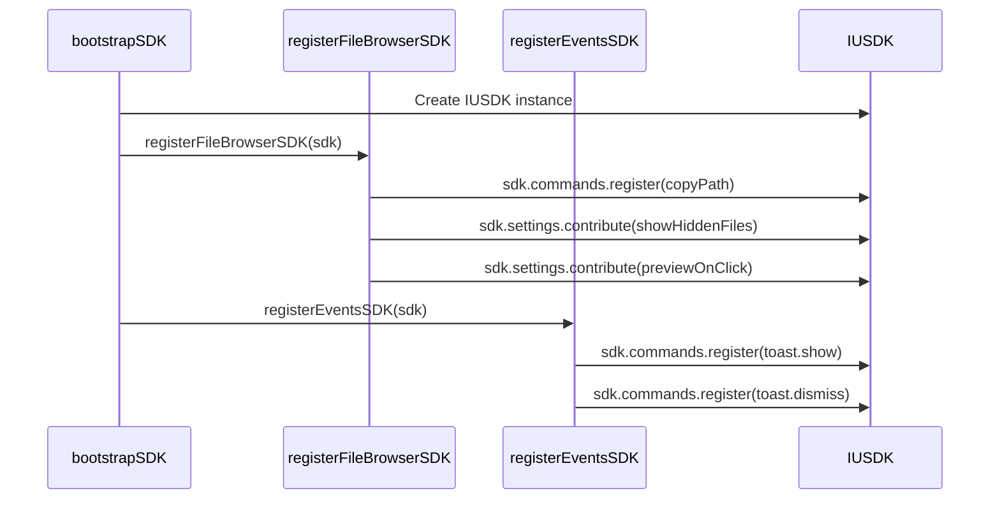

# Phase 6: SDK Wraps, Go-to-Line & Polish — Tasks

**Plan**: [usdk-plan.md](../../usdk-plan.md)
**Phase**: 6 of 6 (Final)
**Domain**: `file-browser` (modify), `_platform/events` (modify), `_platform/sdk` (extend), docs
**Status**: Pending
**Created**: 2026-02-25

---

## Executive Briefing

**Purpose**: The final phase wraps existing features as SDK commands, implements go-to-file+line navigation, writes developer documentation, and produces the USDK architecture decision record. This validates the full publish/consume pattern end-to-end.

**What We're Building**: File-browser and events domain SDK contributions (commands, settings, keybindings registered via `registerXxxSDK()` functions). Go-to-file+line support (URL `line` param, `path:42` / `path#L42` syntax in explorer bar, CodeMirror scroll-to-line). SDK developer guides and an ADR.

**Goals**:
- ✅ file-browser publishes 3+ commands (openFile, openFileAtLine, copyPath) + 2 settings
- ✅ events publishes toast.show and toast.dismiss commands
- ✅ Go-to-file+line: `path:42` / `path#L42` in explorer bar scrolls to line
- ✅ `line` URL param support for deep linking
- ✅ SDK developer documentation (publishing guide, consuming guide)
- ✅ ADR for USDK architecture decision

**Non-Goals**:
- ❌ No plugin system — SDK is compile-time only
- ❌ No settings import/export
- ❌ No symbol search implementation (remains stub)
- ❌ No cross-device settings sync
- ❌ No color/emoji setting controls (pickers in file-browser, not shared yet)

---

## Prior Phase Context

### Available from Phases 1-5

**APIs**: `IUSDK` (.commands, .settings, .context, .keybindings, .toast), `useSDK()`, `useSDKSetting()`, `useSDKContext()`, `useSDKMru()`, `IKeybindingService.register()`

**Commands registered**: `sdk.openCommandPalette`, `sdk.openSettings`, `sdk.listShortcuts`, `file-browser.goToFile`

**Demo settings**: `appearance.theme`, `editor.fontSize`, `editor.wordWrap`, `editor.tabSize` (in bootstrap — Phase 6 should move file-browser ones to domain contribution)

**Patterns**: `registerXxxSDK(sdk)` per ADR-0009. Static `SDKContribution` manifest + handler binding function. Commands registered in `useEffect` when they need component refs.

**Gotchas**: Toast imports sonner directly (DYK-P2-02). `execute()` swallows errors (DYK-05). `params ?? {}` default for no-param commands. Zod v4 not v3.

---

## Pre-Implementation Check

| File | Exists? | Domain Check | Notes |
|------|---------|-------------|-------|
| `apps/web/src/features/041-file-browser/sdk/contribution.ts` | No → **create** | ✅ `file-browser` | Static contribution manifest |
| `apps/web/src/features/041-file-browser/sdk/register.ts` | No → **create** | ✅ `file-browser` | Handler binding |
| `apps/web/src/features/027-central-notify-events/sdk/contribution.ts` | No → **create** | ✅ `_platform/events` | Toast contribution manifest |
| `apps/web/src/features/027-central-notify-events/sdk/register.ts` | No → **create** | ✅ `_platform/events` | Toast handler binding |
| `apps/web/src/features/041-file-browser/params/file-browser.params.ts` | Yes → **modify** | ✅ `file-browser` | Add `line` URL param |
| `apps/web/src/features/041-file-browser/services/file-path-handler.ts` | Yes → **modify** | ✅ `file-browser` | Parse `path:42` / `path#L42` syntax |
| `apps/web/src/features/041-file-browser/components/code-editor.tsx` | Yes → **modify** | ✅ `file-browser` | Expose scroll-to-line via ref |
| `apps/web/src/lib/sdk/sdk-bootstrap.ts` | Yes → **modify** | ✅ `_platform/sdk` | Wire domain registrations, move demo settings |
| `docs/how/sdk/publishing-to-sdk.md` | No → **create** | ✅ docs | Publisher guide |
| `docs/how/sdk/consuming-sdk.md` | No → **create** | ✅ docs | Consumer guide |
| `docs/adr/adr-0010-usdk-architecture.md` | No → **create** | ✅ docs | Architecture decision record |

---

## Architecture Map



---

## Tasks

| Status | ID | Task | Domain | Path(s) | Done When | Notes |
|--------|-----|------|--------|---------|-----------|-------|
| [ ] | T001 | **Create file-browser SDK contribution** — Static `SDKContribution` manifest in `sdk/contribution.ts` with commands: `file-browser.openFileAtLine` (navigate + scroll to line, params: `{path: string, line?: number}`), `file-browser.copyPath` (copy current file path). DYK-P6-02: Drop `openFile` — `goToFile` already exists (Ctrl+P). Settings: `file-browser.showHiddenFiles` (toggle), `file-browser.previewOnClick` (toggle). Handler binding in `sdk/register.ts` calls `registerFileBrowserSDK(sdk)`. Note: `openFileAtLine` handler needs component refs — register via useEffect in browser-client.tsx (DYK-P3-05 pattern). `copyPath` can register in bootstrap. | `file-browser` | `apps/web/src/features/041-file-browser/sdk/contribution.ts`, `apps/web/src/features/041-file-browser/sdk/register.ts`, `apps/web/app/(dashboard)/workspaces/[slug]/browser/browser-client.tsx` | 2 commands registered, 2 settings contributed. Commands appear in palette. Settings appear on settings page. | DYK-P6-02: goToFile exists, only add openFileAtLine + copyPath. AC-25, AC-29. |
| [ ] | T002 | **Create events/toast SDK contribution** — Static manifest with commands: `toast.show` (params: `{message: string, type: 'success'|'error'|'info'|'warning'}`), `toast.dismiss` (no params). Handler binding calls sonner's `toast[type](message)` and `toast.dismiss()`. Register in bootstrap (no component ref needed). DYK-P6-01: Keep `IUSDK.toast` as direct sonner calls (developer API). `toast.show` command is for palette discoverability only. Don't wire them together. | `_platform/events` | `apps/web/src/features/027-central-notify-events/sdk/contribution.ts`, `apps/web/src/features/027-central-notify-events/sdk/register.ts` | `toast.show` and `toast.dismiss` registered. Executing `toast.show` produces same toast as direct `toast()`. | DYK-P6-01: Dual path — sdk.toast (dev) + command (palette). AC-26, AC-28. |
| [ ] | T003 | **Implement go-to-line URL param + path parsing** — Add `line` param to `fileBrowserParams` (nuqs `parseAsInteger`). Modify `file-path-handler.ts` to parse `path:42` and `path#L42` syntax. DYK-P6-04: Path-first resolution — try full string as file first, only parse line suffix if path doesn't exist AND suffix is purely numeric. Extract line number, strip it from path, pass as URL param. When `line` param is present, pass to CodeEditor (via T004). | `file-browser` | `apps/web/src/features/041-file-browser/params/file-browser.params.ts`, `apps/web/src/features/041-file-browser/services/file-path-handler.ts`, `apps/web/app/(dashboard)/workspaces/[slug]/browser/browser-client.tsx` | `path:42` in explorer bar navigates to file and scrolls to line 42. `?file=src/index.ts&line=42` in URL scrolls to line 42. Filenames with colons resolve correctly. | DYK-P6-04: Path-first, digits-only suffix. AC-31, AC-32. |
| [ ] | T004 | **Expose CodeMirror scroll-to-line** — DYK-P6-03: Add `scrollToLine?: number` prop to `CodeEditor`. Use `@uiw/react-codemirror`'s `onCreateEditor` callback to capture `EditorView` into an internal ref. When `scrollToLine` prop changes, call `EditorView.dispatch()` with `scrollIntoView` effect. No forwardRef through dynamic import — prop-driven approach. Wire from browser-client: pass `line` URL param as prop through FileViewerPanel → CodeEditor. | `file-browser` | `apps/web/src/features/041-file-browser/components/code-editor.tsx`, `apps/web/src/features/041-file-browser/components/file-viewer-panel.tsx` | `scrollToLine={42}` scrolls CodeMirror to line 42. | DYK-P6-03: Prop-driven, not ref-driven. |
| [ ] | T005 | **Wire domain registrations into bootstrap** — Call `registerEventsSDK(sdk)` in bootstrapSDK. Move file-browser demo settings (`editor.*`) to the file-browser contribution. Keep `appearance.theme` as a demo. Wire `registerFileBrowserSDK(sdk)` for the bootstrap-safe commands (copyPath). Commands needing component refs (openFile, openFileAtLine) stay in browser-client.tsx useEffect. | `_platform/sdk` | `apps/web/src/lib/sdk/sdk-bootstrap.ts` | Domain contributions loaded at bootstrap. Demo settings replaced by real domain settings. | Per ADR-0009 module registration pattern. |
| [ ] | T006 | **Create SDK developer documentation** — `docs/how/sdk/publishing-to-sdk.md`: How to create a contribution manifest + register function, worked example. `docs/how/sdk/consuming-sdk.md`: How to use useSDK, useSDKSetting, command palette, shortcuts. Brief, practical, with code examples. | docs | `docs/how/sdk/publishing-to-sdk.md`, `docs/how/sdk/consuming-sdk.md` | Two guide files with worked examples. | Per spec: Hybrid docs — README quick-start + docs/how/sdk/ guides. |
| [x] | T007 | **Create USDK Architecture Decision Record** — ADR-0010 explaining: why an SDK layer (not just DI), SDK vs DI boundary, why not plugins, storage choices (WorkspacePreferences), tinykeys choice, context key approach. References spec, workshops, and all 6 phases. | docs | `docs/adr/adr-0010-usdk-architecture.md` | ADR exists with all decision points documented. | Per plan task 6.8. |

---

## Context Brief

### Key Findings from Plan

- **Finding 06** (High): NodeEventRegistry pattern reusable — command registration mirrors it. Domain registration functions follow same `registerXxxSDK(sdk)` pattern.
- **Finding 07** (Medium): tinykeys installed in Phase 4 — no new dependency for shortcuts.
- **Risk**: Go-to-line needs CodeMirror EditorView.dispatch which may not be exposed by @uiw/react-codemirror. Fallback: `onCreateEditor` callback captures EditorView ref.
- **Risk**: Line-number URL param needs nuqs integration — straightforward with `parseAsInteger`.

### Domain Dependencies

| Domain | Contract | What We Use |
|--------|----------|-------------|
| `_platform/sdk` (Phase 1-5) | `IUSDK`, `ICommandRegistry.register()`, `ISDKSettings.contribute()`, `IKeybindingService.register()` | Register commands, settings, keybindings |
| `_platform/sdk` (Phase 2) | `useSDK()`, `useSDKSetting()` | Access SDK in React components |
| `_platform/panel-layout` (Phase 3) | `ExplorerPanelHandle.focusInput()` | file-browser.openFile handler |
| `file-browser` (existing) | `createFilePathHandler()` | Extend to parse line syntax |
| `_platform/events` (existing) | `toast()` from sonner | Toast command handler |

### Domain Constraints

- **`file-browser` owns its SDK contribution**: `sdk/contribution.ts` + `sdk/register.ts` in `features/041-file-browser/sdk/`
- **`_platform/events` owns toast contribution**: `sdk/contribution.ts` + `sdk/register.ts` in `features/027-central-notify-events/sdk/`
- **Bootstrap-safe vs ref-dependent**: Commands that need React refs (openFile, openFileAtLine) register via useEffect. Commands that don't (copyPath, toast) register at bootstrap.
- **ADR-0009**: Domain registration uses `registerXxxSDK(sdk)` function pattern.

### Reusable from Prior Phases

- `SDKContribution` type — static manifest shape
- `useEffect` register/dispose pattern from Phase 3 (ref-dependent commands)
- `bootstrapSDK()` — wire domain registration functions
- `file-browser.goToFile` — already registered, openFile is similar but takes a path param
- Existing file-path-handler — extend, don't replace

### System Flow: Go-to-File+Line



### System Flow: Domain SDK Registration



---

## Critical Insights (2026-02-25)

| # | Insight | Decision |
|---|---------|----------|
| DYK-P6-01 | T002 suggests replacing IUSDK.toast with execute() but DYK-P2-02 forbids it (chicken-and-egg at bootstrap) | Keep dual path: `sdk.toast` = developer convenience (direct sonner), `toast.show` command = palette discoverability. No wiring between them. |
| DYK-P6-02 | `file-browser.openFile` is nearly identical to existing `file-browser.goToFile` — duplicate | Drop `openFile`. Keep `goToFile` (Ctrl+P, user types). Add `openFileAtLine` (programmatic, takes `{path, line}`). |
| DYK-P6-03 | `@uiw/react-codemirror` doesn't support forwardRef, and it's behind `next/dynamic` | CodeEditor takes `scrollToLine?: number` prop. Uses `onCreateEditor` to capture EditorView internally. No forwardRef through dynamic import. |
| DYK-P6-04 | `path:42` syntax collides with valid filenames containing colons (e.g., `2024-01-15T10:30:00.log`) | Path-first resolution: try full string as file first. Only parse `:42` / `#L42` if path doesn't exist and suffix is purely numeric. |
| DYK-P6-05 | ADR + docs are last tasks — risk being rushed | Write ADR first (decisions fresh). Guides short + example-heavy. Reference workshops for deep detail. |

---

## Discoveries & Learnings

_Populated during implementation by plan-6._

| Date | Task | Type | Discovery | Resolution | References |
|------|------|------|-----------|------------|------------|

---

## Directory Layout

```
docs/plans/047-usdk/
  └── tasks/
      ├── phase-1-sdk-foundation/       (complete ✅)
      ├── phase-2-sdk-provider-bootstrap/ (complete ✅)
      ├── phase-3-command-palette/       (complete ✅)
      ├── phase-4-keyboard-shortcuts/    (complete ✅)
      ├── phase-5-settings-domain/       (complete ✅)
      └── phase-6-wraps-polish/
          ├── tasks.md              ← this file
          ├── tasks.fltplan.md      ← flight plan (below)
          └── execution.log.md     ← created by plan-6
```
