# Workshop: Initial SDK Candidates — What We're Adding

**Type**: Integration Pattern / Implementation Inventory
**Plan**: 047-usdk
**Research**: [research-dossier.md](../research-dossier.md)
**Created**: 2026-02-24
**Status**: Draft

**Related Documents**:
- [001 SDK Surface Workshop](./001-sdk-surface-consumer-publisher-experience.md)
- [File Path Utility Bar Workshop](../../041-file-browser/workshops/file-path-utility-bar.md)
- [File Tree Context Menu Workshop](../../041-file-browser/workshops/file-tree-context-menu.md)
- [Workspace Preferences Data Model](../../041-file-browser/workshops/workspace-preferences-data-model.md)

**Domain Context**:
- **Primary Domain**: `_platform/sdk` (the USDK framework)
- **Consumer Domains**: `file-browser`, `_platform/events`, `_platform/settings` (new)

---

## Purpose

Inventory every concrete feature that will be added, upgraded, or wrapped as part of the initial USDK rollout. For each candidate: what exists today, what the SDK version looks like, and how much work is involved. This is the "bill of materials" for the USDK plan — a developer keeps this open to understand scope.

## Key Questions Addressed

- What raw implementations exist today that should become SDK commands?
- What new features need building from scratch (command palette, settings page, go-to-line)?
- What's the priority order? What depends on what?
- How much of this is wrapping existing code vs net-new development?

---

## 1. Candidate Inventory at a Glance

### Category: SDK Framework (Must Build First)

| # | Candidate | Today | SDK Version | Effort |
|---|-----------|-------|-------------|--------|
| F1 | Command Registry | Nothing | `sdk.commands.register/execute/list` | **New** — core types + in-memory registry |
| F2 | Command Palette UI | Explorer bar handles file paths only | `>` prefix handler + dropdown list + filter | **New** — BarHandler + palette component |
| F3 | Settings Store | Workspace prefs in `workspaces.json` | `sdk.settings.contribute/get/set/onChange` | **New** — backed by existing prefs system |
| F4 | Settings Page | Single table of workspace emoji/color/star | Domain-organized settings with auto-generated UI | **New** — page + controls from setting schemas |
| F5 | Keyboard Shortcuts | One hardcoded Ctrl+P in browser-client | `sdk.keybindings.register` + chord resolver | **New** — tinykeys-based, configurable |
| F6 | Context Key Service | Nothing | `sdk.context.set/get/evaluate` | **New** — in-memory map + when-clause evaluator |
| F7 | SDK Provider | Nothing | `<SDKProvider>` wrapping app | **New** — React context + bootstrap |

### Category: Wrap Existing (Publish to SDK)

| # | Candidate | Today | SDK Command | Effort |
|---|-----------|-------|-------------|--------|
| W1 | Toast / Notifications | `import { toast } from 'sonner'` (8 files) | `toast.show` command + `sdk.toast.*` convenience | **Wrap** — thin shim |
| W2 | Clipboard: Copy Path | `navigator.clipboard.writeText()` in use-clipboard.ts | `clipboard.copyText` command | **Wrap** — extract from hook |
| W3 | Go to File | Ctrl+P → ExplorerPanel focus → file-path-handler | `file-browser.openFile` command | **Wrap** — delegate to existing handleSelect |
| W4 | Toggle Theme | `toggleTheme()` via next-themes in theme-toggle.tsx | `appearance.toggleTheme` command | **Wrap** — one-liner |
| W5 | Toggle Sidebar | `toggleSidebar()` from useSidebar() hook | `layout.toggleSidebar` command | **Wrap** — one-liner |
| W6 | Worktree: Set Icon | EmojiPicker → updateWorktreePreferences action | `worktree.setIcon` command | **Wrap** — delegate to server action |
| W7 | Worktree: Set Color | ColorPicker → updateWorktreePreferences action | `worktree.setColor` command | **Wrap** — delegate to server action |

### Category: New Features (Build + Publish)

| # | Candidate | Today | SDK Command | Effort |
|---|-----------|-------|-------------|--------|
| N1 | Go to File + Line | No line param in URL or CodeMirror | `file-browser.openFileAtLine` | **New** — URL param + CM scroll |
| N2 | Navigate to Page | Scattered `router.push()` calls | `navigation.goto` command | **New** — unified navigation |
| N3 | Log to Server | `console.error()` only (browser) | `log.write` command | **New** — server action for logging |
| N4 | Worktree: Set Alert | Nothing exists | `worktree.setAlert` command | **New** — data model + sidebar indicator |
| N5 | Command Palette: Search Stub | Nothing | `search.files` stub | **Stub** — toast "coming soon" |
| N6 | Command Palette: Symbol Stub | Nothing | `search.symbols` stub | **Stub** — toast "LSP/Flowspace coming later" |

---

## 2. Framework Candidates (F1–F7) — Detailed

### F1: Command Registry

**What exists**: Nothing. Cross-domain features consumed via DI or direct import.

**What we're building**:
```typescript
// In-memory registry
class CommandRegistry implements ICommandRegistry {
  private commands = new Map<string, SDKCommand>();

  register<T extends z.ZodType>(command: SDKCommand<T>): Disposable {
    this.commands.set(command.id, command);
    return { dispose: () => this.commands.delete(command.id) };
  }

  async execute(id: string, params?: unknown): Promise<void> {
    const cmd = this.commands.get(id);
    if (!cmd) throw new Error(`Command not found: ${id}`);
    if (!this.context.evaluate(cmd.when ?? 'true')) {
      throw new Error(`Command not available: ${id}`);
    }
    const validated = cmd.params.parse(params);
    await cmd.handler(validated);
  }

  list(filter?: { domain?: string }): SDKCommand[] {
    return [...this.commands.values()]
      .filter(c => !filter?.domain || c.domain === filter.domain)
      .filter(c => this.context.evaluate(c.when ?? 'true'));
  }
}
```

**Files to create**:
- `packages/shared/src/sdk/types.ts` — SDKCommand, SDKSetting, SDKKeybinding, IUSDK
- `apps/web/src/lib/sdk/command-registry.ts` — CommandRegistry class
- `test/unit/web/sdk/command-registry.test.ts`
- `test/fakes/fake-usdk.ts` — FakeUSDK for consumer tests

**Dependencies**: None (foundation piece)

---

### F2: Command Palette UI

**What exists**: ExplorerPanel with BarHandler chain. One handler: file-path-handler. Ctrl+P focuses input. No `>` prefix handling.

**What we're building**:

```
User types '>' in explorer bar:
  ┌──────────────────────────────────────────────────────────┐
  │ > toggle th                                          ⌘⇧P │
  │ ┌──────────────────────────────────────────────────────┐ │
  │ │ 🌙 Appearance: Toggle Theme              ctrl+shift+t│ │
  │ │ 📋 Clipboard: Copy File Path                         │ │
  │ │ 📁 File: Go to File                           ctrl+p │ │
  │ │ 📁 File: Go to File and Line                  ctrl+g │ │
  │ │ 🔔 Notifications: Show Notification                  │ │
  │ │ ⚙️ Settings: Open Settings                     ctrl+, │ │
  │ └──────────────────────────────────────────────────────┘ │
  └──────────────────────────────────────────────────────────┘

  - Fuzzy filter on title + category
  - Enter executes selected command
  - Escape closes palette
  - Arrow keys navigate list
  - Shortcut shown on right when bound
```

**Implementation approach**:

1. New `CommandPaletteHandler` BarHandler — intercepts `>` prefix
2. New `<CommandPaletteDropdown>` client component — renders filtered command list
3. Integrate into ExplorerPanel as overlay below input when palette is active

```typescript
// New bar handler (goes FIRST in handler chain)
export function createCommandPaletteHandler(sdk: IUSDK): BarHandler {
  return async (input, context) => {
    if (!input.startsWith('>')) return false;
    const query = input.slice(1).trim();
    sdk.palette.open(query);
    return true;
  };
}
```

**Palette modes from explorer bar**:

| User Types | Mode | Handler | Action |
|------------|------|---------|--------|
| `> toggle theme` | Command palette | CommandPaletteHandler | Filter + execute command |
| `src/index.ts` | File navigation | FilePathHandler (existing) | Navigate to file |
| `# UserService` | Symbol search | SymbolSearchStubHandler | Toast "coming soon" |

**Files to create**:
- `apps/web/src/lib/sdk/components/command-palette-dropdown.tsx`
- `apps/web/src/lib/sdk/bar-handlers/command-palette-handler.ts`
- `apps/web/src/lib/sdk/bar-handlers/symbol-search-stub-handler.ts`

**Files to modify**:
- `apps/web/src/features/041-file-browser/components/browser-client.tsx` — add palette handler to chain
- `apps/web/src/features/041-file-browser/components/explorer-panel.tsx` — support dropdown overlay

**Dependencies**: F1 (Command Registry)

---

### F3: Settings Store

**What exists**: `WorkspacePreferences` in `workspaces.json` with emoji, color, starred, sortOrder, worktreePreferences. Updated via `updateWorkspacePreferences` server action.

**What we're building**: An SDK layer that lets domains contribute typed settings, backed by the existing preferences storage.

**Storage extension** (non-breaking additive field):
```json
{
  "version": 2,
  "workspaces": [{
    "slug": "substrate",
    "preferences": {
      "emoji": "🔮",
      "color": "violet",
      "starred": true,
      "sdkSettings": {
        "file-browser.showHiddenFiles": true,
        "file-browser.previewOnClick": false,
        "events.toastPosition": "top-right"
      }
    }
  }]
}
```

**How it works**:
```
sdk.settings.contribute(setting)     → registers schema + default in memory
sdk.settings.get(key)                → sdkSettings[key] ?? schema.default
sdk.settings.set(key, value)         → validate → server action → persist → fire onChange
sdk.settings.onChange(key, callback)  → subscribe to in-memory event emitter
```

**Files to create**:
- `apps/web/src/lib/sdk/settings-store.ts` — SettingsStore class
- `apps/web/app/actions/sdk-settings-actions.ts` — server actions for persist
- `test/unit/web/sdk/settings-store.test.ts`

**Files to modify**:
- `packages/workflow/src/entities/workspace.ts` — add `sdkSettings` to `WorkspacePreferences`
- `packages/workflow/src/services/workspace.service.ts` — pass through sdkSettings updates

**Dependencies**: None (can be built in parallel with F1)

---

### F4: Settings Page

**What exists**: `/settings/workspaces` with a table showing workspace emoji/color/star. No domain-organized settings. No per-domain settings sections.

**What we're building**:

```
┌──────────────────────────────────────────────────────────────────┐
│  ⚙️  Settings                                                    │
├──────────────┬───────────────────────────────────────────────────┤
│              │                                                    │
│  Sections    │  File Browser                                     │
│  ──────────  │  ─────────────────────────────────────────        │
│              │                                                    │
│  Workspaces  │  Show Hidden Files                      [  ○ ]    │
│  ──────────  │  Display files starting with a dot                │
│  File        │                                                    │
│  Browser     │  Preview on Single Click                [● ]      │
│  Appearance  │  Open preview when clicking a file                │
│  Notifi-     │                                                    │
│  cations     │  ─────────────────────────────────────────        │
│  Worktree    │                                                    │
│              │  Appearance                                        │
│              │  ─────────────────────────────────────────        │
│              │                                                    │
│              │  Theme                      [Dark ▾]              │
│              │  Application color theme                          │
│              │                                                    │
│              │  ─────────────────────────────────────────        │
│              │                                                    │
│              │  Notifications                                     │
│              │  ─────────────────────────────────────────        │
│              │                                                    │
│              │  Toast Position              [Bottom Right ▾]     │
│              │  Where notifications appear on screen             │
│              │                                                    │
└──────────────┴───────────────────────────────────────────────────┘
```

**Key design decisions**:
- **Graphical only** — no raw JSON editor (unlike VS Code)
- **Workspace-scoped** — settings stored per-workspace
- **Auto-generated** — UI controls rendered from `SDKSetting.ui` hints
- **Existing workspace settings stay** — emoji/color/star table moves to "Workspaces" section
- **Left nav = sections** — grouped by `setting.section` or `setting.domain`

**Routes**:
```
/settings/workspaces           → Existing table (emoji, color, star, remove)
/settings/file-browser         → SDK settings for file-browser domain
/settings/appearance           → Theme, etc
/settings/notifications        → Toast position, etc
/settings                      → Redirect to /settings/workspaces (default)
```

**Files to create**:
- `apps/web/app/(dashboard)/settings/[section]/page.tsx` — dynamic settings page
- `apps/web/app/(dashboard)/settings/[section]/settings-section-client.tsx` — renders controls
- `apps/web/src/lib/sdk/components/setting-controls.tsx` — Toggle, Select, Text, Number, Color, Emoji

**Files to modify**:
- `apps/web/src/components/dashboard-sidebar.tsx` — settings nav from link to expandable section
- `apps/web/src/lib/navigation-utils.ts` — add SETTINGS_NAV_ITEMS (dynamic from SDK)

**Dependencies**: F3 (Settings Store), F1 (Command Registry — for `sdk.openSettings` command)

---

### F5: Keyboard Shortcuts

**What exists**: One hardcoded Ctrl+P listener in `browser-client.tsx`:

```typescript
// browser-client.tsx lines 266-282
useEffect(() => {
  const handler = (e: KeyboardEvent) => {
    const isMac = navigator.platform.includes('Mac');
    const modifier = isMac ? e.metaKey : e.ctrlKey;
    if (modifier && e.key === 'p') {
      const active = document.activeElement;
      if (active?.closest('.cm-editor')) return;
      e.preventDefault();
      explorerRef.current?.focusInput();
    }
  };
  document.addEventListener('keydown', handler);
  return () => document.removeEventListener('keydown', handler);
}, []);
```

**What we're building**: Centralized shortcut system with chord support.

```typescript
// Root-level Client Component
function KeyboardShortcutListener({ sdk }: { sdk: IUSDK }) {
  useEffect(() => {
    const resolver = new KeybindingResolver(sdk.keybindings, sdk.context);

    const handler = (e: KeyboardEvent) => {
      // Skip if inside CodeMirror
      if ((e.target as HTMLElement)?.closest('.cm-editor')) return;

      const command = resolver.handleKeyEvent(e);
      if (command) {
        e.preventDefault();
        sdk.commands.execute(command);
      }
    };

    document.addEventListener('keydown', handler);
    return () => document.removeEventListener('keydown', handler);
  }, [sdk]);

  return null;
}
```

**Chord state machine**:
```
IDLE → (Ctrl+K) → CHORD_PENDING(timeout: 1000ms)
  → (Ctrl+C within timeout) → execute 'ctrl+k ctrl+c' binding → IDLE
  → (timeout) → IDLE
  → (non-match key) → IDLE
```

**Initial keybindings**:

| Shortcut | Command | When |
|----------|---------|------|
| `ctrl+shift+p` | `sdk.openCommandPalette` | always |
| `ctrl+p` | `file-browser.openFile` | `workspaceFocus` |
| `ctrl+g` | `file-browser.openFileAtLine` | `workspaceFocus` |
| `ctrl+,` | `sdk.openSettings` | always |
| `ctrl+shift+t` | `appearance.toggleTheme` | always |

**Files to create**:
- `apps/web/src/lib/sdk/keybinding-resolver.ts` — resolver + chord state machine
- `apps/web/src/lib/sdk/components/keyboard-shortcut-listener.tsx`
- `test/unit/web/sdk/keybinding-resolver.test.ts`

**Files to modify**:
- `apps/web/src/features/041-file-browser/components/browser-client.tsx` — **remove** hardcoded Ctrl+P handler (replaced by SDK)

**Dependencies**: F1 (Command Registry), F6 (Context Keys for when-clauses)

---

### F6: Context Key Service

**What exists**: Nothing.

**What we're building**: In-memory map tracking UI state for when-clause evaluation.

```typescript
class ContextKeyService {
  private keys = new Map<string, unknown>();
  private listeners = new Map<string, Set<() => void>>();

  set(key: string, value: unknown): void {
    this.keys.set(key, value);
    this.listeners.get(key)?.forEach(cb => cb());
  }

  get(key: string): unknown {
    return this.keys.get(key);
  }

  evaluate(expression: string): boolean {
    // Simple expression evaluator:
    // 'workspaceFocus'              → Boolean(get('workspaceFocus'))
    // '!file-browser.isReadonly'    → !Boolean(get('file-browser.isReadonly'))
    // 'workspaceFocus && editorFocus' → both true
  }
}
```

**Context keys set by existing components**:

| Key | Set By | Value |
|-----|--------|-------|
| `workspaceFocus` | Workspace layout | `true` when on `/workspaces/[slug]/*` |
| `file-browser.hasOpenFile` | browser-client | `true` when file is displayed |
| `file-browser.currentFilePath` | browser-client | Current file path string |
| `file-browser.isEditing` | browser-client | `true` when in edit mode |
| `editorFocus` | CodeEditor | `true` when CodeMirror focused |
| `sidebarVisible` | Dashboard layout | `true` when sidebar open |

**Files to create**:
- `apps/web/src/lib/sdk/context-key-service.ts`
- `test/unit/web/sdk/context-key-service.test.ts`

**Dependencies**: None (can build in parallel)

---

### F7: SDK Provider

**What exists**: Nothing.

**What we're building**: React context that initializes and provides the SDK instance.

```typescript
// apps/web/src/lib/sdk/sdk-provider.tsx
'use client';

export function SDKProvider({ children }: { children: ReactNode }) {
  const sdk = useMemo(() => {
    const instance = createUSDK();
    // Framework commands
    registerSDKCoreCommands(instance);
    // Domain registrations
    registerFileBrowserSDK(instance);
    registerEventsSDK(instance);
    registerSettingsSDK(instance);
    registerAppearanceSDK(instance);
    return instance;
  }, []);

  return (
    <SDKContext.Provider value={sdk}>
      <KeyboardShortcutListener sdk={sdk} />
      {children}
    </SDKContext.Provider>
  );
}
```

**Files to create**:
- `apps/web/src/lib/sdk/sdk-provider.tsx`
- `apps/web/src/lib/sdk/create-usdk.ts`
- `apps/web/src/lib/sdk/use-sdk.ts` (hook)
- `apps/web/src/lib/sdk/use-sdk-setting.ts` (hook)
- `apps/web/src/lib/sdk/use-sdk-context.ts` (hook)

**Files to modify**:
- `apps/web/src/components/providers.tsx` — wrap with `<SDKProvider>`

**Dependencies**: F1, F3, F5, F6 (composes all framework pieces)

---

## 3. Wrap Existing (W1–W7) — Detailed

### W1: Toast / Notifications → `toast.show`

**Today** (8 files import sonner directly):
```typescript
import { toast } from 'sonner';
toast.success('File saved');
toast.error('Save failed', { description: 'File was modified externally' });
toast.loading('Saving...');
toast.info('File refreshed');
```

**SDK version** (two options for consumers):
```typescript
// Option A: Via SDK convenience methods (preferred for simple cases)
sdk.toast.success('File saved');
sdk.toast.error('Save failed', { description: 'File was modified externally' });

// Option B: Via command (for cross-domain, programmatic use)
sdk.commands.execute('toast.show', { message: 'File saved', type: 'success' });
```

**Migration**: Replace `import { toast } from 'sonner'` with `const sdk = useSDK()` then `sdk.toast.*`. **Not mandatory immediately** — sonner direct import continues to work. SDK route adds discoverability and consistency.

**Work**: Thin wrapper in events domain SDK registration. ~20 lines.

---

### W2: Clipboard → `clipboard.copyText`

**Today** (in use-clipboard.ts):
```typescript
const copyToClipboard = async (text: string) => {
  if (globalThis.isSecureContext && navigator.clipboard?.writeText) {
    await navigator.clipboard.writeText(text);
  } else {
    // textarea fallback for non-HTTPS
    const textarea = document.createElement('textarea');
    // ...
  }
};
```

**SDK version**:
```typescript
sdk.commands.execute('clipboard.copyText', { text: filePath });
// Handler internally uses the existing secure clipboard logic + fallback
```

**Work**: Extract clipboard utility, register as SDK command. ~30 lines.

---

### W3: Go to File → `file-browser.openFile`

**Today**: Ctrl+P focuses explorer bar → user types path → file-path-handler navigates.

**SDK version**:
```typescript
sdk.commands.execute('file-browser.openFile', { path: 'src/index.ts' });
// Handler calls existing handleSelect() from use-file-navigation
```

**Work**: Register command with handler that calls into existing navigation. The command palette makes this accessible via `> Go to File`. ~15 lines.

---

### W4: Toggle Theme → `appearance.toggleTheme`

**Today** (theme-toggle.tsx):
```typescript
const { setTheme, resolvedTheme } = useTheme();
const toggleTheme = () => setTheme(resolvedTheme === 'dark' ? 'light' : 'dark');
```

**SDK version**:
```typescript
sdk.commands.execute('appearance.toggleTheme');
// Now accessible via command palette: "> Toggle Theme"
// And keyboard shortcut: Ctrl+Shift+T
```

**Work**: One-liner handler. ~10 lines.

---

### W5: Toggle Sidebar → `layout.toggleSidebar`

**Today** (dashboard-sidebar.tsx):
```typescript
const { toggleSidebar } = useSidebar();
<Button onClick={toggleSidebar}>
```

**SDK version**:
```typescript
sdk.commands.execute('layout.toggleSidebar');
// Accessible via "> Toggle Sidebar" and Ctrl+B
```

**Work**: One-liner handler, needs access to sidebar context. ~15 lines.

---

### W6–W7: Worktree Icon/Color → `worktree.setIcon`, `worktree.setColor`

**Today** (worktree-identity-popover.tsx):
```typescript
const handleEmojiSelect = async (emoji: string) => {
  const result = await updateWorktreePreferences(slug, worktreePath, { emoji });
  if (result.success) {
    router.refresh();
    toast.success('Worktree emoji updated');
  }
};
```

**SDK version**:
```typescript
sdk.commands.execute('worktree.setIcon', { emoji: '🚀' });
// Opens emoji picker if no emoji param provided
// Or sets directly if emoji param provided
```

**Work**: Delegate to existing server action. ~20 lines each.

---

## 4. New Features (N1–N6) — Detailed

### N1: Go to File + Line → `file-browser.openFileAtLine`

**Today**: No line parameter support anywhere. CodeMirror shows line numbers but has no scroll-to-line API exposed.

**What needs building**:

| Component | Change | Detail |
|-----------|--------|--------|
| URL params | **Add `line` param** | `line: parseAsInteger.withDefault(0)` in fileBrowserParams |
| Explorer bar | **Parse `path:123` or `path#L123`** | New parser in file-path-handler or dedicated handler |
| useFileNavigation | **Accept `line` option** | `handleSelect(path, { line: 42 })` |
| browser-client | **Pass line to viewer** | Read line from URL, pass to CodeEditor |
| CodeEditor | **scrollToLine API** | Use CodeMirror's `EditorView.dispatch({ effects: scrollTo })` |

**Path syntax** (matching common conventions):
```
src/index.ts:42        → opens file at line 42
src/index.ts#L42       → opens file at line 42 (GitHub style)
src/index.ts:42:10     → opens file at line 42, column 10 (future)
```

**Parser**:
```typescript
function parseFileAndLine(input: string): { path: string; line?: number } {
  // Try path:line format
  const colonMatch = input.match(/^(.+):(\d+)$/);
  if (colonMatch) return { path: colonMatch[1], line: parseInt(colonMatch[2]) };

  // Try path#Lline format
  const hashMatch = input.match(/^(.+)#L(\d+)$/);
  if (hashMatch) return { path: hashMatch[1], line: parseInt(hashMatch[2]) };

  return { path: input };
}
```

**Effort**: Medium — touches URL params, hook, client, and CodeMirror wrapper.

---

### N2: Navigate to Page → `navigation.goto`

**Today**: `router.push()` scattered across components. Navigation items hardcoded in `navigation-utils.ts`.

**SDK version**:
```typescript
// Navigate to any workspace page
sdk.commands.execute('navigation.goto', { page: 'browser' });
sdk.commands.execute('navigation.goto', { page: 'agents' });
sdk.commands.execute('navigation.goto', { page: 'workflows' });
sdk.commands.execute('navigation.goto', { page: 'settings', section: 'file-browser' });

// Navigate to specific workspace
sdk.commands.execute('navigation.gotoWorkspace', { slug: 'substrate' });
```

**Work**: Read from `WORKSPACE_NAV_ITEMS`, resolve current workspace slug, `router.push()`. ~30 lines.

---

### N3: Log to Server → `log.write`

**Today**: `console.error()` and `console.log()` in browser. Server actions use `console.error()` in Node. No client-to-server log bridge.

**SDK version**:
```typescript
sdk.commands.execute('log.write', {
  message: 'User opened file',
  level: 'info',
  context: { path: 'src/index.ts' },
});
```

**Implementation**: Server action that appends to a log file or uses the existing PinoLoggerAdapter via DI.

```typescript
// apps/web/app/actions/sdk-log-action.ts
'use server';
export async function writeLog(level: string, message: string, context?: Record<string, unknown>) {
  const container = getContainer();
  const logger = container.resolve<ILogger>(SHARED_DI_TOKENS.LOGGER);
  logger[level as 'info' | 'warn' | 'error'](message, context);
}
```

**Effort**: Small — server action + command registration.

---

### N4: Worktree Alert Status → `worktree.setAlert`

**Today**: Nothing. No alert/status concept for worktrees.

**What needs building**:

1. **Data model**: Add `alertStatus: 'none' | 'info' | 'warning' | 'error'` to `WorktreeVisualPreferences`
2. **Sidebar indicator**: Show colored dot or badge next to worktree name when alert is set
3. **SDK command**: `worktree.setAlert` with `{ status, message? }`
4. **Server action**: Persist alert status in worktreePreferences

**Use case**: CI/CD integration — mark a worktree as "failing" from an agent or automation.

**Effort**: Medium — data model change + sidebar UI + server action.

---

### N5–N6: Search & Symbol Stubs

**What we're building**: BarHandlers that show "coming soon" messages.

```typescript
// Stub: file search (no prefix)
function createSearchStubHandler(): BarHandler {
  return async (input, context) => {
    // Only triggers when explicitly in search mode (future)
    // For now, file-path-handler handles no-prefix input
    return false;
  };
}

// Stub: symbol search (# prefix)
function createSymbolSearchStubHandler(): BarHandler {
  return async (input, context) => {
    if (!input.startsWith('#')) return false;
    toast.info('Symbol search (LSP / Flowspace) is coming in a future release');
    return true;
  };
}
```

**Effort**: Trivial — ~10 lines each.

---

## 5. Dependency Graph

```mermaid
flowchart TD
    classDef framework fill:#4CAF50,stroke:#2E7D32,color:#fff
    classDef wrap fill:#2196F3,stroke:#1565C0,color:#fff
    classDef newf fill:#FF9800,stroke:#E65100,color:#fff

    F1["F1: Command Registry"]:::framework
    F3["F3: Settings Store"]:::framework
    F6["F6: Context Key Service"]:::framework

    F2["F2: Command Palette UI"]:::framework
    F5["F5: Keyboard Shortcuts"]:::framework
    F4["F4: Settings Page"]:::framework
    F7["F7: SDK Provider"]:::framework

    W1["W1: Toast"]:::wrap
    W2["W2: Clipboard"]:::wrap
    W3["W3: Go to File"]:::wrap
    W4["W4: Toggle Theme"]:::wrap
    W5["W5: Toggle Sidebar"]:::wrap
    W6["W6: Worktree Icon"]:::wrap
    W7["W7: Worktree Color"]:::wrap

    N1["N1: Go to File+Line"]:::newf
    N2["N2: Navigate to Page"]:::newf
    N3["N3: Log to Server"]:::newf
    N4["N4: Worktree Alert"]:::newf

    F1 --> F2
    F1 --> F5
    F1 --> F7
    F3 --> F4
    F3 --> F7
    F6 --> F5
    F6 --> F7

    F7 --> W1
    F7 --> W2
    F7 --> W3
    F7 --> W4
    F7 --> W5
    F7 --> W6
    F7 --> W7
    F7 --> N1
    F7 --> N2
    F7 --> N3
    F7 --> N4

    F2 --> N1
```



**Critical path**: F1 + F3 + F6 (parallel) → F5 + F2 → F4 → F7 → All commands

---

## 6. Phasing Recommendation

### Phase 1: Foundation
Build the SDK framework with zero user-visible features (except plumbing).

| Item | What | Effort |
|------|------|--------|
| F1 | Command Registry (types + in-memory registry + FakeUSDK) | S |
| F3 | Settings Store (backed by workspace prefs) | S |
| F6 | Context Key Service | XS |
| F7 | SDK Provider (wires F1+F3+F6, mounts in providers.tsx) | S |

**Outcome**: `useSDK()` works. No commands registered yet. Settings store functional but no settings contributed.

### Phase 2: Command Palette + Shortcuts
The "wow" feature — users get Ctrl+Shift+P command palette.

| Item | What | Effort |
|------|------|--------|
| F5 | Keyboard Shortcuts (keybinding resolver + chord state machine) | M |
| F2 | Command Palette UI (> prefix handler + dropdown) | M |
| W1 | Toast wrapper (register toast.show command) | XS |
| W3 | Go to File (register file-browser.openFile) | XS |
| W4 | Toggle Theme command | XS |
| W5 | Toggle Sidebar command | XS |
| N2 | Navigate to Page commands | XS |
| — | Remove hardcoded Ctrl+P from browser-client | XS |

**Outcome**: Ctrl+Shift+P opens command palette. ~8 commands available. Ctrl+P goes to file. Theme/sidebar toggle via palette.

### Phase 3: Settings + Go-to-Line
Settings system and the first new feature delivered via SDK.

| Item | What | Effort |
|------|------|--------|
| F4 | Settings Page (auto-generated from SDK contributions) | M |
| N1 | Go to File + Line (URL param, parser, CodeMirror scroll) | M |
| W2 | Clipboard command | XS |
| W6 | Worktree Set Icon command | XS |
| W7 | Worktree Set Color command | XS |
| N3 | Log to Server command | S |

**Outcome**: Settings page with domain-organized sections. `path:42` syntax works in explorer bar. Clipboard/icon/color commands in palette.

### Phase 4: Polish + Alert
Remaining candidates and polish.

| Item | What | Effort |
|------|------|--------|
| N4 | Worktree Alert Status (data model + sidebar indicator) | M |
| N5 | Search stub handler | XS |
| N6 | Symbol search stub handler | XS |
| — | Migrate remaining direct toast imports to sdk.toast | S |
| — | Keyboard shortcut settings UI in settings page | M |

**Outcome**: Full initial SDK surface complete. All candidates wrapped or built.

---

## 7. Open Questions

### Q1: Should we migrate all toast imports immediately?

**RECOMMENDATION: No.** Direct sonner imports continue to work fine. SDK toast is an alternative path that adds discoverability and cross-domain consistency. Migrate organically when touching files.

### Q2: Where does the settings page route live?

**RECOMMENDATION**: `/workspaces/[slug]/settings/[section]` (workspace-scoped). Global settings page without workspace context is a future consideration (Q4 from workshop 001).

### Q3: Should the command palette be a separate component or part of ExplorerPanel?

**RECOMMENDATION**: Part of ExplorerPanel. The `>` prefix activates it in-place — the dropdown renders as an overlay below the explorer bar. This reuses the existing input, focus management, and keyboard handling. No separate modal needed.

### Q4: Do we need to handle Mac vs Windows keybindings?

**RECOMMENDATION**: Yes, from day one. Use `mod` as a platform-agnostic modifier that maps to `Cmd` on Mac and `Ctrl` on Windows/Linux. tinykeys handles this natively.

### Q5: What about settings that aren't workspace-scoped?

**RECOMMENDATION**: Defer to Phase 5+. For now, all settings are workspace-scoped (per ADR-0008). Global settings can be added later with a `scope: 'global'` field on `SDKSetting`.

---

## 8. Effort Summary

| Category | Items | Estimated Lines | Effort |
|----------|-------|-----------------|--------|
| Framework (F1–F7) | 7 | ~800 new | M-L |
| Wrap Existing (W1–W7) | 7 | ~150 new | XS-S each |
| New Features (N1–N6) | 6 | ~400 new | XS-M each |
| Tests | ~15 test files | ~600 new | M |
| **Total** | **20 items** | **~1,950 lines** | |

Not counted: Settings page UI components (F4) — depends on design complexity.

---

## 9. Quick Reference: All SDK Commands (Initial Set)

| Command ID | Category | Domain | Params | Shortcut | Phase |
|------------|----------|--------|--------|----------|-------|
| `sdk.openCommandPalette` | Framework | sdk | `void` | `ctrl+shift+p` | 2 |
| `sdk.openSettings` | Framework | sdk | `{ section? }` | `ctrl+,` | 3 |
| `file-browser.openFile` | Navigation | file-browser | `{ path }` | `ctrl+p` | 2 |
| `file-browser.openFileAtLine` | Navigation | file-browser | `{ path, line }` | `ctrl+g` | 3 |
| `file-browser.copyPath` | Clipboard | file-browser | `{ path }` | | 3 |
| `clipboard.copyText` | Clipboard | sdk | `{ text }` | | 3 |
| `toast.show` | Feedback | events | `{ message, type, description? }` | | 2 |
| `toast.dismiss` | Feedback | events | `void` | | 2 |
| `appearance.toggleTheme` | UI | appearance | `void` | `ctrl+shift+t` | 2 |
| `layout.toggleSidebar` | UI | layout | `void` | `ctrl+b` | 2 |
| `navigation.goto` | Navigation | navigation | `{ page }` | | 2 |
| `navigation.gotoWorkspace` | Navigation | navigation | `{ slug }` | | 2 |
| `worktree.setIcon` | Customization | settings | `{ emoji }` | | 3 |
| `worktree.setColor` | Customization | settings | `{ color }` | | 3 |
| `worktree.setAlert` | Customization | settings | `{ status, message? }` | | 4 |
| `log.write` | Diagnostics | events | `{ message, level, context? }` | | 3 |
