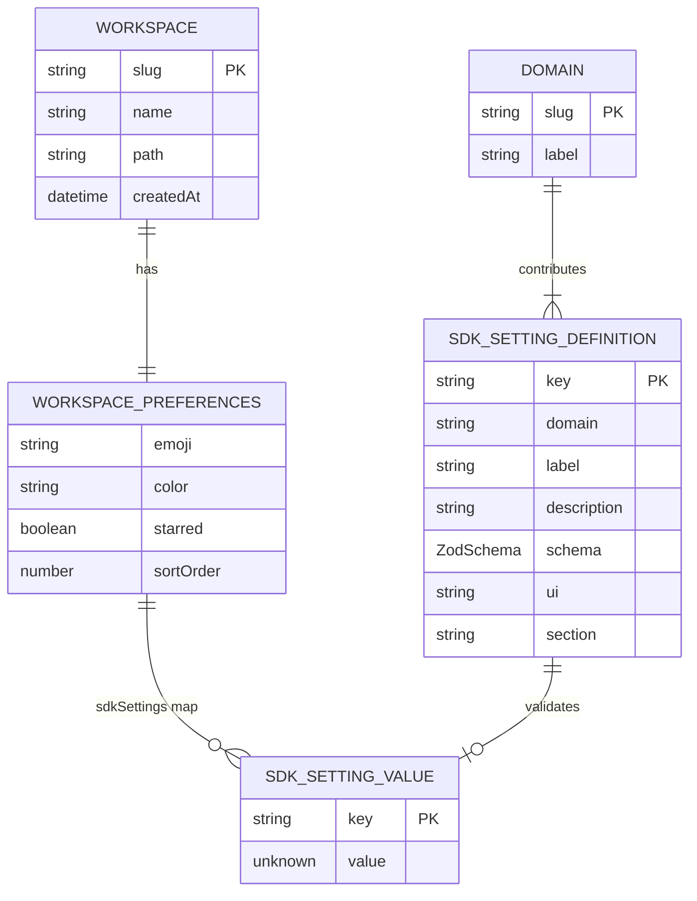

# Workshop: Settings Domain Data Model

**Type**: Data Model
**Plan**: 047-usdk
**Research**: [research-dossier.md](../research-dossier.md)
**Created**: 2026-02-24
**Status**: Draft

**Related Documents**:
- [001 SDK Surface Workshop](./001-sdk-surface-consumer-publisher-experience.md) — SDKSetting type, settings persistence deep dive (§9)
- [002 Initial SDK Candidates](./002-initial-sdk-candidates.md) — F3 Settings Store, F4 Settings Page
- [Workspace Preferences Data Model Workshop](../../041-file-browser/workshops/workspace-preferences-data-model.md)
- [ADR-0008: Workspace-Centric Data Management](../../adr/adr-0008-workspace-centric-data-management.md)

**Domain Context**:
- **Primary Domain**: `_platform/settings` (new — the settings domain)
- **Related Domains**: `_platform/sdk` (settings store API surface), all publishing domains (contribute settings), `file-browser` (first dogfood consumer)

---

## Purpose

Define how SDK settings overlay the existing workspace data model without reinventing the wheel. This workshop answers: where settings are stored, how they're read/written/observed, how the settings page auto-generates from contributed schemas, and how this integrates with the existing `WorkspacePreferences` entity and server actions.

## Key Questions Addressed

- Where do SDK settings physically live? (Answer: inside existing `WorkspacePreferences`, not a new adapter)
- How does `sdkSettings` extend the entity without breaking existing code?
- What's the read/write flow from React hook to disk to cache invalidation?
- How does the settings page render controls from Zod schemas?
- How do change notifications propagate to consuming components?
- What's the relationship between SDK settings and the existing per-worktree domain data adapter pattern?
- How do we handle the workspace-scoped vs global-scoped question?

---

## 1. The Two Storage Systems — and Where Settings Fit

The codebase has two distinct storage layers. SDK settings use **Layer 1 only**.

```
┌──────────────────────────────────────────────────────────────────────┐
│  Layer 1: Global Registry                                            │
│  Location: ~/.config/chainglass/workspaces.json                      │
│                                                                      │
│  What lives here:                                                    │
│  • Workspace metadata (slug, name, path, createdAt)                  │
│  • WorkspacePreferences (emoji, color, starred, sortOrder,           │
│    starredWorktrees, worktreePreferences)                            │
│  • ✅ SDK Settings (NEW — sdkSettings field)                         │
│                                                                      │
│  Access via: IWorkspaceService → IWorkspaceRegistryAdapter           │
│  Scope: User-local, survives worktree deletion                       │
│  Pattern: Read-modify-write with revalidatePath()                    │
├──────────────────────────────────────────────────────────────────────┤
│  Layer 2: Per-Worktree Domain Data                                   │
│  Location: <worktree>/.chainglass/data/<domain>/*.json               │
│                                                                      │
│  What lives here:                                                    │
│  • Samples (domain: 'samples')                                       │
│  • Agent sessions (domain: 'agents')                                 │
│  • Future: workflows, prompts                                        │
│                                                                      │
│  Access via: WorkspaceDataAdapterBase subclasses                     │
│  Scope: Per-worktree, travels with the code, git-trackable           │
│  Pattern: ensureStructure → readJson/writeJson                       │
│                                                                      │
│  ❌ SDK Settings do NOT live here.                                    │
│  Settings are user preferences, not project data.                    │
└──────────────────────────────────────────────────────────────────────┘
```

**Why Layer 1 (not Layer 2)?**

| Concern | Layer 1 (Global Registry) | Layer 2 (Per-Worktree) |
|---------|---------------------------|------------------------|
| User preference? | ✅ Yes — "show hidden files" is personal | ❌ No — this is project data |
| Survives worktree deletion? | ✅ Yes | ❌ No — deleted with worktree |
| Git-trackable? | ❌ No (and shouldn't be) | ✅ Yes |
| Shared across worktrees? | ✅ Yes — same workspace, same prefs | ❌ No — each worktree is independent |
| Existing precedent? | ✅ emoji, color, starred all live here | ✅ samples, agents live here |

Settings are fundamentally user preferences scoped to a workspace. They follow the same pattern as `emoji`, `color`, `starred` — they belong in `WorkspacePreferences`.

---

## 2. Schema Extension: Adding `sdkSettings` to WorkspacePreferences

### 2.1 The Change

A single additive field on `WorkspacePreferences`:

```typescript
// packages/workflow/src/entities/workspace.ts

export interface WorkspacePreferences {
  // ---- Existing fields (unchanged) ----
  emoji: string;
  color: string;
  starred: boolean;
  sortOrder: number;
  starredWorktrees: string[];
  worktreePreferences: Record<string, WorktreeVisualPreferences>;

  // ---- NEW: SDK settings overlay ----
  /** Domain-contributed settings, keyed by 'domain.settingName' */
  sdkSettings: Record<string, unknown>;
}
```

### 2.2 Default Value

```typescript
export const DEFAULT_PREFERENCES: WorkspacePreferences = {
  emoji: '',
  color: '',
  starred: false,
  sortOrder: 0,
  starredWorktrees: [],
  worktreePreferences: {},
  sdkSettings: {},           // NEW — empty object, no SDK settings overridden
};
```

### 2.3 Why This Is Non-Breaking

- `Workspace.create()` merges `DEFAULT_PREFERENCES` with input: `{ ...DEFAULT_PREFERENCES, ...input.preferences }`
- Existing workspaces in `workspaces.json` that lack `sdkSettings` will get `{}` on load (from spread)
- No migration needed — the spread merge handles missing fields gracefully
- `withPreferences()` already does shallow merge — `{ ...this.preferences, ...prefs }` — so updating `sdkSettings` is one line
- `toJSON()` already spreads: `preferences: { ...this.preferences }` — `sdkSettings` is included automatically

### 2.4 Storage Example

```json
{
  "version": 2,
  "workspaces": [
    {
      "slug": "substrate",
      "name": "Substrate",
      "path": "/home/jak/substrate",
      "createdAt": "2025-10-01T12:00:00.000Z",
      "preferences": {
        "emoji": "🔮",
        "color": "violet",
        "starred": true,
        "sortOrder": 0,
        "starredWorktrees": [],
        "worktreePreferences": {
          "/home/jak/substrate/041-file-browser": {
            "emoji": "📁",
            "color": "blue"
          }
        },
        "sdkSettings": {
          "file-browser.showHiddenFiles": true,
          "file-browser.previewOnClick": false,
          "events.toastPosition": "top-right"
        }
      }
    }
  ]
}
```

**Key observations:**
- Settings keys follow `domain.settingName` convention (matches SDKSetting.key)
- Values are JSON primitives (string, number, boolean) or simple objects — validated by Zod schemas at the SDK layer
- Only overridden settings appear — defaults are resolved from SDKSetting.schema
- The workspace adapter serializes this as-is (JSON.stringify handles Record<string, unknown>)

---

## 3. Conceptual Model



**Two distinct roles:**
- **SDK_SETTING_DEFINITION** (in-memory, contributed at bootstrap) — the schema, label, UI hint, default
- **SDK_SETTING_VALUE** (persisted in workspaces.json) — the user's override for this workspace

The definition is ephemeral (rebuilt on each page load from domain contributions). The value is persistent.

---

## 4. Settings Store Implementation

### 4.1 In-Memory Store (Client-Side)

The `SettingsStore` is the SDK's internal engine for settings. It manages:
- The definition registry (contributed schemas)
- The current values (merged: persisted override + schema default)
- The onChange listeners

```typescript
// apps/web/src/lib/sdk/settings-store.ts

import type { SDKSetting } from '@chainglass/shared/sdk/types';

interface SettingsEntry {
  definition: SDKSetting;
  /** Current value — either persisted override or schema default */
  value: unknown;
  /** Whether value comes from persistence (true) or schema default (false) */
  isOverridden: boolean;
}

export class SettingsStore {
  private entries = new Map<string, SettingsEntry>();
  private listeners = new Map<string, Set<(value: unknown) => void>>();

  /**
   * Called during bootstrap to seed persisted values from workspace preferences.
   * This is the "hydration" step — before any domain contributes settings.
   */
  private persistedValues: Record<string, unknown> = {};

  hydrate(sdkSettings: Record<string, unknown>): void {
    this.persistedValues = { ...sdkSettings };

    // If any entries already contributed, apply persisted values
    for (const [key, entry] of this.entries) {
      if (key in this.persistedValues) {
        const parsed = entry.definition.schema.safeParse(this.persistedValues[key]);
        if (parsed.success) {
          entry.value = parsed.data;
          entry.isOverridden = true;
        }
      }
    }
  }

  /**
   * Domain contributes a setting definition.
   * If a persisted value exists, it's applied immediately.
   */
  contribute(setting: SDKSetting): void {
    const defaultValue = setting.schema.parse(undefined);

    // Check if we have a persisted override
    const persisted = this.persistedValues[setting.key];
    let value = defaultValue;
    let isOverridden = false;

    if (persisted !== undefined) {
      const parsed = setting.schema.safeParse(persisted);
      if (parsed.success) {
        value = parsed.data;
        isOverridden = true;
      }
      // If validation fails, fall back to default (stale/invalid persisted data)
    }

    this.entries.set(setting.key, { definition: setting, value, isOverridden });
  }

  /**
   * Get current value for a setting key.
   * Returns undefined if setting not contributed.
   */
  get(key: string): unknown {
    return this.entries.get(key)?.value;
  }

  /**
   * Get the full entry (definition + value) for a setting key.
   */
  getEntry(key: string): SettingsEntry | undefined {
    return this.entries.get(key);
  }

  /**
   * Set a value. Validates against schema, fires listeners.
   * Does NOT persist — caller must persist separately.
   * Returns the validated value, or throws on validation failure.
   */
  set(key: string, value: unknown): unknown {
    const entry = this.entries.get(key);
    if (!entry) throw new Error(`Unknown setting: ${key}`);

    const parsed = entry.definition.schema.parse(value);
    entry.value = parsed;
    entry.isOverridden = true;

    // Fire listeners
    this.listeners.get(key)?.forEach((cb) => cb(parsed));

    return parsed;
  }

  /**
   * Reset a setting to its schema default.
   * Fires listeners. Caller must persist the removal.
   */
  reset(key: string): void {
    const entry = this.entries.get(key);
    if (!entry) return;

    const defaultValue = entry.definition.schema.parse(undefined);
    entry.value = defaultValue;
    entry.isOverridden = false;

    this.listeners.get(key)?.forEach((cb) => cb(defaultValue));
  }

  /**
   * Subscribe to changes for a specific setting key.
   */
  onChange(key: string, callback: (value: unknown) => void): { dispose: () => void } {
    if (!this.listeners.has(key)) this.listeners.set(key, new Set());
    this.listeners.get(key)!.add(callback);
    return { dispose: () => this.listeners.get(key)?.delete(callback) };
  }

  /**
   * List all contributed setting definitions.
   * Used by settings page to render the full settings UI.
   */
  list(): SDKSetting[] {
    return [...this.entries.values()].map((e) => e.definition);
  }

  /**
   * Export overridden values for persistence.
   * Only includes values that differ from defaults.
   */
  toPersistedRecord(): Record<string, unknown> {
    const record: Record<string, unknown> = {};
    for (const [key, entry] of this.entries) {
      if (entry.isOverridden) {
        record[key] = entry.value;
      }
    }
    return record;
  }
}
```

### 4.2 Key Design Decisions

| Decision | Choice | Rationale |
|----------|--------|-----------|
| Only persist overrides | ✅ | Defaults change with code — persisting them pins stale values |
| Validate on contribute | ✅ | Catches stale persisted data at hydration, falls back to default |
| Validate on set | ✅ | Prevents invalid data entering the store |
| Separate hydrate step | ✅ | Persisted data arrives before domain contributions (server → client) |
| In-memory listeners | ✅ | Simple. No event bus needed — settings change infrequently |
| toPersistedRecord() | ✅ | Single export for write-back — avoids partial updates |

---

## 5. Read/Write Flow

### 5.1 Reading a Setting (Component)

```
Component calls useSDKSetting('file-browser.showHiddenFiles')
    │
    ▼
useSDKSetting hook reads from SettingsStore
    │  1. settingsStore.get(key)
    │  2. Returns current value (persisted override or schema default)
    │  3. Subscribes to onChange for re-renders
    │
    ▼
Component renders with value
```

```typescript
// apps/web/src/lib/sdk/use-sdk-setting.ts
'use client';
import { useSyncExternalStore, useCallback } from 'react';
import { useSDK } from './sdk-provider';

export function useSDKSetting<T>(key: string): [T, (value: T) => Promise<void>] {
  const sdk = useSDK();

  // Subscribe to setting changes (useSyncExternalStore for concurrent-safe reads)
  const subscribe = useCallback(
    (onStoreChange: () => void) => {
      const { dispose } = sdk.settings.onChange(key, onStoreChange);
      return dispose;
    },
    [sdk, key]
  );

  const getSnapshot = useCallback(() => sdk.settings.get(key) as T, [sdk, key]);

  const value = useSyncExternalStore(subscribe, getSnapshot, getSnapshot);

  const setValue = useCallback(
    async (newValue: T) => {
      await sdk.settings.set(key, newValue);
    },
    [sdk, key]
  );

  return [value, setValue];
}
```

**Why `useSyncExternalStore`?** It's React 18+'s blessed way to subscribe to external stores. It handles concurrent rendering correctly, avoids tearing, and works with server-side rendering (via getServerSnapshot). This is exactly how Zustand, Redux, and other stores integrate with React.

### 5.2 Writing a Setting (User Changes Value)

```
User toggles "Show Hidden Files" on settings page
    │
    ▼
useSDKSetting setter called: setValue(true)
    │
    ▼
sdk.settings.set('file-browser.showHiddenFiles', true)
    │
    ├─→ 1. SettingsStore.set(key, value)
    │       • Validates against Zod schema
    │       • Updates in-memory value
    │       • Fires onChange listeners → consuming components re-render
    │
    └─→ 2. Persist (async, via server action)
            │
            ▼
        updateSDKSettings(workspaceSlug, settingsStore.toPersistedRecord())
            │
            ├─→ 1. getContainer() → resolve IWorkspaceService
            │
            ├─→ 2. workspaceService.updatePreferences(slug, {
            │         sdkSettings: { ...record }
            │       })
            │       (read-modify-write inside WorkspaceService)
            │
            └─→ 3. revalidatePath(`/workspaces/${slug}`)
```

### 5.3 Server Action for SDK Settings

```typescript
// apps/web/app/actions/sdk-settings-actions.ts
'use server';

import { revalidatePath } from 'next/cache';
import type { IWorkspaceService } from '@chainglass/workflow';
import { WORKSPACE_DI_TOKENS } from '@chainglass/shared';
import { getContainer } from '../../src/lib/bootstrap-singleton';

/**
 * Persist SDK settings for a workspace.
 *
 * Receives the full overridden settings record (from SettingsStore.toPersistedRecord())
 * and writes it atomically as the sdkSettings field in WorkspacePreferences.
 *
 * This is a "last-write-wins" atomic update — not a partial merge.
 * The SettingsStore on the client is the source of truth for the merge.
 */
export async function updateSDKSettings(
  slug: string,
  sdkSettings: Record<string, unknown>
): Promise<{ success: boolean; error?: string }> {
  try {
    const container = getContainer();
    const workspaceService = container.resolve<IWorkspaceService>(
      WORKSPACE_DI_TOKENS.WORKSPACE_SERVICE
    );

    const result = await workspaceService.updatePreferences(slug, { sdkSettings });

    if (!result.success) {
      return { success: false, error: result.errors[0]?.message ?? 'Unknown error' };
    }

    revalidatePath(`/workspaces/${slug}`);
    return { success: true };
  } catch (error) {
    console.error('[updateSDKSettings] Error:', error);
    return { success: false, error: 'Failed to save settings' };
  }
}
```

**Why not update individual keys?** The atomic full-record write is simpler and avoids race conditions between concurrent setting changes. Settings change infrequently (user manually clicking toggles), so the overhead of writing the full record is negligible.

### 5.4 Bootstrap Hydration Flow

```
Page load (Server Component)
    │
    ├─→ Resolve workspace via IWorkspaceService.list()
    │   workspace.toJSON().preferences.sdkSettings → { "file-browser.showHiddenFiles": true }
    │
    ├─→ Pass sdkSettings as prop to <SDKProvider>
    │
    ▼
<SDKProvider sdkSettings={sdkSettings} workspaceSlug={slug}>
    │
    ├─→ 1. Create SettingsStore instance
    ├─→ 2. settingsStore.hydrate(sdkSettings)    ← persisted values loaded
    ├─→ 3. Run domain bootstrap functions
    │       registerFileBrowserSDK(sdk)           ← contributes setting definitions
    │       registerEventsSDK(sdk)                ← contributes setting definitions
    │       (each calls sdk.settings.contribute() which checks persisted values)
    ├─→ 4. SDK ready — components can read/write
    │
    ▼
Components render with correct values from first paint
```

**Why hydrate before contribute?** The server already has the persisted data. By hydrating first, when domains contribute their setting definitions, the persisted override is immediately available. This avoids a flash of default → override on the client.

---

## 6. Default Resolution Order

```
Priority 1 (highest): Workspace sdkSettings override
    ↓ (if key not present in sdkSettings)
Priority 2: SDKSetting schema default (z.boolean().default(false))
    ↓ (future, not v1)
Priority 3: User-global default (future extension)
```

**Only two levels for v1**. This is deliberate — adding global defaults later is non-breaking (insert a new priority level between 1 and 2).

### Resolution in Code

```typescript
// Inside SettingsStore.contribute():
const defaultValue = setting.schema.parse(undefined);  // Priority 2
const persisted = this.persistedValues[setting.key];    // Priority 1 candidate

if (persisted !== undefined) {
  const parsed = setting.schema.safeParse(persisted);
  if (parsed.success) {
    value = parsed.data;   // Priority 1 wins
  } else {
    value = defaultValue;  // Stale/invalid persisted data → fall back to Priority 2
  }
} else {
  value = defaultValue;    // No override → Priority 2
}
```

---

## 7. Settings Page — Auto-Generating UI from Schemas

### 7.1 Route

```
/workspaces/[slug]/settings
```

Currently the settings page is at `/settings/workspaces` and shows a simple table. The SDK settings page will be a new route under the workspace context, replacing or supplementing the existing page.

### 7.2 Page Structure

```
┌─────────────────────────────────────────────────────────────────┐
│  Settings                                                       │
│                                                                 │
│  ┌──────────────┐  ┌─────────────────────────────────────────┐  │
│  │ Search...    │  │ File Browser                            │  │
│  │              │  │                                         │  │
│  │ ▸ File Browser│  │  Show Hidden Files              [═══]  │  │
│  │ ▸ Appearance │  │  Display files starting with .          │  │
│  │ ▸ Notifications│ │                                         │  │
│  │ ▸ Workspace  │  │  Preview on Single Click        [═══]  │  │
│  │              │  │  Open file preview on click vs          │  │
│  │              │  │  double-click                           │  │
│  │              │  │                                         │  │
│  │              │  ├─────────────────────────────────────────┤  │
│  │              │  │ Appearance                              │  │
│  │              │  │                                         │  │
│  │              │  │  Notification Position    [Bottom Right ▾] │
│  │              │  │  Where toasts appear                    │  │
│  │              │  │                                         │  │
│  └──────────────┘  └─────────────────────────────────────────┘  │
└─────────────────────────────────────────────────────────────────┘
```

### 7.3 Grouping Logic

Settings are grouped by `SDKSetting.section`:

```typescript
function groupSettingsBySection(settings: SDKSetting[]): Map<string, SDKSetting[]> {
  const groups = new Map<string, SDKSetting[]>();

  for (const setting of settings) {
    const section = setting.section ?? setting.domain;
    if (!groups.has(section)) groups.set(section, []);
    groups.get(section)!.push(setting);
  }

  // Sort sections alphabetically, but put domain-named sections
  // in domain registry order if available
  return new Map([...groups.entries()].sort(([a], [b]) => a.localeCompare(b)));
}
```

**Section convention:**
- `section: 'File Browser'` — top-level section
- `section: 'Appearance > Colors'` — nested section (future, > is separator)
- If `section` is omitted, falls back to `SDKSetting.domain` as section name

### 7.4 Control Rendering from `ui` Hint

Each `SDKSetting.ui` value maps to a concrete UI control:

| ui | Control | Rendered As |
|----|---------|-------------|
| `'toggle'` | Switch/checkbox | Shadcn `<Switch>` |
| `'select'` | Dropdown | Shadcn `<Select>` with SDKSetting.options |
| `'text'` | Text input | Shadcn `<Input>` |
| `'number'` | Number input | Shadcn `<Input type="number">` |
| `'color'` | Color picker | Existing `ColorPicker` component |
| `'emoji'` | Emoji picker | Existing `EmojiPicker` component |
| (omitted) | Auto-detected | Infer from Zod schema type |

**Auto-detection fallback** when `ui` is omitted:

```typescript
function inferUIHint(schema: z.ZodType): SDKSetting['ui'] {
  // Unwrap defaults
  const inner = schema instanceof z.ZodDefault ? schema._def.innerType : schema;

  if (inner instanceof z.ZodBoolean) return 'toggle';
  if (inner instanceof z.ZodEnum) return 'select';
  if (inner instanceof z.ZodNumber) return 'number';
  if (inner instanceof z.ZodString) return 'text';

  return 'text'; // safe fallback
}
```

### 7.5 Setting Control Component

```typescript
// apps/web/src/features/settings/components/setting-control.tsx
'use client';
import { useSDKSetting } from '@/lib/sdk/use-sdk-setting';
import { Switch } from '@/components/ui/switch';
import { Select, SelectTrigger, SelectValue, SelectContent, SelectItem } from '@/components/ui/select';
import type { SDKSetting } from '@chainglass/shared/sdk/types';

interface SettingControlProps {
  setting: SDKSetting;
}

export function SettingControl({ setting }: SettingControlProps) {
  const [value, setValue] = useSDKSetting(setting.key);
  const ui = setting.ui ?? inferUIHint(setting.schema);

  switch (ui) {
    case 'toggle':
      return (
        <div className="flex items-center justify-between py-3">
          <div>
            <p className="font-medium text-sm">{setting.label}</p>
            <p className="text-muted-foreground text-xs">{setting.description}</p>
          </div>
          <Switch checked={value as boolean} onCheckedChange={setValue} />
        </div>
      );

    case 'select':
      return (
        <div className="flex items-center justify-between py-3">
          <div>
            <p className="font-medium text-sm">{setting.label}</p>
            <p className="text-muted-foreground text-xs">{setting.description}</p>
          </div>
          <Select value={value as string} onValueChange={setValue}>
            <SelectTrigger className="w-48">
              <SelectValue />
            </SelectTrigger>
            <SelectContent>
              {setting.options?.map((opt) => (
                <SelectItem key={opt.value} value={opt.value}>{opt.label}</SelectItem>
              ))}
            </SelectContent>
          </Select>
        </div>
      );

    // ... text, number, color, emoji cases follow same pattern
    default:
      return null;
  }
}
```

---

## 8. Change Notification Flow

### 8.1 Client-Side (Same Tab)

```
sdk.settings.set(key, value)
    │
    ├─→ SettingsStore updates in-memory value
    ├─→ SettingsStore fires onChange listeners
    │       └─→ useSyncExternalStore detects change
    │               └─→ React re-renders consuming components
    │
    └─→ Persist via server action (async, non-blocking)
```

**This is synchronous and immediate** for the UI. The component that called `setValue` and all other components subscribed to the same key re-render in the same React batch.

### 8.2 Cross-Tab (Future)

For v1, settings changes in one browser tab are NOT reflected in another tab. This is acceptable because:
- Settings change infrequently (manual user action)
- The next page navigation rehydrates from the server (fresh data)

**Future extension** (non-breaking): Add a `BroadcastChannel` listener that triggers `settingsStore.hydrate()` when another tab persists settings.

### 8.3 Server-Side Revalidation

The `revalidatePath()` call in the server action ensures that the **next** server component render fetches fresh data. Combined with `router.refresh()` on the client, this means:
- The settings page itself sees the new value immediately (client-side update)
- Any other page that reads preferences from the server will get fresh data on next navigation

---

## 9. Relationship to Existing Preferences

### 9.1 Coexistence Table

| Preference | Stored As | Updated Via | UI |
|-----------|-----------|-------------|-----|
| Workspace emoji | `preferences.emoji` | `updateWorkspacePreferences` (FormData) | Inline EmojiPicker |
| Workspace color | `preferences.color` | `updateWorkspacePreferences` (FormData) | Inline ColorPicker |
| Starred | `preferences.starred` | `toggleWorkspaceStar` (FormData) | Star button |
| Sort order | `preferences.sortOrder` | `updateWorkspacePreferences` (FormData) | Drag-drop |
| Starred worktrees | `preferences.starredWorktrees` | `toggleWorktreeStar` (FormData) | Star button |
| Worktree emoji/color | `preferences.worktreePreferences[path]` | `updateWorktreePreferences` (args) | Inline pickers |
| **SDK settings** | **`preferences.sdkSettings[key]`** | **`updateSDKSettings` (args)** | **Settings page** |

**Key insight**: SDK settings follow a different access pattern than existing preferences:
- Existing preferences are updated piecemeal (one field at a time, via FormData)
- SDK settings are updated as a complete record (atomic write of all overrides)

This is because the existing preferences have dedicated UI controls (star buttons, emoji pickers) wired to individual server actions, while SDK settings go through a single generic settings page.

### 9.2 No Migration

Existing preferences (`emoji`, `color`, `starred`, etc.) stay exactly where they are. They are NOT migrated into `sdkSettings`. Reasons:
- They have dedicated UI and server actions that work
- Migrating would break existing code
- They're workspace-identity fields, not domain-contributed settings
- Different update patterns (FormData vs Record)

**Future consideration**: Domains like `file-browser` could *also* contribute their worktree preferences (emoji, color) as SDK settings for discoverability in the settings page. But the underlying storage and actions wouldn't change.

---

## 10. Coordination with Phase 5 Subtask 001

Phase 5 subtask 001 (Worktree Identity & Tab Titles) is **complete** — all 8 subtasks (ST01–ST08) done, 4370 tests passing. It added:

- `WorktreeVisualPreferences` type → already in entity
- `worktreePreferences: Record<string, WorktreeVisualPreferences>` → already in entity
- `updateWorktreePreferences` server action → already in workspace-actions.ts
- Inline emoji/color popover in sidebar header → working

**Impact on SDK settings**: None. The `sdkSettings` field is additive and doesn't conflict with `worktreePreferences`. Both are independent fields on `WorkspacePreferences`. The only shared code is:
- `IWorkspaceService.updatePreferences()` — already supports `Partial<WorkspacePreferences>`, so `{ sdkSettings }` works
- `Workspace.withPreferences()` — already does shallow merge, handles any new field

---

## 11. TypeScript Types — Complete Reference

```typescript
// packages/shared/src/sdk/types.ts (settings-related subset)

import { z } from 'zod';

/**
 * A setting contributed by a domain to the SDK.
 * Settings are typed via Zod schema, validated on read/write,
 * and observable via onChange.
 */
export interface SDKSetting<T extends z.ZodType = z.ZodType> {
  /** Unique key: 'domain.settingName' */
  key: string;

  /** Domain that owns this setting */
  domain: string;

  /** Human-readable label for settings UI */
  label: string;

  /** Longer description for settings UI */
  description: string;

  /**
   * Zod schema with .default() for the default value.
   * The default is used when no persisted override exists.
   *
   * @example z.boolean().default(false)
   * @example z.enum(['bottom-right', 'top-right']).default('bottom-right')
   */
  schema: T;

  /** UI control hint for settings page rendering */
  ui?: 'toggle' | 'select' | 'text' | 'number' | 'color' | 'emoji';

  /** Options for 'select' ui type */
  options?: Array<{ value: string; label: string }>;

  /**
   * Section path for settings page grouping.
   * e.g., 'File Browser' or 'Appearance > Colors'
   * Falls back to domain label if omitted.
   */
  section?: string;
}

/**
 * Settings surface of the IUSDK interface.
 */
export interface ISDKSettings {
  /** Contribute a setting definition (publisher) */
  contribute(setting: SDKSetting): void;

  /** Get current value for a setting key */
  get(key: string): unknown;

  /** Set a value — validates, updates in-memory, persists */
  set(key: string, value: unknown): Promise<void>;

  /** Reset a setting to its schema default */
  reset(key: string): Promise<void>;

  /** Subscribe to changes for a setting key */
  onChange(key: string, callback: (value: unknown) => void): { dispose: () => void };

  /** List all contributed setting definitions */
  list(): SDKSetting[];
}
```

---

## 12. Settings Domain Architecture

The settings domain (`_platform/settings`) is the first SDK dogfood. It provides the settings page UI and the settings management SDK commands.

```
apps/web/src/features/settings/
├── sdk/
│   ├── contribution.ts          # Static contribution (sdk.openSettings command + settings)
│   └── register.ts              # Handler binding
├── components/
│   ├── settings-page.tsx        # Client component — reads from SDK, renders sections
│   ├── settings-sidebar.tsx     # Section navigation
│   ├── settings-search.tsx      # Filter settings by label/description
│   └── setting-control.tsx      # Individual setting control (switch, select, etc.)
└── index.ts                     # Barrel export
```

### 12.1 Settings Domain SDK Contribution

```typescript
// apps/web/src/features/settings/sdk/contribution.ts
import { z } from 'zod';
import type { SDKContribution } from '@chainglass/shared/sdk/types';

export const settingsContribution: SDKContribution = {
  domain: 'settings',
  domainLabel: 'Settings',

  commands: [
    {
      id: 'sdk.openSettings',
      title: 'Open Settings',
      domain: 'settings',
      category: 'Preferences',
      params: z.object({
        section: z.string().optional(),
        search: z.string().optional(),
      }),
      icon: 'Settings',
    },
  ],

  settings: [], // Settings domain doesn't contribute settings of its own (meta!)

  keybindings: [
    { key: 'ctrl+,', command: 'sdk.openSettings' },
  ],
};
```

### 12.2 Settings Domain as First Dogfood

The settings domain validates the entire SDK lifecycle:

```
1. CONTRIBUTE: settingsContribution declares a command
2. REGISTER:   registerSettingsSDK(sdk) binds handler → navigates to settings page
3. KEYBINDING: Ctrl+, triggers sdk.openSettings
4. PALETTE:    "> Open Settings" appears in command palette
5. CONSUME:    Settings page calls sdk.settings.list() → renders all domains' settings
6. WRITE:      Setting controls call sdk.settings.set() → persists to workspace
```

Every layer of the SDK is exercised by this one domain.

---

## 13. Open Questions

### Q1: Should SDK settings ever be per-worktree (not just per-workspace)?

**RESOLVED**: No for v1. All SDK settings are workspace-scoped, matching the existing preferences model. Per-worktree settings would require a separate adapter (Layer 2), and the use cases don't justify the complexity yet. If needed later, we'd add a `scope: 'workspace' | 'worktree'` field to SDKSetting and route per-worktree settings through a `WorkspaceDataAdapterBase` subclass.

### Q2: Should we migrate existing visual preferences (emoji, color) into sdkSettings?

**RESOLVED**: No. Existing preferences have dedicated UI, server actions, and update patterns. SDK settings are a parallel system for domain-contributed preferences. They coexist in the same WorkspacePreferences object but serve different purposes.

### Q3: What happens when a domain removes a setting from its contribution?

**RESOLVED**: The persisted value in `sdkSettings` becomes orphaned — it stays in `workspaces.json` but no definition exists to render it. This is harmless (unused data). A future "settings cleanup" command could prune orphaned keys, but it's not needed for v1.

### Q4: What about user-global settings (not workspace-scoped)?

**OPEN → Deferred to v2**: Some settings may want to be global (e.g., toast position, theme). For v1, all settings are workspace-scoped (per ADR-0008). Global settings can be added later as a new storage location (e.g., `~/.config/chainglass/global-settings.json`) with a new priority level in the resolution order. This is non-breaking.

### Q5: Should the settings page live at `/settings/workspaces` or `/workspaces/[slug]/settings`?

**RESOLVED**: `/workspaces/[slug]/settings`. SDK settings are workspace-scoped, so they need a workspace context. The existing `/settings/workspaces` page (workspace management — add/remove/star) stays as-is. The new settings page is a different route under the workspace.

### Q6: How do we handle concurrent writes (two settings changed rapidly)?

**RESOLVED**: The SettingsStore is the in-memory source of truth. Each `set()` call updates in-memory immediately and triggers an async persist. If two settings are changed rapidly, both in-memory updates happen synchronously, and the second persist call writes the full record (which includes both changes). Last-write-wins at the file level is fine because we always write the complete `sdkSettings` record, not individual keys.

---

## 14. Quick Reference

### Adding a Setting (Domain Publisher)

```typescript
// In your domain's sdk/contribution.ts
settings: [
  {
    key: 'my-domain.mySetting',
    domain: 'my-domain',
    label: 'My Setting',
    description: 'What this setting does',
    schema: z.boolean().default(false),
    ui: 'toggle',
    section: 'My Domain',
  },
],
```

That's it. The settings page auto-renders it, persistence is automatic.

### Reading a Setting (Domain Consumer)

```typescript
const [showHidden, setShowHidden] = useSDKSetting<boolean>('file-browser.showHiddenFiles');
```

### Where It Ends Up on Disk

```json
{
  "preferences": {
    "emoji": "🔮",
    "sdkSettings": {
      "file-browser.showHiddenFiles": true
    }
  }
}
```

### Full Data Flow

```
SDKSetting.schema.default → SettingsStore.contribute() → hydrate(persisted) → get(key) → value
                                                                              ↕
                                                    set(key, val) → onChange → components re-render
                                                         │
                                                         └→ updateSDKSettings(slug, record) → disk
```
