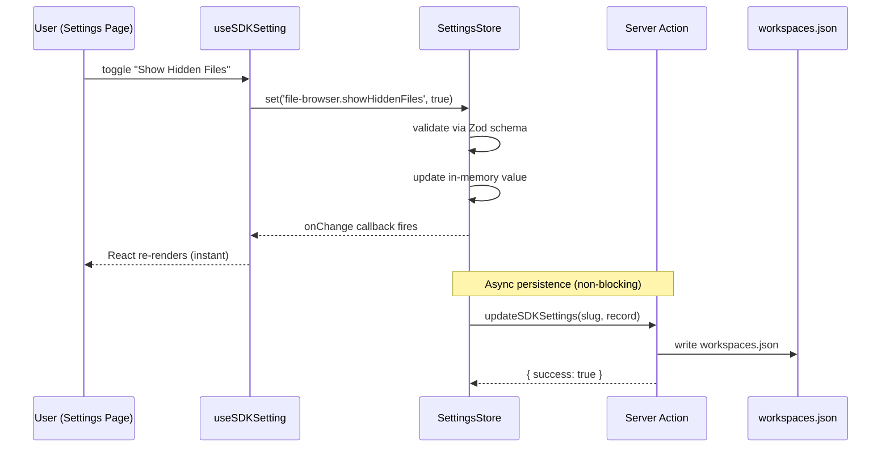
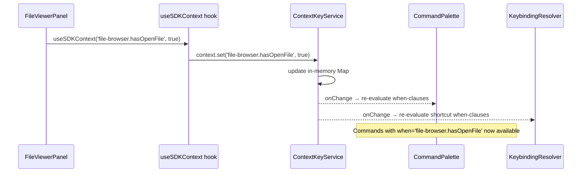
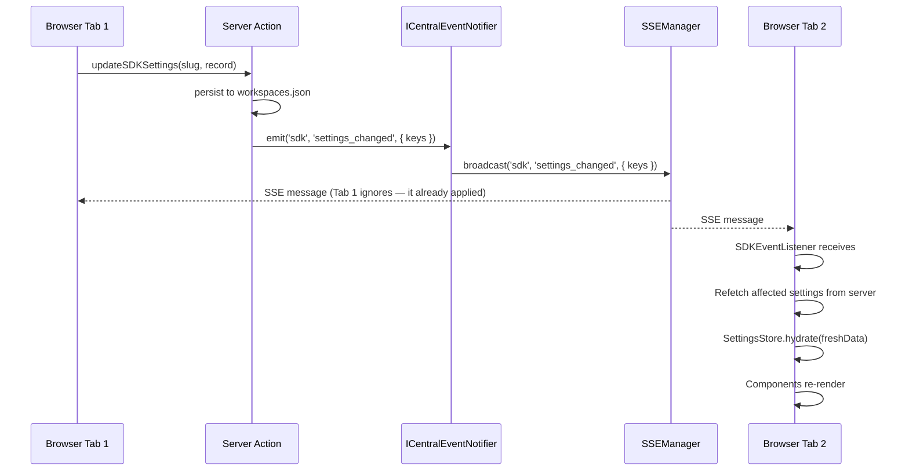

# Workshop: SDK Event Firing via Events Domain

**Type**: Integration Pattern
**Plan**: 047-usdk
**Spec**: [usdk-spec.md](../usdk-spec.md)
**Created**: 2026-02-24
**Status**: Draft

**Related Documents**:
- [001 SDK Surface Workshop](./001-sdk-surface-consumer-publisher-experience.md) — IUSDK interface, onChange listeners
- [003 Settings Domain Data Model](./003-settings-domain-data-model.md) — SettingsStore, persistence flow
- [Events Domain Doc](../../../domains/_platform/events/domain.md) — ICentralEventNotifier, SSE, toast
- [ADR-0007: SSE Single-Channel Routing](../../../adr/adr-0007-sse-single-channel-routing.md)
- [ADR-0010: Central Event Notification](../../../adr/adr-0010-central-event-notification-system.md)

**Domain Context**:
- **Primary Domain**: `_platform/sdk` (the SDK layer that originates events)
- **Related Domains**: `_platform/events` (provides the transport), `_platform/settings` (settings change events)

---

## Purpose

Define how SDK state changes (settings updates, command registration, context key changes, shortcut modifications) fire events, which transport they use, and how consuming components receive them. The codebase already has a mature three-layer event system (Adapter → Notifier → Broadcaster → SSE → Client). This workshop clarifies what SDK events ride that system vs what stays purely client-side.

## Key Questions Addressed

- Which SDK events need SSE (server push) and which are client-side only?
- How does a settings change propagate from the SettingsStore to consuming components?
- How will cross-tab sync work in the future?
- What is the event contract (types, payloads) for SDK-related events?
- How does the events domain's existing infrastructure (ICentralEventNotifier, useSSE, FileChangeHub) relate to SDK events?

---

## 1. The Two Event Transports

The codebase has two fundamentally different event paths. SDK events use **both**, depending on the scenario.

```
┌──────────────────────────────────────────────────────────────────┐
│  Transport A: Client-Side Only (In-Memory)                       │
│                                                                  │
│  Source:       SettingsStore.set() / ContextKeyService.set()     │
│  Mechanism:    Synchronous callback from in-memory Map listeners │
│  Latency:      Instant (same tick)                               │
│  Scope:        Same browser tab only                             │
│  Use for:      Settings onChange, context key updates,           │
│                command registry changes, shortcut changes         │
│                                                                  │
│  Flow:                                                           │
│    store.set(key, value)                                         │
│      → listeners.get(key).forEach(cb => cb(value))              │
│        → useSyncExternalStore detects → React re-renders         │
└──────────────────────────────────────────────────────────────────┘

┌──────────────────────────────────────────────────────────────────┐
│  Transport B: Server-Push (SSE)                                  │
│                                                                  │
│  Source:       Server action (persistence complete)               │
│  Mechanism:    ICentralEventNotifier → ISSEBroadcaster →         │
│                SSEManager → EventSource → useSSE hook             │
│  Latency:      ~50-200ms (server action + SSE delivery)          │
│  Scope:        All browser tabs connected to same channel         │
│  Use for:      Cross-tab settings sync (future),                 │
│                server-side setting changes (future),              │
│                SDK command notifications to other clients          │
│                                                                  │
│  Flow:                                                           │
│    Server action completes                                       │
│      → notifier.emit('sdk', 'settings_changed', { keys })       │
│        → SSEManager.broadcast('sdk', 'settings_changed', ...)   │
│          → EventSource.onmessage in all connected tabs           │
│            → SDKEventListener re-hydrates SettingsStore           │
└──────────────────────────────────────────────────────────────────┘
```

**Key design rule**: Transport A is the **primary** mechanism for v1. Transport B is wired up but only critical for future cross-tab sync.

---

## 2. Event Inventory — What Fires, When, How

### 2.1 SDK Event Catalogue

| Event | Transport | When It Fires | Payload | Consumer |
|-------|-----------|---------------|---------|----------|
| `sdk:settings_changed` | A (in-memory) | `sdk.settings.set(key, value)` called | `{ key, value, previousValue }` | Components via `useSDKSetting` |
| `sdk:settings_persisted` | B (SSE) | Server action `updateSDKSettings` completes | `{ keys: string[] }` | Other tabs (future cross-tab) |
| `sdk:settings_reset` | A (in-memory) | `sdk.settings.reset(key)` called | `{ key, defaultValue }` | Components via `useSDKSetting` |
| `sdk:context_changed` | A (in-memory) | `sdk.context.set(key, value)` called | `{ key, value }` | When-clause evaluator, palette filter |
| `sdk:command_registered` | A (in-memory) | `sdk.commands.register(cmd)` called | `{ commandId }` | Command palette (refreshes list) |
| `sdk:command_executed` | A (in-memory) | `sdk.commands.execute(id)` completes | `{ commandId, params, duration }` | MRU tracker, telemetry (future) |
| `sdk:shortcuts_changed` | A (in-memory) | Shortcut overridden or reset in settings | `{ commandId, oldKey, newKey }` | KeyboardShortcutProvider rebinds |

### 2.2 Why Most Events Are Client-Side Only

SDK state lives **in the browser**. The SettingsStore, CommandRegistry, ContextKeyService, and KeybindingResolver are all in-memory client-side objects. When a user toggles a setting:

1. The value changes in-memory (instant, same tab)
2. Components re-render via `useSyncExternalStore` (instant, same tab)
3. The value persists to disk via server action (async, ~100ms)

Steps 1 and 2 don't need SSE — they're already complete before the server knows. SSE only matters if **another tab** or **another user** needs to know.

### 2.3 When SSE Is Needed

| Scenario | v1 | Future | Transport |
|----------|-----|--------|-----------|
| User changes setting in same tab | ✅ | ✅ | A (in-memory) |
| User changes setting, other tab should update | ❌ (not v1) | ✅ | B (SSE) |
| Server-side process changes a setting | ❌ (not v1) | ✅ | B (SSE) |
| Command palette needs fresh command list | ✅ | ✅ | A (in-memory) |
| When-clause context changes | ✅ | ✅ | A (in-memory) |

---

## 3. Transport A: In-Memory Event Flow (v1 Primary)

### 3.1 Settings Change Flow



### 3.2 Context Key Change Flow



### 3.3 Listener Implementation Pattern

The in-memory event mechanism is the same simple pattern across all SDK subsystems:

```typescript
// Generic listener pattern used by SettingsStore, ContextKeyService, CommandRegistry
class ObservableMap<K, V> {
  private data = new Map<K, V>();
  private listeners = new Map<K, Set<(value: V) => void>>();
  private globalListeners = new Set<(key: K, value: V) => void>();

  set(key: K, value: V): void {
    this.data.set(key, value);
    // Per-key listeners (used by useSDKSetting for individual setting)
    this.listeners.get(key)?.forEach((cb) => cb(value));
    // Global listeners (used by CommandPalette for "anything changed")
    this.globalListeners.forEach((cb) => cb(key, value));
  }

  onChange(key: K, callback: (value: V) => void): { dispose: () => void } {
    if (!this.listeners.has(key)) this.listeners.set(key, new Set());
    this.listeners.get(key)!.add(callback);
    return { dispose: () => this.listeners.get(key)?.delete(callback) };
  }

  onAnyChange(callback: (key: K, value: V) => void): { dispose: () => void } {
    this.globalListeners.add(callback);
    return { dispose: () => this.globalListeners.delete(callback) };
  }
}
```

**Why not use ICentralEventNotifier for in-memory events?**

ICentralEventNotifier is designed for server → client push (domain service → SSE → browser). SDK in-memory events are client → client within the same tab. Using SSE for same-tab events would:
- Add ~100ms latency for something that should be instant
- Require a server round-trip for a client-side state change
- Break when offline

The event domain's transport is the wrong tool for same-tab reactivity. React's own reactivity system (`useSyncExternalStore`) is the right tool.

---

## 4. Transport B: SSE Event Flow (Future Cross-Tab)

### 4.1 Architecture

When cross-tab sync is needed (v2), SDK events ride the existing SSE infrastructure with a new channel:

```
WorkspaceDomain (existing):
  Workgraphs = 'workgraphs'
  Agents     = 'agents'
  FileChanges = 'file-changes'
  SDK        = 'sdk'              ← NEW channel
```

### 4.2 SSE Flow for Settings Sync



### 4.3 The Server Action Extension (Future)

```typescript
// apps/web/app/actions/sdk-settings-actions.ts (future cross-tab version)
'use server';

import { revalidatePath } from 'next/cache';
import type { IWorkspaceService } from '@chainglass/workflow';
import type { ICentralEventNotifier } from '@chainglass/shared';
import { WORKSPACE_DI_TOKENS } from '@chainglass/shared';
import { getContainer } from '../../src/lib/bootstrap-singleton';

export async function updateSDKSettings(
  slug: string,
  sdkSettings: Record<string, unknown>
): Promise<{ success: boolean; error?: string }> {
  try {
    const container = getContainer();
    const workspaceService = container.resolve<IWorkspaceService>(
      WORKSPACE_DI_TOKENS.WORKSPACE_SERVICE
    );

    const result = await workspaceService.updatePreferences(slug, { sdkSettings });
    if (!result.success) {
      return { success: false, error: result.errors[0]?.message ?? 'Unknown error' };
    }

    // Notify other tabs via SSE (per ADR-0007: signal only, not data)
    const notifier = container.resolve<ICentralEventNotifier>(
      WORKSPACE_DI_TOKENS.CENTRAL_EVENT_NOTIFIER
    );
    notifier.emit('sdk' as any, 'settings_changed', {
      workspaceSlug: slug,
      keys: Object.keys(sdkSettings),
    });

    revalidatePath(`/workspaces/${slug}`);
    return { success: true };
  } catch (error) {
    console.error('[updateSDKSettings] Error:', error);
    return { success: false, error: 'Failed to save settings' };
  }
}
```

### 4.4 The Client Listener (Future)

```typescript
// apps/web/src/lib/sdk/sdk-event-listener.tsx (future)
'use client';

import { useEffect } from 'react';
import { useSSE } from '@/hooks/useSSE';
import { useSDK } from './sdk-provider';

/**
 * Listens for SDK events from SSE and updates local stores.
 * Mounted once in SDKProvider. Handles cross-tab sync.
 */
export function SDKEventListener({ workspaceSlug }: { workspaceSlug: string }) {
  const sdk = useSDK();
  const { messages } = useSSE(`/api/events/sdk`, undefined, {
    autoConnect: true,
    reconnectDelay: 3000,
  });

  useEffect(() => {
    for (const msg of messages) {
      const data = msg.data as { workspaceSlug?: string; keys?: string[] };

      // Ignore events from other workspaces
      if (data.workspaceSlug !== workspaceSlug) continue;

      switch (msg.type) {
        case 'settings_changed':
          // Signal only (per ADR-0007) — refetch, don't use payload data
          sdk.settings._refetchFromServer(data.keys ?? []);
          break;
        // Future: shortcuts_changed, commands_changed, etc.
      }
    }
  }, [messages, sdk, workspaceSlug]);

  return null; // Invisible listener component
}
```

### 4.5 Why "Signal Not Data" (per ADR-0007 / PL-08)

The SSE payload carries **only identifiers** (`keys: ['file-browser.showHiddenFiles']`), not the actual values. The receiving tab refetches from the server to get fresh data. This is the established pattern:

> ADR-0007: Data carries only identifiers, clients fetch full state via REST.

Reasons:
- SSE messages can arrive out of order
- Payload might be stale by the time it arrives
- Server is the source of truth, not the event
- Simpler schema — no Zod validation of SSE payloads needed

---

## 5. How This Relates to Existing Events Infrastructure

### 5.1 What We Reuse

| Infrastructure | SDK Usage |
|----------------|-----------|
| `ICentralEventNotifier.emit()` | Future: emit `settings_changed` after persist |
| `ISSEBroadcaster.broadcast()` | Future: `sdk` channel for cross-tab |
| `SSEManager` (globalThis singleton) | Future: manages `sdk` channel connections |
| `/api/events/[channel]` route | Future: serves `sdk` channel (no new route needed!) |
| `useSSE` hook | Future: `SDKEventListener` subscribes to `sdk` channel |
| `FakeCentralEventNotifier` | Tests: verify SDK events are emitted correctly |
| `FakeSSEBroadcaster` | Tests: verify broadcast payloads |

### 5.2 What We Don't Reuse

| Infrastructure | Why Not |
|----------------|---------|
| `FileChangeHub` (client-side fan-out) | SDK events don't need path-based pattern matching |
| `FileChangeProvider` (React context) | SDK has its own provider (`SDKProvider`) |
| `useFileChanges` (debounced subscriptions) | Settings changes don't need debouncing |
| `DomainEventAdapter` (transform layer) | SDK events are simple — no transformation needed |

### 5.3 What We Add

| New Thing | Purpose |
|-----------|---------|
| `WorkspaceDomain.SDK = 'sdk'` | New channel constant (1 line change) |
| `SDKEventListener` component | Mounts in SDKProvider, listens on `sdk` SSE channel |
| `sdk.settings._refetchFromServer()` | Internal method to rehydrate after cross-tab signal |

---

## 6. Event Contract Definitions

### 6.1 SSE Event Types (Transport B — Future)

```typescript
// packages/shared/src/sdk/event-types.ts

/** SSE events on the 'sdk' channel */
export type SDKSSEEventType =
  | 'settings_changed'
  | 'shortcuts_changed';

/** Payload for settings_changed SSE event (signal only — no values) */
export interface SDKSettingsChangedPayload {
  workspaceSlug: string;
  /** Setting keys that were modified */
  keys: string[];
}

/** Payload for shortcuts_changed SSE event (signal only) */
export interface SDKShortcutsChangedPayload {
  workspaceSlug: string;
  /** Command IDs whose shortcuts were modified */
  commandIds: string[];
}
```

### 6.2 In-Memory Event Callbacks (Transport A — v1)

These are not typed "events" — they're simple callbacks on the observable stores. But documenting their signatures matters for implementation:

```typescript
// SettingsStore onChange callback
type SettingChangeCallback = (value: unknown) => void;

// ContextKeyService onChange callback
type ContextKeyChangeCallback = (value: unknown) => void;

// CommandRegistry onRegistryChange callback (global)
type RegistryChangeCallback = () => void;  // no payload, just "something changed"

// KeybindingResolver onBindingsChange callback (global)
type BindingsChangeCallback = () => void;  // no payload, consumer re-reads full list
```

**Why no payload for registry/bindings changes?** These change rarely (only at bootstrap or when user modifies shortcuts). The consumer (command palette, keyboard listener) simply re-reads the full list. No need for granular diffing.

---

## 7. Toast — The SDK's Events Domain Consumption

Toast notifications are a special case: the SDK **consumes** the events domain (sonner's `toast()`) to provide feedback, and also **publishes** toast as an SDK command.

```
┌─────────────────────────────────────────────────────────────────┐
│  sdk.toast.success('Saved!')                                    │
│    │                                                            │
│    └─→ sdk.commands.execute('toast.show', {                     │
│           message: 'Saved!', type: 'success'                   │
│         })                                                      │
│           │                                                     │
│           └─→ toast.show handler calls sonner's toast()         │
│                 │                                               │
│                 └─→ Sonner renders the toast in the DOM         │
└─────────────────────────────────────────────────────────────────┘
```

The SDK doesn't introduce a new notification transport for toasts. It wraps sonner's `toast()` as an SDK command so it's discoverable and invocable from the palette, but the actual rendering is sonner's job.

**Important**: `toast()` is client-only (PL-07). The SDK toast commands inherit this constraint. Calling `sdk.toast.success()` on the server is a no-op, same as `toast()` today.

---

## 8. Sequence Summary — All SDK Event Flows

### 8.1 Setting Changed (v1 — Same Tab)

```
User toggles switch
  → useSDKSetting.setValue(true)
    → SettingsStore.set(key, true)          [in-memory, synchronous]
      → onChange listeners fire              [synchronous callbacks]
        → useSyncExternalStore detects       [React schedules re-render]
          → Components re-render             [same React batch]
    → updateSDKSettings(slug, record)        [async server action]
      → workspaces.json written              [disk I/O]
      → revalidatePath()                     [Next.js cache]
```

**Latency**: UI update is instant. Persistence is ~100ms async.

### 8.2 Setting Changed (Future — Cross Tab)

```
Tab 1: User toggles switch
  → [same as 8.1 for Tab 1]
  → Server action also calls:
    → notifier.emit('sdk', 'settings_changed', { keys })
      → SSEManager.broadcast('sdk', ...)
        → Tab 2: EventSource.onmessage
          → SDKEventListener receives
            → sdk.settings._refetchFromServer(['file-browser.showHiddenFiles'])
              → Server fetch → fresh sdkSettings
                → SettingsStore.hydrate(freshData)
                  → onChange fires → Tab 2 components re-render
```

**Latency**: Tab 1 instant. Tab 2 ~200-500ms (SSE delivery + refetch).

### 8.3 Context Key Changed

```
FileViewerPanel mounts with filePath='src/index.ts'
  → useSDKContext('file-browser.hasOpenFile', true)
    → ContextKeyService.set('file-browser.hasOpenFile', true)  [in-memory]
      → CommandPalette re-evaluates when-clauses               [synchronous]
        → 'file-browser.copyPath' (when='file-browser.hasOpenFile') now available
      → KeybindingResolver re-evaluates shortcuts               [synchronous]
```

**No SSE needed**: Context keys are ephemeral UI state. They don't persist and don't need cross-tab sync.

### 8.4 Command Registered

```
SDK bootstrap runs registerFileBrowserSDK(sdk)
  → sdk.commands.register({ id: 'file-browser.openFile', ... })
    → CommandRegistry.commands.set(id, command)                [in-memory]
      → onAnyChange fires                                     [synchronous]
        → CommandPalette refreshes available command list
```

**No SSE needed**: Command registration happens at bootstrap. All tabs register the same commands from the same code.

---

## 9. Open Questions

### Q1: Should the `sdk` SSE channel be connected in v1 even if cross-tab sync isn't implemented?

**RESOLVED**: No. Don't connect the SSE channel until cross-tab sync is actually needed. Premature SSE connections waste server resources (one open connection per tab per workspace). The `SDKEventListener` component and `WorkspaceDomain.SDK` channel constant can be defined but not mounted.

### Q2: Should sdk.commands.execute fire a telemetry/MRU event?

**RESOLVED**: Yes for MRU (needed for palette ordering per spec OQ-3 resolution). The `sdk:command_executed` event fires after every successful command execution, updating the MRU list in-memory. MRU persists to `sdkMru` in workspace preferences (lightweight — just a string[] of recent command IDs). No telemetry in v1.

### Q3: Should settings onChange fire before or after persistence?

**RESOLVED**: Before. Per PL-02 (persist before broadcast), SSE events fire after persistence. But in-memory onChange is different — it's for same-tab reactivity, not broadcast. The user expects instant UI feedback. The flow is: validate → update in-memory → fire onChange → persist async. If persistence fails, the in-memory value stays (user sees their change), and a toast error appears. This matches optimistic UI patterns.

### Q4: Do we need a BroadcastChannel fallback for SSE cross-tab sync?

**RESOLVED**: No for v1. BroadcastChannel is faster than SSE for same-browser cross-tab (no server round-trip), but adds another transport mechanism. When we implement cross-tab sync, we can choose: SSE-only (simpler, already built) or BroadcastChannel (faster, needs new code). Defer to v2 implementation.

---

## 10. Quick Reference

### Which transport for which event?

| Event | v1 Transport | Future Transport |
|-------|-------------|-----------------|
| Setting changed (same tab) | A — in-memory callback | A — in-memory callback |
| Setting changed (cross tab) | None (not v1) | B — SSE `sdk` channel |
| Context key changed | A — in-memory callback | A — in-memory callback |
| Command registered | A — in-memory callback | A — in-memory callback |
| Command executed (MRU) | A — in-memory callback | A — in-memory callback |
| Shortcut changed (same tab) | A — in-memory callback | A — in-memory callback |
| Shortcut changed (cross tab) | None (not v1) | B — SSE `sdk` channel |
| Toast notification | sonner (direct) | sonner (direct) |

### Event flow cheatsheet

```
Same-tab reactivity:    store.set() → onChange callback → useSyncExternalStore → re-render
Cross-tab sync (future): server action → ICentralEventNotifier.emit() → SSE → refetch → hydrate
Toast:                   sdk.toast.success() → toast() from sonner → DOM render
```

### What touches the events domain?

```
v1: Nothing. SDK events are purely client-side in-memory callbacks.
    Toast wraps sonner (already in events domain) but doesn't add new event infrastructure.

Future: One new SSE channel ('sdk'), one new WorkspaceDomain constant,
        one new SDKEventListener component. That's it.
```
