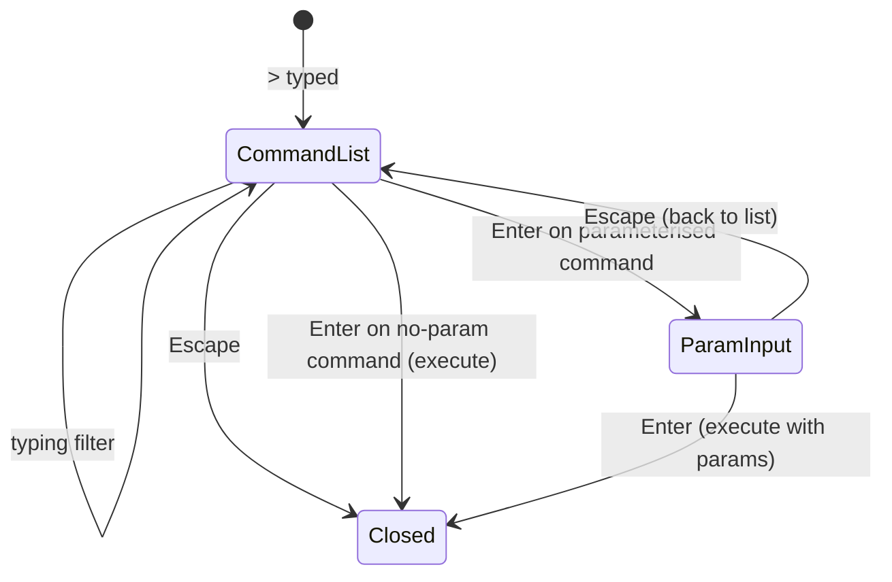

# Workshop: Command Palette Parameter Gathering

**Type**: UX Flow / Data Model
**Plan**: 047-usdk
**Spec**: [usdk-spec.md](../usdk-spec.md)
**Created**: 2026-02-25
**Status**: Draft

**Related Documents**:
- [Workshop 001: SDK Surface](./001-sdk-surface-consumer-publisher-experience.md)
- [Workshop 002: SDK Candidates](./002-initial-sdk-candidates.md)

**Domain Context**:
- **Primary Domain**: `_platform/panel-layout` (palette UI)
- **Related Domains**: `_platform/sdk` (command registry, param schemas)

---

## Purpose

When a user selects a command from the palette, some commands need parameters (e.g., `toast.show` needs a message, `openFileAtLine` needs a path). Currently, executing a parameterised command from the palette crashes with a ZodError because no params are provided. This workshop designs a minimal, progressive parameter gathering UX.

## Key Questions Addressed

- How does the palette know which commands need params vs. which don't?
- What's the simplest UX for gathering a single required string?
- How do we handle enum params (like toast type: success/error/info/warning)?
- Should parameterised commands even appear in the palette?

---

## Current State (The Bug)

```
User: > Show Toast Notification [Enter]

→ sdk.commands.execute('toast.show')
→ cmd.params.parse({})           // z.object({ message: z.string() })
→ ZodError: message is required  // 💥 crashes
```

All commands show in the palette regardless of whether they have required params. Selecting one calls `execute(commandId)` with no params at all.

---

## Design: Two Approaches

### Approach A: Hide Parameterised Commands (Simplest)

Commands with required params don't appear in the palette. They're programmatic-only — called from code with params provided.

**Pros**: Zero UI work. No crash.
**Cons**: `toast.show` becomes invisible. Defeats discoverability.
**Verdict**: ❌ Violates the whole point of the SDK palette.

### Approach B: Inline Parameter Input (Recommended)

When user selects a parameterised command, the palette transitions to a parameter input step. The Zod schema tells us what to ask for.

**Pros**: Discoverable. Simple UX. Schema-driven.
**Cons**: Small amount of UI work.
**Verdict**: ✅ This is the VS Code pattern (e.g., "Go to Line" asks for a number).

---

## Detailed Design: Inline Parameter Input

### Flow

```
┌─────────────────────────────────────────────┐
│ > Show Toast Notification           [Enter] │ ← User selects command
└─────────────────────────────────────────────┘
                    │
                    ▼  (command has required params)
┌─────────────────────────────────────────────┐
│ message: [type your message here___] [Enter]│ ← Palette becomes input
│                                             │
│ ┌─ type (optional) ──────────────────────┐  │
│ │ ● info  ○ success  ○ error  ○ warning  │  │ ← Enum renders as chips
│ └────────────────────────────────────────┘  │
└─────────────────────────────────────────────┘
                    │
                    ▼  [Enter]
        execute('toast.show', { message: "hello", type: "info" })
```

### Schema Introspection

Zod schemas are introspectable. We can determine the shape at runtime:

```typescript
import { z } from 'zod';

/** Check if a command's params schema has required fields. */
function hasRequiredParams(schema: z.ZodType): boolean {
  // z.object({}) has no keys → no params needed
  if (schema instanceof z.ZodObject) {
    const shape = schema.shape;
    const keys = Object.keys(shape);
    if (keys.length === 0) return false;
    // Check if any key lacks a default
    return keys.some((k) => {
      const field = shape[k];
      return !(field instanceof z.ZodDefault) && !(field instanceof z.ZodOptional);
    });
  }
  return false;
}

/** Extract field metadata from a Zod object schema. */
function extractFields(schema: z.ZodType): ParamField[] {
  if (!(schema instanceof z.ZodObject)) return [];
  const shape = schema.shape;
  return Object.entries(shape).map(([key, field]) => ({
    key,
    type: inferFieldType(field as z.ZodType),
    required: !(field instanceof z.ZodDefault || field instanceof z.ZodOptional),
    options: extractEnumOptions(field as z.ZodType),
    default: extractDefault(field as z.ZodType),
  }));
}
```

### Param Field Types

| Zod Type | UI Control | Example |
|----------|-----------|---------|
| `z.string()` | Text input | `message: [___]` |
| `z.number()` | Number input | `line: [42]` |
| `z.enum([...])` | Chip selector | `● info ○ success ○ error` |
| `z.boolean()` | Toggle | `[x] verbose` |
| `z.string().optional()` | Text input (skippable) | `description: [___] (optional)` |

### Simplified MVP: Single-Step Input

For v1, we only need the **single required string** case. This covers `toast.show` (message is the only required field, type has a default).

```
> Show Toast Notification [Enter]
→ Palette changes to:
  message: [type here___]                    [Enter to send]
  Escape to cancel
```

The flow:

1. User selects a command with required params
2. Palette replaces command list with a simple input for the **first required string field**
3. User types value, presses Enter
4. Command executes with `{ [fieldKey]: value, ...defaults }`
5. Palette closes

### What About Multi-Field Commands?

Commands like `openFileAtLine` have `{ path: string, line?: number }`. For MVP:

- **Option 1**: Show only the first required field, use defaults for rest → ✅ Simple
- **Option 2**: Sequential inputs (one per field) → More work, VS Code pattern
- **Option 3**: Hide multi-required-field commands from palette → Pragmatic

**Recommendation**: Option 1 for MVP. `openFileAtLine` probably shouldn't be in the palette anyway — it's programmatic. The palette should show user-friendly commands.

---

## Implementation Sketch

### State Machine



### Component Changes

**ExplorerPanel** gains a `paramGathering` state:

```typescript
// New state
const [paramGathering, setParamGathering] = useState<{
  commandId: string;
  field: { key: string; label: string; type: 'string' | 'number' | 'enum'; options?: string[] };
  schema: z.ZodType;
} | null>(null);
```

**handlePaletteExecute** checks for required params:

```typescript
const handlePaletteExecute = async (commandId: string) => {
  const cmd = sdk.commands.list().find(c => c.id === commandId);
  if (!cmd) return;

  if (hasRequiredParams(cmd.params)) {
    const fields = extractFields(cmd.params);
    const firstRequired = fields.find(f => f.required);
    if (firstRequired) {
      setParamGathering({
        commandId,
        field: firstRequired,
        schema: cmd.params,
      });
      return; // Don't execute yet — wait for input
    }
  }

  // No params needed — execute immediately
  await sdk.commands.execute(commandId);
  exitPaletteMode();
};
```

**Palette UI** in param gathering mode:

```tsx
{paramGathering && (
  <div className="px-3 py-2">
    <div className="text-xs text-muted-foreground mb-1">
      {paramGathering.field.key}
    </div>
    <input
      autoFocus
      value={paramValue}
      onChange={e => setParamValue(e.target.value)}
      onKeyDown={e => {
        if (e.key === 'Enter' && paramValue.trim()) {
          sdk.commands.execute(paramGathering.commandId, {
            [paramGathering.field.key]: paramValue.trim(),
          });
          setParamGathering(null);
          exitPaletteMode();
        }
        if (e.key === 'Escape') {
          setParamGathering(null); // back to command list
        }
      }}
      placeholder={`Enter ${paramGathering.field.key}...`}
      className="w-full bg-transparent text-sm outline-none"
    />
  </div>
)}
```

---

## Quick Fix (Before Full Implementation)

As an immediate stopgap, filter parameterised commands from the palette list:

```typescript
// In command-palette-dropdown.tsx filterAndSort:
const all = sdk.commands.list().filter((c) => {
  if (c.id === 'sdk.openCommandPalette') return false;
  if (!sdk.commands.isAvailable(c.id)) return false;
  // Hide commands with required params until param gathering is implemented
  if (hasRequiredParams(c.params)) return false;
  return true;
});
```

This prevents the crash immediately while the full param gathering UX is built.

---

## Open Questions

### Q1: Should param gathering reuse the existing input or show a new one?

**RECOMMENDATION**: Reuse the explorer bar input. Replace the command filter text with the param prompt. This keeps the UX in one place and matches VS Code's pattern where "Go to Line" replaces the palette content with a `:` prompt.

### Q2: How do enum params render?

**RECOMMENDATION**: Show as dropdown items (same as command list). User arrows through options and presses Enter. For MVP, if a field has a default, skip it entirely.

### Q3: Should we add a `paletteHidden` flag to SDKCommand?

**RECOMMENDATION**: No. Use schema introspection. Commands with `z.object({})` always show. Commands with required params show once param gathering is implemented. This keeps the API clean — publishers don't need to think about palette visibility.

---

## Summary: What to Build

| Priority | What | Effort |
|----------|------|--------|
| **Now** | Filter parameterised commands from palette (stopgap) | 5 min |
| **Next** | Single-string param input (covers toast.show) | 1-2 hours |
| **Later** | Enum chip selector, multi-field sequential | Half day |
| **Maybe** | Full form modal for complex params | Defer |
