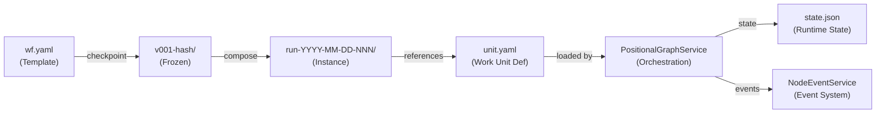

# Research Report: Workflow Templates & Positional Graph Domain Extraction

**Generated**: 2026-02-25T08:55:40Z
**Research Query**: "Workflow templates — template/instance pattern for workflows and work units, domain extraction for positional graph system, e2e test migration"
**Mode**: Pre-Plan (branch-detected: `048-wf-web`)
**Location**: `docs/plans/048-wf-web/research-dossier.md`
**FlowSpace**: Available ✅
**Findings**: 71 findings across 8 subagents

## Executive Summary

### What It Does
The positional graph system is a **line-based workflow execution engine** spread across three packages: `@chainglass/positional-graph` (graph DB, orchestration, events), `@chainglass/workgraph` (workspace-scoped graph CRUD), and `@chainglass/workflow` (template registry, phases, workspace context). All state persists to `.chainglass/` paths (Git-managed).

### Business Purpose
Enable agentic workflows where AI agents, code scripts, and human inputs compose into ordered pipelines. The positional model replaces DAG complexity with line-based topology where executability derives from 4 gates (preceding-lines-complete, transition-open, serial-neighbor-complete, inputs-available).

### Key Insights
1. **Workflows already have a 3-layer model** — `current/` (editable template) → `checkpoints/` (frozen snapshots) → `runs/` (runtime instances) — but work units do NOT have templates/instances yet; they exist as single definitions in `.chainglass/units/`.
2. **No domain has been extracted** for the positional graph system. Three natural domain boundaries exist: positional-graph (engine), workgraph (adapter), workflow (templates).
3. **E2E tests already copy workflows to temp dirs** — the `withTestGraph()` pattern and Plan 038/039 fixtures provide a migration path to formalize as templates.

### Quick Stats
- **Components**: 3 packages (~50+ source files), 6 feature folders
- **Dependencies**: 4 internal (`shared`, `workgraph`, `workflow`, `positional-graph`), 3 external (`zod`, `js-yaml`, `tsyringe`)
- **Test Coverage**: 45+ unit tests (workflow), 4 unit tests (workgraph), 17+ contract tests, 4 e2e scripts; 50% threshold enforced
- **Complexity**: High — cross-package refactoring with schema/type impacts
- **Prior Learnings**: 15 relevant discoveries from plans 007–030
- **Domains**: 0 relevant domains formalized (extraction needed)

---

## How It Currently Works

### Entry Points

| Entry Point | Type | Location | Purpose |
|------------|------|----------|---------|
| `cg workflow list/info/checkpoint/compose` | CLI | `apps/cli/src/commands/` | Workflow template management |
| `cg workgraph create/show/status` | CLI | `apps/cli/src/commands/` | Graph instance CRUD |
| `cg unit validate/info` | CLI | `apps/cli/src/commands/` | Work unit management |
| `cg positional-graph drive` | CLI | `apps/cli/src/commands/` | Orchestration driver (Plan 036) |
| WorkGraph UI (Feature 022) | Web | `apps/web/src/features/022-workgraph-ui/` | Visual graph canvas |
| MCP tools | Server | `packages/mcp-server/src/tools/` | Claude tool integration |

### Core Execution Flow

1. **Workflow Definition** (`wf.yaml`):
   - Template lives in `.chainglass/workflows/<slug>/current/wf.yaml`
   - Defines phases with ordered inputs/outputs and parameter extraction chains
   - Phases reference work units and contain prompt/script commands

2. **Checkpoint Creation**:
   - `WorkflowService.checkpoint()` freezes `current/` → `checkpoints/v001-<hash>/`
   - Creates immutable snapshot with ordinal + content hash

3. **Run Instantiation**:
   - `WorkflowService.compose()` copies checkpoint → `runs/<slug>/<version>/run-YYYY-MM-DD-NNN/`
   - Run is a mutable copy with its own `state.json` for runtime tracking

4. **Graph Execution** (Positional Graph):
   - `PositionalGraphService` manages nodes on lines with X/Y coordinates
   - Orchestration loop: **Settle → Build Reality → Decide (ONBAS) → Act (ODS)**
   - Nodes progress: `pending → starting → agent-accepted → complete` (with `waiting-question` and `blocked-error` branches)

5. **Work Unit Execution**:
   - Units loaded from `.chainglass/units/<slug>/unit.yaml` (or `.chainglass/data/units/`)
   - Discriminated union: `agent` | `code` | `user-input`
   - Input resolution: literal, from-previous, from-data, from-file

### Data Flow


### Current Directory Structure
```
.chainglass/
├── workflows/                      # Workflow TEMPLATES
│   └── hello-workflow/
│       ├── current/                # Editable template (mutable)
│       │   ├── wf.yaml            # Phase definitions
│       │   ├── cg.sh              # Bootstrap script
│       │   ├── AGENT-START.md     # Agent instructions
│       │   └── phases/
│       │       ├── gather/commands/main.md
│       │       ├── process/commands/main.md
│       │       └── report/commands/main.md
│       ├── checkpoints/            # Frozen versions (immutable)
│       │   └── v001-abc12345/
│       └── workflow.json           # Metadata
│
├── units/                          # Work unit DEFINITIONS (single copy)
│   ├── sample-coder/
│   │   ├── unit.yaml
│   │   └── prompts/main.md
│   ├── sample-tester/
│   │   ├── unit.yaml
│   │   └── prompts/main.md
│   ├── sample-pr-creator/
│   │   ├── unit.yaml
│   │   └── scripts/main.sh
│   └── sample-input/
│       └── unit.yaml
│
├── data/
│   ├── work-graphs/                # Graph DEFINITIONS + state
│   │   └── graph-001/
│   │       ├── work-graph.yaml
│   │       └── state.json
│   └── agents/                     # Agent runtime data
│       └── <sessionId>/
│           └── events.ndjson
│
└── runs/                           # Workflow RUNS (instances)
    └── <slug>/<version>/
        └── run-YYYY-MM-DD-NNN/
```

---

## Architecture & Design

### Package Map

| Package | Purpose | Key Exports |
|---------|---------|-------------|
| `@chainglass/shared` | Foundation: filesystem, DI, YAML, config | `IFileSystem`, `IPathResolver`, `IYamlParser`, DI tokens |
| `@chainglass/workflow` | Workflow templates, phases, workspace | `IWorkflowService`, `WorkspaceContext`, adapters |
| `@chainglass/workgraph` | Graph CRUD wrapper, cycle detection | `IWorkGraphService`, `IWorkNodeService`, `IWorkUnitService` |
| `@chainglass/positional-graph` | Graph engine, orchestration, events | `IPositionalGraphService`, `IOrchestrationService`, `IEventHandlerService` |

### Design Patterns Identified

1. **Factory with XOR Invariant** (PS-03): `Workflow.createCurrent()`, `.createCheckpoint()`, `.createRun()` — exactly one source type active
2. **Adapter Pattern** (PS-09): All data access via `WorkspaceDataAdapterBase` wrapping FS/YAML/validation
3. **DI Container** (IA-09): `tsyringe` with `useFactory`, shared/workflow/workgraph/positional-graph token namespaces
4. **Schema-First** (PL-03): Zod schemas → `z.infer<>` types → no divergence
5. **Result Pattern** (PS-05): All operations return `{ data: T | null; errors: ResultError[] }`
6. **Discriminated Unions** (PL-06): `type: 'agent' | 'code' | 'user-input'` for compile-time narrowing
7. **Event-Driven State Machine** (PS-08): Node events with subscriber stamps, settle phase processing

### System Boundaries

- **Internal**: Graph structure, node state, input resolution, orchestration loop
- **External**: Agent adapters (Claude Code, Copilot), filesystem, YAML configs
- **Integration**: CLI commands, Web UI (SSE), MCP tools

---

## Dependencies & Integration

### Dependency Graph
```
┌──────────────────────────────────────────────────┐
│              @chainglass/shared                   │
│  (FileSystem, PathResolver, YamlParser, Config)  │
└──────────────────────────────────────────────────┘
       ↑                    ↑                    ↑
       │                    │                    │
┌──────┴──────┐    ┌───────┴──────┐    ┌────────┴──────────┐
│ @workgraph  │    │  @workflow   │    │ @positional-graph  │
│(Graph CRUD) │    │ (Templates)  │    │  (Orchestration)   │
└─────────────┘    └──────────────┘    └────────────────────┘
       ↑                    ↑                    ↑
       │                    │                    │
       ├────────────────────┼────────────────────┤
       │                    │                    │
┌──────┴────────────────────┴────────────────────┴────┐
│              Consumer Layer                          │
│  apps/cli (cg commands)  ·  apps/web (React UI)     │
│  packages/mcp-server (Claude tools)                  │
└─────────────────────────────────────────────────────┘
```

### External Libraries
| Library | Version | Purpose | Criticality |
|---------|---------|---------|-------------|
| `zod` | — | Schema validation | Critical |
| `js-yaml` | — | YAML parsing | Critical |
| `tsyringe` | — | DI container | Critical |
| `chokidar` | — | File watching | Medium |

---

## Quality & Testing

### Current Test Coverage
- **Unit Tests (workflow/)**: 45 files — services, adapters, fakes, entities
- **Unit Tests (workgraph/)**: 4 files — container registration, cycle detection, fake isolation, node ID
- **Contract Tests**: 17+ — agent-adapter, agent-manager, workgraph-service, workunit-service, worknode-service
- **E2E Tests**: 4 scripts — positional-graph execution, orchestration, CLI, node events
- **Coverage Threshold**: 50% enforced via Vitest v8

### Test Infrastructure
- **FakeFileSystem**: In-memory FS with `setFile()`, `setDir()`, `simulateError()`, `reset()`
- **Contract Testing**: Same tests run against Fake AND Real implementations (DYK-05 parity)
- **`withTestGraph()` fixture**: Creates temp dir, copies fixture units, auto-cleans
- **Plans 038/039**: Real Claude Code agent E2E tests (structural assertions only, marked `describe.skip` for cost)

### Known Tech Debt
- MCP tools not wired through DI container (ADR-0004 violation)
- Agent timeout enforcement not implemented
- Web API persistence has 3 TODOs (T012, T014)
- No performance tests for large graphs (100+ nodes)

---

## Modification Considerations

### ✅ Safe to Modify
1. **`.chainglass/` directory structure** — filesystem-based, no DB migrations needed
2. **Unit YAML schemas** — optional field additions are backward-compatible (PL-05)
3. **Test fixtures** — can add new fixtures without breaking existing tests

### ⚠️ Modify with Caution
1. **`WorkflowService` compose/checkpoint flow** — existing runs depend on current structure
2. **Work unit loading paths** — CLI, MCP, and Web all resolve units; path changes affect all three
3. **Zod schemas** — changes propagate through `z.infer<>` to all consumers

### 🚫 Danger Zones
1. **`IPositionalGraphService` interface** — 20+ methods, consumed by orchestration, CLI, web
2. **DI token namespaces** — container registration order matters; test containers differ from production
3. **State.json format** — existing runs have persisted state; schema changes need migration strategy

### Extension Points
1. **New workflow directory under `.chainglass/`** — add `templates/` for dedicated template storage
2. **New unit storage pattern** — copy units into workflow instance directories
3. **Zod schema extension** — add optional fields for template metadata (source, refreshable, etc.)

---

## Prior Learnings (From Previous Implementations)

### 📚 PL-01: WorkUnit Type Name Collision
**Source**: Plan 026 Phase 1
**Type**: gotcha
**Action**: When adding template types, avoid name collisions with existing workflow `InputDeclaration`. Use explicit prefixes like `WorkUnitTemplateInput`.

### 📚 PL-02: Composition Over Re-implementation
**Source**: Plan 030 Phase 1
**Type**: decision
**Action**: Template status/readiness must use existing `getStatus()` service output, never re-derive gate logic.

### 📚 PL-03: Schema-First, Types Derived
**Source**: Plan 029 Phase 1
**Type**: decision
**Action**: Create template Zod schemas first, derive TypeScript types via `z.infer<>`.

### 📚 PL-05: Optional Fields for Backward Compat
**Source**: Plan 030 Finding #14
**Type**: decision
**Action**: All new template metadata fields must be optional to avoid migration burden.

### 📚 PL-06: Discriminated Unions for Type Narrowing
**Source**: Plan 029 Phase 1
**Type**: pattern
**Action**: Template vs instance distinction should use discriminated union (`source: 'template' | 'instance'`).

### 📚 PL-10: Glob Discovery for Registry
**Source**: Plan 016 Phase 2
**Type**: pattern
**Action**: Template discovery should use glob pattern `.chainglass/templates/workflows/**/wf.yaml` with graceful empty handling.

### 📚 PL-11: YAML Parse → Zod Validate Pipeline
**Source**: Plan 016 Phase 2
**Type**: pattern
**Action**: Template loading: YAML parse first → Zod safeParse → formatted error messages with JSON pointers.

### 📚 PL-12: Re-export Pattern for Migration
**Source**: Plan 026 Phase 1
**Type**: workaround
**Action**: If unit storage paths change, re-export from old location to avoid breaking 27+ consumer files.

### 📚 PL-14: E2E Clean-Slate Setup
**Source**: Plan 007 Phase 6
**Type**: pattern
**Action**: E2E tests must remove `.chainglass/` between runs, validate CLI exit codes, track `.current-run` state.

| ID | Type | Source Plan | Key Insight | Action |
|----|------|-------------|-------------|--------|
| PL-01 | gotcha | 026 | Type name collision | Use explicit prefixes |
| PL-02 | decision | 030 | Compose, don't re-derive | Use existing status services |
| PL-03 | decision | 029 | Schema-first | Zod before TypeScript |
| PL-05 | decision | 030 | Optional new fields | Zero-migration strategy |
| PL-06 | pattern | 029 | Discriminated unions | template vs instance type |
| PL-10 | pattern | 016 | Glob discovery | Graceful empty handling |
| PL-11 | pattern | 016 | YAML → Zod pipeline | Formatted errors |
| PL-12 | workaround | 026 | Re-export pattern | Silent migration |
| PL-14 | pattern | 007 | E2E clean-slate | Remove .chainglass/ between runs |

---

## Domain Context

### Existing Domains Relevant to This Research

| Domain | Relationship | Relevant Contracts | Key Components |
|--------|-------------|-------------------|----------------|
| `_platform/file-ops` | Direct dependency | `IFileSystem`, `IPathResolver` | All template I/O |
| `_platform/events` | Integration point | `ICentralEventNotifier`, `useSSE` | Template state change notifications |
| `_platform/sdk` | Consumer integration | `IUSDK`, `ICommandRegistry` | CLI command registration |

### Potential Domain Actions

Based on Domain & Boundary Scout findings (DB-01 through DB-08):

1. **Extract `_platform/positional-graph`** — Core graph engine (graph DB, state, gates, orchestration, events). Contains `packages/positional-graph/` scope. This is the primary domain the user requested.

2. **Consider `_platform/workgraph`** — Workspace-scoped graph CRUD adapter layer. Contains `packages/workgraph/` scope. Thin wrapper that may not warrant separate domain yet.

3. **Consider `_platform/workflow`** — Template registry (phases, workspace context). Contains `packages/workflow/` scope. Could remain internal until template/instance distinction is formalized.

**Recommended first step**: Extract `_platform/positional-graph` as the foundation, then decide on workgraph/workflow domains based on the template refactoring.

### Proposed Domain Registry Entry
```
| Positional Graph | _platform/positional-graph | infrastructure | _platform | Plan 048 | active |
```

**Contracts out**: `IPositionalGraphService`, `IOrchestrationService`, `IEventHandlerService`, `IWorkUnitService`
**Contracts in**: `IFileSystem` (file-ops), `IPathResolver` (file-ops), `WorkspaceContext` (workflow)
**Known consumers**: workgraph, web UI (022), CLI commands, MCP tools

---

## Critical Discoveries

### 🚨 Critical Finding 01: Work Units Lack Template/Instance Separation
**Impact**: Critical
**Source**: IA-06, PS-04, IC-05
**What**: Work units exist as single definitions in `.chainglass/units/`. There is NO template vs instance concept for units. When a node references a unit, it loads directly from the unit definition directory.
**Why It Matters**: The user's design requires unit templates (stored separately) and unit instances (copied into workflow instance directories). This is a new concept that doesn't exist yet.
**Required Action**: Design template storage location, copy mechanism, and refresh-from-template operation for units.

### 🚨 Critical Finding 02: Workflow Template→Instance Already Partially Exists
**Impact**: High
**Source**: IA-02, PS-04, IC-04
**What**: Workflows have `current/` (template) → `checkpoints/` (frozen) → `runs/` (instance). This is close to the desired pattern but runs are checkpoint-derived, not directly template-derived. The intermediate checkpoint step may or may not be wanted for the new template system.
**Why It Matters**: Can build on existing patterns rather than inventing new ones. The question is whether templates need checkpoints or can spawn instances directly.
**Required Action**: Clarify whether template→instance is direct or requires intermediate freeze step.

### 🚨 Critical Finding 03: Six ADR-0012 Domain Boundaries (Graph, Event, Orchestration, Agent, Pod, Consumer)
**Impact**: High
**Source**: DE-04
**What**: ADR-0012 already defines six conceptual boundaries within the workflow system. Domain extraction should align with these boundaries rather than fighting them.
**Why It Matters**: The domain extraction must respect existing architectural decisions.
**Required Action**: Read `docs/adr/adr-0012-workflow-domain-boundaries.md` during specification phase.

### 🚨 Critical Finding 04: E2E Tests Already Use Temp-Dir Copy Pattern
**Impact**: Medium
**Source**: QT-04, QT-05
**What**: `withTestGraph()` fixture creates temp dirs and copies fixture units. Plans 038/039 define multi-node pipelines with predefined workflows and work units.
**Why It Matters**: These patterns ARE the template system in embryonic form. Porting them to a formal template system should be straightforward.
**Required Action**: Inventory existing e2e fixtures and map them to the new template/instance model.

---

## Supporting Documentation

### Related Plans (Evolution Timeline)
| Plan | Focus | Key Deliverable |
|------|-------|-----------------|
| 026 | Positional Graph Model | Line-based topology, input resolution, 4-gate algorithm |
| 029 | Agentic Work Units | Discriminated union types, reserved params |
| 030 | Positional Orchestrator | Reality, ONBAS, ODS, pod lifecycle |
| 032 | Node Event System | Event types, handlers, settle phase |
| 034 | Agentic CLI | Agent redesign, manager service |
| 038 | Real Agent E2E | Claude Code agent orchestration tests |
| 039 | Advanced E2E Pipeline | 6-node, 4-line multi-agent pipeline |
| 040 | Graph Inspect CLI | Graph introspection commands |

### Key ADRs
- **ADR-0003**: Schema-first (Zod source of truth)
- **ADR-0004**: DI container pattern (tsyringe useFactory)
- **ADR-0006**: CLI-based agent orchestration
- **ADR-0012**: Workflow domain boundaries (6 domains)

---

## Recommendations

### If Implementing Template/Instance System
1. **Add `.chainglass/templates/` top-level directory** for workflow and unit templates, separate from instances
2. **Workflow instances** go to `.chainglass/workflows/<slug>/instances/<instance-id>/` (or keep existing `runs/` pattern)
3. **Unit instances** are copied INTO workflow instance directories (not referenced externally)
4. **Add `source_template` metadata** to instances for refresh-from-template tracking
5. **Implement `refresh` command** that overwrites instance unit from template (one-way sync)
6. **Use existing Zod schemas** with optional template metadata fields (PL-05)

### If Extracting Positional Graph Domain
1. **Start with `_platform/positional-graph`** encompassing `packages/positional-graph/`
2. **Define contracts**: `IPositionalGraphService`, `IOrchestrationService`, `IEventHandlerService`
3. **Create `docs/domains/_platform/positional-graph/domain.md`**
4. **Update domain registry and domain map**
5. **Defer workgraph/workflow domain extraction** until template refactoring clarifies boundaries

### If Porting E2E Tests
1. **Inventory `test/e2e/` fixtures** — identify which have predefined workflows/units
2. **Create template versions** of those fixtures in `.chainglass/templates/`
3. **Update `withTestGraph()` helper** to use template→instance copy instead of direct fixture copy
4. **Write new e2e test** validating template create → instance copy → unit refresh → execution

---

## External Research Opportunities

### Research Opportunity 1: Template Versioning Strategies for Git-Managed Config

**Why Needed**: The codebase uses checkpoint-based versioning for workflows, but the new template system needs a strategy for template version evolution across Git branches (merge conflicts, template drift).
**Impact on Plan**: Directly affects how templates stored in `.chainglass/` paths merge across branches.
**Source Findings**: IA-02, PS-04, DE-07

**Ready-to-use prompt:**
```
/deepresearch "What are best practices for versioning file-based configuration templates
in Git monorepos? Context: TypeScript monorepo with YAML-based workflow definitions stored
in a .chainglass/ directory. Templates can be modified independently on branches and need
clean merges. Currently using ordinal+hash versioning (v001-abc12345). Questions:
1. How to handle template merge conflicts across branches?
2. Should templates use content-addressable hashing or sequential versioning?
3. How do similar systems (GitHub Actions, Argo Workflows, Temporal) handle template evolution?
4. What's the cleanest approach for 'refresh instance from template' when both may have diverged?"
```

---

**Research Complete**: 2026-02-25T08:55:40Z
**Report Location**: `docs/plans/048-wf-web/research-dossier.md`
