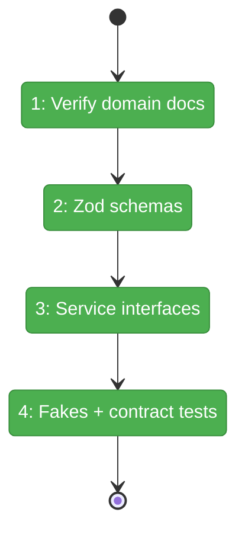
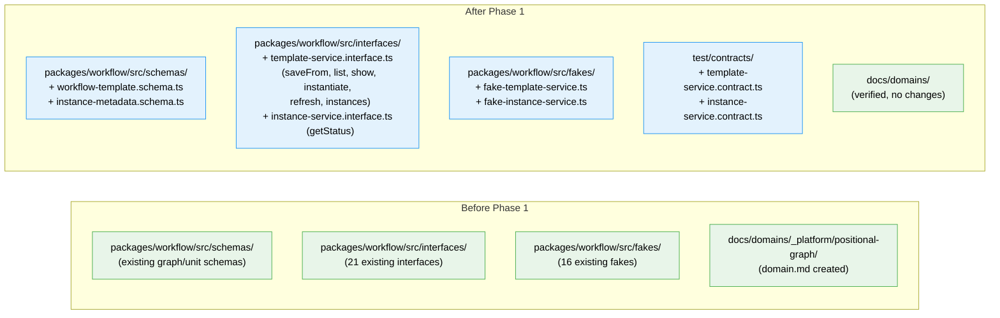

# Flight Plan: Phase 1 — Domain Finalization & Template Schema

**Plan**: [wf-web-plan.md](../../wf-web-plan.md)
**Phase**: Phase 1: Domain Finalization & Template Schema
**Generated**: 2026-02-25
**Status**: Landed

---

## Departure → Destination

**Where we are**: The positional graph domain has been extracted (`domain.md`, registry, map all created). No template/instance schemas, interfaces, or test infrastructure exist yet. Workshop 002 established that templates are saved from working graph instances — the existing graph.yaml + node.yaml files ARE the template format, no new declarative YAML needed.

**Where we're going**: A developer can import `TemplateValidationSchema`, `InstanceMetadataSchema`, `ITemplateService` (with `saveFrom`), `IInstanceService`, `FakeTemplateService`, and `FakeInstanceService` from `@chainglass/workflow`. Contract tests validate fake behavior. Phase 2 builds real implementations against these contracts.

---

## Domain Context

### Domains We're Changing

| Domain | What Changes | Key Files |
|--------|-------------|-----------|
| _platform/positional-graph | New schemas, interfaces, fakes for template/instance system | `packages/workflow/src/schemas/`, `packages/workflow/src/interfaces/`, `packages/workflow/src/fakes/` |

### Domains We Depend On (no changes)

| Domain | What We Consume | Contract |
|--------|----------------|----------|
| _platform/file-ops | IFileSystem, IPathResolver (declared as constructor deps, not used yet) | Interface types only |
| _platform/positional-graph | WorkspaceContext type, ResultError pattern | Used in method signatures |

---

## Flight Status

**Legend**: grey = pending | yellow = active | red = blocked/needs input | green = done

---

## Stages

- [x] **Stage 1: Verify domain docs** — Spot-check domain.md, registry, map for consistency (`domain.md`, `registry.md`, `domain-map.md`)
- [x] **Stage 2: Create Zod schemas** — TemplateValidationSchema (validates template directory: graph.yaml + nodes/ + units/) + InstanceMetadataSchema (instance.yaml format) — (`workflow-template.schema.ts`, `instance-metadata.schema.ts` — new files)
- [x] **Stage 3: Define service interfaces** — ITemplateService (saveFrom, list, show, instantiate, refresh, instances) + IInstanceService (getStatus) with Result pattern methods (`template-service.interface.ts`, `instance-service.interface.ts` — new files)
- [x] **Stage 4: Build fakes + contract tests** — FakeTemplateService + FakeInstanceService with call tracking, contract test suites (`fake-template-service.ts`, `fake-instance-service.ts`, `template-service.contract.ts`, `instance-service.contract.ts` — new files)

---

## Architecture: Before & After

**Legend**: existing (green, unchanged) | new (blue, created)

---

## Acceptance Criteria

- [ ] AC-1: `docs/domains/_platform/positional-graph/domain.md` exists and is consistent with registry and map
- [ ] AC-2: `TemplateValidationSchema` validates template directory structure (graph.yaml present, nodes/ match, units/ cover all referenced slugs)
- [ ] AC-3: `InstanceMetadataSchema` validates instance.yaml (slug, template_source, created_at, units[])
- [ ] AC-4: `ITemplateService` interface exported with 7 methods (saveFrom, listWorkflows, showWorkflow, instantiate, listInstances, refresh, listUnits)
- [ ] AC-5: `IInstanceService` interface exported with 1 method (getStatus)
- [ ] AC-6: `FakeTemplateService` and `FakeInstanceService` implement full interfaces with call tracking
- [ ] AC-7: Contract tests pass against Fake implementations
- [ ] AC-8: All types derived via `z.infer<>` per ADR-0003

## Goals & Non-Goals

**Goals**: Zod schemas (template validation + instance metadata), service interfaces (ITemplateService with saveFrom, IInstanceService), fakes, contract tests — the typed foundation for Phase 2
**Non-Goals**: No real implementation, no CLI, no filesystem operations, no new declarative YAML format (templates reuse existing graph.yaml per Workshop 002)

---

## Checklist

- [x] T001: Verify domain extraction docs
- [x] T002: Create TemplateValidationSchema (Zod)
- [x] T003: Create InstanceMetadataSchema (Zod)
- [x] T004: Define ITemplateService (with saveFrom) and IInstanceService interfaces
- [x] T005: Create FakeTemplateService and FakeInstanceService
- [x] T006: Contract tests for ITemplateService and IInstanceService
