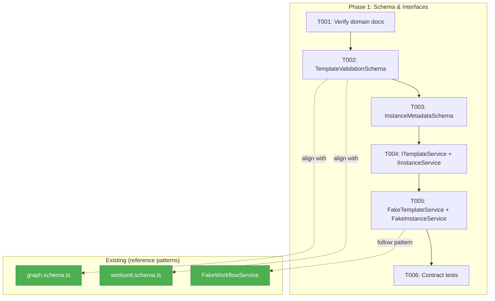
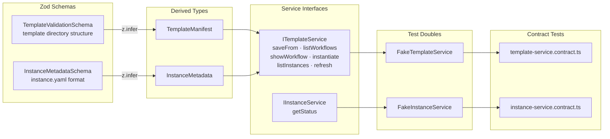
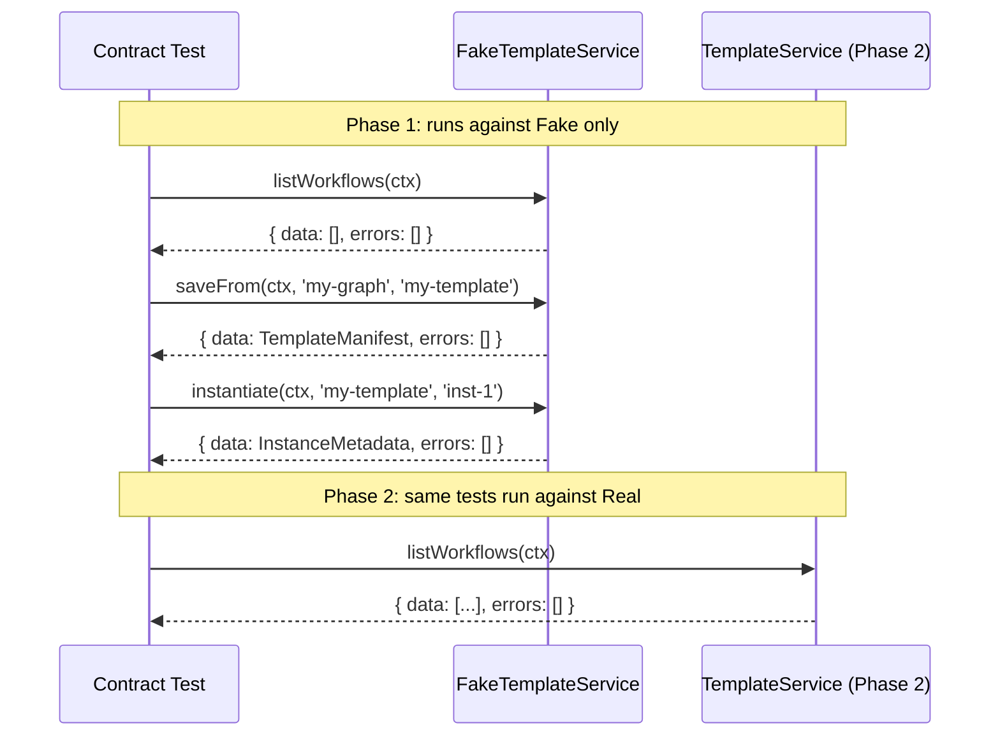

# Phase 1: Domain Finalization & Template Schema

## Executive Briefing

- **Purpose**: Establish the foundation — Zod schemas, interfaces, fakes, and contract tests — that all subsequent phases build on. No implementation code; pure types and test infrastructure.
- **What We're Building**: A template directory validation schema (`TemplateValidationSchema`), an instance metadata schema (`InstanceMetadataSchema`), two service interfaces (`ITemplateService` with `saveFrom`, `IInstanceService`), two fakes with call tracking, and contract tests that validate fake↔real parity.
- **Goals**:
  - ✅ Zod schema for template directory validation (graph.yaml + nodes/ + units/ structure)
  - ✅ Zod schema for `instance.yaml` (instance metadata + unit manifest)
  - ✅ `ITemplateService` interface: saveFrom, listWorkflows, showWorkflow, instantiate, listInstances, refresh
  - ✅ `IInstanceService` interface: getStatus
  - ✅ Fakes with call tracking and return builders
  - ✅ Contract tests that will run against both Fake and Real implementations
  - ✅ Verified domain extraction docs
- **Non-Goals**:
  - ❌ No real service implementation (deferred to Phase 2)
  - ❌ No CLI commands (Phase 2)
  - ❌ No filesystem operations (Phase 2)
  - ❌ No new declarative YAML format — templates reuse existing graph.yaml + node.yaml (Workshop 002)

## Pre-Implementation Check

| File | Exists? | Domain Check | Notes |
|------|---------|-------------|-------|
| `docs/domains/_platform/positional-graph/domain.md` | ✅ Yes | ✅ Correct | Created during domain extraction |
| `docs/domains/registry.md` | ✅ Yes | ✅ Contains entry | positional-graph: active |
| `docs/domains/domain-map.md` | ✅ Yes | ✅ In diagram | posGraph node with contracts |
| `packages/workflow/src/schemas/` | ✅ Dir exists | ✅ Correct domain | Has index.ts, no template schemas yet |
| `packages/workflow/src/interfaces/` | ✅ Dir exists | ✅ Correct domain | 21 existing files, no template/instance interfaces |
| `packages/workflow/src/fakes/` | ✅ Dir exists | ✅ Correct domain | 16 existing fakes, no template/instance fakes |
| `ITemplateService` | ❌ Does not exist | — | New — to create |
| `IInstanceService` | ❌ Does not exist | — | New — to create |
| `TemplateValidationSchema` | ❌ Does not exist | — | New — validates template directory structure (graph.yaml + nodes/ + units/) |
| `InstanceMetadataSchema` | ❌ Does not exist | — | New — to create |

**Concept search**: No existing template/instance service pattern found. `InitService.hydrateStarterTemplates()` is similar (copies bundled templates) but is a different concern — adopt its `IFileSystem.copyDirectory()` pattern in Phase 2, not Phase 1.

**Existing schemas to align with**: `PositionalGraphDefinitionSchema` (graph.schema.ts) and `WorkUnitSchema` (workunit.schema.ts) are the established patterns — same Zod `z.object()` idiom, same `z.infer<>` type derivation.

## Architecture Map



## Tasks

| Status | ID | Task | Domain | Path(s) | Done When | Notes |
|--------|-----|------|--------|---------|-----------|-------|
| [x] | T001 | Verify domain extraction docs | _platform/positional-graph | `docs/domains/_platform/positional-graph/domain.md`, `docs/domains/registry.md`, `docs/domains/domain-map.md` | All 3 files are consistent: registry entry matches domain.md, domain-map Mermaid includes posGraph node with correct contracts | Spot-check only — already created |
| [x] | T002 | Create `TemplateValidationSchema` (Zod) for template directory structure | _platform/positional-graph | `packages/workflow/src/schemas/workflow-template.schema.ts` | Schema validates that a template dir contains: graph.yaml (valid per existing `PositionalGraphDefinitionSchema`), nodes/ with node.yaml files, units/ with unit dirs matching all unit_slugs referenced in node.yaml files. Type `TemplateManifest` exported via `z.infer<>`. Test Doc format. | ADR-0003: schema first, types derived. Reuses existing graph.yaml schema — no new graph format per Workshop 002. Templates are saved from working graph instances. |
| [x] | T003 | Create `InstanceMetadataSchema` (Zod) for instance.yaml | _platform/positional-graph | `packages/workflow/src/schemas/instance-metadata.schema.ts` | Schema validates instance.yaml with slug, template_source, created_at, units[] (slug + source + refreshed_at). Type `InstanceMetadata` exported via `z.infer<>`. Test Doc format. | ADR-0003. See Workshop 001 §Instance Schema. |
| [x] | T004 | Define `ITemplateService` and `IInstanceService` interfaces | _platform/positional-graph | `packages/workflow/src/interfaces/template-service.interface.ts`, `packages/workflow/src/interfaces/instance-service.interface.ts` | ITemplateService has: `saveFrom(ctx, graphSlug, templateSlug)`, `listWorkflows(ctx)`, `showWorkflow(ctx, slug)`, `instantiate(ctx, slug, instanceId)`, `listInstances(ctx, slug)`, `refresh(ctx, slug, instanceId)`. IInstanceService has: `getStatus(ctx, slug, instanceId)`. All methods return Result pattern `{data, errors}`. Both interfaces defined BEFORE any implementation. | Constitution P2: interface-first. `saveFrom` is primary template creation path (Workshop 002: templates come from working graph instances). All methods take WorkspaceContext as first param. |
| [x] | T005 | Create `FakeTemplateService` and `FakeInstanceService` | _platform/positional-graph | `packages/workflow/src/fakes/fake-template-service.ts`, `packages/workflow/src/fakes/fake-instance-service.ts` | Both fakes implement full interfaces. Call tracking arrays (`saveFromCalls`, `instantiateCalls`, etc.). Return builders (`withWorkflows(...)`, `withInstances(...)`). All tests use Test Doc 5-field format. | Constitution P4: fakes over mocks. Follow FakeWorkflowService pattern in same directory. |
| [x] | T006 | Contract tests for ITemplateService and IInstanceService | _platform/positional-graph | `test/contracts/template-service.contract.ts`, `test/contracts/instance-service.contract.ts` | Shared test suites that run against Fake (now) and Real (Phase 2). Tests cover: list returns empty on fresh workspace, saveFrom creates template directory, instantiate creates instance with fresh state, refresh updates timestamps. All tests use Test Doc format. | Constitution P2: contract tests verify fake↔real parity. Real implementation deferred — tests run against Fake only in Phase 1. |

## Context Brief

**Key findings from plan**:
- Finding 02: `IFileSystem.copyDirectory()` already exists — Phase 1 is schema/interface only, but interfaces should accept `IFileSystem` as constructor dependency for Phase 2.
- Finding 04: **ELIMINATED by Workshop 002** — No new declarative YAML format needed. Templates reuse existing graph.yaml + node.yaml files, saved from working graph instances via `saveFrom()`.
- Finding 05: WorkUnitAdapter hardcodes `.chainglass/units/` — Phase 1 interfaces should be path-agnostic (take WorkspaceContext, not hardcoded paths).
- Finding 07: Templates are created FROM working graph instances — graph.yaml + nodes/*/node.yaml already contain real node IDs and validated wiring.

**Domain dependencies** (contracts this phase consumes):
- `_platform/file-ops`: `IFileSystem`, `IPathResolver` — not directly consumed in Phase 1 (no implementation), but interfaces should declare these as constructor dependencies for Phase 2.
- `_platform/positional-graph`: `WorkspaceContext` type — first parameter of all service methods.
- `_platform/positional-graph`: `ResultError` pattern — return type for all service methods.

**Domain constraints**:
- All new files go in `packages/workflow/src/` (existing domain package)
- Interfaces in `interfaces/`, schemas in `schemas/`, fakes in `fakes/`, tests in `test/contracts/`
- No imports from `@chainglass/workgraph` (deprecated domain)
- ADR-0003: Zod schemas are source of truth; types via `z.infer<>`
- ADR-0004: No decorators; DI via `useFactory` (relevant for Phase 2 wiring)

**Reusable from existing codebase**:
- `PositionalGraphDefinitionSchema` (graph.schema.ts) — Zod pattern reference
- `WorkUnitSchema` (workunit.schema.ts) — discriminated union pattern reference
- `FakeWorkflowService` — fake pattern with call tracking and return builders
- `workflowServiceContractTests` — contract test pattern reference
- `ResultError` type and error factory helpers

**Mermaid flow diagram** (what Phase 1 produces):


**Mermaid sequence diagram** (how contract tests validate fakes):


## Discoveries & Learnings

_Populated during implementation by plan-6._

| Date | Task | Type | Discovery | Resolution | References |
|------|------|------|-----------|------------|------------|

---

```
docs/plans/048-wf-web/
  ├── wf-web-plan.md
  ├── wf-web-spec.md
  ├── research-dossier.md
  ├── workshops/
  │   ├── 001-template-instance-directory-layout.md
  │   └── 002-template-creation-flow-and-node-identity.md
  └── tasks/phase-1-schema-and-interfaces/
      ├── tasks.md                    ← this file
      ├── tasks.fltplan.md            ← flight plan
      └── execution.log.md           # created by plan-6
```
